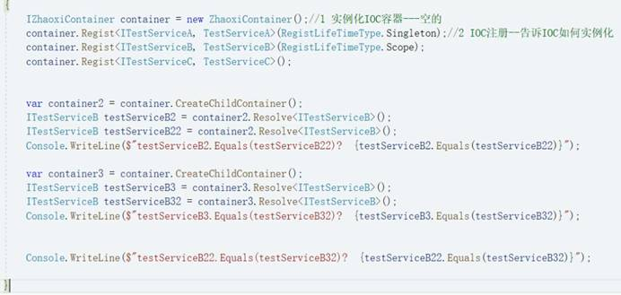

# IOC & DI

Inversion of Control：控制反转，简称IOC

Dependency Injection：依赖注入，简称DI

Denpendency Lookup：依赖查找，简称DL

 

# 内置IOC认知

ASP.NET Core内置了IOC容器**ServiceCollection**

1. Program.cs 注册

2. 构造函数注入

**你还知道哪些IOC**

Autofac / Unity / MEF / Spring.Net

SimpleIOC / SmartIOC / ZhaoxiIOC

 

# 追本溯源-DIP

**依赖倒置原则（Dependence Inversion Principle）：**面向对象语言程序设计时，高层模块不要依赖于底层模块，二者应该通过抽象来依赖（依赖抽象，而不是依赖细节）

面向抽象编程，架构更稳定，良好扩展性

**IOC核心理论基础**

抽象：接口&抽象类

细节：普通类

 

# IOC雏形（工厂模式，抽象工厂）

**实现DIP：**创建工厂

**-->**反射(Assembly)（BLL\DLL文件） + 配置文件=**（实例化时面向抽象）（实现热插拔）**

**-->** 泛型（<T> (params object[] arguments)）=**（如果类型很多）**

-->（如果依赖别多）

 

# 遗留问题（IOC雏形缺陷，通过DI实现）

1 类型多，每个都需要工厂？

2 层级多依赖多，写不赢

 

需要IOC（控制反转）

-->高层和低层之间，依赖于抽象，需要一个工厂创建对象，这个工厂就是IOC（功能更完善更强大的工厂）

-->IOC 好处：让上端减少依赖，能更稳定，程序更有扩展性

-->但是 实例化过程中的依赖问题需要靠DI依赖注入，能做到创建A对象时，自动把A以来的其他对象注入，依次循环。

-->DI好处：可以让上端不用关心构造的细节

 

# Inversion of Control (控制反转 IOC)

控制反转IOC是面向对象编程的一种设计原则，可以用来减低代码之间的耦合度。

**IOC容器：**实例化对象工厂

**作用：**第三方类库，能生成实例，还得注册映射关系

**依赖倒置：**高层不在直接依赖低层，而是依赖于抽象

**控制反转：**高层以前是依赖于低层，现在依赖于抽象，把决定对象交给第三方

**手写IOC：** 

1. 注册Register 

2. 获取实例Resolve 

3. 依赖和注入

**总结：稳定性 - 就是为了依赖抽象（如果想完全去掉细节，通过反射+遍历，可以动态升级，其实已经不怎么用了）**

1. 集中管理细节，让使用的地方不用关心细节，方便维护

2. 易于升级扩展，替换IOC容器注册。。ASP.NET Core里面一堆的IOC容器，常见的扩展方式，就是替换IOC注册

 

 

# Dependency Injection(依赖注入 DI)

**依赖注入：**构造A对象时，需要依赖B对象，那么就先构造B对象传入，也就是能在构造对象时，对象的依赖初始化并注入进去，这个技术手段就叫依赖注入

**为什么要依赖注入？**因为要IOC控制反转，不依赖细节，细节还会依赖细节，为了屏蔽细节，所以需要依赖注入去解决无限层级的对象依赖

 

**IOC是一种设计模式，是一种程序设计的目标**

**DI是IOC的实现手段，是一种编码技术**

 

**属性注入：**就是给实例化对象的属性，完成初始化 -。反射创建对象，然后在反射找属性，反射创建对象绑定属性。 **（特性 - Attribute）**

**方法注入：**就是实例化完对象，通过调用方法来完成注入。反射创建对象，然后在反射找方法，反射准备参数，反射调用方法。**（特性 - Attribute）**

 

**手写构造函数注入：** 多个相同名称的构造函数：特性标识 ->参数多 

多个参数：准备参数(递归)->反射创建

循环依赖（A/B/C）：构造函数注入是无法解决，可以考靠属性注入\方法注入

**总结 - DI：就是自动注入（反射），可以屏蔽构建细节。去餐馆吃佛跳墙，不需要知道材料**

 

# 生命周期管理

**理解IOC容器对象生命周期管理**

1. 瞬时生命周期(AddTransient) ：每次都有新实例

2. 单例生命周期(AddSingleton) ：进程中只有一个实例

3. 作用域单例(AddScoped) ：单次请求时同个实例，不同请求时不同实例**

4. 线程单例 - 一个线程单例复用，不同线程不可复用

5. 外部可释放单例 

 

**手写单例生命周期：**

1. 注册时，保存对象生命周期，存个对象

2. 获取实例时，就得加入对象重用的处理

 

**手写作用域单例：Scope作用域单例，一次请求过程中只有一个实例，不同请求的十里不同**

1. 保存好生命周期信息以及对象实例

2. 区分请求来重用对象：不同的请求，就是不同的HttpContext，里面有个RequestService属性是IOC容器实例，不同的容器之间不共享，内部共享。（创建子容器，子容器独立的存储空间）

****

 

**线程单例实现：一个线程只有一个实例，不同线程的实例不同**

1. 一个线程内部共享 - 保存在线程里面共享

 

**总结：IOC已经贯穿程序开发，单例推荐都用容器单例而不是写单例**

 

# IOC容器扩展 - 策略模式，AOP

**控制反转IOC是如何完成扩展？**

对象实力替换，从A1换到A2，换到A3，由IOC容器处理 - 扩展的单位是类（实例）

**如果不替换对象，也扩展功能呢？**

**不能每次扩展功能都是新的对象，如果扩展5个功能随机组合，2的5次方**

# AOP面向切面编程 - 【NET Framework - MVC - Filter】

AOP(Aspect Oriented Programming)能在不破坏封装的前提下，去额外扩展功能。不修改类，但是能额外增加功能 - Filter

1. 聚焦业务逻辑，轻松扩展功能

2. 代码复用，集中管理

****

**Castle** **实现 AOP**

1. Nuget - Castle.Core

2. 配套代码：

   ProxyGenerator - 动态代理

   CustomInterceptor - 注入

   CommonClass - 原始对象

**准备引入第三方组件，对基础类库完成AOP扩展实现AOP**

**怎么实现的？** 低层是基于System.Reflection.Emit，能动态生成代码并且编译运行

****

 

# Autofac

**使用步骤**

1. Nuget引入程序包

   Autofac

   Autofac.Extensions.DependencyInjection

2. 得到容器建造者

3. 配置抽象和具体类之间的关系

4. Build一下得到容器实例

5. 基于容器来获取对象的实例了

 

注册抽象和具体普通类

注册一个具体实例

注册一段业务逻辑

注册泛型

注册程序集

 

1. 构造函数注入

   默认选择参数多的构造函数注入

   选择指定构造函数注入 - UsingConstructor()

2. 属性注入

3. 扩展 - PropertiesAutowired - 表示支持属性注入：在对象创建出来以后，自动给属性创建实例，赋值

   \- PropertySelector - 用来选择属性注入：特性实现

3. 方法注入

   在构造出某一个对象后，自动去调用对象中的某一个方法，方法需要什么参数，自动给构造出来，传递进去

   扩展 - OnActivated

4. 单抽象多实现

   如何获取全部 - containerBuilder.Build().Resolve<Ienumerable<Iterface>>()

   如何选择一个 - Keyed / ResolveKeyed

 

Autofac - AOP支持

Nuget引入程序集 - Castle.Core

扩展Iinterceptor

 

# Spring.NET

**什么是Spring.NET?**

Spring框架本是Java平台上的一个应用非常多的、开源的框架，虽然语言是固定的，但是好的方法是通用的，于是Spring框架就被程序员从Java平台搬迁到了.NET平台。

通过Spring.NET，我们可以用统一且透明的方式来配置应用程序。Spring.NET的重点是为中间层提供声明事务管理，以及一个功能齐全的ASP.NET扩展框架，Spring.NET是非嵌入式的，代码对框架本身不会产生任何依赖

Spring.NET能够提供很多方面的功能，例如：控制反转（IoC）、依赖注入（DI）

 

**应用环境 - .NET Framework4.7.2**

**使用步骤：**

1. 引用Nuget程序集 - Spring.Core

2. 准备抽象和实现

3. 准备配置文件

 

# Unity

**什么是Unity?**

是微软推出的IOC框架，使用这个框架，可以实现AOP面向切面编程，便于代码的后期维护，此外，这套框架还自带单例模式，可以提高程序的运行效率

 

**应用环境 - .NET Framework4.7.2 、 Unity版本-5.11.11.0**

**使用步骤：**

1. Nuget引入程序集 - Unity.Container / Unity.Abstractions

2. 创建容器，注册服务，获取实例

| Unity注入    | //实例化容器  UnityContainer unityContainer = new  UnityContainer();  / /注册抽象和具体  unityContainer.RegisterType<ITestServiceA,  TestServiceA> ();   //获取对象  ITestServiceA testServiceA =  unityContainer.Resolve<**ITestServiceA**> ();   testServiceA.Show(); |
| ------------ | ------------------------------------------------------------ |
| 构造函数注入 | UnityContainer unityContainer = new  UnityContainer();   unityContainer.RegisterType<ITestServiceA,  TestServiceA> ();   unityContainer.RegisterType<ITestServiceB,  TestServiceB> ();   ITestServiceB testServiceB =  unityContainer.Resolve<**ITestServiceB**> (); |

**应用环境 - ASP.NET Core5** 

**使用步骤：**

1. Nuget引入程序集 - Unity.Microsoft.Dependencyinjection**(Unity****程序包)** / Unity.Interception**(****支持AOP)** / Unity.Interception.Configuration(支持AOP配置文件读取)

2. 在Program的CreateHostBuilder方法中把Unity替换进来

 

 

 

 

 

 

 

 

 

 

 

 

 

 

 