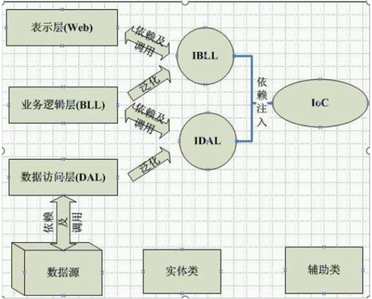

# IOC & DI

**Inversion of Control**：控制反转，简称**IOC**

**Dependency Injection**：依赖注入，简称**DI**

**Denpendency Lookup**：依赖查找，简称**DL**

# 内置IOC认知

# 追本溯源 - DIP

**依赖倒置原则（****Dependence Inversion Principle****）：**面向对象语言程序设计时，高层模块不要依赖于底层模块，二者应该通过抽象来依赖（依赖抽象，而不是依赖细节）

# IOC雏形（工厂模式，抽象工厂）

# 遗留问题（IOC 雏形缺陷，通过DI实现）

# Inversion of Control（控制反转IOC）

# Denpendency Injection（依赖注入 DI）

# 生命周期管理

# IOC容器扩展 - 策略模式，AOP

# AOP面向切面编程

**AOP的背景**

 - 项目已经上线，且正常运行
 - 产品经理 - 来个新需求

**1. 普通方式解决**

* 大量的重复代码
* 大量测试工作
* 违背了开闭原则

**2. 面向切面编程AOP - [NET Framework - MVC - Filter]** 

- AOP（Aspect Oriented Programming）能在不破坏封装的前提下，去额外扩展功能。

# Autofac

# Spring.NET

# Unity