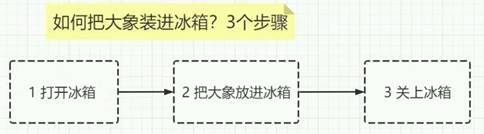
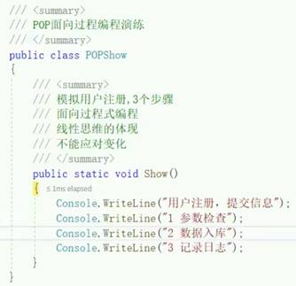
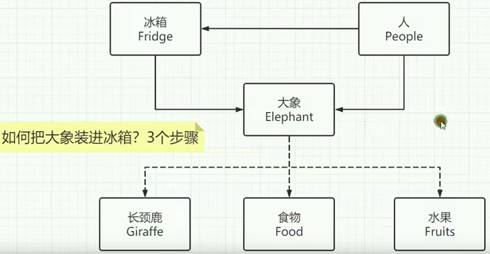
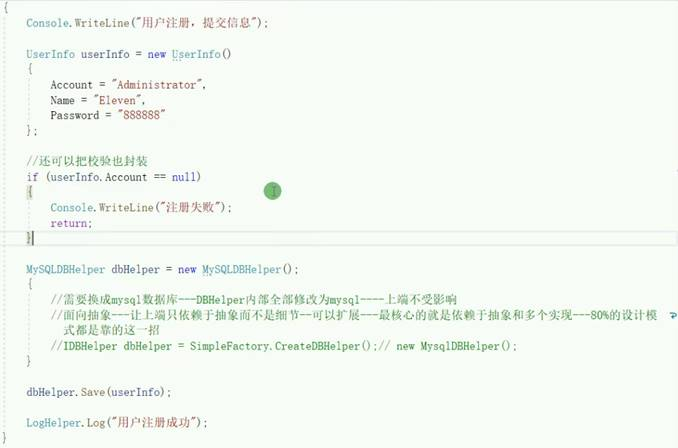
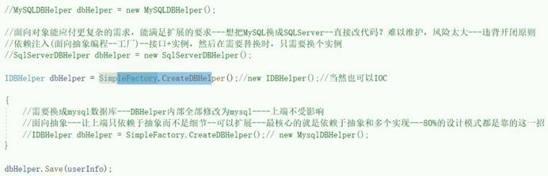
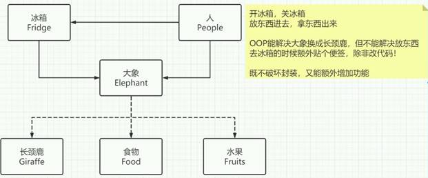
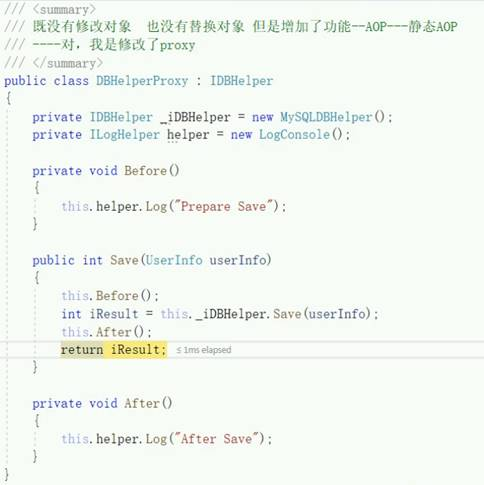
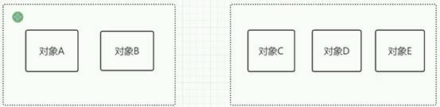

# 编程思想

## POP - 面向过程编程

**面向过程编程 - Procedure Oriented Programming**

分析出解决问题所需要的步骤，然后用函数把这些步骤一步一步实现，使用的时候一个一个依次调用。考虑问题是从解决问题的步骤出发

1. 符合常规线性思维

2. 难以应对复杂的业务，难也满足业务扩展需求

 

 

## OOP - 面向对象编程

**面向对象编程 - Object Oriented Programming** 开闭原则 - 只拓展,不修改

按人们认识客观世界的系统思维方式，采用基于对象（实体）的概念建立模型，模拟客观世界分析、设计、实现软件的办法。

一个个类组装的---->封装一个类---->多个类交互完成小功能---->多个功能叠加---->模块---->多个模块叠加---->系统---->平台

 

OOP的内部，依旧是POP的线性思维

OOP是程序设计，POP是内部实现

 

 

工厂，切换数据库

 

## AOP - 面向切面编程

**面向切面编程 - Aspect Oriented Programming** 只是补充OOP,而不是替换。既不破坏封装,又能额外增加功能。

解决面向对象语言的静态问题，能突破类的限制，去动态扩展类的功能 

 

任意扩展功能，聚焦业务逻辑

代码复用，集中管理，方面团队管理

 

* AOP多种实现

  1. 静态代理，代理模式-装饰器模式

  2. 动态代理，反射代理，以前RealProxy-还有Castle(靠**emit：动态生成代码**)

  3. 静态织入，代理PostSharp(收费)；Aspect

  4. 委托嵌套，ASP.NET Core管道中间件

  5. 特性+反射，ASP.NET Core的Filter

  6. IOC容器，Autofac、Unity等，其实是基于动态代理或者emit完成

 

**静态AOP**

 

## DDD - 领域驱动设计 (微服务)

(领域驱动设计 - Domain-Driven Design) 微服务

划分领域（更上层，关系紧密），其实就像类，但是编程语言没有这个东西，所以就创造了一个领域（聚合根，可以包含多个对象），业务分析设计方法

POP - 无边界

OOP - 以对象为边界

DDD - 其实就是扩大边界，将对象组装成领域，程序分析设计轻松点

 

**DDD是一种承需分析设计方法，不关乎具体技术，具体代码实现，依旧是OOP**

 

 

 

 

 

 

 

 

 