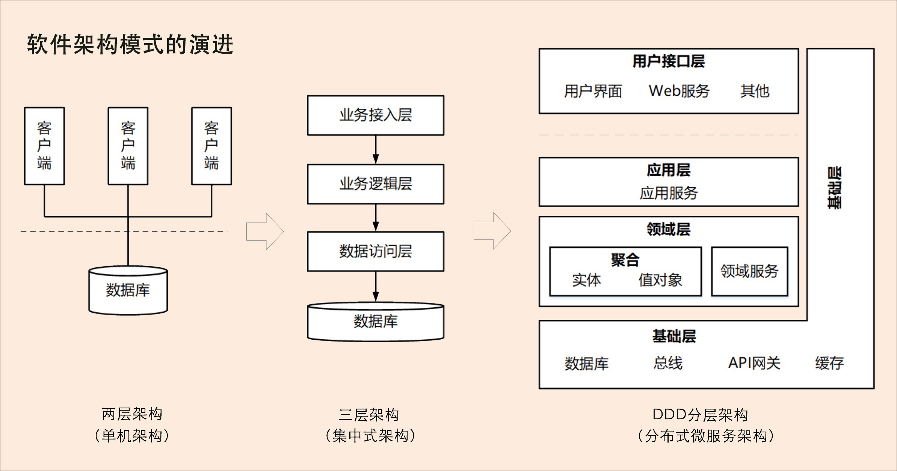

# DDD之1微服务设计为什么选择DDD

## 背景
名词解释

如果你的团队目前正是构建微服务架构风格的软件系统，问自己两个问题？

## 软件架构演进
软件架构大致经历了从单机架构，集中式架构，分布式微服架构，程序的层次图如下所示。

### 1. 单机架构
特点如下：

1. 面向过程的设计方法；

2. 结构为CS；

3. 程序的层次分两层，即UI层和数据库层；

4. 设计的核心在数据库和字段。

### 2. 集中式架构

特点如下：

1. 面向对象的设计方法；

2. 程序层次为经典的3层架构，即业务接入层， 业务逻辑层，数据库层； 

3. 部分企业也采用SOA架构风格；

4. 集中式的架构缺点：扩展性，伸缩性差，系统容易变得臃肿；

### 3. 分布式微服务架构
特点：

1. 基于微服务的理念：分而治之，模块高内聚（独立团队，独立部署，独立存储，技术异构），模块之间通过RPC或者HTTP通信，松耦合；

2. 模块之间松耦合，解决了扩展性和伸缩性的问题；

### 4. 架构对比
单体架构和集中式架构，系统分析， 系统设计，系统开发这3个阶段是割裂的，即分属3个不同的人或者小组或者岗位的人负责，这样的后果是：

1. 系统分析，设计，开发三个阶段的信息不一致，导致上线之后功能跟需求偏差非常大；

2. 系统的开发无法快速响应需求和业务的变化，错失发展的良机。

   

## 微服务的困局
### 1. 微服务解决的问题
微服务解决了单体架构和集中式架构的问题：扩展性，弹性伸缩，敏捷开发快速响应业务变化；

但是微服务并非毫无缺陷。

### 2. 微服务的挑战
微服务的粒度应该多大？微服务应该怎么拆分和设计？微服务的边界在哪里？

微服务架构的提出者martin flower 也没有告诉我们该如何拆分微服务。

微服务拆分的困局：

失败的例子：微服务就是把单体拆的足够小能够独立部署的技术框架，然后由于拆分的太细，后期服务运维和上线。

问题的本质：**业务或者微服务的边界到底是什么？**

破局之路：2004年DDD发布，Domain-Driven Design –Tackling Complexity in the Heart of Software，跟踪软件的核心复杂度。

核心思想：**通过领域驱动设计方法来定义领域模型，来确定业务和应用的边界，最后保证业务模型和代码模型的一致性。通过业界的大量实践证明：通过DDD的方法来设计领域模型，划分领域边界再根据领域边界从业务的视角来划分微服务的边界，通过这些边界设计出来的微服务都非常合理，可以实现服务的内部高内聚，外部低耦合。**所以很多的企业已经把DDD当做微服务设计的主流方法了。

## DDD
### 1. 定义

是一种处理高度复杂的领域设计思想：围绕业务概念进行领域建模来控制业务的复杂性，并试图分离技术实现的复杂性，解决软件系统难以理解难以演进的复杂性问题；

不是架构，而是一种架构设计的方法论： 通过边界划分把复杂业务领域简单化，帮助我们设计清晰的领域和应用边界，容易实现架构的演进。

### 2. 主要内容

分为战略设计和战术设计。

DDD带了了什么？

#### 2.1. 战略设计

从业务视角出发，建立业务领域模型，划分领域的边界，建立通用语言的限界上下文。限界上下文就是微服务边界的参考。

领域模型用来指导微服务的设计和拆分。

基础元素：

领域模型，领域边界，通用语言限界上下文；

方法：

划定领域模型和微服务边界的步骤：

#### 2.2. 战术设计

技术视角出发，侧重于领域模型的技术实现，完成软件的开发和落地。

包含基础元素： 聚合根、 实体、 值对象、 领域服务、 应用服务和 资源库

等代码逻辑的设计和实现。

把领域模型中的领域对象跟代码模型中的对象对应，将业务架构和系统架构进行绑定。当我们调整业务架构和领域模型的时候，系统架构也会发生映射关系的调整；

## 微服务和DDD之间的关系

## 小结

主要回答了为什么微服务的设计和边界需要使用DDD这种方法论来操作。希望诸位的微服务设计高内聚低耦合，良好的适应业务的变化，具备非常好的扩展性，伸缩性。
