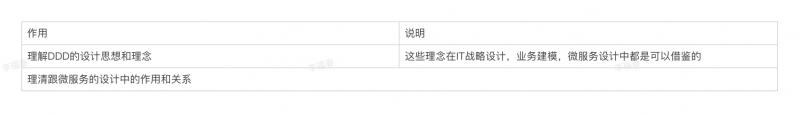
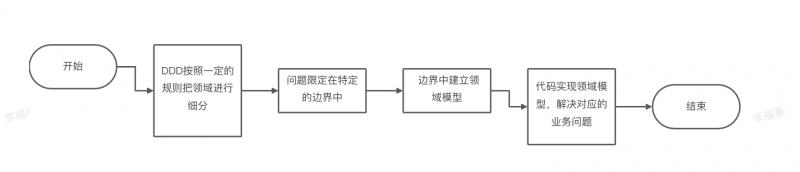
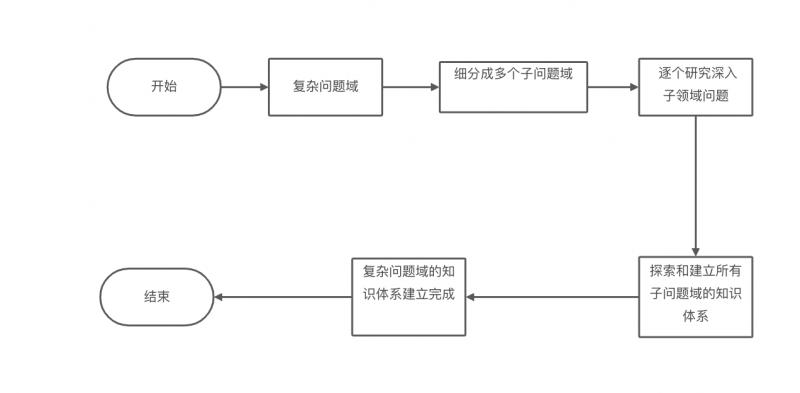
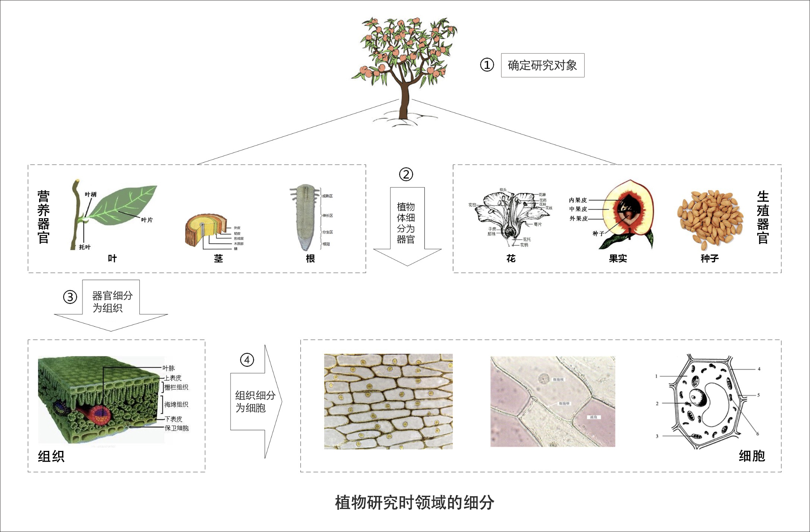
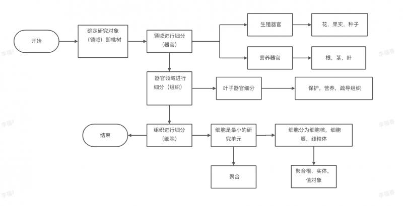
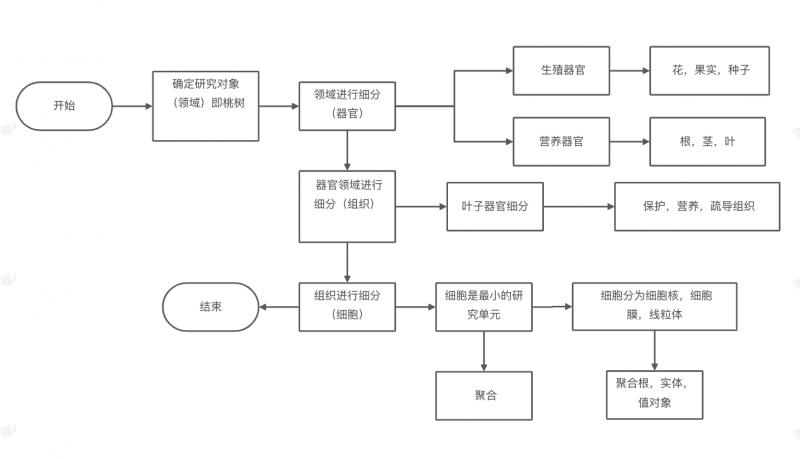
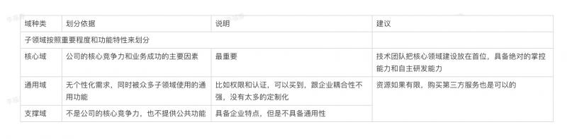
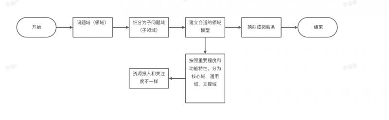

# DDD之2领域概念

## 背景
DDD中出现的名词： 领域，子领域，核心域，通用域，支撑域，限界上下文，聚合，聚合根，实体，值对象 都是关键概念，但是又比较晦涩，在开始DDD之前，搞清楚这些关键概念名词非常的重要。

那它们作用体现在哪里呢？

## 领域-子领域

领域是： 从事专门活动或者事业的范围。  领域的作用是：确定范围和边界

DDD研究和解决业务问题过程如下：

DDD中的领域是：边界中要解决的业务问题域

领域就是范围，范围有大小之分，所以，DDD中大范围的叫领域，小范围的叫子领域；

DDD是一种处理高度复杂领域的设计思想，试图分离技术实现的复杂度。

那么问题来了？ 

**面对错综复杂的业务领域，DDD是如何让业务从复杂变得简单，更容易理解？ 如何让技术实现更容易？ ** 答：跟自然科学的研究方法类似。

可以看看植物的完整生物知识学体系建立过程。

小结：

1，领域可以逐级细分为子领域，每个子领域都有一个知识体系（DDD的领域模型）， 2，当所有的子领域的知识体系都建立完毕，就完成了对领域的知识体系建立，即建立了全域的领域模型。

从业务领域来分析对比二者的细分过程是否一致。

保险行业

对比结果：不同行业业务模型不一样，但是领域建模和微服务建设过程基本一样，核心思想：**把问题领域逐步细分为子领域，从而降低业务理解和系统实现的复杂度。**

## 核心域-通用域-支撑域
领域可以按照规则细分为子领域，子领域按照重要程度和功能特性有分为3类。即核心域，通用域，支撑域；

为什么要对子领域再进行核心域，通用域，支撑域的划分？目的是什么？

公司的IT系统建设过程中，资源和预算有限，在不同类型的子领域有不同的关注度和资源投入。

重要程度跟公司的战略方向和商业模式有关系，不同的公司，关注点不一样，即商业模式不同，核心领域的划分结果不同。

在公司领域细分、建立领域模型和系统建设时，我们就要结合公司战略重点和商业模式，找到核心域了，且重点关注核心域。

## 小结
领域的核心思想是逐级细分子领域，来降低业务的理解复杂度和技术实现的复杂度。

核心域，通用域，支撑域的划分目的是：区分不同的子领域在公司的重要程度和功能属性，从而提供不同的资源投入策略和关注度。

一句话来表达: 领域拆分为子领域就是做减法的过程，降低了业务的理解复杂度和系统实现的复杂度，而核心域，通用域，支撑域的划分是跟公司的商业模式有关系的，决定了子领域的不同优先级和资源投入策略。