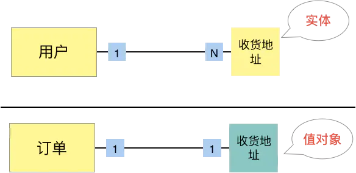
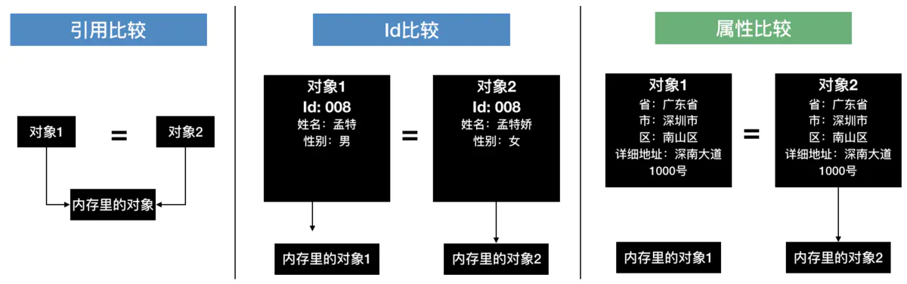
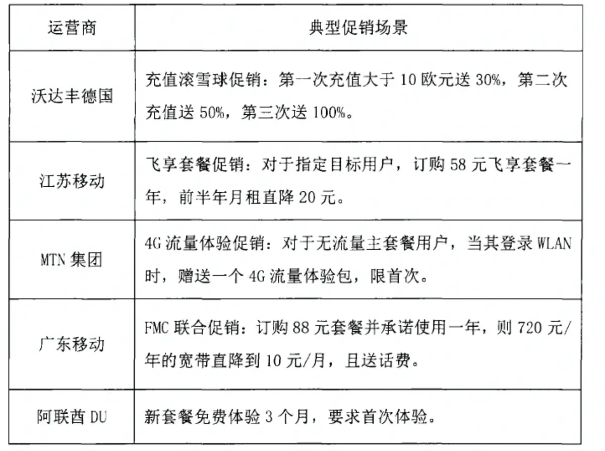
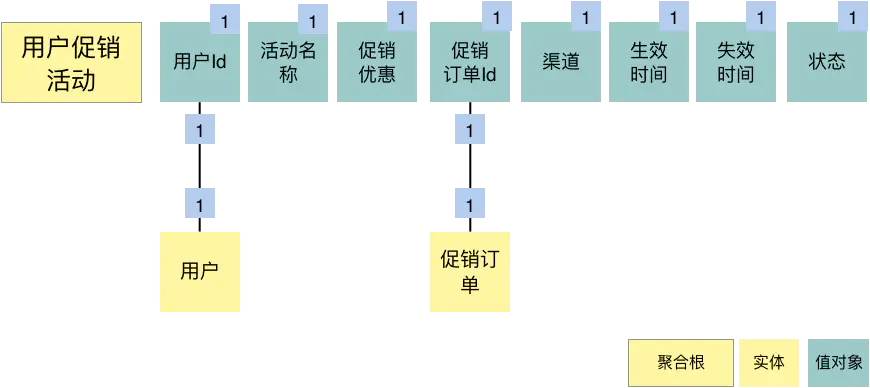
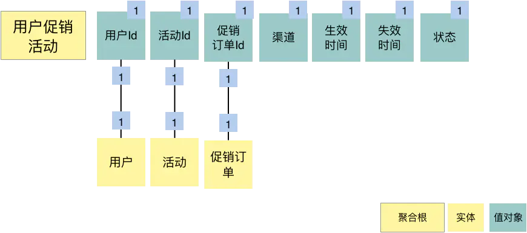

# DDD之3实体和值对象

传统的系统[架构](https://so.csdn.net/so/search?q=架构&spm=1001.2101.3001.7020)设计阶段，通常我们会将关注点放在数据上面，而不是领域上面。这种设计风格在软件开发中，使数据库占据了主导地位，我们总是有限考虑数据的属性（对应数据库的列）和关联关系（外键关联），而不是富有行为的领域概念。这样做的结果是直接将数据模型反映在对象模型上，导致这些表示领域模型的实体中含有大量的`getter、setter`方法，也就是**贫血领域模型**这不符合DDD的做法。

与传统数据模型设计优先不同，DDD 是先构建[领域模型](https://so.csdn.net/so/search?q=领域模型&spm=1001.2101.3001.7020)，针对实际业务场景构建实体对象和行为，再将实体对象映射到数据持久化对象。传统数据模型不具备行为能力，而DDD的领域模型实体含有丰富的行为能力。

## 背景
实体和值对象是领域模型中的领域对象，是组成领域模型的基础单元，一起实现实体最基本的核心领域逻辑。

那么问题来了：

1. 他两在领域模型中的作用是什么？

2. 在系统中跟代码模型和数据模型是怎么对应的？

搞清楚这两个问题很重要。回答问题是需要有知识基础的，先来捋清楚这两个概念的定义和内涵。然后在小结部分我们来回答这两个问题。

## 概念

实体与值对象两者在《领域驱动设计》书中原文的定义。

> 实体（Entity）， 主要由标识定义的对象。它可以是任何事物，只要满足两个条件即可，一是它在整个生命周期中具有连续性；二是它的区别并不是由那些对用户非常重要的属性决定的。

> 值对象(Value Object)，用于描述领域的某个方面而本身没有概念的对象称为值对象，值对象被实例化之后用来表示一些设计元素，对于这些设计元素，我们只关心它们是什么，不关心它是谁。

光看定义，理解起来有点生硬，再呈上一张详细对比图以帮助大家理解。

”什么叫持久化？“， ”什么叫Equals方法？“, "为什么实体可变而值对象不可变？"

经典案例京东商城：

> ”我们以电商为例，通常电商用户自己可以配置一个或多个收货地址，同时可以对用户收货地址进行修改、删除，像这个用户收货地址就是实体；而当用户下订单时从用户收货地址里选取一个地址作为订单送货地址，这个订单的送货地址就应该是个值对象，因为订单送货地址是随着订单创建后就固定下来了，它不会因为用户修改了用户收货地址而导致订单的送货地址发生变化，所以订单送货地址里应该保存的是地址的完整信息而非用户收货地址的Id“

有的业务同学们似乎理解了，还帮着向旁边的小伙伴解释。看来关于实体、值对象的理解似乎统一了认识，不用再解释什么叫持久化和Equals方法了。

## 二义性

DDD工作坊很重要的一环是事件风暴，通常会按场景来开展，包括三个关键步骤，第一步梳理领域事件， 第二步识别角色和命令， 第三步是识别聚合。刚做完第一个场景就有爱思考的同学提出困惑了：”DDD导入培训时说聚合是一组相关对象的集合，可现在看这个结果全是独立的，看不出哪有集合。“  这确实是个好问题，因为在这阶段梳理出来的结果在未完成聚合划分、模型细化的前提下，还真说不准它会是一个聚合根实体、普通实体还是值对象。为解除语义上的困扰于是我们把这个第三步改叫做”识别领域对象“， 领域对象包括实体和值对象。（在胡皓老师新年礼物的实战工作坊操作手册里把这步叫识别领域名词）

## 实体
在DDD中有这样一类对象，他们拥有唯一标识符，且标识符在经历各种状态变更后能保持一致，对这些对象而言，重要的不是其属性而是其延续性和标识，对象的延续性和标识会跨越甚至超过软件的生命周期。我们把这些对象成为实体；

在DDD的领域模型中，实体应该是富有业务行为且具有唯一标识符的对象。在不同的设计阶段实体是可以改变的，但是根据唯一标识符始终能定位到这个唯一对象。

唯一标识符可以是用户指定的，也可以是通过应用程序生成的`UUID`或者通过持久化机制生成的序列值（`Sequence`），当然也可以是限界上下文中传递的过来的，但无论是哪一种生产方式都要具备全局唯一性（比如订单的流水号，一些电商场景订单的流水号是通过专门的工具生产全局唯一的）。

### 实体形态

> 实体的可变性主要体现在不同的设计阶段，实体会根据所处阶段的侧重点不同，发生一定地形态变化。

#### 1. 实体的业务形态

在战略设计时，实体是领域模型的一个重要对象。领域模型中的实体是多个属性、操作或行为的载体。在事件风暴中，我们可以根据命令、操作或者事件，找出产生这些行为的业务实体对象，进而按照一定的业务规则将依存度高和业务关联紧密的多个实体对象和值对象进行聚类，形成聚合。你可以这么理解，实体和值对象是组成领域模型的基础单元。

#### 2. 实体的代码形态

在代码模型中，实体的表现形式是实体类，这个类包含了实体的属性和方法，通过这些方法实现实体自身的业务逻辑。在 DDD 里，这些实体类通常采用**充血模型**，与这个实体相关的所有业务逻辑都在实体类的方法中实现，跨多个实体的领域逻辑则在领域服务中实现。

| 模型     | 描述                                                         |
| :------- | :----------------------------------------------------------- |
| 贫血模型 | 像我们平时普通开发那样，Service 是业务逻辑，处理传递进来的 BO 或则参数对象，对于 BO 来说，BO 是贫血模型。数据和业务逻辑被分割到不同的类中 |
| 充血模型 | 数据和对应的业务逻辑被封装到同一个类中                       |

#### 3. 实体的运行形态

实体以 DO（领域对象）的形式存在，每个实体对象都有唯一的 ID。我们可以对一个实体对象进行多次修改，修改后的数据和原来的数据可能会大不相同。但是，由于它们拥有相同的 ID，它们依然是同一个实体。比如商品是商品上下文的一个实体，通过唯一的商品 ID 来标识，不管这个商品的数据如何变化，商品的 ID 一直保持不变，它始终是同一个商品。

#### 4. 实体的数据库形态

在领域模型映射到数据模型时，一个实体可能对应 0 个、1 个或者多个数据库持久化对象。大多数情况下实体与持久化对象是一对一。在某些场景中，有些实体只是暂驻静态内存的一个运行态实体，它不需要持久化。比如，基于多个价格配置数据计算后生成的折扣实体。

而在有些复杂场景下，实体与持久化对象则可能是一对多或者多对一的关系。比如，用户 `user` 与角色 `role` 两个持久化对象可生成权限实体，一个实体对应两个持久化对象，这是一对多的场景。再比如，有些场景为了避免数据库的联表查询，提升系统性能，会将客户信息 customer 和账户信息 account 两类数据保存到同一张数据库表中，客户和账户两个实体可根据需要从一个持久化对象中生成，这就是多对一的场景。

## 值对象

我们先看一下《实现领域驱动设计》一书中对值对象的定义**：通过对象属性值来识别的对象，它将多个相关属性组合为一个概念整体 。**在 DDD 中用来描述领域的特定方面，并且是一个没有标识符的对象，叫作值对象。也就说，值对象描述了领域中的一件东西，这个东西是不可变的，它将不同的相关属性组合成了一个概念整体。当度量和描述改变时，可以用另外一个值对象予以替换。它可以和其它值对象进行相等性比较，且不会对协作对象造成副作用。

简单来说，值对象本质上就是一个集。那这个集合里面有什么呢？若干个用于描述目的、具有整体概念和不可修改的属性。那这个集合存在的意义又是什么？**在领域建模的过程中，值对象可以保证属性归类的清晰和概念的完整性，避免属性零碎。**

举个简单的例子，请看下面这张图：

如果把省市区地址放在人员实体中，会显得属性很多很零碎。 推荐的做法是把省市区地址构成一个集合，即地址值对象；

人员实体原本包括：姓名、年龄、性别以及人员所在的省、市、县和街道等属性。这样显示地址相关的属性就很零碎，现在，我们可以将**省、市、县和街道等属性**拿出来构成一个**地址属性集合**，这个集合就是值对象了

### 值对象形态

#### 1. 值对象的业务形态

值对象是 DDD 领域模型中的一个基础对象，它跟实体一样都来源于事件风暴所构建的领域模型，都包含了若干个属性，它与实体一起构成聚合。

| 类型   | 作用                                                         |
| :----- | :----------------------------------------------------------- |
| 实体   | 实体是看得到，摸得到的实实在在的业务对象，实体具有业务属性，业务行为和业务逻辑 |
| 值对象 | 值对象只是若干属性的集合，只有数据初始化操作和有限的不涉及修改数据行为，基本不包括业务逻辑 |

值对象的属性虽然在物理位上被独立出来了，但在逻辑上它仍然是实体属性的一部分，用于描述实体特征。

#### 2. 值对象的代码形态

值对象在代码中有两种形态：

| 类型             | 形态                                                         |
| :--------------- | :----------------------------------------------------------- |
| 值对象是单一属性 | 直接定义为实体类的属性                                       |
| 值对象时属性集合 | 把它设计为Class类，Class类将具有整体概念的多个属性归集为属性集合，这样的值对象没有ID，会被实体整体引用 |

我们看一下下面这段代码，`person` 这个实体有若干个单一属性的值对象，比如 `Id、name` 等属性；同时它也包含多个属性的值对象，比如地址 `address`。

#### 3. 值对象的运行形态

实体实例化后的 DO 对象的业务属性和业务行为非常丰富，但是值对象的实例话对象则相对简单和乏味。除了值对象数据初始化和整体替换行为外，其他业务行为就很少了。

值对象嵌入到实体后的话，有这样两种不同的数据格式，也可以说是两种方式。属性嵌入式的方式和序列化大对象的方式。

引用单一属性的值对象或只有一条记录的多属性值对象的实体，可以采用属性嵌入的方式嵌入。引用一条或多条记录的多属性值对象的实体，可以采用序列化大对象的方式嵌入。比如，人员实体可以有多个通讯地址，多个地址序列化后可以嵌入人员的地址属性。值对象创建后就不允许修改了，只能用另外一个值对象来整体替换。

**案例 1：**以属性嵌入的方式形成的人员实体对象，地址值对象直接以属性值嵌入人员实体中。

**案例 2：**以序列化大对象的方式形成的人员实体对象，地址值对象被序列化成大对象 Json 串后，嵌入人员实体中。

#### 4. 值对象的数据库形态

> 在领域建模时，我们可以将部分对象设计为值对象，保留对象的业务涵义，同时又减少了实体的数量；在数据建模时，我们可以将值对象嵌入实体，减少实体表的数量，简化数据库设计。

DDD 引入值对象是希望实现从“数据建模为中心”向“领域建模为中心”转变，减少数据库表的数量和表与表之间复杂的依赖关系，尽可能地简化数据库设计，提升数据库性能。

**如何理解用值对象来简化数据库设计呢？**

传统的数据建模大多是根据数据库范式设计的，每一个数据库表对应一个实体，每一个实体的属性值用单独的一列来存储，一个实体主表会对应 N 个实体从表。而值对象在数据库持久化方面简化了设计，它的数据库设计大多采用非数据库范式，值对象的属性值和实体对象的属性值保存在同一个数据库实体表中。

* 举个例子，还是基于上述人员和地址那个场景，实体和数据模型设计通常有两种解决方案：

  第一是把地址值对象的所有属性都放到人员实体表中，创建人员实体，创建人员数据表；

  第二是创建人员和地址两个实体，同时创建人员和地址两张表。

* 优缺点：

  第一个方案会破坏地址的业务涵义和概念完整性，

  第二个方案增加了不必要的实体和表，需要处理多个实体和表的关系，从而增加了数据库设计的复杂性。

**那到底应该怎样设计，才能让业务含义清楚，同时又不让数据库变得复杂呢？**

​		我们可以综合这两个方案的优势，扬长避短。在领域建模时，我们可以把地址作为值对象，人员作为实体，这样就可以保留地址的业务涵义和概念完整性。而在数据建模时，我们可以将地址的属性值嵌入人员实体数据库表中，只创建人员数据库表。这样既可以兼顾业务含义和表达，又不增加数据库的复杂度。

​		值对象就是通过这种方式，简化了数据库设计，总结一下就是：在领域建模时，我们可以将部分对象设计为值对象，保留对象的业务涵义，同时又减少了实体的数量；在数据建模时，我们可以将值对象嵌入实体，减少实体表的数量，简化数据库设计。

​		另外，也有 DDD 专家认为，要想发挥对象的威力，就需要优先做领域建模，弱化数据库的作用，只把数据库作为一个保存数据的仓库即可。即使违反数据库设计原则，也不用大惊小怪，只要业务能够顺利运行，就没什么关系。

> 我们可以综合这两个方案的优势，扬长避短。在领域建模时，我们可以把地址作为值对象，人员作为实体，这样就可以保留地址的业务涵义和概念完整性。而在数据建模时，我们可以将地址的属性值嵌入人员实体数据库表中，只创建人员数据库表。这样既可以兼顾业务含义和表达，又不增加数据库的复杂度。
>
> DDD 提倡从领域模型设计出发，而不是先设计数据模型。前面讲过了，传统的数据模型设计通常是一个表对应一个实体，一个主表关联多个从表，当实体表太多的时候就很容易陷入无穷无尽的复杂的数据库设计，领域模型就很容易被数据模型绑架。可以说，值对象的诞生，在一定程度上，和实体是互补的。
>
> 强调一点，我们不避讳传统的设计方法，毕竟适合自己的才是最好的。

### 值对象的优势和局限

值对象是一把双刃剑，它的优势是可以简化数据库设计，提升数据库性能。

- 值对象采用序列化大对象的方法简化了数据库设计，减少了实体表的数量，可以简单、清晰地表达业务概念。这种设计方式虽然降低了数据库设计的复杂度，但却无法满足基于值对象的快速查询，会导致搜索值对象属性值变得异常困难。
- 值对象采用属性嵌入的方法提升了数据库的性能，但如果实体引用的值对象过多，则会导致实体堆积一堆缺乏概念完整性的属性，这样值对象就会失去业务涵义，操作起来也不方便。

所以，你可以对照着以上这些优劣势，结合你的业务场景，好好想一想了。那如果在你的业务场景中，值对象的这些劣势都可以避免掉，那就请放心大胆地使用值对象吧。

## 实体和值对象的区别

> 实体和值对象的目的都是抽象聚合若干属性以简化设计和沟通，有了这一层抽象，我们在使用人员实体时，不会产生歧义，在引用地址值对象时，不用列举其全部属性，在同一个限界上下文中，大幅降低误解、缩小偏差，两者的区别如下：
>
>
> ①两者都经过属性聚类形成，实体有唯一性，值对象没有。在本文案例的限界上下文中，人员有唯一性，一旦某个人员被系统纳入管理，它就被赋予了在事件、流程和操作中被唯一识别的能力，而值对象没有也不必具备唯一性。
>
>
> ②实体着重唯一性和延续性，不在意属性的变化，属性全变了，它还是原来那个它；值对象着重描述性，对属性的变化很敏感，属性变了，它就不是那个它了。
>
>
> ③战略上的思考框架稳定不变，战术上的模型设计却灵活多变，实体和值对象也有可能随着系统业务关注点的不同而更换位置。比如，如果换一个特殊的限界上下文，这个上下文更关注地址，而不那么关注与这个地址产生联系的人员，那么就应该把地址设计成实体，而把人员设计成值对象。

DDD提倡从领域模型设计出发，而不是先设计数据模型；

## 实体和值对象的关系

实体和值对象都是微服务底层的最基础对象，一起实现实体最基本的核心领域逻辑。

值对象和实体在某些场景下可以互换，很多 DDD 专家在这些场景下，其实也很难判断到底将领域对象设计成实体还是值对象？可以说，值对象在某些场景下有很好的价值，但是并不是所有的场景都适合值对象。你需要根据团队的设计和开发习惯，以及上面的优势和局限分析，选择最适合的方法。

DDD 提倡从领域模型设计出发，而不是先设计数据模型。前面讲过了，传统的数据模型设计通常是一个表对应一个实体，一个主表关联多个从表，当实体表太多的时候就很容易陷入无穷无尽的复杂的数据库设计，领域模型就很容易被数据模型绑架。可以说，值对象的诞生，在一定程度上，和实体是互补的。

我们还是以前面的图示为例：

在领域模型中人员是实体，地址是值对象，地址值对象被人员实体引用。在数据模型设计时，地址值对象可以作为一个属性集整体嵌入人员实体中，组合形成上图这样的数据模型；也可以以序列化大对象的形式加入到人员的地址属性中，前面表格有展示。

从这个例子中，我们可以看出，同样的对象在不同的场景下，可能会设计出不同的结果。有些场景中，地址会被某一实体引用，它只承担描述实体的作用，并且它的值只能整体替换，这时候你就可以将地址设计为值对象，比如收货地址。而在某些业务场景中，地址会被经常修改，地址是作为一个独立对象存在的，这时候它应该设计为实体，比如行政区划中的地址信息维护。

## 小结
首先明确了实体和值对象的概念，以及在不同的设计阶段的形态。然后通过一个例子展示了实体和值对象的概念和使用；

这是一个从业务模型向系统模型落地过程，考验的是设计能力，我们应该结合自己的业务场景，选择合适的方法进行微服务设计。

最后我来回答一下在背景部分抛出的两个问题？

1. 实体和值对象在领域模型中的作用是什么？

2. 在系统中跟代码模型和数据模型是怎么对应的？

经过上面的分析，我的回答如下：

| 作用     | 实体                                                         | 值对象                                                       |
| -------- | ------------------------------------------------------------ | ------------------------------------------------------------ |
| 领域模型 | 实体是领域模型的领域对象，是组成领域模型的基础单元。 包含了业务属性，业务方法，业务逻辑；具备唯一标识； 是事件风暴过程中通过事件，命令，操作发生的主体； | 值对象也是领域模型的基础领域对象，是组成领域模型的基础单元； 包含了一组相关的属性，不具备标识，一般是实体的一部分； 也是事件风暴过程中通过事件，命令，操作产生的； |
| 系统模型 | 对应的代码模型中的实体类DO、充血模型、有自己的属性和方法，方法实现的是自身的业务逻辑：具备唯一标识； 对应数据模型中的实体表；关系要根据实际场景来，1对多，1对1，多对1，1对0多种情况都有可能 | 代码模型中对应的值对象类，无标识，有属性。只有有限的初始化和整体替换方法；  数据模型：可以作为多属性嵌入或者大对象序列化的方式跟实体表放在一起，简化数据库的设计； |

# 实现

当项目开始做领域建模时，围绕实体与值对象还发生了一个小插曲。做模型细化时需要把聚合根实体下有哪些实体、值对象识别出来，有开发同学提出疑问：”值对象和实体是不是就是对应到Java代码里的基本数据类型和引用类型？“

> 不全是，值对象的实现时强调的是不可变。基本数据类型可以满足不可变，引用类型也可以做到。比如Java里String类型就是一个不可变的引用类型。

> 在Java里具体需要如何定义值对象，需要首先了解Java里判断对象相等的实现方式。1. 判断引用是否相等；2. 判断Id是否相同；3.判断特定属性集是否相等；

所以在Java代码里区分实体与值对象，取决于判断两个同类型的实例是否相等的方式， 实体通过引用或Id比较来判断， 值对象通过属性比较来判断。这也是为什么在前文提到的值对象需要实现equals方法。

# 案例

开发同学继续好奇的问道：”像实体与值对象这么偏技术的，是不是不需要在DDD工作坊阶段就确定下来，只要标识它是一个领域对象就行了？“

还正在思考怎么组织逻辑来回答这个问题， 作为业务代表的产品经理打断了我们，说要讨论对”用户促销活动“这个聚合进行细化。

这里先简单介绍一下促销中心的业务背景。

> 促销活动配置管理员会去管理后台配置一系列的促销活动，每个活动里会包含一些参与条件及可享受的折扣优惠；当用户达到参与条件并在柜台签署一份参与活动的协议后，营业员就会把用户参与的促销活动提交给促销中心系统。计费系统会在费用结算时根据用户参与的促销活动进行费用的折扣减免。

> 用户促销活动，就是指用户参与了的促销活动，代表用户与促销活动的订购关系。

下图是一些典型运营商促销场景。

基于对于业务的理解，大多同学都认为在用户促销活动里应该把配置管理的活动优惠作为值对象把关键属性存下来，这样当配置管理员调整活动的折扣优惠时不会影响到已经办理过了的用户促销活动优惠计算。于是用户促销活动的领域模型会是这样的，如下图：

产品经理看了用户促销活动的领域模型思考片刻后提出促销优惠应该是个实体。为了避免是产品经理对实体与值对象的理解偏差，我把二者的定义、区别以及京西商城用户地址的例子又和他讲了一遍。

他听完后更加坚定的说:"那就是的，促销优惠在用户促销活动下是个实体，我希望配置管理员修改配置活动里的优惠后，用户参与了的促销活动也立即生效。"

”那这样用户话费计算不就是有不确定性了？“ 开发同学着急的问道。

产品经理解释道：”因为正常来说，我们的促销活动一经发布就不会修改了。如果有变化都是通过策划新的活动来替代它，而不会修改原来的活动。但有一种情况会修改，那就是配置人员配置错误了，这个时候就希望领导审批后能够通过修改活动配置来纠正并同步修正用户已经办理了的促销活动。“

看来领域模型中的实体、值对象的识别还是得业务和技术一起对齐业务认识， 光凭技术同学的经验是有风险的。

根据产品经理的描述，于是赶紧调整了”用户促销活动“的领域模型，把活动名称、促销优惠都通过关联活动实体来获取。

# 扩展阅读

是否要设计为值对象，他要看这个对象后续还会来回修改，会不会有生命周期。如果不可修改，并且以后也不会专门针对它进行查询或者统计，就可以把它设计成值对象，如果不行那就设计成实体。

DDD 强调领域模型而不是数据模型 ，所以在设计的时候不建议把数据模型放在很优先的位置，但是如果你的数据需要经常修改，还是把它设计为实体吧。

很多值对象来源于上一个业务流程或者外部第三方的数据，它在上游或者第三方是一个关键实体，甚至是聚合根。但在下游或者其他微服务内它是不可以修改的，要修改也只能从上游或者第三方修改后做整体替换，它只是一个值，这类领域对象你是可以设计为值对象的。

虽然我们项目不是按照 DDD 设计的，但我还是结合自己所在的团队的项目中的一部分来分析下实体和值对象，我们的项目主要是为业务方提供账单服务。首先，介绍下业务，业务方会同步订单过来，同时附带一些第三方的接口参数，收付款方的信息。对于我们来讲「订单」就是一个实体对象，而第三方参数是仅保存不提供修改的对象，所以可以设计为一个值对象。而对于收付款方的信息，为了更利于查询，我们将其设计成一个实体。

数据集被整体创建，整体读取，修改需求少时可以设计成值对象。