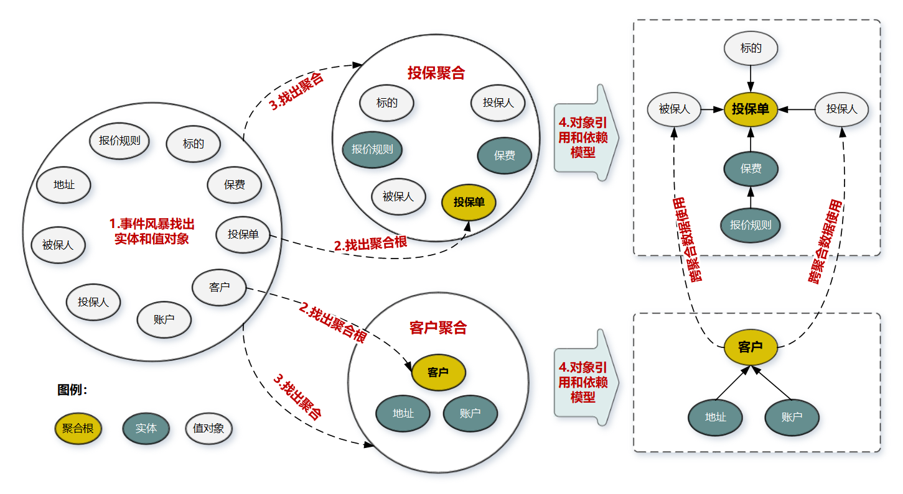

# DDD之4聚合和聚合根

聚合就是归类的意思，把同类事物统一处理； 聚合根也就是最抽象，最普遍的特性；

## 背景
领域建模的过程回顾：

那么问题来了？

为什么要在限界上下文和实体之间增加聚合和聚合根的概念，即作用是什么？

如何设计聚合？

按照一般的研究和学习思路，先弄懂概念，然后结合实际例子理解概念，然后再回答提出的问题。

## 聚合根
聚合根：如果把聚合比作组织，聚合根则是组织的负责人，聚合根也叫做根实体，它不仅仅是实体，还是实体的管理者；

职责： 

1. 作为实体，具备自己的业务属性，业务行为，业务逻辑 

2. 作为聚合的管理者， 在聚合内部，负责协调实体和值对象按照固定的业务规则协同完成共同的业务逻辑； 在聚合之间：它是聚合对外的接口人，以聚合根ID的方式接受外部请求和任务，实现上下文中的聚合之间的业务协同；

聚合之间通过聚合根关联引用，如果需要访问其他聚合的实体，先访问聚合根，再导航到聚合内部的实体；即外部对象不能直接访问聚合内的实体；

解决的问题： 复杂数据模型缺少统一的业务规则控制而导致的聚合，实体之间数据不一致的问题；

| 数据处理方式                  | 问题                                                         |
| ----------------------------- | ------------------------------------------------------------ |
| 传统:实体个数据模型一一对应， | 任由实体无控制的修改数据，容易导致实体之间数据逻辑不一致的问题；加锁增加了软件复杂度和降低系统性能； |

## 聚合
在DDD中，实体和值对象都是很基础的领域对象。

聚合是什么呢？类比一下：

| DDD的概念                                                    | 人类                                                         |
| ------------------------------------------------------------ | ------------------------------------------------------------ |
| 实体，值对象                                                 | 人                                                           |
| 聚合                                                         | 社团，组织，部门                                             |
| 聚合的好处：                                                 |                                                              |
| 让实体和值对象协同工作的组织就是聚合，用来确保这些领域对象在实现公共的业务逻辑的时候，可以保持数据的一致性 | 个人是组织的一员，协同工作，有共同目标，可以发挥出更大的力量 |

聚合的另一种视图： 聚合是业务和逻辑紧密关联的实体和值对象组合而成，聚合是数据修改和持久化的基本单元，一个聚合对应一个数据的持久化；

聚合在DDD分层架构中属于领域层，领域层包含了多个聚合，共同实现核心业务逻辑，聚合内的实体以充血模型实现个体业务能力，以及业务逻辑的高内聚； 跨多个实体的业务逻辑通过领域服务来实现，跨多个聚合的业务逻辑通过应用服务来实现；

| 跨越场景                                     | 处理办法                   |
| -------------------------------------------- | -------------------------- |
| 业务场景需要一个聚合中的A实体和B实体共同完成 | 业务逻辑用领域服务来实现； |
| 业务逻辑需要聚合C和聚合D共同完成             | 应用服务来组合这两个服务； |

聚合的组成：

| 组成部分                   | 说明                                                         |
| -------------------------- | ------------------------------------------------------------ |
| 上下文边界                 | 边界是根据业务单一职责和高内聚原则，定义了聚合内部应该包含哪些实体和值对象 |
| 聚合之间的边界是松耦合的； |                                                              |
| 聚合根                     | 见下面的介绍                                                 |

如何设计聚合？

例子：保单系统聚合的过程。

| 步骤 | 说明                                                         |
| ---- | ------------------------------------------------------------ |
| 1    | 通过事件风暴的用例分析，场景分析，用户旅程分析得到领域对象（账户，客户，投保单，报废，标的，报价规则，地址，投保人，被保人） |
| 2    | 从领域对象中找出适合作为实体管理者的对象（聚合根），[是否具备唯一标识，能管理其他的实体]-》（投保，客户） |
| 3    | 按照业务的职责单一和高内聚原则，找出聚合根紧密关联的实体和值对象，构建以聚合根为中心的集合，即得到聚合；-》（投保聚合，客户聚合） |
| 4    | 在聚合内部画出聚合根跟实体和值对象的引用和依赖关系图-》（客户依赖地址和账户） |
| 5    | 多个聚合根据业务语义，和上下文划在同一个限界上下文中         |

聚合的设计原则：

| 原则                       | 说明                                                         |
| -------------------------- | ------------------------------------------------------------ |
| 聚合设计的尽量小           | 如果聚合设计的过大，内部还有大量的实体和值对象，管理会比较复杂，高频操作会有并发和数据库锁冲突的问题，导致系统可用性降低； 聚合设计的足够小，也就降低了复杂度，可复用性也更高，降低了后期重构复杂聚合的成本； |
| 聚合应该高内聚             | 封装的是真正的不变的领域对象，内部的实体和值对象按照固定的规则运行，实现数据的一致性，边界外的任何东西都于该聚合无关， |
| 通过唯一标识符引用其它聚合 | 聚合之间通过聚合根的唯一ID来关联，而不是直接对象引用的方式，外部的聚合对象如果在本聚合范围内管理，容易导致边界不清晰，增加聚合之间的耦合度； |
| 边界之外使用最终一致性     | 聚合内部数据强一致性，聚合之间数据最终一致性，在一次事务中最多只修改一个聚合的数据状态，如果在一次事务中涉及修改多个聚合的状态，应该使用领域事件的方式来异步的实现最终一致性，实现聚合之间的解耦； |
| 在应用层实现跨聚合的调用   | 实现微服务内部聚合之间的解耦，以为为未来以聚合为单位的拆分和组合，应该避免跨聚合的的领域服务调用和数据表关联； |

## 小结
聚合的特点：高内聚低耦合，是领域模型中最底层的边界，可以作为拆分微服务的最小单位，但是不建议单独对应一个微服务，除非是对性能有极致要求的场景，一个微服务可以包含多个聚合，聚合之间的边界是逻辑最天然的边界，有了这个逻辑边界，就可以在微服务拆分的时候作为拆分和组合依据，微服务架构演进也就不是难事了。

聚合根的特点：聚合根是实体，具备唯一标识，有独立的生命周期，一个聚合只有一个聚合根，聚合根在聚合之内采用引用依赖的方式对实体和值对象进行组织和协调，聚合根和聚合根之间通过唯一id进行聚合之间的协同；

实体的特点：具备id标识，可以通过id进行相等性比较，实体在聚合内唯一，但是状态可变，它依附于聚合根，它的生命周期由聚合根管理，实体一般都会持久化，跟数据持久化对象存在多种对应关系（一对一，一对多，多对一，1对0），实体可以引用聚合中的聚合根，实体，值对象；

值对象特点：无id,不可变，无生命周期，用完即失效，值对象之间通过属性值判断相等性，他的核心是值，是一组概念完整的属性集合，用于描述实体的特征和状态，值对象尽量只引用值对象；

本篇主要介绍了聚合根，聚合的概念，然后介绍了聚合的设计过程和原则，以及对比了聚合，聚合根，实体，值对象的特点。

下面我们来回答最初的两个问题？

为什么要在实体和限界上下文之间增加聚合和聚合根，作用是什么？

在实体和限界上下文之间增加聚合和聚合根之间的原因是：**让实体和值对象协同工作，在实现公共业务逻辑的时候，可以保证数据的一致性；**

如何设计聚合？

过程是：通过事件风暴（用例分析，场景分析，用户旅程分析）得到实体和值对象，然后找出聚合根，按照高内聚低耦合的设计原则，找出跟聚合根紧密关联的实体和值对象，即形成聚合，并画出聚合内的实体和值对象的引用依赖关系，最后把业务把关联紧密的聚合画在同一个限界上线文中，即完成了领域建模；

聚合的设计原则： 高内聚，聚合尽量小，聚合之间通过id关联，边界之外使用最终一致性，在应用层实现跨聚合的调用。

希望大家可以得到相对完整（高内聚低耦合）的业务领域模型；