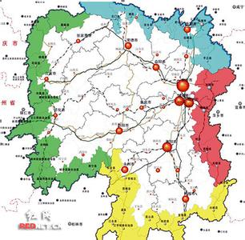
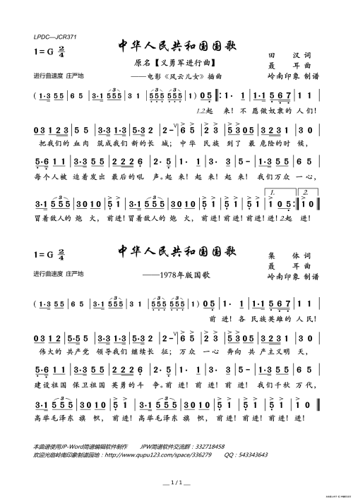
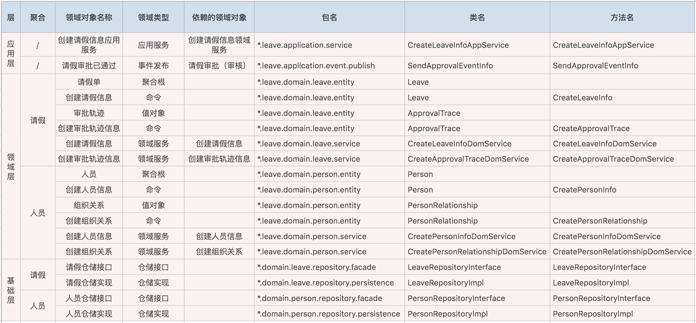
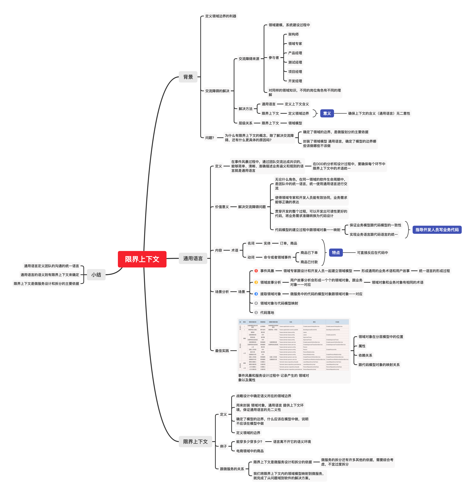

# DDD之5限界上下文-定义领域边界的利器

上图是一张普通地图，最刺眼的就是边界？ 非常好奇地图绘制工程师是如何描绘如此弯曲多变的边界的？强制行政区域还是人群历史原因自然的人以群分？ 我们再换个视角，对工程师或者架构师来说，微服务的边界如何划分呢？

**基于DDD设计方法论中的概念 限界上下文 来划分微服务的边界；**

## 背景
架构师小李正在团队推行DDD设计方法论,领域建模和系统建设过程中，很多岗位需要参加进来，比如产品经理，领域专家，项目经理，架构师，开发经理，测试经理。对同样的领域知识，不同的人可能有不同的认识，交流起来存在一定障碍。 **假如你是小李，你会如何消除这种交流障碍呢？**

答案是今天的主角：**通用语言**和**限界上下文**。 先简单的厘清这两个概念。

| 名词       | 概念                                                         |
| ---------- | ------------------------------------------------------------ |
| 通用语言   | 定义上下文含义                                               |
| 限界上下文 | 定义领域的边界，确保每个上下文的语义（通用语言）在边界内的唯一性含义 |

## 通用语言
通用语言：**团队交流达成共识的能够明确简单清晰的描述业务规则和业务含义的语言就是通用语言。** 用途：通用语言是团队的统一语言，在团队中不管你是什么角色，在同一领域的软件生命周期里都使用统一语言进行交流。 价值：

1. 解决各岗位的沟通障碍问题，促进不同岗位的和合作，确保业务需求的正确表达。

2. 通用语言贯穿于整个设计过程，基于通用语言可以开发出可读性更好的代码，能准确的把业务需求转化为代码。

   

类比： 义勇军对中国人来说就是通用语言，大家都知道这是我们的国歌，没有二义性；

通用语言的组成：

| 组成部分 | 说明                                                       | 代码对应                         |
| -------- | ---------------------------------------------------------- | -------------------------------- |
| 术语     | 名词：给领域命名，比如订单，商品；动词：给命令和事件命名； | 名词：对应实体动词：命令或者事件 |

DDD领域建模和系统落地过程： 既然是一种映射，那么可以整理成一张表格。 记录事件风暴中产生的领域对象的位置，属性和在代码模型中对应的代码对象的对应关系。 格式如下：

要点：DDD的设计和分析的过程中，要保证术语在限界上下文中的统一，并保证业务模型中的领域对象跟系统模型中的代码对象一一对应。从而保证业务模型跟代码模型的一致性。

## 限界上下文
定义：战略设计中确定语义所在的领域边界就是限界上下文。 为了好理解，这里对比一下中文和DDD：

| 对比项目 | 语言     | 语义环境   |
| -------- | -------- | ---------- |
| 中文     | 汉语     | 语言环境   |
| DDD      | 通用语言 | 限界上下文 |

限界：即边界上下文：即语义环境； 综合起来：即带边界的语义环境。 限界上下文是微服务拆分和设计的主要边界依据，当然微服务还有其他的划分边界依据，需要综合考虑；我们将限界上下文内的领域模型映射到微服务就完成了从问题域到软件的解决方案。

## 小结
问题？ 为什么有限界上下文的概念，除了解决交流障碍，还有什么更具体的原因吗？ 确定了领域的边界，是微服划分的主要依据 封装了领域模型 通用语言，确定了模型的边界哪些该做哪些不该做

限界上下文在微服务设计的作用和意义？ 微服务边界划分的主要依据

最后小结汇总成一张图。

