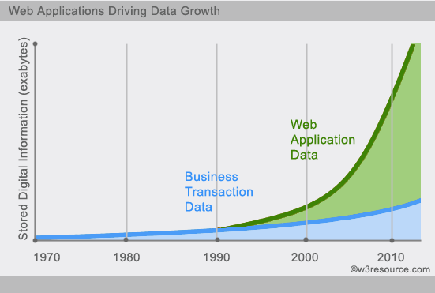
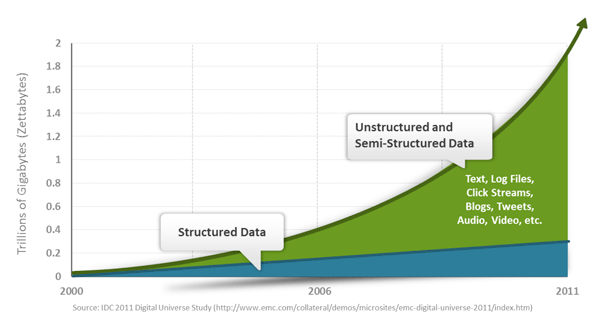

# 工具

* navicat

# NoSQL 简介

​		NoSQL(NoSQL = Not Only SQL )，意即"不仅仅是SQL"。

​		在现代的计算系统上每天网络上都会产生庞大的数据量。

​		这些数据有很大一部分是由关系数据库管理系统（RDBMS）来处理。 1970年 E.F.Codd's提出的关系模型的论文 "A relational model of data for large shared data banks"，这使得数据建模和应用程序编程更加简单。

​		通过应用实践证明，关系模型是非常适合于客户服务器编程，远远超出预期的利益，今天它是结构化数据存储在网络和商务应用的主导技术。

​		NoSQL 是一项全新的数据库革命性运动，早期就有人提出，发展至2009年趋势越发高涨。NoSQL的拥护者们提倡运用非关系型的数据存储，相对于铺天盖地的关系型数据库运用，这一概念无疑是一种全新的思维的注入。

## 关系型数据库遵循ACID规则

​		事务在英文中是transaction，和现实世界中的交易很类似，它有如下四个特性：

**1、A (Atomicity) 原子性**

​		原子性很容易理解，也就是说事务里的所有操作要么全部做完，要么都不做，事务成功的条件是事务里的所有操作都成功，只要有一个操作失败，整个事务就失败，需要回滚。

​		比如银行转账，从A账户转100元至B账户，分为两个步骤：1）从A账户取100元；2）存入100元至B账户。这两步要么一起完成，要么一起不完成，如果只完成第一步，第二步失败，钱会莫名其妙少了100元。

**2、C (Consistency) 一致性**

​		一致性也比较容易理解，也就是说数据库要一直处于一致的状态，事务的运行不会改变数据库原本的一致性约束。

​		例如现有完整性约束a+b=10，如果一个事务改变了a，那么必须得改变b，使得事务结束后依然满足a+b=10，否则事务失败。

**3、I (Isolation) 独立性**

​		所谓的独立性是指并发的事务之间不会互相影响，如果一个事务要访问的数据正在被另外一个事务修改，只要另外一个事务未提交，它所访问的数据就不受未提交事务的影响。

​		比如现在有个交易是从A账户转100元至B账户，在这个交易还未完成的情况下，如果此时B查询自己的账户，是看不到新增加的100元的。

**4、D (Durability) 持久性**

​		持久性是指一旦事务提交后，它所做的修改将会永久的保存在数据库上，即使出现宕机也不会丢失。

## 分布式系统

​		分布式系统（distributed system）由多台计算机和通信的软件组件通过计算机网络连接（本地网络或广域网）组成。

​		分布式系统是建立在网络之上的软件系统。正是因为软件的特性，所以分布式系统具有高度的内聚性和透明性。

​		因此，网络和分布式系统之间的区别更多的在于高层软件（特别是操作系统），而不是硬件。

​		分布式系统可以应用在不同的平台上如：Pc、工作站、局域网和广域网上等。

## 分布式计算的优点

**可靠性（容错） ：**

分布式计算系统中的一个重要的优点是可靠性。一台服务器的系统崩溃并不影响到其余的服务器。

**可扩展性：**

在分布式计算系统可以根据需要增加更多的机器。

**资源共享：**

共享数据是必不可少的应用，如银行，预订系统。

**灵活性：**

由于该系统是非常灵活的，它很容易安装，实施和调试新的服务。

**更快的速度：**

分布式计算系统可以有多台计算机的计算能力，使得它比其他系统有更快的处理速度。

**开放系统：**

由于它是开放的系统，本地或者远程都可以访问到该服务。

**更高的性能：**

相较于集中式计算机网络集群可以提供更高的性能（及更好的性价比）。

## 分布式计算的缺点

**故障排除：**

故障排除和诊断问题。

**软件：**

更少的软件支持是分布式计算系统的主要缺点。

**网络：**

网络基础设施的问题，包括：传输问题，高负载，信息丢失等。

**安全性：**

开放系统的特性让分布式计算系统存在着数据的安全性和共享的风险等问题。

## 什么是NoSQL?

​		NoSQL，指的是非关系型的数据库。NoSQL有时也称作Not Only SQL的缩写，是对不同于传统的关系型数据库的数据库管理系统的统称。

​		NoSQL用于超大规模数据的存储。（例如谷歌或Facebook每天为他们的用户收集万亿比特的数据）。这些类型的数据存储不需要固定的模式，无需多余操作就可以横向扩展。

## 为什么使用NoSQL ?

​		今天我们可以通过第三方平台（如：Google,Facebook等）可以很容易的访问和抓取数据。用户的个人信息，社交网络，地理位置，用户生成的数据和用户操作日志已经成倍的增加。我们如果要对这些用户数据进行挖掘，那SQL数据库已经不适合这些应用了, NoSQL 数据库的发展却能很好的处理这些大的数据。

## 实例

社会化关系网:

> Each record: UserID1, UserID2
> Separate records: UserID, first_name,last_name, age, gender,...
> Task: Find all friends of friends of friends of ... friends of a given user.

Wikipedia 页面 :

> Large collection of documents
> Combination of structured and unstructured data
> Task: Retrieve all pages regarding athletics of Summer Olympic before 1950.

## RDBMS vs NoSQL

**RDBMS（Relational Database Management System：RDBMS）- 关系数据库管理系统**
\- 高度组织化结构化数据
\- 结构化查询语言（SQL） (SQL)
\- 数据和关系都存储在单独的表中。
\- 数据操纵语言，数据定义语言
\- 严格的一致性
\- 基础事务

**NoSQL**

\- 代表着不仅仅是SQL
\- 没有声明性查询语言
\- 没有预定义的模式
\- 键 - 值对存储，列存储，文档存储，图形数据库
\- 最终一致性，而非ACID属性
\- 非结构化和不可预知的数据
\- CAP定理
\- 高性能，高可用性和可伸缩性

## NoSQL 简史

​		NoSQL一词最早出现于1998年，是Carlo Strozzi开发的一个轻量、开源、不提供SQL功能的关系数据库。

​		2009年，Last.fm的Johan Oskarsson发起了一次关于分布式开源数据库的讨论[2]，来自Rackspace的Eric Evans再次提出了NoSQL的概念，这时的NoSQL主要指非关系型、分布式、不提供ACID的数据库设计模式。

​		2009年在亚特兰大举行的"no:sql(east)"讨论会是一个里程碑，其口号是"select fun, profit from real_world where relational=false;"。因此，对NoSQL最普遍的解释是"非关联型的"，强调Key-Value Stores和文档数据库的优点，而不是单纯的反对RDBMS。

## CAP定理（CAP theorem）

在计算机科学中, CAP定理（CAP theorem）, 又被称作 布鲁尔定理（Brewer's theorem）, 它指出对于一个分布式计算系统来说，不可能同时满足以下三点:

- **一致性(Consistency)** (所有节点在同一时间具有相同的数据)
- **可用性(Availability)** (保证每个请求不管成功或者失败都有响应)
- **分隔容忍(Partition tolerance)** (系统中任意信息的丢失或失败不会影响系统的继续运作)

CAP理论的核心是：一个分布式系统不可能同时很好的满足一致性，可用性和分区容错性这三个需求，最多只能同时较好的满足两个。

因此，根据 CAP 原理将 NoSQL 数据库分成了满足 CA 原则、满足 CP 原则和满足 AP 原则三 大类：

- CA - 单点集群，满足一致性，可用性的系统，通常在可扩展性上不太强大。
- CP - 满足一致性，分区容忍性的系统，通常性能不是特别高。
- AP - 满足可用性，分区容忍性的系统，通常可能对一致性要求低一些。

## NoSQL的优点/缺点

优点:

- \- 高可扩展性
- \- 分布式计算
- \- 低成本
- \- 架构的灵活性，半结构化数据
- \- 没有复杂的关系

缺点:

- \- 没有标准化
- \- 有限的查询功能（到目前为止）
- \- 最终一致是不直观的程序

## BASE

BASE：Basically Available, Soft-state, Eventually Consistent。 由 Eric Brewer 定义。

CAP理论的核心是：一个分布式系统不可能同时很好的满足一致性，可用性和分区容错性这三个需求，最多只能同时较好的满足两个。

BASE是NoSQL数据库通常对可用性及一致性的弱要求原则:

- Basically Available --基本可用
- Soft-state --软状态/柔性事务。 "Soft state" 可以理解为"无连接"的, 而 "Hard state" 是"面向连接"的
- Eventually Consistency -- 最终一致性， 也是 ACID 的最终目的。

## ACID vs BASE

| ACID                    | BASE                                  |
| :---------------------- | :------------------------------------ |
| 原子性(**A**tomicity)   | 基本可用(**B**asically **A**vailable) |
| 一致性(**C**onsistency) | 软状态/柔性事务(**S**oft state)       |
| 隔离性(**I**solation)   | 最终一致性 (**E**ventual consistency) |
| 持久性 (**D**urable)    |                                       |

## NoSQL 数据库分类

| 类型          | 部分代表                                                     | 特点                                                         |
| ------------- | ------------------------------------------------------------ | ------------------------------------------------------------ |
| 列存储        | Hbase Cassandra Hypertable                         | 顾名思义，是按列存储数据的。最大的特点是方便存储结构化和半结构化数据，方便做数据压缩，对针对某一列或者某几列的查询有非常大的IO优势。 |
| 文档存储      | MongoDB CouchDB                                         | 文档存储一般用类似json的格式存储，存储的内容是文档型的。这样也就有机会对某些字段建立索引，实现关系数据库的某些功能。 |
| key-value存储 | Tokyo Cabinet / TyrantBerkeley DB MemcacheDB Redis | 可以通过key快速查询到其value。一般来说，存储不管value的格式，照单全收。（Redis包含了其他功能） |
| 图存储        | Neo4J FlockDB                                           | 图形关系的最佳存储。使用传统关系数据库来解决的话性能低下，而且设计使用不方便。 |
| 对象存储      | db4o Versant                                            | 通过类似面向对象语言的语法操作数据库，通过对象的方式存取数据。 |
| xml数据库     | Berkeley DB XMLBaseX                                         | 高效的存储XML数据，并支持XML的内部查询语法，比如XQuery,Xpath。 |

## 谁在使用

现在已经有很多公司使用了 NoSQL：

- Google
- Facebook
- Mozilla
- Adobe
- Foursquare
- LinkedIn
- Digg
- McGraw-Hill Education
- Vermont Public Radio