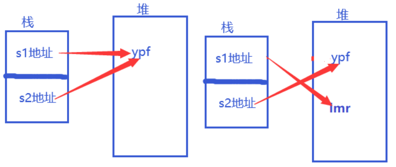

# 一. 值类型和引用类型

## 1. 前言

- 分类

　　值类型包括：布尔类型、浮点类型(float、double、decimal、byte)、字符类型(char)、整型（int、long、short等）、枚举(entum)、结构体(struct)。

　　引用类型：数组、字符串(string)、类、接口、委托(delegate)。 

- 内存存储的区别
  * 值类型数据存放在栈stack中， 引用类型地址存放栈stack中，数据存放在堆heap中。
  * 值类型变量声明后，不管是否赋值，都会在在栈中分配内存空间。引用类型声明时，只在栈中分配内存，用于存放地址，并没有在堆上分配内存空间。
  * 值类型的内存不由 GC（垃圾回收，Gabage Collection）控制，作用域结束时，值类型会自行释放，減少了托管堆的压力，因此具有性能上的优势。例如，通常 struct 比 class 更高效；而引用类型的内存回收，由 GC 来完成，微软甚至建议用户最好不要自行释放内存。
- 区别
  - 值类型继承自 ValueType （注意：而 System. ValueType 又继承自 System.Object)；而引用类型继承自 System.Object。


## 2. 对象的传递

- 将值类型的变量赋值给另一个变量，会执行一次赋值，赋值变量包含的值。

- 将引用类型的变量赋值给另一个引用类型变量，它复制的是引用对象的内存地址，在赋值后就会多个变量指向同一个引用对象实例。

  **示例代码**

  ```c#
  Console.WriteLine("------------------------下面是值类型和引用类型赋值-----------------------------");
  //值类型赋值
  int a = 0;
  int b = a;
  Console.WriteLine($"默认值： a={a},b={b}");
  a = 1;
  Console.WriteLine($"修改a的值后： a={a},b={b}");
  b = 2;
  Console.WriteLine($"修改b的值后： a={a},b={b}");
  
  //引用类型赋值
  Student stu1 = new Student();
  stu1.age = 20;
  Student stu2 = stu1;
  Console.WriteLine($"默认值： stu1.age={ stu1.age}, stu2.age={stu2.age}");
  stu1.age = 30;
  Console.WriteLine($"修改stu1.age的值后：stu1.age={ stu1.age}, stu2.age={stu2.age}");
  stu2.age = 40;
  Console.WriteLine($"修改stu2.age的值后： stu1.age={ stu1.age}, stu2.age={stu2.age}");
  ```

## 3. 参数按值传递

- 对于值类型(age)，传递的是该值类型实例的一个副本，因此原本的值age并没有改变。

- 对于引用类型(Student stu)，传递是变量stu的引用地址（即stu对象实例的内存地址）拷贝副本，因此他们操作都是同一个stu对象实例。

  **示例代码**

  ```c#
  {
      Console.WriteLine("------------------------下面是参数按值传递-----------------------------");
      //值类型按值传递
      int age1 = 60;
      Utils.AddAge1(age1);
      Console.WriteLine($"age={age1}");
  
      //引用类型按值传递
      Student stu2 = new Student();
      stu2.age = 100;
      Utils.ReduceAge1(stu2);
      Console.WriteLine($"age={stu2.age}");
  }
  public class Utils
  {
      public static void ReduceAge1(Student stu)
      {
          stu.age -= 10;
          Console.WriteLine($"ReduceAge  age={stu.age}");
      }
      public static void AddAge1(int age)
      {
          age += 10;
          Console.WriteLine($"AddAge age ={age}");
      }
      public static void ReduceAge2(ref Student stu)
      {
          stu.age -= 10;
          Console.WriteLine($"ReduceAge  age={stu.age}");
      }
      public static void AddAge2(ref int age)
      {
          age += 10;
          Console.WriteLine($"AddAge age ={age}");
      }
  }
  ```

## 4. 参数按引用类型传递

​		不管是值类型还是引用类型，可以使用ref或out关键字来实现参数的按引用传递。ref或out关键字告诉编译器，方法传递的是参数地址，而非参数本身。在按引用传递时，方法的定义和调用都必须显式的使用ref或out关键字，不可以省略，否则会引起编译错误。

**代码分享：**

```c#
{
    Console.WriteLine("------------------------下面是参数按引用传递-----------------------------");
    //值类型按值传递
    int age1 = 60;
    Utils.AddAge2(ref age1);
    Console.WriteLine($"age={age1}");

    //引用类型按值传递
    Student stu2 = new Student();
    stu2.age = 100;
    Utils.ReduceAge2(ref stu2);
    Console.WriteLine($"age={stu2.age}");
}
public class Utils
{
    public static void ReduceAge1(Student stu)
    {
        stu.age -= 10;
        Console.WriteLine($"ReduceAge  age={stu.age}");
    }
    public static void AddAge1(int age)
    {
        age += 10;
        Console.WriteLine($"AddAge age ={age}");
    }
    public static void ReduceAge2(ref Student stu)
    {
        stu.age -= 10;
        Console.WriteLine($"ReduceAge  age={stu.age}");
    }
    public static void AddAge2(ref int age)
    {
        age += 10;
        Console.WriteLine($"AddAge age ={age}");
    }
}
```

## 5. string和其它引用类型的区别

- 在string字符串，一开始s1地址指向是ypf，因为s2=s1，所以s2地址也同样指向ypf；当s1再次赋值lmr时，堆中就会开辟出数据lmr，而且ypf没有消失，没有被覆盖。s1地址就指向lmr，s2地址还是原来的ypf。

- 在引用类型数组上，一开始arry1和arry2的地址都指向{1,2,3}，当给arry1进行数据更改时，由于是引用类型，所以在{1,2,3}上面进行更改，就会对arry2进行覆盖。

  **示例代码：**

  ```c#
  {
      Console.WriteLine("------------------------下面是string和其它引用类型的区别-----------------------------");
      //string类型的测试
      string s1 = "ypf";
      string s2 = s1;
      Console.WriteLine($"s1={s1},s2={s2}");
      //修改s1的值
      s1 = "lmr";
      Console.WriteLine($"s1={s1},s2={s2}");
  
      //其它引用类型的测试
      int[] arry1 = new int[] { 1, 2, 3 };
      int[] arry2 = arry1;
      Console.WriteLine($"默认值：arry1[0]={arry1[0]},arry1[1]={arry1[1]},arry1[2]={arry1[2]}");
      Console.WriteLine($"默认值：arry2[0]={arry2[0]},arry2[1]={arry2[1]},arry2[2]={arry2[2]}");
  
      arry1[2] = 0;
      Console.WriteLine($"修改后：arry1[0]={arry1[0]},arry1[1]={arry1[1]},arry1[2]={arry1[2]}");
      Console.WriteLine($"修改后：arry2[0]={arry2[0]},arry2[1]={arry2[1]},arry2[2]={arry2[2]}");
  }
  ```

  **运行结果**

  

  **string变化图如下：**

  

  **Array类型变化图如下：**

  

## 6. 拆箱和装箱

​		装箱是值类型向引用类型转换时发生的，拆箱是引用类型向值类型转换时发生的。装箱是隐式的，拆箱是显式的

```c#
{
    Console.WriteLine("------------------------下面是拆箱和装箱-----------------------------");
    int a = 123;
    object obj = a;  //装箱(隐式)
    Console.WriteLine($"装箱后的结果obj={obj}");

    int b = (int)obj; //拆箱(显式)
    Console.WriteLine($"拆箱后的结果b={b}");
}
```

**运行结果：**


## 7. 总结

- 值类型有更好的效率，但不支持多态，适合用作存储数据的载体。而引用类型支持多态，适合用于定义程序的行为。

- 引用类型可以派生新的类型，而值类型不能。