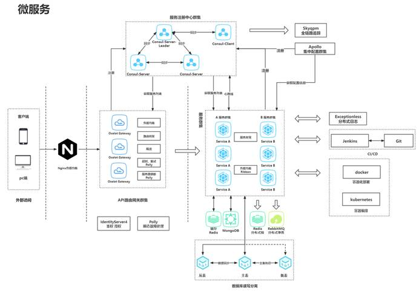

# 微服务架构（Microservice Architecture）

微服务架构是一个用分布式服务拆分业务逻辑，完成解耦的架构模式（架构风格）

微服务肯定是分布式的一种，是在分布式技术成熟之后，然后把分布式当成解耦的手段来架构系统 - 是因为拆分服务很细致

 

三层架构时，业务逻辑写在BLL - 用户的管理功能

微服务架构时，业务逻辑写在服务 - 独立部署

 

单体架构 ->微服务架构 的思维模式转换

## 简版微服务架构图

## 微服务终极形态

 

 

## 微服务落地

服务粒度如何拆分？搭建一个微服务架构电商平台，服务如何拆分？

会员、商品、支付、物流、仓储、营销

## DDD领域驱动设计

2004年领域驱动设计之父Eric Evans发表Domain-Driven Design - Tackling Complexity in the Heart of Software(领域驱动设计)

常用的微服务概念：xxRepository xxService xxFactory Entity UnitOfWork 

 

微服务明确诉求，需要业务拆分，把相关性强的业务独立起来，避免跨服务调用；又要尽量拆分。

DDD就是解决这个问题，领域驱动设计，领域≈≈服务

 

**Domain:**

一个项目、一个模块、一个BLL都是领域

领域是来做需求分析的 - 是一个共同语言，领域与技术无关，由领域专家主导的，大家都能理解的建模语言

**Driven:**

1.领域驱动设计 - 拆分领域、涉及领域

2.领域驱动代码实现 - 按照领域设计去实现功能

**Design:**

项目按照领域设计，每个领域都是按照设计实现的

 

# 实践

## 服务监测 - Consul

## 网关

网关是个中间商

关于**服务和权限认证**，应该放在网关：**SSO**

1. 代码复用易维护 

2. 拦截无效请求

 

 

  