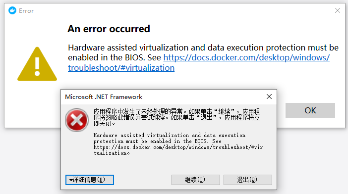
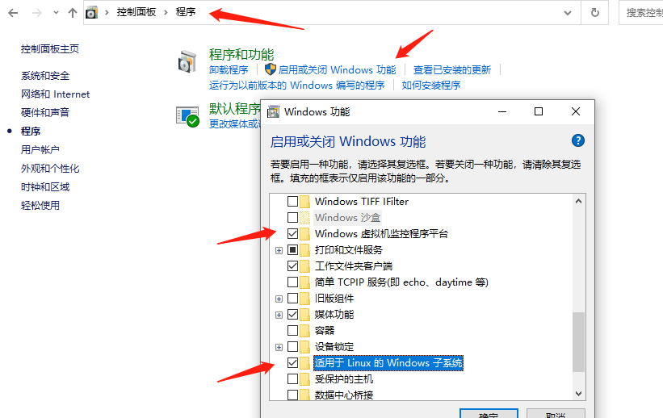

# Docker 简介和安装

## 1. Docker 是什么

Docker 是一个应用打包、分发、部署的工具
你也可以把它理解为一个轻量的虚拟机，它只虚拟你软件需要的运行环境，多余的一点都不要，
而普通虚拟机则是一个完整而庞大的系统，包含各种不管你要不要的软件。

> 本文档课件配套 [视频教程](https://www.bilibili.com/video/BV11L411g7U1)

## 2. 跟普通虚拟机的对比

| 特性   | 普通虚拟机                                                   | Docker                                               |
| :----- | ------------------------------------------------------------ | ---------------------------------------------------- |
| 跨平台 | 通常只能在桌面级系统运行，例如 Windows/Mac，无法在不带图形界面的服务器上运行 | 支持的系统非常多，各类 windows 和 Linux 都支持       |
| 性能   | 性能损耗大，内存占用高，因为是把整个完整系统都虚拟出来了     | 性能好，只虚拟软件所需运行环境，最大化减少没用的配置 |
| 自动化 | 需要手动安装所有东西                                         | 一个命令就可以自动部署好所需环境                     |
| 稳定性 | 稳定性不高，不同系统差异大                                   | 稳定性好，不同系统都一样部署方式                     |

## 3. 打包、分发、部署

**打包**：就是把你软件运行所需的依赖、第三方库、软件打包到一起，变成一个安装包
**分发**：你可以把你打包好的“安装包”上传到一个镜像仓库，其他人可以非常方便的获取和安装
**部署**：拿着“安装包”就可以一个命令运行起来你的应用，自动模拟出一摸一样的运行环境，不管是在 Windows/Mac/Linux。


## 4. Docker 部署的优势

常规应用开发部署方式：自己在 Windows 上开发、测试 --> 到 Linux 服务器配置运行环境部署。

> 问题：我机器上跑都没问题，怎么到服务器就各种问题了

用 Docker 开发部署流程：自己在 Windows 上开发、测试 --> 打包为 Docker 镜像（可以理解为软件安装包） --> 各种服务器上只需要一个命令部署好

> 优点：确保了不同机器上跑都是一致的运行环境，不会出现我机器上跑正常，你机器跑就有问题的情况。

例如 [易文档](https://easydoc.net/)，[SVNBucket](https://svnbucket.com/) 的私有化部署就是用 Docker，轻松应对客户的各种服务器。

## 5. Docker 通常用来做什么

- 应用分发、部署，方便传播给他人安装。特别是开源软件和提供私有部署的应用
- 快速安装测试/学习软件，用完就丢（类似小程序），不把时间浪费在安装软件上。例如 Redis / MongoDB / ElasticSearch / ELK
- 多个版本软件共存，不污染系统，例如 Python2、Python3，Redis4.0，Redis5.0
- Windows 上体验/学习各种 Linux 系统

## 6. 重要概念：镜像、容器

**镜像**：可以理解为软件安装包，可以方便的进行传播和安装。
**容器**：软件安装后的状态，每个软件运行环境都是独立的、隔离的，称之为容器。

## 7. 安装

桌面版：https://www.docker.com/products/docker-desktop
服务器版：https://docs.docker.com/engine/install/#server

### 7.1 CentOS 安装 Docker 

1. **卸载旧版本 **

   旧版本的 Docker 被称为docker或docker-engine. 如果安装了这些，请卸载它们以及相关的依赖项。
   **内容在/var/lib/docker/，包括图像、容器、卷和网络，都被保留。Docker 引擎包现在称为docker-ce.**

   ```perl
   sudo yum remove docker \
                   docker-client \
                   docker-client-latest \
                   docker-common \
                   docker-latest \
                   docker-latest-logrotate \
                   docker-logrotate \
                   docker-engine
   ```

2. **安装**

   ```perl
   #Set up the repository
   yum install -y yum-utils
   yum-config-manager \
   	--add-repo \
   	http://mirrors.aliyun.com/docker-ce/linux/centos/docker-ce.repo
   
   #Install Docker Engine
   #Install the latest version of Docker Engine, containerd, and Docker Compose 
   yum install docker-ce docker-ce-cli containerd.io Docker introduce & operate-plugin
   ```

### 7.2. Windows 启动报错解决

报错截图


**解决方法**：
控制面板->程序->启用或关闭 windows 功能，开启 Windows 虚拟化和 Linux 子系统（WSL2)


**命令行安装 Linux 子系统（这步可能不需要，因为 docker 安装时有说自动安装 wsl）**
`wsl --install -d Ubuntu`

> 命令行安装可能太慢，你也可以打开微软商店 Microsoft Store 搜索 Linux 进行安装

**设置开机启动 Hypervisor**
`bcdedit /set hypervisorlaunchtype auto`

> 注意要用管理员权限打开 PowerShell

**确保 BIOS 已开启虚拟化，下图检查是否已开启好**

> 如果是已禁用，请在开机时按 F2 进入 BIOS 开启一下，不会设置的可以网上搜索下自己主板的设置方法，Intel 和 AMD 的设置可能稍有不同


**出现下图错误，点击链接安装最新版本的 WSL2**
https://wslstorestorage.blob.core.windows.net/wslblob/wsl_update_x64.msi


## 8. 镜像加速源

| 镜像加速器          | 镜像加速器地址                          |
| ------------------- | --------------------------------------- |
| Docker 中国官方镜像 | https://registry.docker-cn.com          |
| DaoCloud 镜像站     | http://f1361db2.m.daocloud.io           |
| Azure 中国镜像      | https://dockerhub.azk8s.cn              |
| 科大镜像站          | https://docker.mirrors.ustc.edu.cn      |
| 阿里云              | https://<your_code>.mirror.aliyuncs.com |
| 七牛云              | https://reg-mirror.qiniu.com            |
| 网易云              | https://hub-mirror.c.163.com            |
| 腾讯云              | https://mirror.ccs.tencentyun.com       |


# Docker 快速安装软件

## 1. 直接安装的缺点

- 安装麻烦，可能有各种依赖，运行报错。例如：WordPress，ElasticSearch，Redis，ELK
- 可能对 Windows 并不友好，运行有各种兼容问题，软件只支持 Linux 上跑
- 不方便安装多版本软件，不能共存。
- 电脑安装了一堆软件，拖慢电脑速度。
- 不同系统和硬件，安装方式不一样

> 本文档课件配套 [视频教程](https://www.bilibili.com/video/BV11L411g7U1?p=2)

## 2. Docker 安装的优点

- 一个命令就可以安装好，快速方便
- 有大量的镜像，可直接使用
- 没有系统兼容问题，Linux 专享软件也照样跑
- 支持软件多版本共存
- 用完就丢，不拖慢电脑速度
- 不同系统和硬件，只要安装好 Docker 其他都一样了，一个命令搞定所有

## 3. 演示 Docker 安装 Redis

Redis 官网：https://redis.io/

> 官网下载安装教程只有源码安装方式，没有 Windows 版本。想要自己安装 windows 版本需要去找别人编译好的安装包。

Docker 官方镜像仓库查找 Redis ：https://hub.docker.com/


一个命令跑起来：`docker run -d -p 6379:6379 --name redis redis:latest`
命令参考：https://docs.docker.com/engine/reference/commandline/run/


## 4. 安装 Wordpress

Docker introduce & operate.yml

```
version: '3.1'

services:

  wordpress:
    image: wordpress
    restart: always
    ports:
      - 8080:80
    environment:
      WORDPRESS_DB_HOST: db
      WORDPRESS_DB_USER: exampleuser
      WORDPRESS_DB_PASSWORD: examplepass
      WORDPRESS_DB_NAME: exampledb
    volumes:
      - wordpress:/var/www/html

  db:
    image: mysql:5.7
    restart: always
    environment:
      MYSQL_DATABASE: exampledb
      MYSQL_USER: exampleuser
      MYSQL_PASSWORD: examplepass
      MYSQL_RANDOM_ROOT_PASSWORD: '1'
    volumes:
      - db:/var/lib/mysql

volumes:
  wordpress:
  db:
```

## 5. 安装 ELK

```
docker run -p 5601:5601 -p 9200:9200 -p 5044:5044 -it --name elk sebp/elk
```

[内存不够解决方法](https://docs.microsoft.com/en-us/windows/wsl/wsl-config#global-configuration-options-with-wslconfig)
转到用户目录 `cd ~`，路径类似这个：`C:\Users\<UserName>`
创建 `.wslconfig` 文件填入以下内容

```
[wsl2]
memory=10GB # Limits VM memory in WSL 2 to 4 GB
processors=2 # Makes the WSL 2 VM use two virtual processors
```

生效配置，命令行运行 `wsl --shutdown`

## 6. 更多相关命令

`docker ps` 查看当前运行中的容器
`docker images` 查看镜像列表
`docker rm container-id` 删除指定 id 的容器
`docker stop/start container-id` 停止/启动指定 id 的容器
`docker rmi image-id` 删除指定 id 的镜像
`docker volume ls` 查看 volume 列表
`docker network ls` 查看网络列表


# 制作自己的镜像

## 1. 为Web 项目构建镜像

示例项目代码：https://github.com/gzyunke/test-docker
这是一个 Nodejs + Koa2 写的 Web 项目，提供了简单的两个演示页面。
软件依赖：[nodejs](https://nodejs.org/zh-cn/)
项目依赖库：koa、log4js、koa-router

> 本文档课件配套 [视频教程](https://www.bilibili.com/video/BV11L411g7U1?p=3)

## 2. 编写 Dockerfile

```
FROM node:11
MAINTAINER easydoc.net

# 复制代码
ADD . /app

# 设置容器启动后的默认运行目录
WORKDIR /app

# 运行命令，安装依赖
# RUN 命令可以有多个，但是可以用 && 连接多个命令来减少层级。
# 例如 RUN npm install && cd /app && mkdir logs
RUN npm install --registry=https://registry.npm.taobao.org

# CMD 指令只能一个，是容器启动后执行的命令，算是程序的入口。
# 如果还需要运行其他命令可以用 && 连接，也可以写成一个shell脚本去执行。
# 例如 CMD cd /app && ./start.sh
CMD node app.js
```

[Dockerfile文档](https://docs.docker.com/engine/reference/builder/#run)

> 实用技巧：
> 如果你写 Dockerfile 时经常遇到一些运行错误，依赖错误等，你可以直接运行一个依赖的底，然后进入终端进行配置环境，成功后再把做过的步骤命令写道 Dockerfile 文件中，这样编写调试会快很多。
> 例如上面的底是`node:11`，我们可以运行`docker run -it -d node:11 bash`，跑起来后进入容器终端配置依赖的软件，然后尝试跑起来自己的软件，最后把所有做过的步骤写入到 Dockerfile 就好了。
> 掌握好这个技巧，你的 Dockerfile 文件编写起来就非常的得心应手了。

## 3. Build 为镜像（安装包）和运行

编译 `docker build -t test:v1 .`

> `-t` 设置镜像名字和版本号
> 命令参考：https://docs.docker.com/engine/reference/commandline/build/

运行 `docker run -p 8080:8080 --name test-hello test:v1`

> `-p` 映射容器内端口到宿主机
> `--name` 容器名字
> `-d` 后台运行
> 命令参考文档：https://docs.docker.com/engine/reference/run/

## 4. 更多相关命令

`docker ps` 查看当前运行中的容器
`docker images` 查看镜像列表
`docker rm container-id` 删除指定 id 的容器
`docker stop/start container-id` 停止/启动指定 id 的容器
`docker rmi image-id` 删除指定 id 的镜像
`docker volume ls` 查看 volume 列表
`docker network ls` 查看网络列表


# 目录挂载

## 1. 背景

- 使用 Docker 运行后，我们改了项目代码不会立刻生效，需要重新`build`和`run`，很是麻烦。
- 容器里面产生的数据，例如 log 文件，数据库备份文件，容器删除后就丢失了。

> 目录挂载解决以上问题

> 本文档课件配套 [视频教程](https://www.bilibili.com/video/BV11L411g7U1?p=4)

## 2. 几种挂载方式

- `bind mount` 直接把宿主机目录映射到容器内，适合挂代码目录和配置文件。可挂到多个容器上
- `volume` 由容器创建和管理，创建在宿主机，所以删除容器不会丢失，官方推荐，更高效，Linux 文件系统，适合存储数据库数据。可挂到多个容器上
- `tmpfs mount` 适合存储临时文件，存宿主机内存中。不可多容器共享。

文档参考：https://docs.docker.com/storage/


## 3. 挂载演示

```
bind mount` 方式用绝对路径 `-v D:/code:/app
volume` 方式，只需要一个名字 `-v db-data:/app
```

示例：
`docker run -p 8080:8080 --name test-hello -v D:/code:/app -d test:v1`

> 注意！
> 因为挂载后，容器里的代码就会替换为你本机的代码了，如果你代码目录没有`node_modules`目录，你需要在代码目录执行下`npm install --registry=https://registry.npm.taobao.org`确保依赖库都已经安装，否则可能会提示“Error: Cannot find module ‘koa’”
> 如果你的电脑没有安装 [nodejs](https://nodejs.org/en/)，你需要安装一下才能执行上面的命令。


# 多容器通信

## 1. 学习目标

项目往往都不是独立运行的，需要数据库、缓存这些东西配合运作。
这节我们把前面的 Web 项目增加一个 Redis 依赖，多跑一个 Redis 容器，演示如何多容器之间的通信。

> 本文档课件配套 [视频教程](https://www.bilibili.com/video/BV11L411g7U1?p=5)

## 2. 创建虚拟网络

要想多容器之间互通，从 Web 容器访问 Redis 容器，我们只需要把他们放到同个网络中就可以了。

文档参考：https://docs.docker.com/engine/reference/commandline/network/

## 3. 演示

* 创建一个名为`test-net`的网络：

```
docker network create test-net
```

* 运行 Redis 在 `test-net` 网络中，别名`redis`

```
docker run -d --name redis --network test-net --network-alias redis redis:latest
```

* 修改代码中访问`redis`的地址为网络别名


* 运行 Web 项目，使用同个网络

```
docker run -p 8080:8080 --name test -v D:/test:/app --network test-net -d test:v1
```

* 查看数据

`http://localhost:8080/redis`
容器终端查看数据是否一致

## 4. 更多相关命令

`docker ps` 查看当前运行中的容器
`docker images` 查看镜像列表
`docker rm container-id` 删除指定 id 的容器
`docker stop/start container-id` 停止/启动指定 id 的容器
`docker rmi image-id` 删除指定 id 的镜像
`docker volume ls` 查看 volume 列表
`docker network ls` 查看网络列表


# docker-compose

## 1. 背景

我们运行了两个容器：Web 项目 + Redis
如果项目依赖更多的第三方软件，我们需要管理的容器就更加多，每个都要单独配置运行，指定网络。
我们使用 docker-compose 把项目的多个服务集合到一起，一键运行。

> 本文档课件配套 [视频教程](https://www.bilibili.com/video/BV11L411g7U1?p=6)

## 2. 安装 Docker Compose

- 如果你是安装的桌面版 Docker，不需要额外安装，已经包含了。
- 如果是没图形界面的服务器版 Docker，你需要单独安装 [安装文档](https://docs.docker.com/compose/install/#install-compose-on-linux-systems)
- 运行`Docker-compose`检查是否安装成功

服务器版 Docker：

```perl
#下载最新版的docker-compose文件 
curl -L "https://github.com/docker/compose/releases/download/v2.5.0/docker-compose-$(uname -s)-$(uname -m)" -o /usr/local/bin/docker-compose

curl -L https://get.daocloud.io/docker/compose/releases/download/v2.5.0/docker-compose-`uname -s`-`uname -m` > /usr/local/bin/docker-compose

#添加可执行权限
chmod +x /usr/local/bin/docker-compose

#测试安装结果
docker-compose -v
docker-compose --version
```

## 3. 编写脚本

要把项目依赖的多个服务集合到一起，我们需要编写一个`docker-compose.yml`文件，描述依赖哪些服务
参考文档：https://docs.docker.com/compose/

```perl
version: "3.7"

services:
  app:
    build: ./
    ports:
      - 80:8080
    volumes:
      - ./:/app
    environment:
      - TZ=Asia/Shanghai
  redis:
    image: redis:5.0.13
    volumes:
      - redis:/data
    environment:
      - TZ=Asia/Shanghai

volumes:
  redis:
```

> 容器默认时间不是北京时间，增加 TZ=Asia/Shanghai 可以改为北京时间

## 4. 跑起来

在`docker-compose.yml` 文件所在目录，执行：`docker-compose up`就可以跑起来了。
命令参考：https://docs.docker.com/compose/reference/up/

在后台运行只需要加一个 -d 参数`docker-compose up -d`
查看运行状态：`docker-compose ps`
停止运行：`docker-compose stop`
重启：`docker-compose restart`
重启单个服务：`docker-compose restart service-name`
进入容器命令行：`docker-compose exec service-name sh`
查看容器运行log：`docker-compose logs [service-name]`


# 发布和部署

## 1. 镜像仓库介绍

镜像仓库用来存储我们 build 出来的“安装包”，Docker 官方提供了一个 [镜像库](https://hub.docker.com/)，里面包含了大量镜像，基本各种软件所需依赖都有，要什么直接上去搜索。

我们也可以把自己 build 出来的镜像上传到 docker 提供的镜像库中，方便传播。
当然你也可以搭建自己的私有镜像库，或者使用国内各种大厂提供的镜像托管服务，例如：阿里云、腾讯云

> 本文档课件配套 [视频教程](https://www.bilibili.com/video/BV11L411g7U1?p=7)

## 2.上传我们的镜像

- 首先你要先 [注册一个账号](https://hub.docker.com/)
- 创建一个镜像库
  
- 命令行登录账号：
  `docker login -u username`
- 新建一个tag，名字必须跟你注册账号一样
  `docker tag test:v1 username/test:v1`
- 推上去
  `docker push username/test:v1`
- 部署试下
  `docker run -dp 8080:8080 username/test:v1`

**Docker introduce & operate 中也可以直接用这个镜像了**

```
version: "3.7"

services:
  app:
#    build: ./
    image: helloguguji/test:v1
    ports:
      - 80:8080
    volumes:
      - ./:/app
    environment:
      - TZ=Asia/Shanghai
  redis:
    image: redis:5.0.13
    volumes:
      - redis:/data
    environment:
      - TZ=Asia/Shanghai

volumes:
  redis:
```

## 3.阿里云容器托管

docker 官方的镜像托管有时候上传和下载都太慢了，如果你想要更快的速度，可以使用阿里云的免费镜像托管
登录 [阿里云](https://www.aliyun.com/)


# 备份和迁移数据

## 1. 迁移方式介绍

容器中的数据，如果没有用挂载目录，删除容器后就会丢失数据。
前面我们已经讲解了如何 [挂载目录](doc:kze7f0ZR)
如果你是用`bind mount`直接把宿主机的目录挂进去容器，那迁移数据很方便，直接复制目录就好了
如果你是用`volume`方式挂载的，由于数据是由容器创建和管理的，需要用特殊的方式把数据弄出来。

> 本文档课件配套 [视频教程](https://www.bilibili.com/video/BV11L411g7U1?p=8)

## 2. 备份和导入 Volume 的流程

备份：

- 运行一个 ubuntu 的容器，挂载需要备份的 volume 到容器，并且挂载宿主机目录到容器里的备份目录。
- 运行 tar 命令把数据压缩为一个文件
- 把备份文件复制到需要导入的机器

导入：

- 运行 ubuntu 容器，挂载容器的 volume，并且挂载宿主机备份文件所在目录到容器里
- 运行 tar 命令解压备份文件到指定目录

## 3. 备份 MongoDB 数据演示

- 运行一个 mongodb，创建一个名叫`mongo-data`的 volume 指向容器的 /data 目录
  `docker run -p 27018:27017 --name mongo -v mongo-data:/data -d mongo:4.4`
- 运行一个 Ubuntu 的容器，挂载`mongo`容器的所有 volume，映射宿主机的 backup 目录到容器里面的 /backup 目录，然后运行 tar 命令把数据压缩打包
  `docker run --rm --volumes-from mongo -v d:/backup:/backup ubuntu tar cvf /backup/backup.tar /data/`

最后你就可以拿着这个 backup.tar 文件去其他地方导入了。

## 4. 恢复 Volume 数据演示

- 运行一个 ubuntu 容器，挂载 mongo 容器的所有 volumes，然后读取 /backup 目录中的备份文件，解压到 /data/ 目录
  `docker run --rm --volumes-from mongo -v d:/backup:/backup ubuntu bash -c "cd /data/ && tar xvf /backup/backup.tar --strip 1"`

> 注意，volumes-from 指定的是容器名字
> strip 1 表示解压时去掉前面1层目录，因为压缩时包含了绝对路径