## Hypervisor

- **虚拟化过程**

  - 物理机

    对于一台计算机，我们可以简单的划分为三层：从下到上一次是物理硬件层，操作系统层，应用程序层

  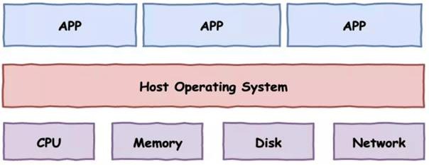

  - 虚拟化技术

  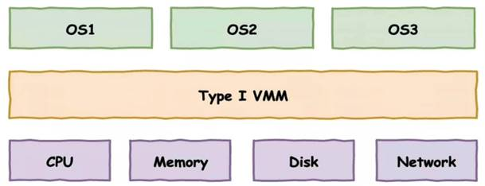

  

  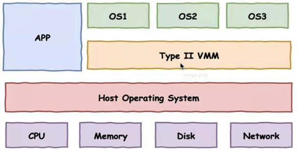

- **虚拟工具巨头**

  - VMWare workstation（个人学习使用），主要用于Windows平台
  - 企业版虚拟化 VMWare esxi虚拟化工具，高性能服务器结合，进行服务器资源虚拟化
  - Linux下的虚拟工具，kvm工具（命令行创建）

- **虚拟技术**

  - 全虚拟化：VMware二进制翻译技术 （存在敏感指令）

  - 半虚拟化：Xen内核定制修改 （需要修改操作系统源码，作相应的配置工作 - Linux）

  - 硬件辅助虚拟化 VT /AMD-v （CPU)

    

- **虚拟化 & 容器 发展历程**

  

  

 

## Hypervisor & Docker 区别 

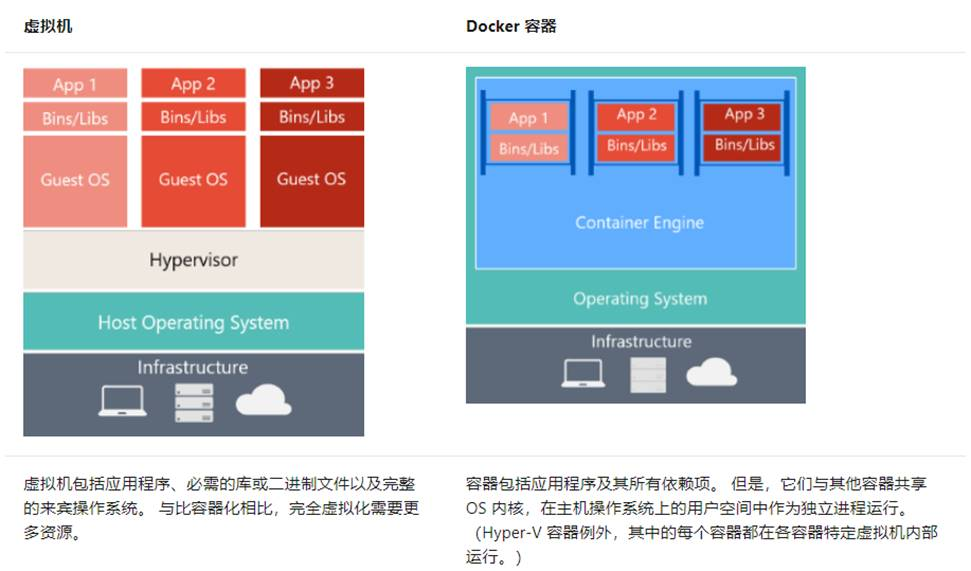

 

- **传统虚拟机技术**

  虚拟机是虚拟出一套硬件，在其上面运行一个完整的操作系统，例如我们使用KVM，指定系统镜像，然后装系统，最终可以使用，在该系统上在运行所需的应用程序。

  KVM创建虚拟机时，指定较少的CPU，内存，硬盘等资源，虚拟机性能较低

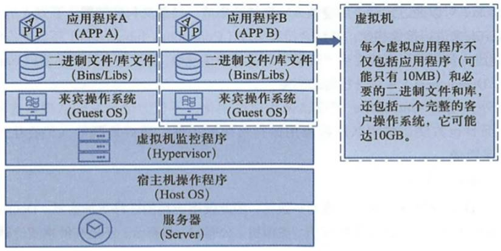

 

- **容器技术**

  容器内的应用程序直接运行在宿主机的内核上，容器内没有自己的内核，也没有对硬件运行虚拟，因此容器比起虚拟机更轻便

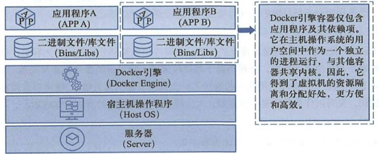

 

- **容器对比KVM的好处**
  - 容器能够提供宿主机的性能，而kvm虚拟机是分配宿主机硬件资源，性能较弱
  - 同样配置的宿主机，最多可以启动10个虚拟机的话，可以启动100+的容器数量
  - 启动一个KVM虚拟机，得有一个完整的开机流程，花费时间较长，或许需要20s，而启动一个容器只需要1s
  - KVM需要硬件cpu的虚拟化支持，而容器不需要
  - 一致性的环境
  - 持续交付和部署
  - 更轻松迁移

 

- **安装虚拟化容器**

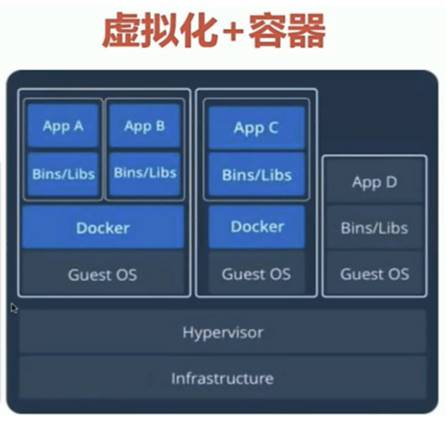

## Docker具体解决了什么问题

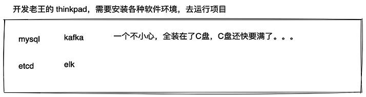

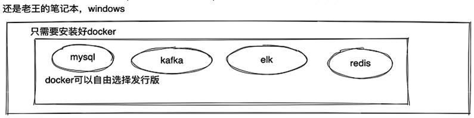

 

## 企业与容器集群

- **京东容器集群**

  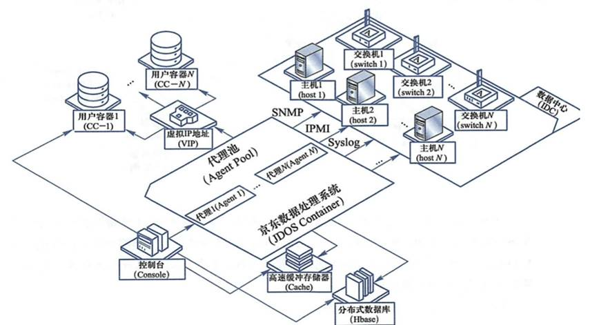

-  **淘宝容器集群**

  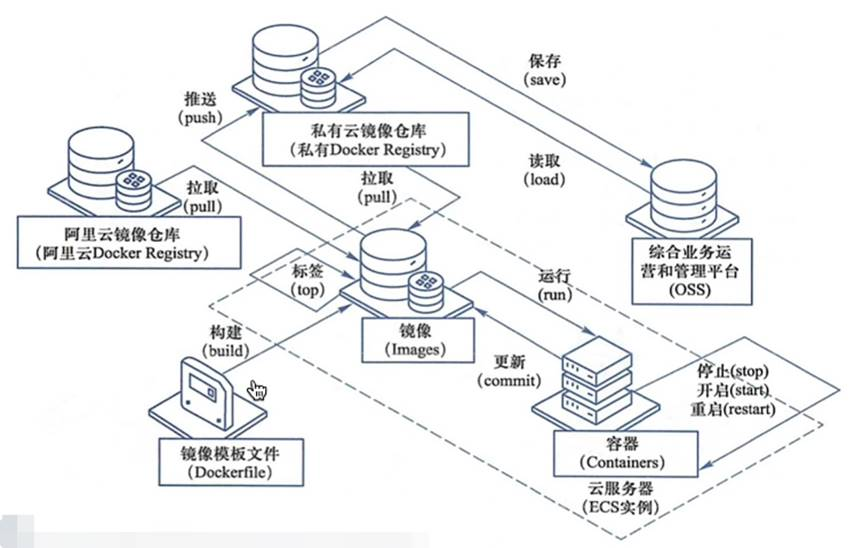

## Docker引擎

Docker Engine是C/S架构的

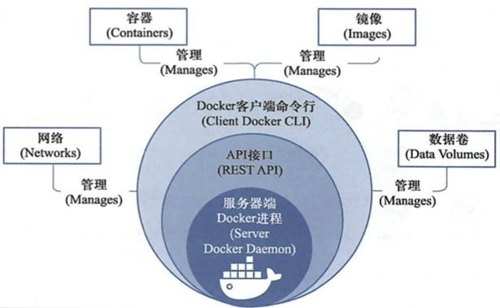

 

- **Docker Daemon**

  安装使用Docker，得先运行Docker Daemon进程，用于管理daocker。

  - 镜像 images

  - 容器 containers

  - 网络 network

  - 数据卷 Data Volumes

 

- **Rest接口**

  提供和Daemon交互的API接口

 

- **Docker     Client**

  客户端使用REST API和Docker Daemon进行访问

 

- **Docker 平台组成**

  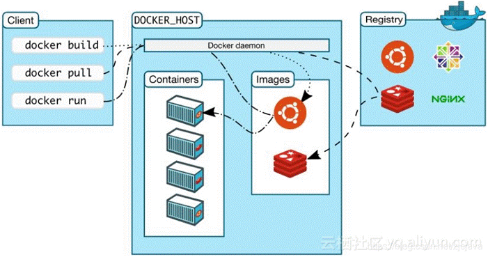

  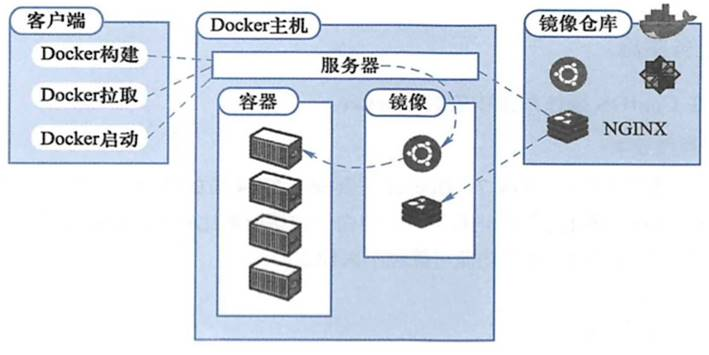

- **Images**

  **images** **-** **应用程序运行所需的环境，打包为镜像**

  **dockerfile** **-** **将部署项目的操作，写成一个部署脚本，且该脚本还能构建出镜像文件**

  镜像是一个只读模板，用于创建容器，也可以通过Dockerfile文件描述镜像的内容

  镜像的概念类似于编程开发里面向对象的类，从一个基类开始（基础镜像base image）

  构建容器的过程，就是运行镜像，生成容器实例。

  Docker镜像的描述文件是Dockerfile，包含如下指令

  - FROM 定义基础镜像 - FROM CENTOS:6.8

  - MAINTAINER 作者

  - RUN 运行Linux命令 - RUN yum     install mysql-server -y

  - ADD 添加宿主机的文件到容器内。自动解压

  - COPY 作用和ADD是一样的，都是拷贝宿主机的文件到容器内，COPY就是仅仅拷贝

  - WORKDIR 设置当前工作目录

  - VOLUME 设置卷。容器运行时，应该保证在存储层不写入任何数据，运行容器内产生的数据，我们推荐是挂载，写入到宿主机上，进行维护。

  - EXPOSE 指定对外的端口

  - ENV 环境变量 - 无论镜像构建时，还是容器运行时，该变量都可以使用

  - ARG 环境变量 - 只是构建镜像需要设置的变量，容器运行时就消失了

  - CMD 运行进程 - CMD ["/bin/bash"]

  - ENTRYPOINT 作用和CMD一样，都是在指定容器启动程序以及参数。当指定ENTRYPOINT之后，CMD指令的语义有了变化，而是把CMD的内容当作参数传递给ENTRYPOINT指令。
  
    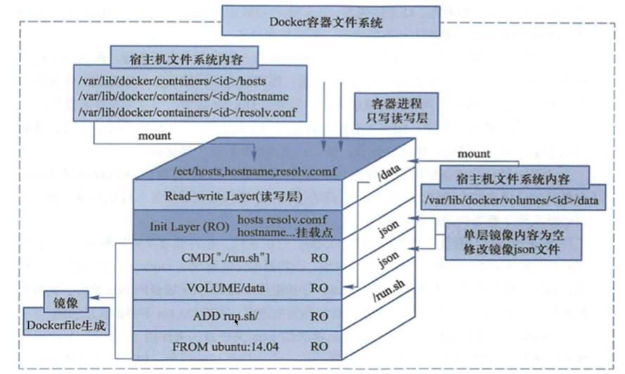

- **Container**

  **应用程序（镜像）运行在容器中**

  容器是一个镜像的运行实例，镜像>容器

  创建容器的过程

  - 获取镜像，如docker pull centos，从镜像仓库拉取

  - 使用镜像创建容器

  - 分配文件系统，过在一个读写层，在读写层加载镜像

  - 分配网络/网络桥接，创建一个网络接口，让容器和宿主机通信

  - 容器获取IP地址

  - 执行容器命令，如/bin/bash

  - 反馈容器启动结果

 

- **Registry     -** **镜像仓库**

  **Registry -** **保存镜像文件，提供上传，下载镜像**

  Docker镜像需要进行管理，Docker提供了Registry仓库，其实他也是一个容器。可以基于该容器运行私有仓库。

  也可以使用Docker Hub互联网公有镜像仓库

 

## Docker生命周期

学习Docker的核心要素镜像、容器！

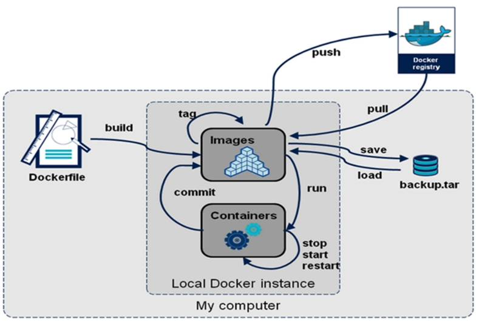

 

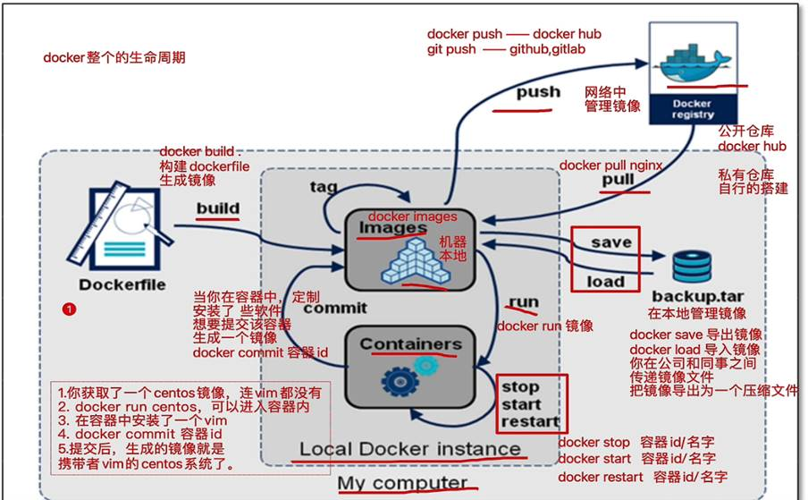

 

## Docker Images

- **了解Linux系统 & Docker使用Linux**

  我们一直以来，使用vmware虚拟机，安装系统，是一个完整的系统文件，包含2部分

  - Linux内核     - 作用是提供操作系统的基本功能，和机器硬件交互

  - centos7发行版 - 作用是提供软件功能，例如yum安装包管理等

  因此，Linux内核+centos发行版，就组成了一个系统。

  

  #发行版本 - cat /etc/redhat-release

  #内核版本 - uname -r

  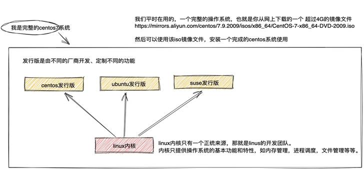

  

  是否有办法，可以灵活的替换发行版，让我们使用不同的”系统“？

  - docker就可以实现这个功能，技术手段就是docker     images

    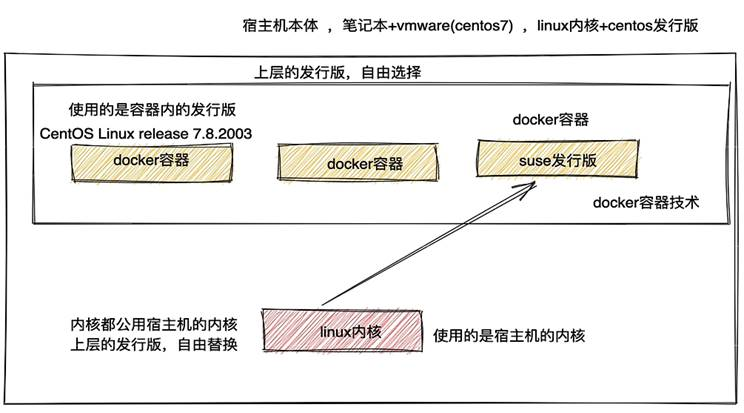

- **了解Images 1.0**

  - docker imges搜索地址 - https://hub.docker.com/_/centos?tab=tags&page=1&ordering=last_updated

  - 一个完整的docker镜像可以创建出docker容器的运行，例如一个centos:7.8.2003镜像文件，我们获取的是centos7发行版，镜像文件是不包含linux内核

  - docker的架构，镜像就是一个”发行版“的作用，你需要准备好一个linux内核，然后上层使用不同的”发行版“就好了，这样可以自由地使用各种版本系统，兼容多种环境

    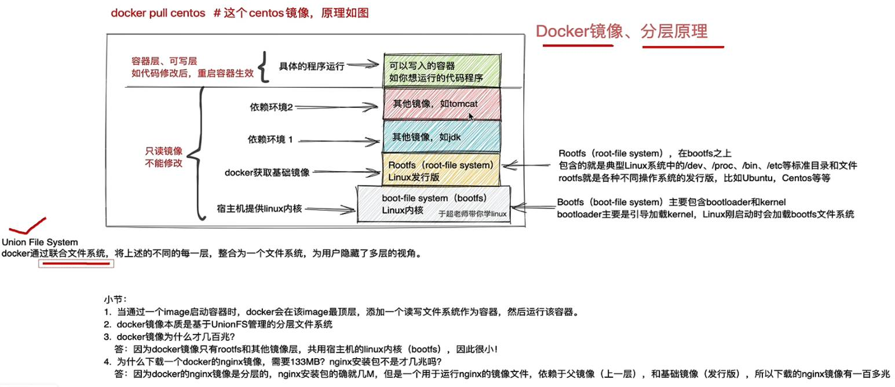

    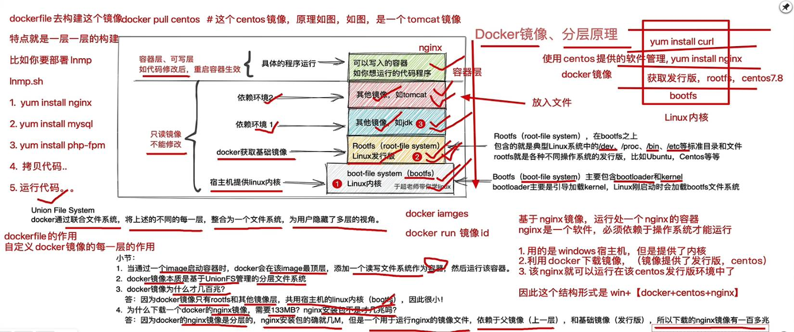

 

- **了解Images 2.0**

  - 我们如果自定义镜像，docker镜像不包含linux内核，和宿主机公用。

  - 我们如果想要定义一个mysql5.6镜像，我们会这么做

    - 获取基础镜像，选择一个发行版平台（ubuntu，centos）
    - 在centos镜像中安装mysql5.6软件

  - 导出镜像，可以命名为mysql:5.6镜像文件

  - 从这个过程，我们可以感觉出这一层一层的添加，docker镜像的层级概念就出来了，底层是centos镜像，上一层是mysql镜像，centos镜像层属于父镜像。

    

  - Docker镜像是在基础镜像之后，然后安装软件，配置软件，添加新的层，构建出来。

 

- **Docker 为什么分层镜像**
  - 分层镜像一大好处共享资源，例如有过个docker镜像来自同一个base镜像，那么docker host只需要存储一份base镜像。
  - 内存里也需要加载一份host，即可为多个容器。
  - 注意：即使多个容器共享一个base镜像，某一个容器修改了base镜像的内容，例如修改了/etc/下的配置文件，其他的容器的/etc/下的内容是不会被修改的，修改的动作只限制在单个容器内，这就是容器的写入时复制特性（Copy-on-write）。

 

- **可写的容器层**

  - 当容器启动后，一个新的可写层被加载到镜像的顶层，这一层通常被称为 <容器层**(可写)**>，容器层 下的曾为 <镜像层**(只读)**>。

    

  - 所有对容器的修改动作，都只会发生在 <容器层>里，只有<容器层>是可写的，其余<镜像层>都是只读的。

    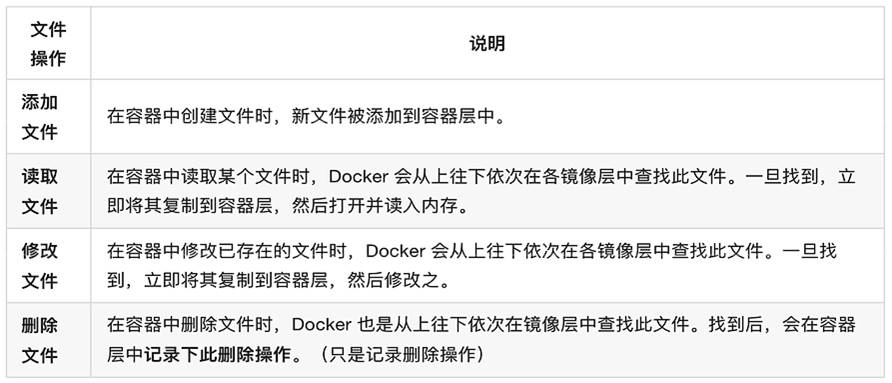

  - 只有当需要修改时才复制一份数据，这种特性称作Copy-on-write。可见，容器层保存的而镜像变化的部分，不会对镜像本身进行任何修改。

 

- **Docker镜像的内容**
  - docker镜像层级管理的方式大大便捷了Docker镜像的分发和存储。
    - Docker镜像代表一个容器的文件系统内容
    - 镜像层级技术属于 <联合文件系统>
    - 容器是一个动态的环境，每一层镜像里的而文件都数据静态内容
      - fockerfile里的ENV、VOLUME、CMD等内容都会落实到容器环境里

- **UnionFS**

 

## Docker 网络

当你安装完Docker时，它会自动创建三个网络。你可以使用以下docker network ls命令列出这些网络：

Shell 命令 - docker network ls

结果应如下

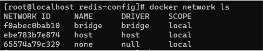

Docker内置这三个网络，运行容器时，你可以使用该来指定容器应连接到哪些网络。

我们在使用docker run创建Docker容器时，可以用--network标志 选项指定容器的网络模式，Docker有以下4种网络模式：

host模式：使用 --net=host 指定。

none模式：使用 --net=none 指定。

bridge模式：使用 --net=bridge 指定，默认设置。

container模式：使用 --net=container:NAME*or*ID 指定。

**host模式**

Docker使用了Linux的Namespaces技术来进行资源隔离，如PID Namespace隔离进程，Mount Namespace隔离文件系统，Network Namespace隔离网络等。一个Network Namespace提供了一份独立的网络环境，包括网卡、路由、Iptable规则等都与其他的Network Namespace隔离。

host模式类似于Vmware的桥接模式，与宿主机在同一个网络中，但没有独立IP地址。一个Docker容器一般会分配一个独立的Network Namespace。但如果启动容器的时候使用host模式，那么这个容器将不会获得一个独立的Network Namespace，而是和宿主机共用一个Network Namespace。容器将不会虚拟出自己的网卡，配置自己的IP等，而是使用宿主机的IP和端口。

如下图所示：容器与主机在相同的网络命名空间下面，使用相同的网络协议栈，容器可以直接使用主机的所有网络接口

 

**总结**

host 模式简单并且性能高，host 模式下面的网络模型是最简单和最低延迟的模式，容器进程直接与主机网络接口通信，与物理机性能一致，host 不利于网络自定配置和管理，并且所有主机的容器使用相同的IP。也不利于主机资源的利用。对网络性能要求比较高，可以使用该模式。否则应该使用其他模式

 

 

 

 

 

 

 

 

 

 

 

 

 

 

 

 

 

 

 

 

 

 

 