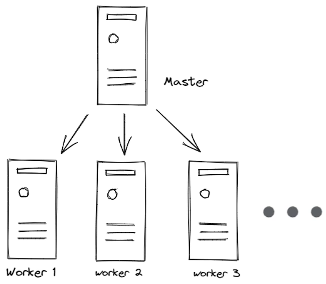
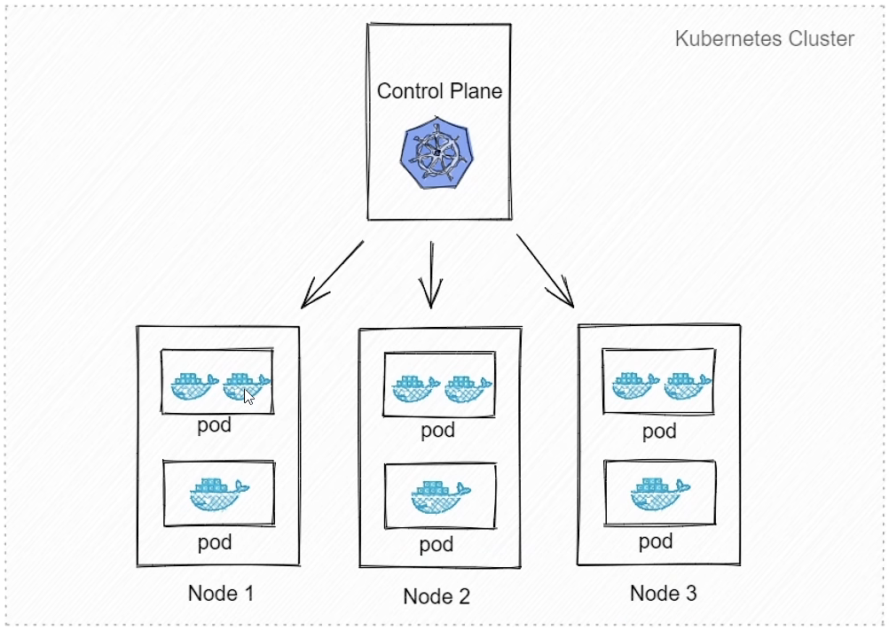
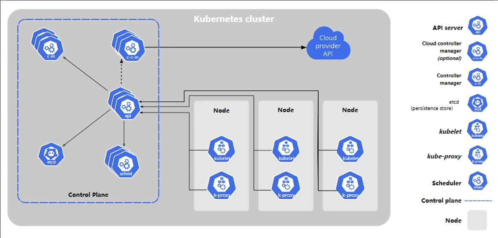

# Kubernetes介绍

## Kubernetes(K8s)是什么

他是一个为容器化应用提供集群部署和管理的工具，又google开发。

kubernetes这个名字源于希腊语。意为“舵手”或“飞行员”。k8s这个缩写是因为k和s之间有8个字符的关系。google在2014年开源kubernetes项目。

**主要特性：**

- 高可用，不宕机，自动灾难恢复
- 灰度更新，不影响业务正常运转
- 一键回滚到历史版本
- 方便的伸缩扩展（应用伸缩，机器加减）、提供负载均衡
- 有一个完善的生态

## 不同的应用部署方案

- 传统部署方式：

  应用直接在物理机上部署，机器资源分配不好控制，出现Bug时，可能机器的大部分资源被某个应用占用，导致其他应用无法正常运行，无法做到应用隔离。

* 虚拟机部署

  在单个物理机上运行多个虚拟机，每个虚拟机都是完整独立的系统，性能损耗大。

* 容器部署

  所有容器共享主机的系统，轻量级的虚拟机，性能损耗小，资源隔离，CPU和内存可按需分配

.assets/image-20220508220022552.png)

## Kubernetes 集群架构

* Master

  主节点，控制平台，不需要很高性能，不跑任务，通常一个就行了，也可以开多个主节点来提高集群的可用度。

* Worker

  工作节点，可以是虚拟机或物理计算机，任务都在这里跑，机器性能需要好点；通常会有很多个，可以不断加机器扩大集群；每个工作节点有主节点管理。

## 重要概念Pod

豆荚，K8s调度，管理的最小单位，一个Pod可以包含一个或多个容器，每个Pod有自己的虚拟IP。一个工作节点可以有多个Pod，主节点会考量负载自动调度Pod到哪个节点运行。

## Kubernetes 组件

kube-apiserver API服务器，公开Kubernetes API

etcd 键值数据库，可以作为保存Kubernetes所有集群数据的后台数据库

kube-scheduler 调度 Pod 到哪个节点运行

kube-controller 集群控制器

cloud-controller 与云服务商交互

