# 1. Kubenetes（K8S）简介

### 1.1 课程内容

- 介绍下什么是 kubernetes，什么时候需要 kubernetes，以及它的组成架构。
- 用 3 种不同的方式教大家如何安装 kubernetes 集群。包括 minikube，云平台搭建，裸机搭建（3 台服务器）。
- 通过一个 demo 项目演示如何部署项目到集群中，怎么对外暴露服务端口
- 怎么部署数据库这种有状态的应用，以及如何数据持久化
- 集群中配置文件和密码文件的使用
- 怎么使用 Helm 应用商店快速安装第三方应用
- 怎么使用 Ingress 对外提供服务

目标：学完课程，对 kubernetes 有一个全面的认识，能够轻松应对各种集群部署工作。

> 本文档课件需配套 [视频](https://www.bilibili.com/video/BV1Tg411P7EB/) 一起学习

### 1.2 Kubernetes (K8S) 是什么

它是一个为 **容器化** 应用提供集群部署和管理的开源工具，由 Google 开发。
**Kubernetes** 这个名字源于希腊语，意为“舵手”或“飞行员”。k8s 这个缩写是因为 k 和 s 之间有八个字符的关系。 Google 在 2014 年开源了 Kubernetes 项目

**主要特性：**

- 高可用，不宕机，自动灾难恢复
- 灰度更新，不影响业务正常运转
- 一键回滚到历史版本
- 方便的伸缩扩展（应用伸缩，机器加减）、提供负载均衡
- 有一个完善的生态

> **学习课程前提**
> 熟悉 Docker 的基本使用，如果你还不了解 Docker，先看视频 [Docker 快速上手](https://www.bilibili.com/video/BV11L411g7U1)
> 熟悉 Linux 操作系统

### 1.3 不同的应用部署方案


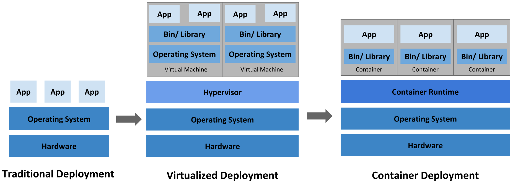

* 传统部署方式：

  应用直接在物理机上部署，机器资源分配不好控制，出现Bug时，可能机器的大部分资源被某个应用占用，导致其他应用无法正常运行，无法做到应用隔离。

* 虚拟机部署

  在单个物理机上运行多个虚拟机，每个虚拟机都是完整独立的系统，性能损耗大。

* 容器部署

  所有容器共享主机的系统，轻量级的虚拟机，性能损耗小，资源隔离，CPU和内存可按需分配

### 1.4 什么时候需要 Kubernetes

当你的应用只是跑在一台机器，直接一个 docker + docker-compose 就够了，方便轻松；
当你的应用需要跑在 3，4 台机器上，你依旧可以每台机器单独配置运行环境 + 负载均衡器；
当你应用访问数不断增加，机器逐渐增加到十几台、上百台、上千台时，每次加机器、软件更新、版本回滚，都会变得非常麻烦、痛不欲生，再也不能好好的摸鱼了，人生浪费在那些没技术含量的重复性工作上。

这时候，Kubernetes 就可以一展身手了，让你轻松管理百万千万台机器的集群。“谈笑间，樯橹灰飞烟灭”，享受着一手掌控所有，年薪百万指日可待。

Kubernetes 可以为你提供集中式的管理集群机器和应用，加机器、版本升级、版本回滚，那都是一个命令就搞定的事，不停机的灰度更新，确保高可用、高性能、高扩展。

### 1.5 Kubernetes 集群架构


* master

  主节点，控制平台，不需要很高性能，不跑任务，通常一个就行了，也可以开多个主节点来提高集群可用度。

* worker

  工作节点，可以是虚拟机或物理计算机，任务都在这里跑，机器性能需要好点；通常都有很多个，可以不断加机器扩大集群；每个工作节点由主节点管理

* 重要概念 Pod

  豆荚，K8S 调度、管理的最小单位，一个 Pod 可以包含一个或多个容器，每个 Pod 有自己的虚拟IP。一个工作节点可以有多个 pod，主节点会考量负载自动调度 pod 到哪个节点运行。

  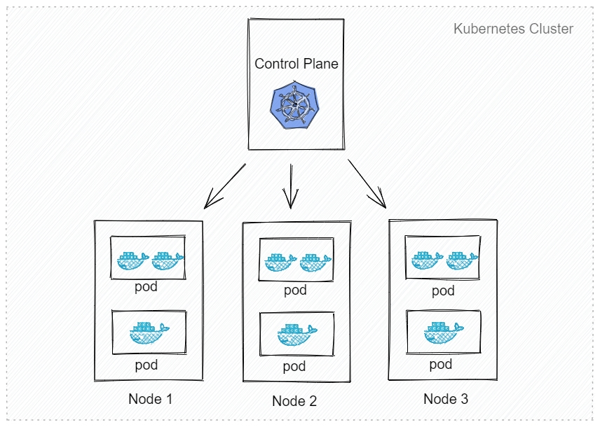

* Kubernetes 组件

  `kube-apiserver` API 服务器，公开了 Kubernetes API
  `etcd` 键值数据库，可以作为保存 Kubernetes 所有集群数据的后台数据库
  `kube-scheduler` 调度 Pod 到哪个节点运行
  `kube-controller` 集群控制器
  `cloud-controller` 与云服务商交互
  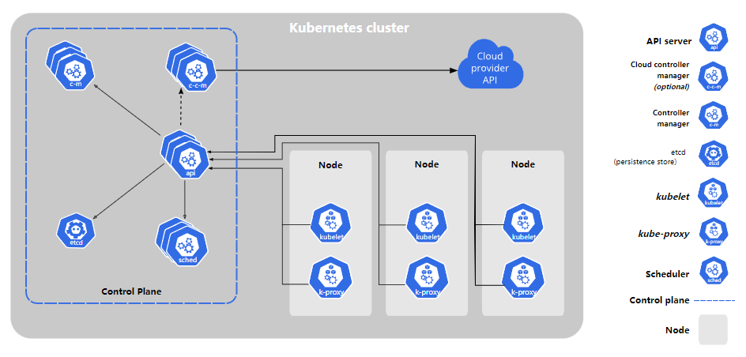

> 如果你想要了解更多 K8S 组成细节，主节点、工作节点分别有哪些程序，各有什么作用，可以查看 [官网详细介绍](https://kubernetes.io/zh/docs/concepts/overview/components/)


# 2. 安装 Kubernetes 集群

### 2.1 安装方式介绍

- **minikube - (Windows模拟器)**
  只是一个 K8S 集群模拟器，只有一个节点的集群，只为测试用，master 和 worker 都在一起
  
- **直接用云平台 Kubernetes**
  可视化搭建，只需简单几步就可以创建好一个集群。
  优点：安装简单，生态齐全，负载均衡器、存储等都给你配套好，简单操作就搞定
  
- **裸机安装（Bare Metal）**
  至少需要两台机器（主节点、工作节点个一台），需要自己安装 Kubernetes 组件，配置会稍微麻烦点。
  可以到各云厂商按时租用服务器，费用低，用完就销毁。
  缺点：配置麻烦，缺少生态支持，例如负载均衡器、云存储。
  
  > 本文档课件需配套 [视频](https://www.bilibili.com/video/BV1Tg411P7EB?p=2) 一起学习
  
  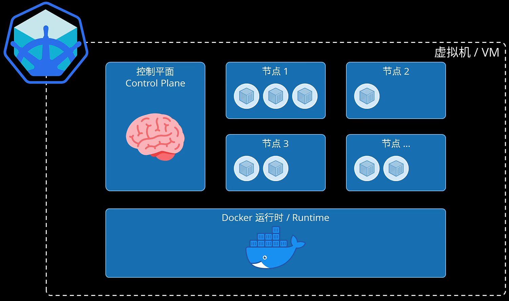

### 2.2 minikube

安装非常简单，支持各种平台，[安装方法](https://minikube.sigs.k8s.io/docs/start/)

> 需要提前安装好 Docker

```perl
# 启动集群
minikube start
# 查看节点。kubectl 是一个用来跟 K8S 集群进行交互的命令行工具
kubectl get node
# 停止集群
minikube stop
# 清空集群
minikube delete --all
# 安装集群可视化 Web UI 控制台
minikube dashboard
```

### 2.3 云平台搭建

- [腾讯云 TKE](https://cloud.tencent.com/product/tke)（控制台搜索容器）

- 登录阿里云控制台 - 产品搜索 Kubernetes

  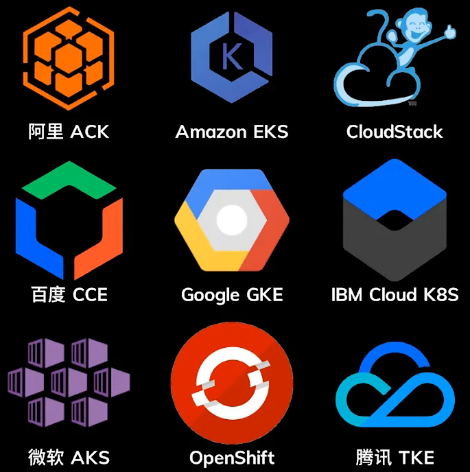

### 2.4 裸机搭建（Bare Metal）

* 主节点需要组件

  - docker（也可以是其他容器运行时）

  - kubectl 集群命令行交互工具

  - kubeadm 集群初始化工具

* 工作节点需要组件 [文档](https://kubernetes.io/zh/docs/concepts/overview/components/#node-components)

  - docker（也可以是其他容器运行时）

  - kubelet 管理 Pod 和容器，确保他们健康稳定运行。

  - kube-proxy 网络代理，负责网络相关的工作

#### 安装

> 你也可以试下 [这个项目](https://github.com/lework/kainstall)，用脚本快速搭建 K8S 裸机集群
> 当然，为了更好的理解，你应该先手动搭建一次

##### 系统配置

1. 设置主机名 / hosts

   ```perl
   # 每个节点分别设置对应主机名
   # 设置主机名
   hostnamectl set-hostname master
   hostnamectl set-hostname node1
   hostnamectl set-hostname node2
   
   # 所有节点都修改 hosts
   # 设置域名解析
   vim /etc/hosts
   192.168.137.130 master
   192.168.137.131 node1
   192.168.137.132 node2
   
   #cat >> /etc/hosts << EOF
   #192.168.137.130 master
   #192.168.137.131 node1
   #192.168.137.132 node2
   #EOF
   ```

2. 关闭防火墙 、selinux和swap

   ```perl
   #所有节点确保防火墙关闭
   systemctl stop firewalld
   systemctl disable firewalld
   systemctl status firewalld
   
   # 所有节点关闭 SELinux
   setenforce 0
   sed -i "s/^SELINUX=enforcing/SELINUX=disabled/g" /etc/selinux/config
   #ed -i --follow-symlinks 's/SELINUX=enforcing/SELINUX=disabled/g' /etc/sysconfig/selinux
   
   #关闭所有节点swap
   swapoff -a
   sed -i 's/.*swap.*/#&/' /etc/fstab
   ```

3. 将桥接的IPv4流量传递到iptables的链

   ```perl
   cat > /etc/sysctl.d/k8s.conf << EOF
   net.bridge.bridge-nf-call-ip6tables = 1
   net.bridge.bridge-nf-call-iptables = 1
   EOF
   #生效
   sysctl --system
   ```

4. 时间同步

   ```perl
   yum -y install ntpdate
   ntpdate time.windows.com
   hwclock --systohc
   ```

5. 安装常用软件

   ```perl
   yum install -y yum-utils device-mapper-persistent-data lvm2 wget git
   ```

##### 安装Docker

Kubernetes默认CRI（容器运行时）为Docker，因此先安装Docker。

1. 添加安装源（所有节点）

   ```perl
   # 添加 Docker 安装源
   yum-config-manager --add-repo http://mirrors.aliyun.com/docker-ce/linux/centos/docker-ce.repo
   #导入镜像源
   #wget https://mirrors.aliyun.com/docker-ce/linux/centos/docker-ce.repo -O /etc/yum.repos.d/docker-ce.repo
   #查找可以docker版本
   yum list docker-ce --showduplicates | sort -r
   #安装docker
   yum -y install docker-ce
   ```
   
2. 设置镜像加速（所有节点）

   ```perl
   # kubernetes 官方推荐 docker 等使用 systemd 作为 cgroupdriver，否则 kubelet 启动不了
   mkdir -p /etc/docker/
   cat > /etc/docker/daemon.json << EOF
   {
     "exec-opts": ["native.cgroupdriver=systemd"],
     "registry-mirrors": ["https://53r9lvsk.mirror.aliyuncs.com"]
   }
   EOF
   
   # 重启生效
   systemctl daemon-reload
   systemctl restart docker
   ```
   
3. 启动docker（所有节点）

   ```perl
   systemctl enable docker  
   systemctl start docker 
   
   systemctl status docker && docker info && docker --version
   ```

##### 安装kubelet

1. 配置 k8s 安装源

   ```perl
   cat > /etc/yum.repos.d/kubernetes.repo << EOF 
   [kubernetes]
   name=Kubernetes
   baseurl=https://mirrors.aliyun.com/kubernetes/yum/repos/kubernetes-el7-x86_64
   enabled=1
   gpgcheck=0
   repo_gpgcheck=1
   gpgkey=https://mirrors.aliyun.com/kubernetes/yum/doc/yum-key.gpg https://mirrors.aliyun.com/kubernetes/yum/doc/rpm-package-key.gpg
   EOF
   
   #update cache
   yum clean all  
   yum makecache  
   yum repolist
   
   #参数说明
   baseurl=https://mirrors.aliyun.com/kubernetes/yum/repos/kubernetes-el7-x86_64   #Kubernetes源设为阿里
   gpgcheck=0：#表示对从这个源下载的rpm包不进行校验
   repo_gpgcheck=0：#某些安全性配置文件会在 /etc/yum.conf 内全面启用 repo_gpgcheck，以便能检验软件库的中继数据的加密签署
   #如果gpgcheck设为1，会进行校验，就会报错如下，所以这里设为0
   repomd.xml signature could not be verified for kubernetes
   ```

2. 安装k8s组件（所有节点）
   ```perl
   yum install -y kubelet-1.23.5 kubeadm-1.23.5 kubectl-1.23.5
   #yum install -y kubelet kubeadm kubectl
   ```
   
3. 启动 kubelet、docker，并设置开机启动（所有节点）

   ```perl
   systemctl enable kubelet
   systemctl start kubelet
   systemctl status kubelet
   ```

4. 列出k8s所需镜像包

   ```perl
   kubeadm config images list
   ################################################
   以下是该版本所需的镜像包，可以提前下载
   ################################################
   k8s.gcr.io/kube-apiserver:v1.23.5
   k8s.gcr.io/kube-controller-manager:v1.23.5
   k8s.gcr.io/kube-scheduler:v1.23.5
   k8s.gcr.io/kube-proxy:v1.23.5
   k8s.gcr.io/pause:3.6
   k8s.gcr.io/etcd:3.5.1-0
   k8s.gcr.io/coredns/coredns:v1.8.6
   ################################################
   ```

5. 下载镜像包

   ```perl
   #下载k8s所需镜像包
   docker pull registry.cn-hangzhou.aliyuncs.com/google_containers/kube-apiserver:v1.23.5 
   docker pull registry.cn-hangzhou.aliyuncs.com/google_containers/kube-controller-manager:v1.23.5
   docker pull registry.cn-hangzhou.aliyuncs.com/google_containers/kube-scheduler:v1.23.5
   docker pull registry.cn-hangzhou.aliyuncs.com/google_containers/kube-proxy:v1.23.5
   docker pull registry.cn-hangzhou.aliyuncs.com/google_containers/pause:3.6
   docker pull registry.cn-hangzhou.aliyuncs.com/google_containers/etcd:3.5.1-0
   docker pull registry.cn-hangzhou.aliyuncs.com/google_containers/coredns:v1.8.6
   
   #将阿里镜像包，tag成k8s.gcr.io
   docker tag registry.cn-hangzhou.aliyuncs.com/google_containers/kube-apiserver:v1.23.5 k8s.gcr.io/kube-apiserver:v1.23.5
   docker tag registry.cn-hangzhou.aliyuncs.com/google_containers/kube-controller-manager:v1.23.5 k8s.gcr.io/kube-controller-manager:v1.23.5
   docker tag registry.cn-hangzhou.aliyuncs.com/google_containers/kube-scheduler:v1.23.5 k8s.gcr.io/kube-scheduler:v1.23.5
   docker tag registry.cn-hangzhou.aliyuncs.com/google_containers/kube-proxy:v1.23.5 k8s.gcr.io/kube-proxy:v1.23.5
   docker tag registry.cn-hangzhou.aliyuncs.com/google_containers/pause:3.6 k8s.gcr.io/pause:3.6
   docker tag registry.cn-hangzhou.aliyuncs.com/google_containers/etcd:3.5.1-0 k8s.gcr.io/etcd:3.5.1-0
   docker tag registry.cn-hangzhou.aliyuncs.com/google_containers/coredns:v1.8.6 k8s.gcr.io/coredns/coredns:v1.8.6
   ```
   


##### 安装K8s

1. 用 [kubeadm](https://kubernetes.io/docs/reference/setup-tools/kubeadm/) 初始化集群（仅在主节点跑）

   ```perl
   # 初始化集群控制台 Control plane
   # 失败了可以用 kubeadm reset 重置
   kubeadm init --image-repository=registry.aliyuncs.com/google_containers
   kubeadm init \
   --apiserver-advertise-address=192.168.137.130 \
   --image-repository registry.aliyuncs.com/google_containers \
   --kubernetes-version v1.23.5 \
   --ignore-preflight-errors=Swap,NumCPU \
   --token-ttl 0 \
   --service-cidr=10.96.0.0/12 \
   --pod-network-cidr=10.244.0.0/16
   
   #参数说明：
   1. –kubernetes-version: #用于指定k8s版本；
   2. –apiserver-advertise-address：#指定kube-apiserver监听的ip地址,就是 master本机IP地址。
   3. –image-repository: #指定国内镜像仓库地址
   4. –service-cidr：#指定service网段；（服务的地址段）
   5. –pod-network-cidr：#指定K8s Pod网段；（pod的地址段）
   6. -ignore-preflight-errors=Swap,NumCPU：# 忽略因为系统配置SWAP/CPU而产生的错误
   
   #######################################################################
   #            响应结果里会出现如下两部分待执行的命令
   #######################################################################
   Your Kubernetes control-plane has initialized successfully!
   
   To start using your cluster, you need to run the following as a regular user:
   # 1.Master节点待执行
     mkdir -p $HOME/.kube
     sudo cp -i /etc/kubernetes/admin.conf $HOME/.kube/config
     sudo chown $(id -u):$(id -g) $HOME/.kube/config
   
   Alternatively, if you are the root user, you can run:
   
     export KUBECONFIG=/etc/kubernetes/admin.conf
   
   You should now deploy a pod network to the cluster.
   Run "kubectl apply -f [podnetwork].yaml" with one of the options listed at:
     https://kubernetes.io/docs/concepts/cluster-administration/addons/
   
   Then you can join any number of worker nodes by running the following on each as root:
   # 2.WorkNode节点执行
   kubeadm join 192.168.137.130:6443 --token rklrya.41ibwuan7o98g3dd \
           --discovery-token-ca-cert-hash sha256:3fb0caf71f96b3997555ac3e2284073b143688667761b9eb6c704fc258bc24f5
   #######################################################################
   
   # 复制授权文件，以便 kubectl 可以有权限访问集群
   # 如果你其他节点需要访问集群，需要从主节点复制这个文件过去其他节点
   # 在其他机器上创建 ~/.kube/config 文件也能通过 kubectl 访问到集群
   mkdir -p $HOME/.kube
   cp -i /etc/kubernetes/admin.conf $HOME/.kube/config
   chown $(id -u):$(id -g) $HOME/.kube/config
   
   # 记得把 kubeadm join xxx 保存起来
   # 忘记了重新获取：kubeadm token create --print-join-command
   kubeadm join 192.168.137.130:6443 --token rklrya.41ibwuan7o98g3dd \
           --discovery-token-ca-cert-hash sha256:3fb0caf71f96b3997555ac3e2284073b143688667761b9eb6c704fc258bc24f5
   ```

   > 有兴趣了解 kubeadm init 具体做了什么的，可以 [查看文档](https://kubernetes.io/docs/reference/setup-tools/kubeadm/kubeadm-init/)

2. 把工作节点加入集群（只在工作节点跑）

   ```perl
   kubeadm join 192.168.137.130:6443 --token xxx --discovery-token-ca-cert-hash xxx
   
   #######################################################################
   #                            响应结果
   #######################################################################
   This node has joined the cluster:
   * Certificate signing request was sent to apiserver and a response was received.
   * The Kubelet was informed of the new secure connection details.
   
   Run 'kubectl get nodes' on the control-plane to see this node join the cluster.
   #######################################################################
   ```

3. 查看集群状态信息

   ```perl
   [root@master ~]# kubectl get nodes
   NAME     STATUS     ROLES                  AGE     VERSION
   master   NotReady   control-plane,master   7m22s   v1.23.5
   node1    NotReady   <none>                 4m42s   v1.23.5
   node2    NotReady   <none>                 3m48s   v1.23.5
   ```

4. 修改调度模式

   ```perl
   #修改proxy 模型为ipvs,执行以下命令后，修改mode为“ipvs"
   kubectl edit configmap kube-proxy -n kube-system
   kubectl edit cm kube-proxy -n kube-system
   
   #删除之前已生成kube-proxy的pods，集群会自动创建新kube-proxy的pod
   for i in `kubectl get pods -n kube-system | grep kube-proxy | awk '{print $1}'`; do kubectl delete pod $i -n kube-system ;done
   
   #验证ipvs模式
   [root@vm21 ~]# kubectl get pods -A |grep kube-proxy
   NAMESPACE     NAME                                       READY   STATUS    RESTARTS   AGE
   kube-system   kube-proxy-8bb7r                           1/1     Running   0          8s
   kube-system   kube-proxy-tfp98                           1/1     Running   0          8s
   kube-system   kube-proxy-zh22j                           1/1     Running   0          7s
   
   #查看pod启动日志，看到"Using ipvs Proxier"，说明已经设置成功
   [root@vm21 ~]# kubectl logs kube-proxy-8bb7r -n kube-system
   I0410 11:40:41.201062       1 node.go:163] Successfully retrieved node IP: 192.168.123.23
   I0410 11:40:41.201183       1 server_others.go:138] "Detected node IP" address="192.168.123.23"
   I0410 11:40:41.218878       1 server_others.go:269] "Using ipvs Proxier"
   I0410 11:40:41.218917       1 server_others.go:271] "Creating dualStackProxier for ipvs"
   I0410 11:40:41.218929       1 server_others.go:491] "Detect-local-mode set to ClusterCIDR, but no IPv6 cluster CIDR defined, , defaulting to no-op detect-local for IPv6"
   I0410 11:40:41.219507       1 proxier.go:438] "IPVS scheduler not specified, use rr by default"
   I0410 11:40:41.220166       1 proxier.go:438] "IPVS scheduler not specified, use rr by default"
   I0410 11:40:41.220324       1 ipset.go:113] "Ipset name truncated" ipSetName="KUBE-6-LOAD-BALANCER-SOURCE-CIDR" truncatedName="KUBE-6-LOAD-BALANCER-SOURCE-CID"
   I0410 11:40:41.220438       1 ipset.go:113] "Ipset name truncated" ipSetName="KUBE-6-NODE-PORT-LOCAL-SCTP-HASH" truncatedName="KUBE-6-NODE-PORT-LOCAL-SCTP-HAS"
   I0410 11:40:41.220744       1 server.go:656] "Version info" version="v1.23.5"
   I0410 11:40:41.223812       1 conntrack.go:52] "Setting nf_conntrack_max" nf_conntrack_max=131072
   I0410 11:40:41.224189       1 config.go:226] "Starting endpoint slice config controller"
   I0410 11:40:41.224212       1 shared_informer.go:240] Waiting for caches to sync for endpoint slice config
   I0410 11:40:41.224303       1 config.go:317] "Starting service config controller"
   I0410 11:40:41.224306       1 shared_informer.go:240] Waiting for caches to sync for service config
   I0410 11:40:41.325841       1 shared_informer.go:247] Caches are synced for endpoint slice config
   I0410 11:40:41.325926       1 shared_informer.go:247] Caches are synced for service config
   ```

5. 安装网络组件（主节点跑）

   * flannel

     ```perl
     # 很有可能国内网络访问不到这个资源，你可以网上找找国内的源安装 flannel
     kubectl apply -f https://raw.githubusercontent.com/coreos/flannel/master/Documentation/kube-flannel.yml
     ```

   * calico

     ```perl
     #应用官网yaml文件，在线安装
     #kubectl apply -f https://docs.projectcalico.org/manifests/calico.yaml
     
     #生成yaml文件
     mkdir -p /opt/yaml
     cd /opt/yaml
     curl https://docs.projectcalico.org/manifests/calico.yaml -O
     
     #应用yaml
     #通过 watch kubectl get pods -n kube-system 来查看calico容器的状态，等待一会后，即全部完成。
     kubectl apply -f calico.yaml
     ```

     查看集群状态（查看node节点）

     查看节点，要在主节点查看（其他节点有安装 kubectl 也可以查看）

     ```perl
     #此时集群节点的status全部为Ready状态了
     [root@master ~]# kubectl get node
     NAME     STATUS   ROLES                  AGE   VERSION
     master   Ready    control-plane,master   8h    v1.23.5
     node1    Ready    <none>                 8h    v1.23.5
     node2    Ready    <none>                 8h    v1.23.5
     ```

6. 安装 Dashboard（master 节点）

   生成yaml文件 

   * 拉取官网yaml文件

     > 本例 k8s 是 v1.17.2，对应的 dashboard 是 v2.0.0-rc5 这个版本，
     >
     > 具体去这里查看对应的版本 [Releases · kubernetes/dashboard · GitHub](https://github.com/kubernetes/dashboard/releases)

     ```perl
     wget https://raw.githubusercontent.com/kubernetes/dashboard/v1.10.1/src/deploy/recommended/kubernetes-dashboard.yaml -O kubernetes-dashboard.yaml
     
     wget https://raw.githubusercontent.com/kubernetes/dashboard/v2.0.0-rc5/aio/deploy/recommended.yaml
     ```


   * 手动生成yaml文件

     ```perl
     [root@master ~]# vi dashboard.yaml
     # Copyright 2017 The Kubernetes Authors.
     #
     # Licensed under the Apache License, Version 2.0 (the "License");
     # you may not use this file except in compliance with the License.
     # You may obtain a copy of the License at
     #
     #     http://www.apache.org/licenses/LICENSE-2.0
     #
     # Unless required by applicable law or agreed to in writing, software
     # distributed under the License is distributed on an "AS IS" BASIS,
     # WITHOUT WARRANTIES OR CONDITIONS OF ANY KIND, either express or implied.
     # See the License for the specific language governing permissions and
     # limitations under the License.
     
     apiVersion: v1
     kind: Namespace
     metadata:
       name: kubernetes-dashboard
     
     ---
     
     apiVersion: v1
     kind: ServiceAccount
     metadata:
       labels:
         k8s-app: kubernetes-dashboard
       name: kubernetes-dashboard
       namespace: kubernetes-dashboard
     
     ---
     
     kind: Service
     apiVersion: v1
     metadata:
       labels:
         k8s-app: kubernetes-dashboard
       name: kubernetes-dashboard
       namespace: kubernetes-dashboard
     spec:
       ports:
         - port: 443
           targetPort: 8443
           protocol: TCP
           nodePort: 30000
       selector:
         k8s-app: kubernetes-dashboard
       type: NodePort
     ---
     
     apiVersion: v1
     kind: Secret
     metadata:
       labels:
         k8s-app: kubernetes-dashboard
       name: kubernetes-dashboard-certs
       namespace: kubernetes-dashboard
     type: Opaque
     
     ---
     
     apiVersion: v1
     kind: Secret
     metadata:
       labels:
         k8s-app: kubernetes-dashboard
       name: kubernetes-dashboard-csrf
       namespace: kubernetes-dashboard
     type: Opaque
     data:
       csrf: ""
     
     ---
     
     apiVersion: v1
     kind: Secret
     metadata:
       labels:
         k8s-app: kubernetes-dashboard
       name: kubernetes-dashboard-key-holder
       namespace: kubernetes-dashboard
     type: Opaque
     
     ---
     
     kind: ConfigMap
     apiVersion: v1
     metadata:
       labels:
         k8s-app: kubernetes-dashboard
       name: kubernetes-dashboard-settings
       namespace: kubernetes-dashboard
     
     ---
     
     kind: Role
     apiVersion: rbac.authorization.k8s.io/v1
     metadata:
       labels:
         k8s-app: kubernetes-dashboard
       name: kubernetes-dashboard
       namespace: kubernetes-dashboard
     rules:
       # Allow Dashboard to get, update and delete Dashboard exclusive secrets.
       - apiGroups: [""]
         resources: ["secrets"]
         resourceNames: ["kubernetes-dashboard-key-holder", "kubernetes-dashboard-certs", "kubernetes-dashboard-csrf"]
         verbs: ["get", "update", "delete"]
         # Allow Dashboard to get and update 'kubernetes-dashboard-settings' config map.
       - apiGroups: [""]
         resources: ["configmaps"]
         resourceNames: ["kubernetes-dashboard-settings"]
         verbs: ["get", "update"]
         # Allow Dashboard to get metrics.
       - apiGroups: [""]
         resources: ["services"]
         resourceNames: ["heapster", "dashboard-metrics-scraper"]
         verbs: ["proxy"]
       - apiGroups: [""]
         resources: ["services/proxy"]
         resourceNames: ["heapster", "http:heapster:", "https:heapster:", "dashboard-metrics-scraper", "http:dashboard-metrics-scraper"]
         verbs: ["get"]
     
     ---
     
     kind: ClusterRole
     apiVersion: rbac.authorization.k8s.io/v1
     metadata:
       labels:
         k8s-app: kubernetes-dashboard
       name: kubernetes-dashboard
     rules:
       # Allow Metrics Scraper to get metrics from the Metrics server
       - apiGroups: ["metrics.k8s.io"]
         resources: ["pods", "nodes"]
         verbs: ["get", "list", "watch"]
     
     ---
     
     apiVersion: rbac.authorization.k8s.io/v1
     kind: RoleBinding
     metadata:
       labels:
         k8s-app: kubernetes-dashboard
       name: kubernetes-dashboard
       namespace: kubernetes-dashboard
     roleRef:
       apiGroup: rbac.authorization.k8s.io
       kind: Role
       name: kubernetes-dashboard
     subjects:
       - kind: ServiceAccount
         name: kubernetes-dashboard
         namespace: kubernetes-dashboard
     
     ---
     
     apiVersion: rbac.authorization.k8s.io/v1
     kind: ClusterRoleBinding
     metadata:
       name: kubernetes-dashboard
     roleRef:
       apiGroup: rbac.authorization.k8s.io
       kind: ClusterRole
       name: kubernetes-dashboard
     subjects:
       - kind: ServiceAccount
         name: kubernetes-dashboard
         namespace: kubernetes-dashboard
     
     ---
     
     kind: Deployment
     apiVersion: apps/v1
     metadata:
       labels:
         k8s-app: kubernetes-dashboard
       name: kubernetes-dashboard
       namespace: kubernetes-dashboard
     spec:
       replicas: 1
       revisionHistoryLimit: 10
       selector:
         matchLabels:
           k8s-app: kubernetes-dashboard
       template:
         metadata:
           labels:
             k8s-app: kubernetes-dashboard
         spec:
           securityContext:
             seccompProfile:
               type: RuntimeDefault
           containers:
             - name: kubernetes-dashboard
               image: kubernetesui/dashboard:v2.5.0
               imagePullPolicy: Always
               ports:
                 - containerPort: 8443
                   protocol: TCP
               args:
                 - --auto-generate-certificates
                 - --namespace=kubernetes-dashboard
                 # Uncomment the following line to manually specify Kubernetes API server Host
                 # If not specified, Dashboard will attempt to auto discover the API server and connect
                 # to it. Uncomment only if the default does not work.
                 # - --apiserver-host=http://my-address:port
               volumeMounts:
                 - name: kubernetes-dashboard-certs
                   mountPath: /certs
                   # Create on-disk volume to store exec logs
                 - mountPath: /tmp
                   name: tmp-volume
               livenessProbe:
                 httpGet:
                   scheme: HTTPS
                   path: /
                   port: 8443
                 initialDelaySeconds: 30
                 timeoutSeconds: 30
               securityContext:
                 allowPrivilegeEscalation: false
                 readOnlyRootFilesystem: true
                 runAsUser: 1001
                 runAsGroup: 2001
           volumes:
             - name: kubernetes-dashboard-certs
               secret:
                 secretName: kubernetes-dashboard-certs
             - name: tmp-volume
               emptyDir: {}
           serviceAccountName: kubernetes-dashboard
           nodeSelector:
             "kubernetes.io/os": linux
           # Comment the following tolerations if Dashboard must not be deployed on master
           tolerations:
             - key: node-role.kubernetes.io/master
               effect: NoSchedule
     
     ---
     
     kind: Service
     apiVersion: v1
     metadata:
       labels:
         k8s-app: dashboard-metrics-scraper
       name: dashboard-metrics-scraper
       namespace: kubernetes-dashboard
     spec:
       ports:
         - port: 8000
           targetPort: 8000
       selector:
         k8s-app: dashboard-metrics-scraper
     
     ---
     
     kind: Deployment
     apiVersion: apps/v1
     metadata:
       labels:
         k8s-app: dashboard-metrics-scraper
       name: dashboard-metrics-scraper
       namespace: kubernetes-dashboard
     spec:
       replicas: 1
       revisionHistoryLimit: 10
       selector:
         matchLabels:
           k8s-app: dashboard-metrics-scraper
       template:
         metadata:
           labels:
             k8s-app: dashboard-metrics-scraper
         spec:
           securityContext:
             seccompProfile:
               type: RuntimeDefault
           containers:
             - name: dashboard-metrics-scraper
               image: kubernetesui/metrics-scraper:v1.0.7
               ports:
                 - containerPort: 8000
                   protocol: TCP
               livenessProbe:
                 httpGet:
                   scheme: HTTP
                   path: /
                   port: 8000
                 initialDelaySeconds: 30
                 timeoutSeconds: 30
               volumeMounts:
               - mountPath: /tmp
                 name: tmp-volume
               securityContext:
                 allowPrivilegeEscalation: false
                 readOnlyRootFilesystem: true
                 runAsUser: 1001
                 runAsGroup: 2001
           serviceAccountName: kubernetes-dashboard
           nodeSelector:
             "kubernetes.io/os": linux
           # Comment the following tolerations if Dashboard must not be deployed on master
           tolerations:
             - key: node-role.kubernetes.io/master
               effect: NoSchedule
           volumes:
             - name: tmp-volume
               emptyDir: {}
     ```

     应用yaml文件

     ```perl
     kubectl apply -f dashboard.yaml
     ```

     查看生成容器状态

     ```perl
     [root@master ~]# kubectl get pods,svc -A -n kubernetes-dashboard
     NAMESPACE              NAME                                TYPE        CLUSTER-IP      EXTERNAL-IP   PORT(S)                  AGE
     default                service/kubernetes                  ClusterIP   10.96.0.1       <none>        443/TCP                  47m
     kube-system            service/kube-dns                    ClusterIP   10.96.0.10      <none>        53/UDP,53/TCP,9153/TCP   47m
     kubernetes-dashboard   service/dashboard-metrics-scraper   ClusterIP   10.101.26.122   <none>        8000/TCP                 24s
     kubernetes-dashboard   service/kubernetes-dashboard        NodePort    10.109.37.83    <none>        443:30000/TCP            25s
     ```

     访问dashboard

     在浏览器中输入 [https://192.168.123.21:31849](https://192.168.123.21:31849/)

     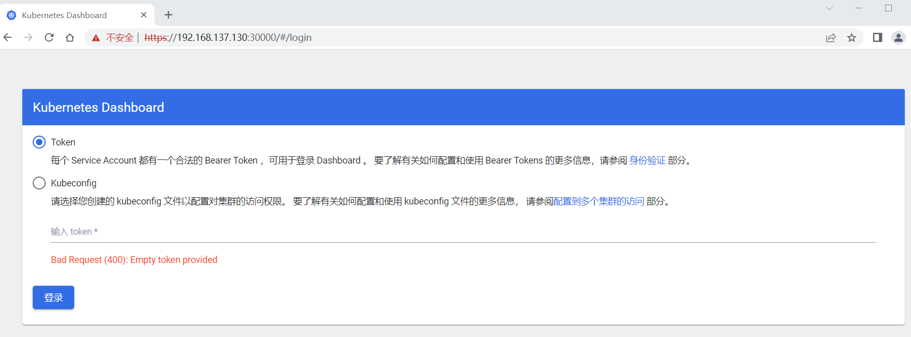

     生成token

     ```perl
     #创建 serviceaccount
     kubectl create serviceaccount dashboard-admin -n kube-system
     #绑定 权限
     kubectl create clusterrolebinding dashboard-admin --clusterrole=cluster-admin --serviceaccount=kube-system:dashboard-admin
     ```

     查看token

     ```perl
     [root@master ~]# kubectl describe secrets -n kube-system $(kubectl -n kube-system get secret | awk '/dashboard-admin/{print $1}')
     Name:         dashboard-admin-token-px288
     Namespace:    kube-system
     Labels:       <none>
     Annotations:  kubernetes.io/service-account.name: dashboard-admin
                   kubernetes.io/service-account.uid: 34a78b40-08d2-4a93-9f4e-4b3f50c85c06
     
     Type:  kubernetes.io/service-account-token
     
     Data
     ====
     ca.crt:     1099 bytes
     namespace:  11 bytes
     token:      eyJhbGciOiJSUzI1NiIsImtpZCI6Im5UemVtS0RZU0wxdldHc3poRU04VDlldDNwVHhFVUVxamN1RDdLQkxocmsifQ.eyJpc3MiOiJrdWJlcm5ldGVzL3NlcnZpY2VhY2NvdW50Iiwia3ViZXJuZXRlcy5pby9zZXJ2aWNlYWNjb3VudC9uYW1lc3BhY2UiOiJrdWJlLXN5c3RlbSIsImt1YmVybmV0ZXMuaW8vc2VydmljZWFjY291bnQvc2VjcmV0Lm5hbWUiOiJkYXNoYm9hcmQtYWRtaW4tdG9rZW4tcHgyODgiLCJrdWJlcm5ldGVzLmlvL3NlcnZpY2VhY2NvdW50L3NlcnZpY2UtYWNjb3VudC5uYW1lIjoiZGFzaGJvYXJkLWFkbWluIiwia3ViZXJuZXRlcy5pby9zZXJ2aWNlYWNjb3VudC9zZXJ2aWNlLWFjY291bnQudWlkIjoiMzRhNzhiNDAtMDhkMi00YTkzLTlmNGUtNGIzZjUwYzg1YzA2Iiwic3ViIjoic3lzdGVtOnNlcnZpY2VhY2NvdW50Omt1YmUtc3lzdGVtOmRhc2hib2FyZC1hZG1pbiJ9.q25-wiz4lJWni_nxoudnyAFQlEgi2_7iguntXNvvhH6aTeekcE3USeSSxknrWitYK56xbWKodbFn4vaDQA8k0v5zlB3vcrdAnhzIlD1OPHnOcorghqRsvskmsTzc6wUj5lsUXLx4ky7QNLETKKEDlaMAJQI-ZM9bHMr4yOdibN8ojmppymRTX9IRbl2_otMhFc1CoaOS5F2Ps5HAJjhhRQs4HpLO1CRqpkWTBp3kF4dbxWHBjgc7a-dhwPDVAX0QxyFND4rKxQorkC3rWFLV4K9mqpKKJKrgB5D9DhELPT6am2n5tqhAJ1fxw5Hq5z20chmnsIyam8pmoVzG6LGTPg
     ```

     登录dashboard

     输入上面查找到的token值后，即可看到dashboard的主界面。这是官方的ui界面

     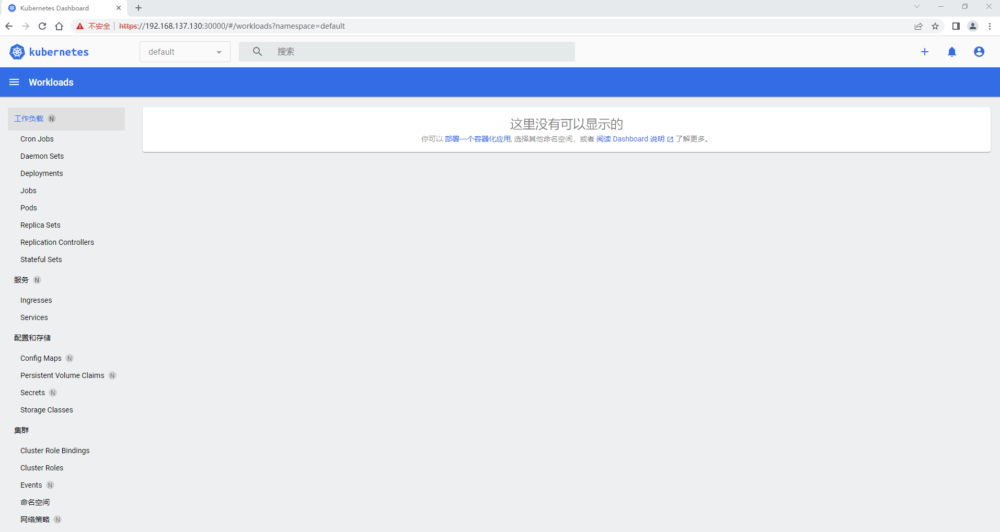


#### 卸载删除k8s及组件

在卸载K8s组件前，先执行kubeadm reset命令，清空K8s集群设置

```perl
kubeadm reset
```


卸载管理组件（kubelet kubeadm kubectl kubernetes-cni）

```perl
yum erase -y kubelet kubectl kubeadm kubernetes-cni
```

删除基础组件镜像。基础组件通过Docker镜像部署，因此只需要强制删除对应镜像即可卸载。

```perl
docker rmi -f k8s.gcr.io/kube-apiserver:v1.15.1
docker rmi -f k8s.gcr.io/kube-controller-manager:v1.15.1
docker rmi -f k8s.gcr.io/kube-scheduler:v1.15.1
docker rmi -f k8s.gcr.io/kube-proxy:v1.15.1
docker rmi -f k8s.gcr.io/pause:3.1
docker rmi -f k8s.gcr.io/etcd:3.3.10
docker rmi -f k8s.gcr.io/coredns:1.3.1
```


#### 总结

```perl
1.[WARNING Service-Kubelet]: kubelet service is not enabled, please run 'systemctl enable kubelet.service'
#kubelet 服务未启用，请运行 'systemctl enable kubelet.service'

2.[ERROR NumCPU]: the number of available CPUs 1 is less than the required 2
#可用CPU数量1小于要求的2

3.[ERROR CRI]: container runtime is not running: output: time="2022-05-15T22:13:25+08:00" level=fatal msg="getting status of runtime: rpc error: code = Unimplemented desc = unknown service runtime.v1alpha2.RuntimeService"
#解决：
rm /etc/containerd/config.toml
systemctl restart containerd

4.[ERROR FileContent--proc-sys-net-bridge-bridge-nf-call-iptables]: /proc/sys/net/bridge/bridge-nf-call-iptables contents are not set to 1
[ERROR FileContent--proc-sys-net-ipv4-ip_forward]: /proc/sys/net/ipv4/ip_forward contents are not set to 
#设置桥接

5.This error is likely caused by:
    - The kubelet is not running
    - The kubelet is unhealthy due to a misconfiguration of the node in some way (required cgroups disabled)
#镜像错误

6.Error response from daemon: pull access denied for registry.cn-hangzhou.aliyuncs.com/google_containers/coredns/coredns, repository does not exist or may require 'docker login': denied: requested access to the resource is denied
#镜像地址错误

7.The connection to the server localhost:8080 was refused - did you specify the right host or port?

```


# 3. 部署应用到集群中

### 3.1 部署应用 YAML 文件

> 本文档课件需配套 [视频](https://www.bilibili.com/video/BV1Tg411P7EB?p=3) 一起学习

* 直接命令运行

  ```perl
  kubectl run testapp --image=ccr.ccs.tencentyun.com/k8s-tutorial/test-k8s:v1
  ```

* Pod

  ```perl
  apiVersion: v1
  kind: Pod
  metadata:
    name: test-pod
  spec:
    # 定义容器，可以多个
    containers:
      - name: test-k8s # 容器名字
        image: ccr.ccs.tencentyun.com/k8s-tutorial/test-k8s:v1 # 镜像
  ```

* Deployment

  ```perl
  apiVersion: apps/v1
  kind: Deployment
  metadata:
    # 部署名字
    name: test-k8s
  spec:
    replicas: 2
    # 用来查找关联的 Pod，所有标签都匹配才行
    selector:
      matchLabels:
        app: test-k8s
    # 定义 Pod 相关数据
    template:
      metadata:
        labels:
          app: test-k8s
      spec:
        # 定义容器，可以多个
        containers:
        - name: test-k8s # 容器名字
          image: ccr.ccs.tencentyun.com/k8s-tutorial/test-k8s:v1 # 镜像
  ```

* Deployment 通过 label 关联起来 Pods

  

### 3.2 部署应用演示

部署一个 nodejs web 应用，源码地址：[Github](https://github.com/gzyunke/test-k8s)

```perl
# 部署应用
kubectl apply -f app.yaml
# 查看 deployment
kubectl get deployment
# 查看 pod
kubectl get pod -o wide
# 查看 pod 详情
kubectl describe pod pod-name
# 查看 log
kubectl logs pod-name
# 进入 Pod 容器终端， -c container-name 可以指定进入哪个容器。
kubectl exec -it pod-name -- bash
# 伸缩扩展副本
kubectl scale deployment test-k8s --replicas=5
# 把集群内端口映射到节点
kubectl port-forward pod-name 8090:8080
# 查看历史
kubectl rollout history deployment test-k8s
# 回到上个版本
kubectl rollout undo deployment test-k8s
# 回到指定版本
kubectl rollout undo deployment test-k8s --to-revision=2
# 删除部署
kubectl delete deployment test-k8s
```

* Pod 报错解决

  如果你运行 `kubectl describe pod/pod-name` 发现 Events 中有下面这个错误

  ```perl
  networkPlugin cni failed to set up pod "test-k8s-68bb74d654-mc6b9_default" network: open /run/flannel/subnet.env: no such file or directory
  ```

  在每个节点创建文件`/run/flannel/subnet.env`写入以下内容，配置后等待一会就好了

  ```perl
  FLANNEL_NETWORK=10.244.0.0/16
  FLANNEL_SUBNET=10.244.0.1/24
  FLANNEL_MTU=1450
  FLANNEL_IPMASQ=true
  ```

* 更多命令

  ```perl
  # 查看全部
  kubectl get all
  # 重新部署
  kubectl rollout restart deployment test-k8s
  # 命令修改镜像，--record 表示把这个命令记录到操作历史中
  kubectl set image deployment test-k8s test-k8s=ccr.ccs.tencentyun.com/k8s-tutorial/test-k8s:v2-with-error --record
  # 暂停运行，暂停后，对 deployment 的修改不会立刻生效，恢复后才应用设置
  kubectl rollout pause deployment test-k8s
  # 恢复
  kubectl rollout resume deployment test-k8s
  # 输出到文件
  kubectl get deployment test-k8s -o yaml >> app2.yaml
  # 删除全部资源
  kubectl delete all --all
  ```

  更多官网关于 [Deployment](https://kubernetes.io/zh/docs/concepts/workloads/controllers/deployment/) 的介绍

  将 Pod 指定到某个节点运行：[nodeselector](https://kubernetes.io/zh/docs/concepts/scheduling-eviction/assign-pod-node/#nodeselector)
  限定 CPU、内存总量：[文档](https://kubernetes.io/zh/docs/concepts/policy/resource-quotas/#计算资源配额)

  ```perl
  apiVersion: v1
  kind: Pod
  metadata:
    name: nginx
    labels:
      env: test
  spec:
    containers:
    - name: nginx
      image: nginx
      imagePullPolicy: IfNotPresent
    nodeSelector:
      disktype: ssd
  ```

### 3.3 工作负载分类

- Deployment
  适合无状态应用，所有pod等价，可替代
  
- StatefulSet
  有状态的应用，适合数据库这种类型。
  
- DaemonSet
  在每个节点上跑一个 Pod，可以用来做节点监控、节点日志收集等
  
- Job & CronJob
  Job 用来表达的是一次性的任务，而 CronJob 会根据其时间规划反复运行。
  
  [文档](https://kubernetes.io/zh/docs/concepts/workloads/)

### 3.4 现存问题

- 每次只能访问一个 pod，没有负载均衡自动转发到不同 pod
- 访问还需要端口转发
- Pod 重创后 IP 变了，名字也变了

下节我们讲解如何解决。


# 4. Service

### 4.1 特性

- Service 通过 label 关联对应的 Pod
- Servcie 生命周期不跟 Pod 绑定，不会因为 Pod 重创改变 IP
- 提供了负载均衡功能，自动转发流量到不同 Pod
- 可对集群外部提供访问端口
- 集群内部可通过服务名字访问

> 本文档课件需配套 [视频](https://www.bilibili.com/video/BV1Tg411P7EB?p=4) 一起学习

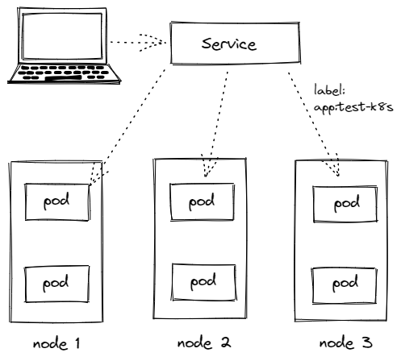

### 4.2 创建 Service

创建 一个 Service，通过标签`test-k8s`跟对应的 Pod 关联上
`service.yaml`

```perl
apiVersion: v1
kind: Service
metadata:
  name: test-k8s
spec:
  selector:
    app: test-k8s
  type: ClusterIP
  ports:
    - port: 8080        # 本 Service 的端口
      targetPort: 8080  # 容器端口
```

应用配置 `kubectl apply -f service.yaml`
查看服务 `kubectl get svc`

查看服务详情 `kubectl describe svc test-k8s`，可以发现 Endpoints 是各个 Pod 的 IP，也就是他会把流量转发到这些节点。
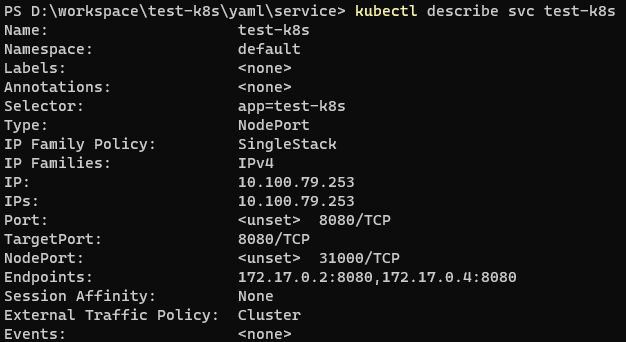

服务的默认类型是`ClusterIP`，只能在集群内部访问，我们可以进入到 Pod 里面访问：
`kubectl exec -it pod-name -- bash`
`curl http://test-k8s:8080`

如果要在集群外部访问，可以通过端口转发实现（只适合临时测试用）：
`kubectl port-forward service/test-k8s 8888:8080`

> 如果你用 minikube，也可以这样`minikube service test-k8s`

### 4.3 对外暴露服务

上面我们是通过端口转发的方式可以在外面访问到集群里的服务，如果想要直接把集群服务暴露出来，我们可以使用`NodePort` 和 `Loadbalancer` 类型的 Service

```perl
apiVersion: v1
kind: Service
metadata:
  name: test-k8s
spec:
  selector:
    app: test-k8s
  # 默认 ClusterIP 集群内可访问，NodePort 节点可访问，LoadBalancer 负载均衡模式（需要负载均衡器才可用）
  type: NodePort
  ports:
    - port: 8080        # 本 Service 的端口
      targetPort: 8080  # 容器端口
      nodePort: 31000   # 节点端口，范围固定 30000 ~ 32767
```

应用配置 `kubectl apply -f service.yaml`
在节点上，我们可以 `curl http://localhost:31000/hello/easydoc` 访问到应用
并且是有负载均衡的，网页的信息可以看到被转发到了不同的 Pod

```perl
hello easydoc 

IP lo172.17.0.8, hostname: test-k8s-68bb74d654-962lh
```

> 如果你是用 minikube，因为是模拟集群，你的电脑并不是节点，节点是 minikube 模拟出来的，所以你并不能直接在电脑上访问到服务

`Loadbalancer` 也可以对外提供服务，这需要一个负载均衡器的支持，因为它需要生成一个新的 IP 对外服务，否则状态就一直是 pendding，这个很少用了，后面我们会讲更高端的 Ingress 来代替它。

### 4.4 多端口

多端口时必须配置 name， [文档](https://kubernetes.io/zh/docs/concepts/services-networking/service/#multi-port-services)

```perl
apiVersion: v1
kind: Service
metadata:
  name: test-k8s
spec:
  selector:
    app: test-k8s
  type: NodePort
  ports:
    - port: 8080        # 本 Service 的端口
      name: test-k8s    # 必须配置
      targetPort: 8080  # 容器端口
      nodePort: 31000   # 节点端口，范围固定 30000 ~ 32767
    - port: 8090
      name: test-other
      targetPort: 8090
      nodePort: 32000
```

### 4.5 总结

* ClusterIP

  默认的，仅在集群内可用

* NodePort

  暴露端口到节点，提供了集群外部访问的入口
  端口范围固定 30000 ~ 32767

* LoadBalancer

  需要负载均衡器（通常都需要云服务商提供，裸机可以安装 [METALLB](https://metallb.universe.tf/) 测试）
  会额外生成一个 IP 对外服务
  K8S 支持的负载均衡器：[负载均衡器](https://kubernetes.io/zh/docs/concepts/services-networking/service/#internal-load-balancer)

* Headless

  适合数据库
  clusterIp 设置为 None 就变成 Headless 了，不会再分配 IP，后面会再讲到具体用法
  [官网文档](https://kubernetes.io/zh/docs/concepts/services-networking/service/#headless-services)


# 5. StatefulSet

### 5.1 什么是 StatefulSet

StatefulSet 是用来管理有状态的应用，例如数据库。
前面我们部署的应用，都是不需要存储数据，不需要记住状态的，可以随意扩充副本，每个副本都是一样的，可替代的。
而像数据库、Redis 这类有状态的，则不能随意扩充副本。
StatefulSet 会固定每个 Pod 的名字

> 本文档课件需配套 [视频](https://www.bilibili.com/video/BV1Tg411P7EB?p=5) 一起学习

### 5.2 部署 StatefulSet 类型的 Mongodb

```perl
apiVersion: apps/v1
kind: StatefulSet
metadata:
  name: mongodb
spec:
  serviceName: mongodb
  replicas: 3
  selector:
    matchLabels:
      app: mongodb
  template:
    metadata:
      labels:
        app: mongodb
    spec:
      containers:
        - name: mongo
          image: mongo:4.4
          # IfNotPresent 仅本地没有镜像时才远程拉，Always 永远都是从远程拉，Never 永远只用本地镜像，本地没有则报错
          imagePullPolicy: IfNotPresent
---
apiVersion: v1
kind: Service
metadata:
  name: mongodb
spec:
  selector:
    app: mongodb
  type: ClusterIP
  # HeadLess
  clusterIP: None
  ports:
    - port: 27017
      targetPort: 27017
kubectl apply -f mongo.yaml
```

### 5.3 StatefulSet 特性

- Service 的 `CLUSTER-IP` 是空的，Pod 名字也是固定的。
- Pod 创建和销毁是有序的，创建是顺序的，销毁是逆序的。
- Pod 重建不会改变名字，除了IP，所以不要用IP直连

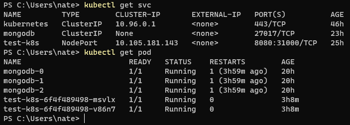

Endpoints 会多一个 hostname
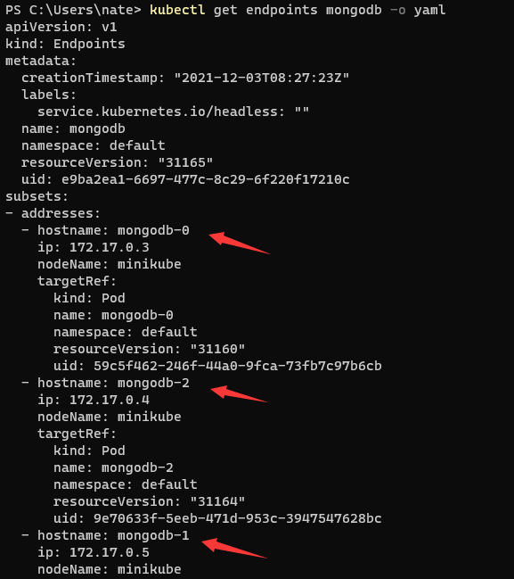

访问时，如果直接使用 Service 名字连接，会随机转发请求
要连接指定 Pod，可以这样`pod-name.service-name`
运行一个临时 Pod 连接数据测试下
`kubectl run mongodb-client --rm --tty -i --restart='Never' --image docker.io/bitnami/mongodb:4.4.10-debian-10-r20 --command -- bash`

### 5.4 Web 应用连接 Mongodb

在集群内部，我们可以通过服务名字访问到不同的服务
指定连接第一个：`mongodb-0.mongodb`

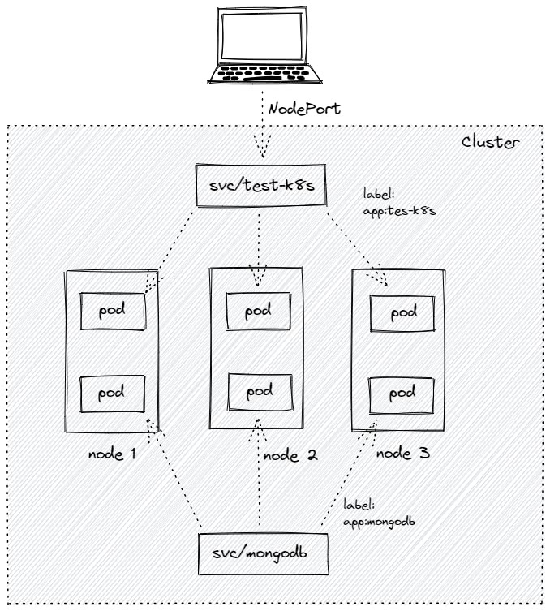

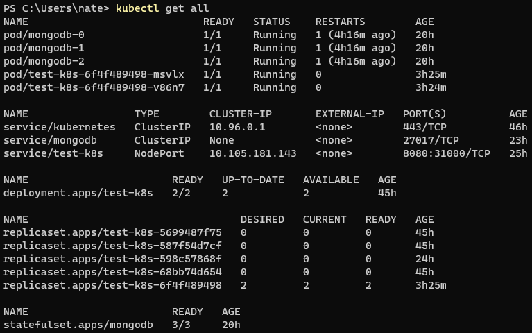

### 5.5 问题

**pod 重建后，数据库的内容丢失了**
下节，我们讲解如何解决这个问题。


# 6. 数据持久化

### 6.1 介绍

kubernetes 集群不会为你处理数据的存储，我们可以为数据库挂载一个磁盘来确保数据的安全。
你可以选择云存储、本地磁盘、NFS。

- 本地磁盘：可以挂载某个节点上的目录，但是这需要限定 pod 在这个节点上运行
- 云存储：不限定节点，不受集群影响，安全稳定；需要云服务商提供，裸机集群是没有的。
- NFS：不限定节点，不受集群影响

> 本文档课件需配套 [视频](https://www.bilibili.com/video/BV1Tg411P7EB?p=6) 一起学习

### 6.2 hostPath 挂载示例

把节点上的一个目录挂载到 Pod，但是已经不推荐使用了，[文档](https://kubernetes.io/zh/docs/concepts/storage/volumes/#hostpath)
配置方式简单，需要手动指定 Pod 跑在某个固定的节点。
仅供单节点测试使用；不适用于多节点集群。
minikube 提供了 hostPath 存储，[文档](https://minikube.sigs.k8s.io/docs/handbook/persistent_volumes/)

```perl
apiVersion: apps/v1
kind: StatefulSet
metadata:
  name: mongodb
spec:
  replicas: 1
  selector:
    matchLabels:
      app: mongodb
  template:
    metadata:
      labels:
        app: mongodb
    spec:
      containers:
        - name: mongo
          image: mongo:4.4
          # IfNotPresent 仅本地没有镜像时才远程拉，Always 永远都是从远程拉，Never 永远只用本地镜像，本地没有则报错
          imagePullPolicy: IfNotPresent
          volumeMounts:
            - mountPath: /data/db # 容器里面的挂载路径
              name: mongo-data    # 卷名字，必须跟下面定义的名字一致
      volumes:
        - name: mongo-data              # 卷名字
          hostPath:
            path: /data/mongo-data      # 节点上的路径
            type: DirectoryOrCreate     # 指向一个目录，不存在时自动创建
```

### 6.3 更高级的抽象


* Storage Class (SC)

  将存储卷划分为不同的种类，例如：SSD，普通磁盘，本地磁盘，按需使用。[文档](https://kubernetes.io/zh/docs/concepts/storage/storage-classes/)

  ```perl
  apiVersion: storage.k8s.io/v1
  kind: StorageClass
  metadata:
    name: slow
  provisioner: kubernetes.io/aws-ebs
  parameters:
    type: io1
    iopsPerGB: "10"
    fsType: ext4
  ```

* Persistent Volume (PV)

  描述卷的具体信息，例如磁盘大小，[访问模式](https://kubernetes.io/zh/docs/concepts/storage/persistent-volumes/#access-modes)。[文档](https://kubernetes.io/zh/docs/concepts/storage/persistent-volumes/)，[类型](https://kubernetes.io/zh/docs/concepts/storage/persistent-volumes/#types-of-persistent-volumes)，[Local 示例](https://kubernetes.io/zh/docs/concepts/storage/volumes/#local)

  ```perl
  apiVersion: v1
  kind: PersistentVolume
  metadata:
    name: mongodata
  spec:
    capacity:
      storage: 2Gi
    volumeMode: Filesystem  # Filesystem（文件系统） Block（块）
    accessModes:
      - ReadWriteOnce       # 卷可以被一个节点以读写方式挂载
    persistentVolumeReclaimPolicy: Delete
    storageClassName: local-storage
    local:
      path: /root/data
    nodeAffinity:
      required:
        # 通过 hostname 限定在某个节点创建存储卷
        nodeSelectorTerms:
          - matchExpressions:
              - key: kubernetes.io/hostname
                operator: In
                values:
                  - node2
  ```

* Persistent Volume Claim (PVC)

  对存储需求的一个申明，可以理解为一个申请单，系统根据这个申请单去找一个合适的 PV
  还可以根据 PVC 自动创建 PV。

  ```perl
  apiVersion: v1
  kind: PersistentVolumeClaim
  metadata:
    name: mongodata
  spec:
    accessModes: ["ReadWriteOnce"]
    storageClassName: "local-storage"
    resources:
      requests:
        storage: 2Gi
  ```

* 为什么要这么多层抽象

  - 更好的分工，运维人员负责提供好存储，开发人员不需要关注磁盘细节，只需要写一个申请单。

  - 方便云服务商提供不同类型的，配置细节不需要开发者关注，只需要一个申请单。

  - [动态创建](https://kubernetes.io/zh/docs/concepts/storage/dynamic-provisioning/)，开发人员写好申请单后，供应商可以根据需求自动创建所需存储卷。

### 6.4 腾讯云示例

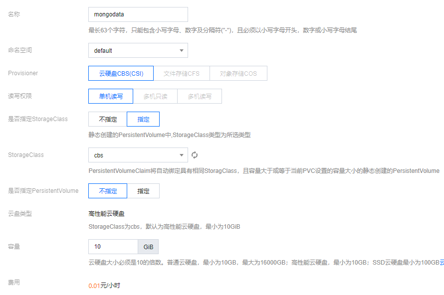

### 6.5 本地磁盘示例

不支持动态创建，需要提前创建好

```perl
apiVersion: apps/v1
kind: StatefulSet
metadata:
  name: mongodb
spec:
  replicas: 1
  selector:
    matchLabels:
      app: mongodb
  template:
    metadata:
      labels:
        app: mongodb
    spec:
      containers:
        image: mongo:5.0
        imagePullPolicy: IfNotPresent
        name: mongo
        volumeMounts:
          - mountPath: /data/db
            name: mongo-data
      volumes:
        - name: mongo-data
          persistentVolumeClaim:
             claimName: mongodata
---
apiVersion: v1
kind: Service
metadata:
  name: mongodb
spec:
  clusterIP: None
  ports:
  - port: 27017
    protocol: TCP
    targetPort: 27017
  selector:
    app: mongodb
  type: ClusterIP
---
apiVersion: storage.k8s.io/v1
kind: StorageClass
metadata:
  name: local-storage
provisioner: kubernetes.io/no-provisioner
volumeBindingMode: WaitForFirstConsumer
---
apiVersion: v1
kind: PersistentVolume
metadata:
  name: mongodata
spec:
  capacity:
    storage: 2Gi
  volumeMode: Filesystem  # Filesystem（文件系统） Block（块）
  accessModes:
    - ReadWriteOnce       # 卷可以被一个节点以读写方式挂载
  persistentVolumeReclaimPolicy: Delete
  storageClassName: local-storage
  local:
    path: /root/data
  nodeAffinity:
    required:
      # 通过 hostname 限定在某个节点创建存储卷
      nodeSelectorTerms:
        - matchExpressions:
            - key: kubernetes.io/hostname
              operator: In
              values:
                - node2
---
apiVersion: v1
kind: PersistentVolumeClaim
metadata:
  name: mongodata
spec:
  accessModes: ["ReadWriteOnce"]
  storageClassName: "local-storage"
  resources:
    requests:
      storage: 2Gi
```

### 6.6 问题

当前数据库的连接地址是写死在代码里的，另外还有数据库的密码需要配置。
下节，我们讲解如何解决。


# 7. ConfigMap & Secret

### 7.1 ConfigMap

数据库连接地址，这种可能根据部署环境变化的，我们不应该写死在代码里。
Kubernetes 为我们提供了 ConfigMap，可以方便的配置一些变量。[文档](https://kubernetes.io/zh/docs/concepts/configuration/configmap/)

> 本文档课件需配套 [视频](https://www.bilibili.com/video/BV1Tg411P7EB?p=7) 一起学习

```perl
configmap.yaml
apiVersion: v1
kind: ConfigMap
metadata:
  name: mongo-config
data:
  mongoHost: mongodb-0.mongodb
# 应用
kubectl apply -f configmap.yaml
# 查看
kubectl get configmap mongo-config -o yaml
```

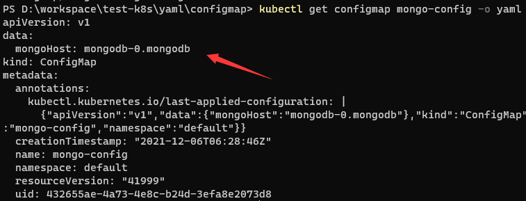

### 7.2 Secret

一些重要数据，例如密码、TOKEN，我们可以放到 secret 中。[文档](https://kubernetes.io/zh/docs/concepts/configuration/secret/)，[配置证书](https://kubernetes.io/zh/docs/concepts/configuration/secret/#tls-secret)

> 注意，数据要进行 Base64 编码。[Base64 工具](https://tools.fun/base64.html)

```perl
secret.yaml
apiVersion: v1
kind: Secret
metadata:
  name: mongo-secret
# Opaque 用户定义的任意数据，更多类型介绍 https://kubernetes.io/zh/docs/concepts/configuration/secret/#secret-types
type: Opaque
data:
  # 数据要 base64。https://tools.fun/base64.html
  mongo-username: bW9uZ291c2Vy
  mongo-password: bW9uZ29wYXNz
# 应用
kubectl apply -f secret.yaml
# 查看
kubectl get secret mongo-secret -o yaml
```

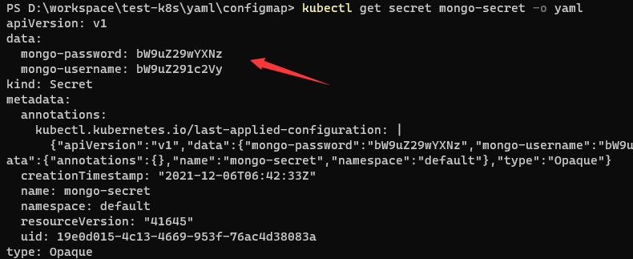

### 7.3 使用方法

* 作为环境变量使用

  ```perl
  apiVersion: apps/v1
  kind: StatefulSet
  metadata:
    name: mongodb
  spec:
    replicas: 3
    selector:
      matchLabels:
        app: mongodb
    template:
      metadata:
        labels:
          app: mongodb
      spec:
        containers:
          - name: mongo
            image: mongo:4.4
            # IfNotPresent 仅本地没有镜像时才远程拉，Always 永远都是从远程拉，Never 永远只用本地镜像，本地没有则报错
            imagePullPolicy: IfNotPresent
            env:
            - name: MONGO_INITDB_ROOT_USERNAME
              valueFrom:
                secretKeyRef:
                  name: mongo-secret
                  key: mongo-username
            - name: MONGO_INITDB_ROOT_PASSWORD
              valueFrom:
                secretKeyRef:
                  name: mongo-secret
                  key: mongo-password
            # Secret 的所有数据定义为容器的环境变量，Secret 中的键名称为 Pod 中的环境变量名称
            # envFrom:
            # - secretRef:
            #     name: mongo-secret
  ```

* 挂载为文件（更适合证书文件）

  挂载后，会在容器中对应路径生成文件，一个 key 一个文件，内容就是 value，[文档](https://kubernetes.io/zh/docs/concepts/configuration/secret/#using-secrets-as-files-from-a-pod)

  ```perl
  apiVersion: v1
  kind: Pod
  metadata:
    name: mypod
  spec:
    containers:
    - name: mypod
      image: redis
      volumeMounts:
      - name: foo
        mountPath: "/etc/foo"
        readOnly: true
    volumes:
    - name: foo
      secret:
        secretName: mysecret
  ```


# 8. Helm & 命名空间

### 8.1 介绍

`Helm`类似 npm，pip，docker hub, 可以理解为是一个软件库，可以方便快速的为我们的集群安装一些第三方软件。
使用 Helm 我们可以非常方便的就搭建出来 MongoDB / MySQL 副本集群，YAML 文件别人都给我们写好了，直接使用。[官网](https://helm.sh/zh/)，[应用中心](https://artifacthub.io/)

> 本文档课件需配套 [视频](https://www.bilibili.com/video/BV1Tg411P7EB?p=8) 一起学习

### 8.2 安装 Helm

安装 [文档](https://helm.sh/zh/docs/intro/install/)
`curl https://raw.githubusercontent.com/helm/helm/main/scripts/get-helm-3 | bash`

### 8.3 安装 MongoDB 示例

```perl
# 安装
helm repo add bitnami https://charts.bitnami.com/bitnami
helm install my-mongo bitnami/mongodb

# 指定密码和架构
helm install my-mongo bitnami/mongodb --set architecture="replicaset",auth.rootPassword="mongopass"

# 删除
helm ls
heml delete my-mongo

# 查看密码
kubectl get secret my-mongo-mongodb -o json
kubectl get secret my-mongo-mongodb -o yaml > secret.yaml

# 临时运行一个包含 mongo client 的 debian 系统
kubectl run mongodb-client --rm --tty -i --restart='Never' --image docker.io/bitnami/mongodb:4.4.10-debian-10-r20 --command -- bash

# 进去 mongodb
mongo --host "my-mongo-mongodb" -u root -p mongopass

# 也可以转发集群里的端口到宿主机访问 mongodb
kubectl port-forward svc/my-mongo-mongodb 27017:27018
```

### 8.4 命名空间

如果一个集群中部署了多个应用，所有应用都在一起，就不太好管理，也可以导致名字冲突等。
我们可以使用 namespace 把应用划分到不同的命名空间，跟代码里的 namespace 是一个概念，只是为了划分空间。

```perl
# 创建命名空间
kubectl create namespace testapp
# 部署应用到指定的命名空间
kubectl apply -f app.yml --namespace testapp
# 查询
kubectl get pod --namespace kube-system
```

可以用 [kubens](https://github.com/ahmetb/kubectx) 快速切换 namespace

```perl
# 切换命名空间
kubens kube-system
# 回到上个命名空间
kubens -
# 切换集群
kubectx minikube
```

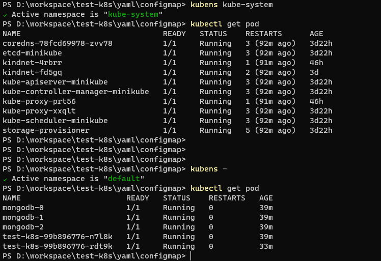


# 9. Ingress

### 9.1 介绍

Ingress 为外部访问集群提供了一个 **统一** 入口，避免了对外暴露集群端口；
功能类似 Nginx，可以根据域名、路径把请求转发到不同的 Service。
可以配置 https

> 本文档课件需配套 [视频](https://www.bilibili.com/video/BV1Tg411P7EB?p=9) 一起学习

**跟 LoadBalancer 有什么区别？**
LoadBalancer 需要对外暴露端口，不安全；
无法根据域名、路径转发流量到不同 Service，多个 Service 则需要开多个 LoadBalancer；
功能单一，无法配置 https


### 9.2 使用

要使用 Ingress，需要一个负载均衡器 + Ingress Controller
如果是裸机（bare metal) 搭建的集群，你需要自己安装一个负载均衡插件，可以安装 [METALLB](https://metallb.universe.tf/)
如果是云服务商，会自动给你配置，否则你的外部 IP 会是 “pending” 状态，无法使用。

文档：[Ingress](https://kubernetes.io/zh/docs/concepts/services-networking/ingress/)
Minikube 中部署 Ingress Controller：[nginx](https://kubernetes.io/zh/docs/tasks/access-application-cluster/ingress-minikube/)
Helm 安装： [Nginx](https://kubernetes.github.io/ingress-nginx/deploy/#quick-start)

```perl
apiVersion: networking.k8s.io/v1
kind: Ingress
metadata:
  name: simple-example
spec:
  ingressClassName: nginx
  rules:
  - host: tools.fun
    http:
      paths:
      - path: /easydoc
        pathType: Prefix
        backend:
          service:
            name: service1
            port:
              number: 4200
      - path: /svnbucket
        pathType: Prefix
        backend:
          service:
            name: service2
            port:
              number: 8080
```

### 9.3 腾讯云配置 Ingress 演示

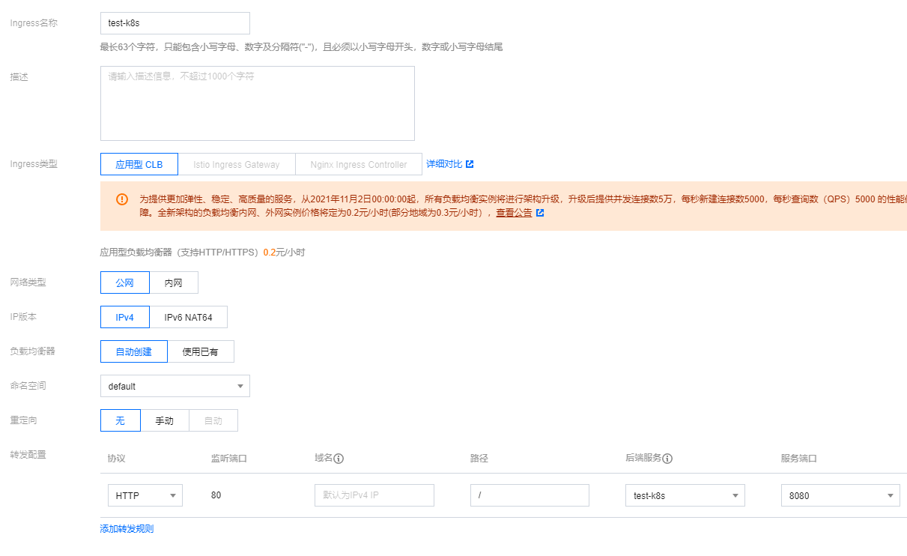


# 10. 其他补充

kubernetes 可以管理大量的容器化应用，方便的进行伸缩扩展集群，随时回退版本。
kubernetes 需要云厂商的支持才是完整的，好在当前各大云厂商都已经提供了 k8s 集群服务，生态很完善，非常方便。
我们自己搭建的叫裸机，用来做测试、学习很好，可以把自己淘汰的电脑用起来搭建出一个集群玩玩。

### WEB 可视化管理集群

如果你觉得命令行管理集群太麻烦，你可以用 Helm 快速搭建一个 [kubernetes-dashboard](https://artifacthub.io/packages/helm/k8s-dashboard/kubernetes-dashboard)，这样你就有了一个 WEB 界面，可以可视化的进行一些操作和管理。
如果是 minikube 更加简单，一个命令`minikube dashboard`就好了。

### 数据库更好的做法

数据库这种有状态的应用，更好的做法是直接使用云厂商提供的数据库，运行会更加稳定，也有完善的数据备份。

### 用脚本搭建集群

Github 上有用户已经把裸机搭建需要做的工作写成了脚本，一个脚本就帮你初始化好集群工作：[kainstall](https://github.com/lework/kainstall)

### 公网搭建 K8S 集群

网友提供的：[参考文档](https://ilep2pm1ty.feishu.cn/docs/doccnah39IMGdW3sY5uZWvJaX3X)
