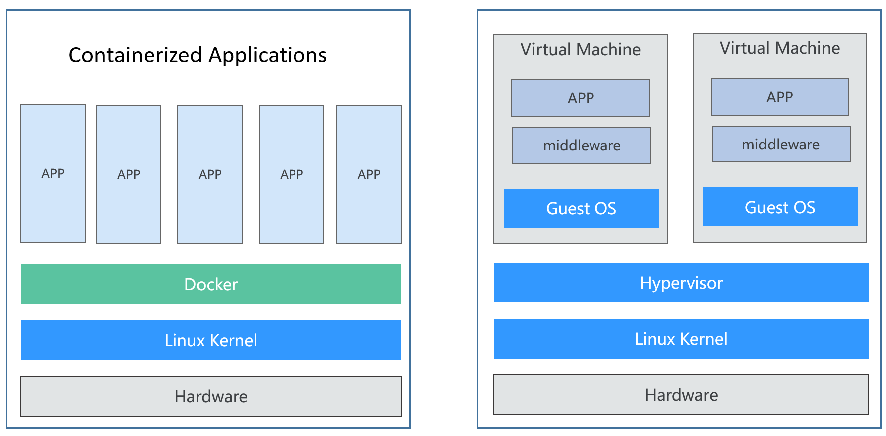
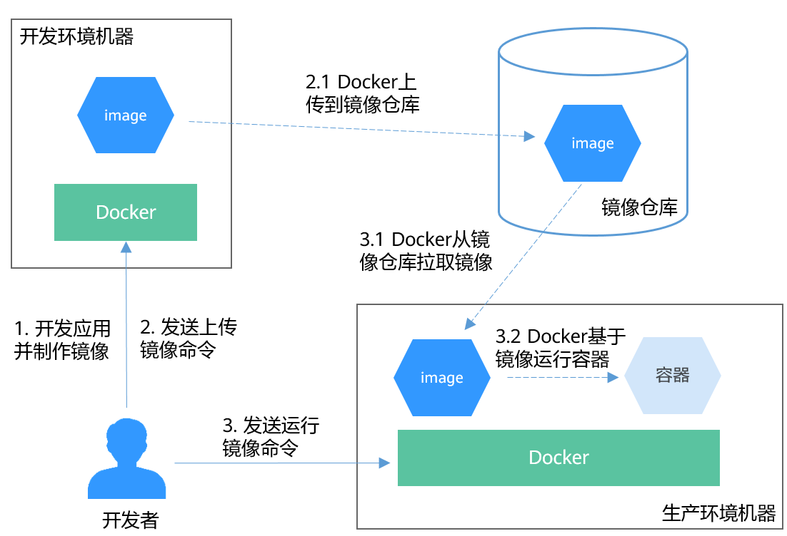
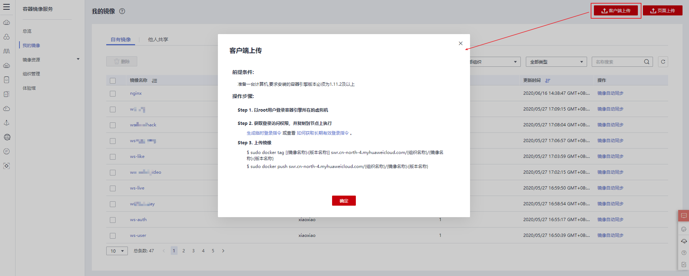
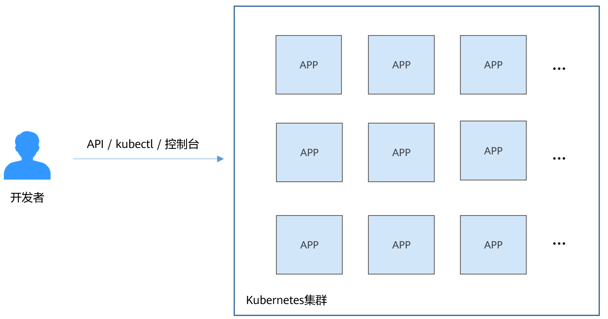
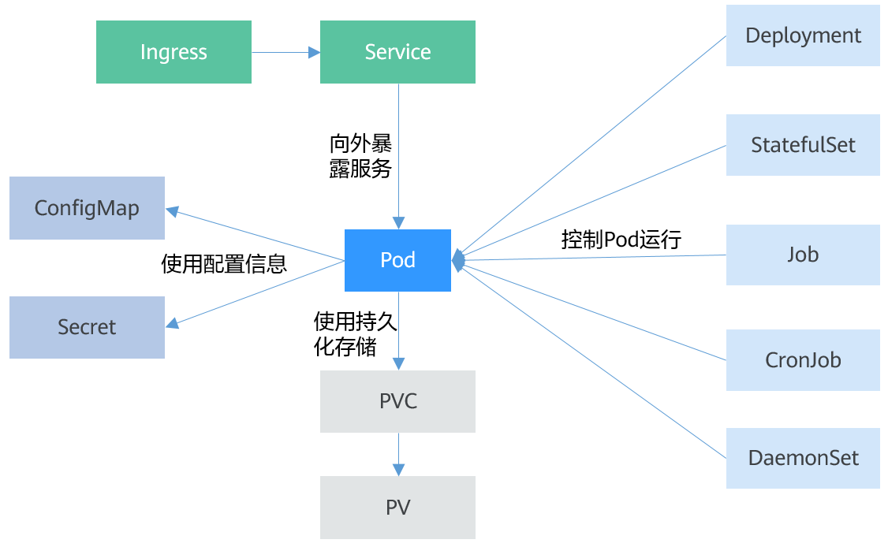
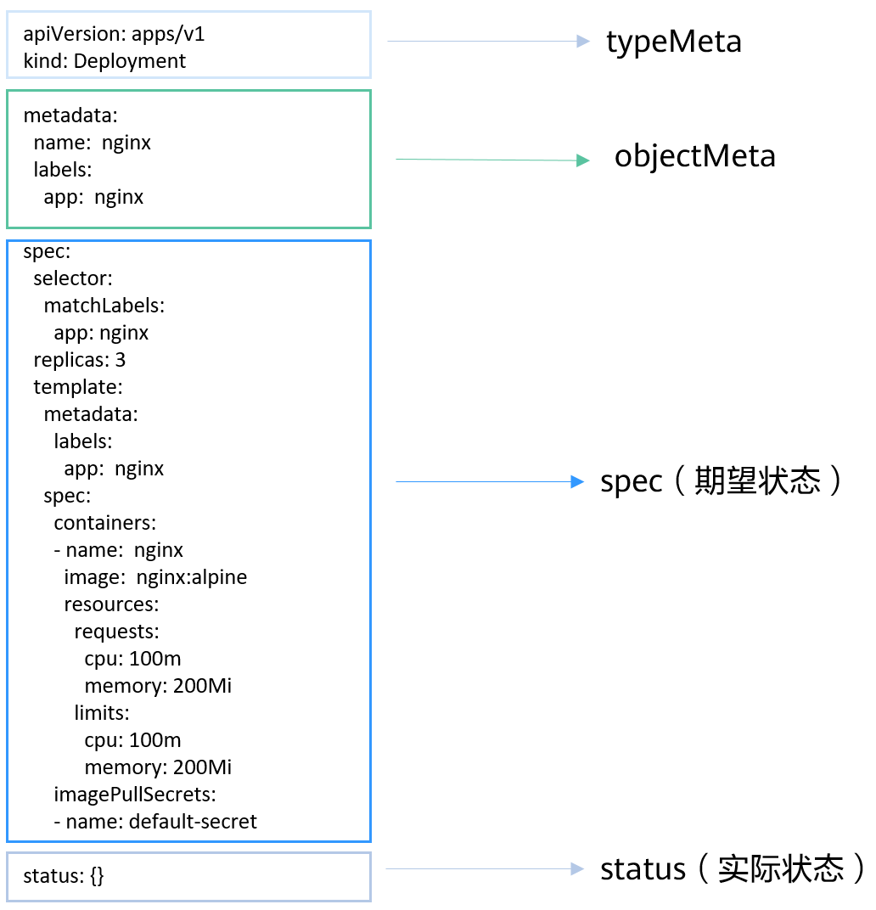

# 容器

#### 容器与Docker

容器技术起源于Linux，是一种内核虚拟化技术，提供轻量级的虚拟化，以便隔离进程和资源。尽管容器技术已经出现很久，却是随着Docker的出现而变得广为人知。Docker是第一个使容器能在不同机器之间移植的系统。它不仅简化了打包应用的流程，也简化了打包应用的库和依赖，甚至整个操作系统的文件系统能被打包成一个简单的可移植的包，这个包可以被用来在任何其他运行Docker的机器上使用。

容器和虚拟机具有相似的资源隔离和分配方式，容器虚拟化了操作系统而不是硬件，更加便携和高效。

图1 容器 vs 虚拟机


相比于使用虚拟机，容器有如下优点：

- 更高效的利用系统资源

  由于容器不需要进行硬件虚拟以及运行完整操作系统等额外开销，容器对系统资源的利用率更高。无论是应用执行速度、内存损耗或者文件存储速度，都要比传统虚拟机技术更高效。因此，相比虚拟机技术，一个相同配置的主机，往往可以运行更多数量的应用。

- 更快速的启动时间

  传统的虚拟机技术启动应用服务往往需要数分钟，而Docker容器应用，由于直接运行于宿主内核，无需启动完整的操作系统，因此可以做到秒级、甚至毫秒级的启动时间，大大节约了开发、测试、部署的时间。

- 一致的运行环境

  开发过程中一个常见的问题是环境一致性问题。由于开发环境、测试环境、生产环境不一致，导致有些问题并未在开发过程中被发现。而Docker的镜像提供了除内核外完整的运行时环境，确保了应用运行环境一致性。

- 更轻松的迁移

  由于Docker确保了执行环境的一致性，使得应用的迁移更加容易。Docker可以在很多平台上运行，无论是物理机、虚拟机，其运行结果是一致的。因此可以很轻易的将在一个平台上运行的应用，迁移到另一个平台上，而不用担心运行环境的变化导致应用无法正常运行的情况。

- 更轻松的维护和扩展

  Docker使用的分层存储以及镜像的技术，使得应用重复部分的复用更为容易，也使得应用的维护更新更加简单，基于基础镜像进一步扩展镜像也变得非常简单。此外，Docker团队同各个开源项目团队一起维护了大批高质量的官方镜像，既可以直接在生产环境使用，又可以作为基础进一步定制，大大的降低了应用服务的镜像制作成本。

#### Docker容器典型使用流程

Docker容器有如下三个主要概念：

- **镜像**：Docker镜像里包含了已打包的应用程序及其所依赖的环境。它包含应用程序可用的文件系统和其他元数据，如镜像运行时的可执行文件路径。
- **镜像仓库**：Docker镜像仓库用于存放Docker镜像，以及促进不同人和不同电脑之间共享这些镜像。当编译镜像时，要么可以在编译它的电脑上运行，要么可以先上传镜像到一个镜像仓库，然后下载到另外一台电脑上并运行它。某些仓库是公开的，允许所有人从中拉取镜像，同时也有一些是私有的，仅部分人和机器可接入。
- **容器**：Docker容器通常是一个Linux容器，它基于Docker镜像被创建。一个运行中的容器是一个运行在Docker主机上的进程，但它和主机，以及所有运行在主机上的其他进程都是隔离的。这个进程也是资源受限的，意味着它只能访问和使用分配给它的资源（CPU、内存等）。

典型的使用流程如[图2](https://support.huaweicloud.com/basics-cce/kubernetes_0002.html#kubernetes_0002__fig12227225474)所示：

图2 Docker容器典型使用流程


1. 首先开发者在开发环境机器上开发应用并制作镜像。

   Docker执行命令，构建镜像并存储在机器上。

2. 开发者发送上传镜像命令。

   Docker收到命令后，将本地镜像上传到镜像仓库。

3. 开发者向生产环境机器发送运行镜像命令。

   生产环境机器收到命令后，Docker会从镜像仓库拉取镜像到机器上，然后基于镜像运行容器。

#### 使用示例

下面使用Docker将基于Nginx镜像打包一个容器镜像，并基于容器镜像运行应用，然后推送到容器镜像仓库。

**安装Docker**

Docker几乎支持在所有操作系统上安装，用户可以根据需要选择要安装的Docker版本。

在Linux操作系统下，可以使用如下命令快速安装Docker。

```
curl -fsSL get.docker.com -o get-docker.sh
sh get-docker.sh
systemctl restart docker
```


**Docker打包镜像**

Docker提供了一种便捷的描述应用打包的方式，叫做Dockerfile，如下所示：

```
# 使用官方提供的Nginx镜像作为基础镜像
FROM nginx:alpine

# 执行一条命令修改Nginx镜像index.html的内容
RUN echo "hello world" > /usr/share/nginx/html/index.html

# 允许外界访问容器的80端口
EXPOSE 80
```


执行docker build命令打包镜像。

**docker build -t** *hello* **.**

其中-t表示给镜像加一个标签，也就是给镜像取名，这里镜像名为hello。**.** 表示在当前目录下执行该打包命令。

执行docker images命令查看镜像，可以看到hello镜像已经创建成功。您还可以看到一个Nginx镜像，这个镜像是从镜像仓库下载下来的，作为hello镜像的基础镜像使用。

```
# docker images
REPOSITORY          TAG                 IMAGE ID            CREATED             SIZE
hello               latest              d120ec16dcea        17 minutes ago      158MB
nginx               alpine              eeb27ee6b893        2 months ago        148MB
```


**本地运行容器镜像**

有了镜像后，您可以在本地执行docker run命令运行容器镜像。

```
# docker run -p 8080:80 hello
```


docker run命令会启动一个容器，命令中-p是将本地机器的8080端口映射到容器的80端口，即本地机器的8080端口的流量会映射到容器的80端口，当您在本地机器访问http://127.0.0.1:8080时，就会访问到容器中，此时浏览器中返回的内容应该就是“hello world”。

**把镜像推送到镜像仓库**

华为云提供了容器镜像服务SWR，您也可以将镜像上传到SWR，下面演示如何将镜像推送到SWR。详细的方法请参见[客户端上传镜像](https://support.huaweicloud.com/usermanual-swr/swr_01_0011.html)，本文档后续的示例中将主要使用SWR作为示例。

首先登录[SWR控制台](https://console.huaweicloud.com/swr/?#/app/warehouse/list)，在左侧选择“我的镜像”，然后单击右侧“客户端上传镜像”，在弹出的窗口中单击“生成临时登录指令”，然后复制该指令在本地机器上执行，登录到SWR镜像仓库。



上传镜像前需要给镜像取一个完整的名称，如下所示：

```
# docker tag hello swr.cn-east-3.myhuaweicloud.com/container/hello:v1
```


这里swr.cn-east-3.myhuaweicloud.com是仓库地址，每个华为云区域的地址不同，v1则是hello镜像分配的版本号。

- swr.cn-east-3.myhuaweicloud.com是仓库地址，每个华为云区域的地址不同。
- container是组织名，组织一般在SWR中创建，如果没有创建则首次上传的时候会自动创建，组织名在单个区域内全局唯一，需要选择合适的组织名称。
- v1则是hello镜像分配的版本号。

然后执行docker push命令就可以将镜像上传到SWR。

```
# docker push swr.cn-east-3.myhuaweicloud.com/container/hello:v1
```


当需要使用该镜像时，使用docker pull命令拉取（下载）该命令即可。

```
# docker pull swr.cn-east-3.myhuaweicloud.com/container/hello:v1
```


# Kubernetes

#### Kubernetes是什么

[Kubernetes](https://kubernetes.io/)是一个很容易地部署和管理容器化的应用软件系统，使用Kubernetes能够方便对容器进行调度和编排。

对应用开发者而言，可以把Kubernetes看成一个集群操作系统。Kubernetes提供服务发现、伸缩、负载均衡、自愈甚至选举等功能，让开发者从基础设施相关配置等解脱出来。

Kubernetes可以把大量的服务器看做一台巨大的服务器，在一台大服务器上面运行应用程序。无论Kubernetes的集群有多少台服务器，在Kubernetes上部署应用程序的方法永远一样。

图1 在Kubernetes集群上运行应用程序



#### Kubernetes集群架构

Kubernetes集群包含master节点（控制节点）和node节点（计算节点/工作节点），应用部署在node节点上，且可以通过配置选择应用部署在某些特定的节点上。

Kubernetes集群的架构如下所示：

图2 Kubernetes集群架构


**Master节点**

Master节点是集群的控制节点，由API Server、Scheduler、Controller Manager和ETCD四个组件构成。

- API Server：各组件互相通讯的中转站，接受外部请求，并将信息写到ETCD中。
- Controller Manager：执行集群级功能，例如复制组件，跟踪Node节点，处理节点故障等等。
- Scheduler：负责应用调度的组件，根据各种条件（如可用的资源、节点的亲和性等）将容器调度到Node上运行。
- ETCD：一个分布式数据存储组件，负责存储集群的配置信息。

在生产环境中，为了保障集群的高可用，通常会部署多个master，如CCE的集群高可用模式就是3个master节点。

**Node节点**

Node节点是集群的计算节点，即运行容器化应用的节点。

- kubelet：kubelet主要负责同Container Runtime打交道，并与API Server交互，管理节点上的容器。
- kube-proxy：应用组件间的访问代理，解决节点上应用的访问问题。
- Container Runtime：容器运行时，如Docker，最主要的功能是下载镜像和运行容器。

#### Kubernetes的扩展性

Kubernetes开放了容器运行时接口（CRI）、容器网络接口（CNI）和容器存储接口（CSI），这些接口让Kubernetes的扩展性变得最大化，而Kubernetes本身则专注于容器调度。

- CRI（Container Runtime Interface）：容器运行时接口，提供计算资源，CRI隔离了各个容器引擎之间的差异，而通过统一的接口与各个容器引擎之间进行互动。
- CNI（Container Network Interface）：容器网络接口，提供网络资源，通过CNI接口，Kubernetes可以支持不同网络环境。例如华为云CCE就是开发的CNI插件支持Kubernetes集群运行在华为云VPC网络中。
- CSI（Container Storage Interface）：容器存储接口，提供存储资源，通过CSI接口，Kubernetes可以支持各种类型的存储。例如华为云CCE就可以方便的对接华为云块存储（EVS）、文件存储（SFS）和对象存储（OBS）。

#### Kubernetes中的基本对象

上面介绍Kubernetes集群的构成，下面将介绍Kubernetes中基本对象及它们之间的一些关系。

图3 Kubernetes基本对象


- Pod

  Pod是Kubernetes创建或部署的最小单位。一个Pod封装一个或多个容器（container）、存储资源（volume）、一个独立的网络IP以及管理控制容器运行方式的策略选项。

- Deployment

  Deployment是对Pod的服务化封装。一个Deployment可以包含一个或多个Pod，每个Pod的角色相同，所以系统会自动为Deployment的多个Pod分发请求。

- StatefulSet

  StatefulSet是用来管理有状态应用的对象。和Deployment相同的是，StatefulSet管理了基于相同容器定义的一组Pod。但和Deployment不同的是，StatefulSet为它们的每个Pod维护了一个固定的ID。这些Pod是基于相同的声明来创建的，但是不能相互替换，无论怎么调度，每个Pod都有一个永久不变的ID。

- Job

  Job是用来控制批处理型任务的对象。批处理业务与长期伺服业务（Deployment）的主要区别是批处理业务的运行有头有尾，而长期伺服业务在用户不停止的情况下永远运行。Job管理的Pod根据用户的设置把任务成功完成就自动退出（Pod自动删除）。

- CronJob

  CronJob是基于时间控制的Job，类似于Linux系统的crontab，在指定的时间周期运行指定的任务。

- DaemonSet

  DaemonSet是这样一种对象（守护进程），它在集群的每个节点上运行一个Pod，且保证只有一个Pod，这非常适合一些系统层面的应用，例如日志收集、资源监控等，这类应用需要每个节点都运行，且不需要太多实例，一个比较好的例子就是Kubernetes的kube-proxy。

- Service

  Service是用来解决Pod访问问题的。Service有一个固定IP地址，Service将访问流量转发给Pod，而且Service可以给这些Pod做负载均衡。

- Ingress

  Service是基于四层TCP和UDP协议转发的，Ingress可以基于七层的HTTP和HTTPS协议转发，可以通过域名和路径做到更细粒度的划分。

- ConfigMap

  ConfigMap是一种用于存储应用所需配置信息的资源类型，用于保存配置数据的键值对。通过ConfigMap可以方便的做到配置解耦，使得不同环境有不同的配置。

- Secret

  Secret是一种加密存储的资源对象，您可以将认证信息、证书、私钥等保存在Secret中，而不需要把这些敏感数据暴露到镜像或者Pod定义中，从而更加安全和灵活。

- PersistentVolume（PV）

  PV指持久化数据存储卷，主要定义的是一个持久化存储在宿主机上的目录，比如一个NFS的挂载目录。

- PersistentVolumeClaim（PVC）

  Kubernetes提供PVC专门用于持久化存储的申请，PVC可以让您无需关心底层存储资源如何创建、释放等动作，而只需要申明您需要何种类型的存储资源、多大的存储空间。

#### 搭建Kubernetes集群

[Kubernetes网站](https://kubernetes.io/docs/setup/)上有多种搭建Kubernetes集群的方法，例如minikube、kubeadm等。

如果不想自行搭建Kubernetes集群，可以在[华为云的CCE服务](https://www.huaweicloud.com/product/cce.html)中购买，本文后续内容都将在CCE中购买的集群上操作演示。

#### kubectl

[kubectl](https://kubernetes.io/docs/tasks/tools/install-kubectl/)是Kubernetes集群的命令行工具，您可以将kubectl安装在任意一台机器上，通过kubectl命令操作Kubernetes集群。

CCE集群的kubectl安装请参见[通过kubectl连接集群](https://support.huaweicloud.com/usermanual-cce/cce_01_0107.html#section1)。连接后您可以执行**kubectl cluster-info**查看集群的信息，如下所示。

```
# kubectl cluster-info
Kubernetes master is running at https://*.*.*.*:5443
CoreDNS is running at https://*.*.*.*:5443/api/v1/namespaces/kube-system/services/coredns:dns/proxy

To further debug and diagnose cluster problems, use 'kubectl cluster-info dump'.
```


执行**kubectl get nodes**可以查看集群中的Node节点信息。

```
# kubectl get nodes
NAME            STATUS    ROLES     AGE       VERSION
192.168.0.153   Ready     <none>    7m        v1.15.6-r1-20.3.0.2.B001-15.30.2
192.168.0.207   Ready     <none>    7m        v1.15.6-r1-20.3.0.2.B001-15.30.2
192.168.0.221   Ready     <none>    7m        v1.15.6-r1-20.3.0.2.B001-15.30.2
```


#### Kubernetes对象的描述

kubernetes中资源可以使用YAML描述（如果您对YAML格式不了解，可以参考[YAML语法](https://support.huaweicloud.com/devg-cci/cci_05_1001.html)），也可以使用JSON。其内容可以分为如下四个部分：

- typeMeta：对象类型的元信息，声明对象使用哪个API版本，哪个类型的对象。
- objectMeta：对象的元信息，包括对象名称、使用的标签等。
- spec：对象的期望状态，例如对象使用什么镜像、有多少副本等。
- status：对象的实际状态，只能在对象创建后看到，创建对象时无需指定。

图4 YAML描述文件


#### 在Kubernetes上运行应用

将[图4](https://support.huaweicloud.com/basics-cce/kubernetes_0003.html#kubernetes_0003__fig370933922411)中的内容去除status存为一个名为nginx-deployment.yaml的文件，如下所示：

```
apiVersion: apps/v1
kind: Deployment
metadata:
  name:  nginx
  labels:
    app:  nginx
spec:
  selector:
    matchLabels:
      app: nginx
  replicas: 3
  template:
    metadata:
      labels:
        app:  nginx
    spec:
      containers:
      - name:  nginx
        image:  nginx:alpine
        resources:
          requests:
            cpu: 100m
            memory: 200Mi
          limits:
            cpu: 100m
            memory: 200Mi
      imagePullSecrets:
      - name: default-secret
```


使用kubectl连接集群后，执行如下命令：

```
# kubectl create -f nginx-deployment.yaml 
deployment.apps/nginx created
```


命令执行后，Kubernetes集群中会创建3个Pod，使用如下命令可以查询到Deployment和Pod：

```
# kubectl get deploy
NAME    READY   UP-TO-DATE   AVAILABLE   AGE
nginx   3/3     3            3           9s

# kubectl get pods
NAME                     READY   STATUS    RESTARTS   AGE
nginx-685898579b-qrt4d   1/1     Running   0          15s
nginx-685898579b-t9zd2   1/1     Running   0          15s
nginx-685898579b-w59jn   1/1     Running   0          15s
```


到此为止，您了解容器和Docker、Kubernetes集群、Kubernetes基本概念，并通过一个示例了解kubectl的最基本使用，本文后续将向您深入介绍Kubernetes对象的概念以及使用方法，并介绍对象之间的关系。