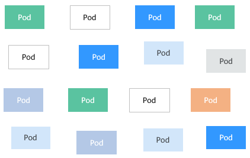

# Pod：Kubernetes中的最小调度对象

#### Pod

Pod是Kubernetes创建或部署的最小单位。一个Pod封装一个或多个容器（container）、存储资源（volume）、一个独立的网络IP以及管理控制容器运行方式的策略选项。

Pod使用主要分为两种方式：

- Pod中运行一个容器。这是Kubernetes最常见的用法，您可以将Pod视为单个封装的容器，但是Kubernetes是直接管理Pod而不是容器。

- Pod中运行多个需要耦合在一起工作、需要共享资源的容器。通常这种场景下应用包含一个主容器和几个辅助容器（SideCar Container），如

  图1

  所示，例如主容器为一个web服务器，从一个固定目录下对外提供文件服务，而辅助容器周期性的从外部下载文件存到这个固定目录下。

  图1 Pod
  

实际使用中很少直接创建Pod，而是使用Kubernetes中称为Controller的抽象层来管理Pod实例，例如Deployment和Job。Controller可以创建和管理多个Pod，提供副本管理、滚动升级和自愈能力。通常，Controller会使用Pod Template来创建相应的Pod。

#### 创建Pod

kubernetes中资源可以使用YAML描述（如果您对YAML格式不了解，可以参考[YAML语法](https://support.huaweicloud.com/devg-cci/cci_05_1001.html)），也可以使用JSON，如下示例描述了一个名为nginx的Pod，这个Pod中包含一个名为container-0的容器，使用nginx:alpine镜像，使用的资源为100m core CPU、200Mi内存。

```yaml
apiVersion: v1                      # Kubernetes的API Version
kind: Pod                           # Kubernetes的资源类型
metadata:
  name: nginx                       # Pod的名称
spec:                               # Pod的具体规格（specification）
  containers:
  - image: nginx:alpine             # 使用的镜像为 nginx:alpine
    name: container-0               # 容器的名称
    resources:                      # 申请容器所需的资源
      limits:
        cpu: 100m
        memory: 200Mi
      requests:
        cpu: 100m
        memory: 200Mi
  imagePullSecrets:                 # 拉取镜像使用的证书，在CCE上必须为default-secret
  - name: default-secret
```


如上面YAML的注释，YAML描述文件主要为如下部分：

- **metadata**：一些名称/标签/namespace等信息。
- **spec**：Pod实际的配置信息，包括使用什么镜像，volume等。

如果去查询Kubernetes的资源，您会看到还有一个**status**字段，status描述kubernetes资源的实际状态，创建时不需要配置。这个示例是一个最小集，其他参数定义后面会逐步介绍。

Pod定义好后就可以使用kubectl创建，如果上面YAML文件名称为nginx.yaml，则创建命令如下所示，-f表示使用文件方式创建。

```shell
$ kubectl create -f nginx.yaml
pod/nginx created
```


Pod创建完成后，可以使用kubectl get pods命令查询Pod的状态，如下所示。

```shell
$ kubectl get pods
NAME           READY   STATUS    RESTARTS   AGE
nginx          1/1     Running   0          40s
```


可以看到此处nginx这个Pod的状态为Running，表示正在运行；READY为1/1，表示这个Pod中有1个容器，其中1个容器的状态为Ready。

可以使用kubectl get命令查询具体Pod的配置信息，如下所示，-o yaml表示以YAML格式返回，还可以使用-o json，以JSON格式返回。

```shell
$ kubectl get pod nginx -o yaml
```


您还可以使用kubectl describe命令查看Pod的详情。

```shell
$ kubectl describe pod nginx
```


删除pod时，Kubernetes终止Pod中所有容器。 Kubernetes向进程发送SIGTERM信号并等待一定的秒数（默认为30）让容器正常关闭。如果它没有在这个时间内关闭，Kubernetes会发送一个SIGKILL信号杀死该进程。

Pod的停止与删除有多种方法，比如按名称删除，如下所示。

```shell
$ kubectl delete po nginx
pod "nginx" deleted
```


同时删除多个Pod。

```shell
$ kubectl delete po pod1 pod2
```


删除所有Pod。

```shell
$ kubectl delete po --all
pod "nginx" deleted
```


根据Label删除Pod，[Label](https://support.huaweicloud.com/basics-cce/kubernetes_0011.html)详细内容将会在下一个章节介绍。

```shell
$ kubectl delete po -l app=nginx
pod "nginx" deleted
```


#### 使用环境变量

环境变量是容器运行环境中设定的一个变量。

环境变量为应用提供极大的灵活性，您可以在应用程序中使用环境变量，在创建容器时为环境变量赋值，容器运行时读取环境变量的值，从而做到灵活的配置，而不是每次都重新编写应用程序制作镜像。

环境变量的使用方法如下所示，配置spec.containers.env字段即可。

```yaml
apiVersion: v1
kind: Pod
metadata:
  name: nginx
spec:
    containers:
    - image: nginx:alpine
      name: container-0
      resources:
        limits:
          cpu: 100m
          memory: 200Mi
        requests:
          cpu: 100m
          memory: 200Mi
      env:                            # 环境变量
      - name: env_key
        value: env_value
    imagePullSecrets:
    - name: default-secret
```


执行如下命令查看容器中的环境变量，可以看到env_key这个环境变量，其值为env_value。

```shell
$ kubectl exec -it nginx -- env
PATH=/usr/local/sbin:/usr/local/bin:/usr/sbin:/usr/bin:/sbin:/bin
HOSTNAME=nginx
TERM=xterm
env_key=env_value
```


环境变量还可以引用ConfigMap和Secret，具体使用方法请参见[在环境变量中引用ConfigMap](https://support.huaweicloud.com/basics-cce/kubernetes_0020.html#kubernetes_0020__section18458337406)和[在环境变量中引用Secret](https://support.huaweicloud.com/basics-cce/kubernetes_0021.html#kubernetes_0021__section66761159194018)。

#### 容器启动命令

启动容器就是启动主进程，但有些时候，启动主进程前，需要一些准备工作。比如MySQL类的数据库，可能需要一些数据库配置、初始化的工作，这些工作要在最终的MySQL服务器运行之前做完。这些操作，可以在制作镜像时通过在Dockerfile文件中设置ENTRYPOINT或CMD来完成，如下所示的Dockerfile中设置了**ENTRYPOINT ["top", "-b"]**命令，其将会在容器启动时执行。

```
FROM ubuntu
ENTRYPOINT ["top", "-b"]
```


实际使用时，只需配置Pod的containers.command参数，该参数是list类型，第一个参数为执行命令，后面均为命令的参数。

```yaml
apiVersion: v1
kind: Pod
metadata:
  name: nginx
spec:
  containers:
  - image: nginx:alpine
    name: container-0
    resources:
      limits:
        cpu: 100m
        memory: 200Mi
      requests:
        cpu: 100m
        memory: 200Mi
    command:                     # 启动命令
    - top
    - "-b"
  imagePullSecrets:
   - name: default-secret
```


#### 容器的生命周期

Kubernetes提供了[容器生命周期钩子](https://kubernetes.io/docs/concepts/containers/container-lifecycle-hooks/)，在容器的生命周期的特定阶段执行调用，比如容器在停止前希望执行某项操作，就可以注册相应的钩子函数。目前提供的生命周期钩子函数如下所示。

- 启动后处理（PostStart）：容器启动后触发。
- 停止前处理（PreStop）：容器停止前触发。

实际使用时，只需配置Pod的lifecycle.postStart或lifecycle.preStop参数，如下所示。

```yaml
apiVersion: v1
kind: Pod
metadata:
  name: nginx
spec:
  containers:
  - image: nginx:alpine
    name: container-0
    resources:
      limits:
        cpu: 100m
        memory: 200Mi
      requests:
        cpu: 100m
        memory: 200Mi
    lifecycle:
      postStart:                 # 启动后处理
        exec:
          command:
          - "/postStart.sh"
      preStop:                   # 停止前处理
        exec:
          command:
          - "/preStop.sh"
  imagePullSecrets:
   - name: default-secret
```


# 存活探针（Liveness Probe）

#### 存活探针

Kubernetes提供了自愈的能力，具体就是能感知到容器崩溃，然后能够重启这个容器。但是有时候例如Java程序内存泄漏了，程序无法正常工作，但是JVM进程却是一直运行的，对于这种应用本身业务出了问题的情况，Kubernetes提供了Liveness Probe机制，通过检测容器响应是否正常来决定是否重启，这是一种很好的健康检查机制。

毫无疑问，每个Pod最好都定义Liveness Probe，否则Kubernetes无法感知Pod是否正常运行。

Kubernetes支持如下三种探测机制。

- HTTP GET：向容器发送HTTP GET请求，如果Probe收到2xx或3xx，说明容器是健康的。
- TCP Socket：尝试与容器指定端口建立TCP连接，如果连接成功建立，说明容器是健康的。
- Exec：Probe执行容器中的命令并检查命令退出的状态码，如果状态码为0则说明容器是健康的。

与存活探针对应的还有一个就绪探针（Readiness Probe），将在[就绪探针（Readiness Probe）](https://support.huaweicloud.com/basics-cce/kubernetes_0026.html)中会详细介绍。

#### HTTP GET

HTTP GET方式是最常见的探测方法，其具体机制是向容器发送HTTP GET请求，如果Probe收到2xx或3xx，说明容器是健康的，定义方法如下所示。

```shell
apiVersion: v1
kind: Pod
metadata:
  name: liveness-http
spec:
  containers:
  - name: liveness
    image: nginx:alpine
    livenessProbe:           # liveness probe
      httpGet:               # HTTP GET定义
        path: /
        port: 80
  imagePullSecrets: 
  - name: default-secret
```


创建这个Pod。

```shell
$ kubectl create -f liveness-http.yaml
pod/liveness-http created
```


如上，这个Probe往容器的80端口发送HTTP GET请求，如果请求不成功，Kubernetes会重启容器。

查看Pod详情。

```shell
$ kubectl describe po liveness-http
Name:               liveness-http
......
Containers:
  liveness:
    ......
    State:          Running
      Started:      Mon, 03 Aug 2020 03:08:55 +0000
    Ready:          True
    Restart Count:  0
    Liveness:       http-get http://:80/ delay=0s timeout=1s period=10s #success=1 #failure=3
    Environment:    <none>
    Mounts:
      /var/run/secrets/kubernetes.io/serviceaccount from default-token-vssmw (ro)
......
```


可以看到Pod当前状态是Running，Restart Count为0，说明没有重启。如果Restart Count不为0，则说明已经重启。

#### TCP Socket

TCP Socket尝试与容器指定端口建立TCP连接，如果连接成功建立，说明容器是健康的，定义方法如下所示。

```yaml
apiVersion: v1
kind: Pod
metadata:
  labels:
    test: liveness
  name: liveness-tcp
spec:
  containers:
  - name: liveness
    image: nginx:alpine
    livenessProbe:           # liveness probe
      tcpSocket:
        port: 80
  imagePullSecrets: 
  - name: default-secret
```


#### Exec

Exec即执行具体命令，具体机制是Probe执行容器中的命令并检查命令退出的状态码，如果状态码为0则说明健康，定义方法如下所示。

```yaml
apiVersion: v1
kind: Pod
metadata:
  labels:
    test: liveness
  name: liveness-exec
spec:
  containers:
  - name: liveness
    image: nginx:alpine
    args:
    - /bin/sh
    - -c
    - touch /tmp/healthy; sleep 30; rm -rf /tmp/healthy; sleep 600
    livenessProbe:           # liveness probe
      exec:                  # Exec定义
        command:
        - cat
        - /tmp/healthy
  imagePullSecrets: 
  - name: default-secret
```


上面定义在容器中执行**cat /tmp/healthy**命令，如果成功执行并返回0，则说明容器是健康的。上面定义中，30秒后命令会删除/tmp/healthy，这会导致Liveness Probe判定Pod处于不健康状态，然后会重启容器。

#### Liveness Probe高级配置

上面liveness-http的describe命令回显中有如下行。

```
Liveness: http-get http://:80/ delay=0s timeout=1s period=10s #success=1 #failure=3
```


这一行表示Liveness Probe的具体参数配置，其含义如下：

- delay：延迟，delay=0s，表示在容器启动后立即开始探测，没有延迟时间
- timeout：超时，timeout=1s，表示容器必须在1s内进行响应，否则这次探测记作失败
- period：周期，period=10s，表示每10s探测一次容器
- success：成功，#success=1，表示连续1次成功后记作成功
- failure：失败，#failure=3，表示连续3次失败后会重启容器

以上存活探针表示：容器启动后立即进行探测，如果1s内容器没有给出回应则记作探测失败。每次间隔10s进行一次探测，在探测连续失败3次后重启容器。

这些是创建时默认设置的，您也可以手动配置，如下所示。

```yaml
apiVersion: v1
kind: Pod
metadata:
  name: liveness-http
spec:
  containers:
  - name: liveness
    image: nginx:alpine
    livenessProbe:
      httpGet:
        path: /
        port: 80
      initialDelaySeconds: 10    # 容器启动后多久开始探测
      timeoutSeconds: 2          # 表示容器必须在2s内做出相应反馈给probe，否则视为探测失败
      periodSeconds: 30          # 探测周期，每30s探测一次
      successThreshold: 1        # 连续探测1次成功表示成功
      failureThreshold: 3        # 连续探测3次失败表示失败
```


initialDelaySeconds一般要设置大于0，这是由于很多情况下容器虽然启动成功，但应用就绪也需要一定的时间，需要等就绪时间之后才能返回成功，否则就会导致probe经常失败。

另外failureThreshold可以设置多次循环探测，这样在实际应用中健康检查的程序就不需要多次循环，这一点在开发应用时需要注意。

#### 配置有效的Liveness Probe

- Liveness Probe应该检查什么

  一个好的Liveness Probe应该检查应用内部所有关键部分是否健康，并使用一个专有的URL访问，例如/health，当访问/health 时执行这个功能，然后返回对应结果。这里要注意不能做鉴权，不然probe就会一直失败导致陷入重启的死循环。

  另外检查只能限制在应用内部，不能检查依赖外部的部分，例如当前端web server不能连接数据库时，这个就不能看成web server不健康。

- Liveness Probe必须轻量

  Liveness Probe不能占用过多的资源，且不能占用过长的时间，否则所有资源都在做健康检查，这就没有意义了。例如Java应用，就最好用HTTP GET方式，如果用Exec方式，JVM启动就占用了非常多的资源。


# Label：组织Pod的利器

#### 为什么需要Label

当资源变得非常多的时候，如何分类管理就非常重要了，Kubernetes提供了一种机制来为资源分类，那就是Label（标签）。Label非常简单，但是却很强大，Kubernetes中几乎所有资源都可以用Label来组织。

Label的具体形式是key-value的标记对，可以在创建资源的时候设置，也可以在后期添加和修改。

以Pod为例，当Pod变得多起来后，就显得杂乱且难以管理，如下图所示。

图1 没有分类组织的Pod


如果我们为Pod打上不同标签，那情况就完全不同了，如下图所示。

图2 使用Label组织的Pod


#### 添加Label

Label的形式为key-value形式，使用非常简单，如下，为Pod设置了app=nginx和env=prod两个Label。

```yaml
apiVersion: v1
kind: Pod
metadata:
  name: nginx
  labels:                     # 为Pod设置两个Label    
    app: nginx    
    env: prod
spec:
  containers:
  - image: nginx:alpine
    name: container-0
    resources:
      limits:
        cpu: 100m
        memory: 200Mi
      requests:
        cpu: 100m
        memory: 200Mi
  imagePullSecrets:
  - name: default-secret
```


Pod有了Label后，在查询Pod的时候带上--show-labels就可以看到Pod的Label。

```shell
$ kubectl get pod --show-labels
NAME              READY   STATUS    RESTARTS   AGE   LABELS
nginx             1/1     Running   0          50s   app=nginx,env=prod
```


还可以使用-L只查询某些固定的Label。

```shell
$ kubectl get pod -L app,env 
NAME              READY   STATUS    RESTARTS   AGE   APP     ENV
nginx             1/1     Running   0          1m    nginx   prod
```


对已存在的Pod，可以直接使用kubectl label命令直接添加Label。

```shell
$ kubectl label pod nginx creation_method=manual
pod/nginx labeled

$ kubectl get pod --show-labels
NAME              READY   STATUS    RESTARTS   AGE   LABELS
nginx             1/1     Running   0          50s   app=nginx, creation_method=manual,env=prod
```


#### 修改Label

对于已存在的Label，如果要修改的话，需要在命令中带上--overwrite，如下所示。

```shell
$ kubectl label pod nginx env=debug --overwrite
pod/nginx labeled

$ kubectl get pod --show-labels
NAME              READY   STATUS    RESTARTS   AGE   LABELS
nginx             1/1     Running   0          50s   app=nginx,creation_method=manual,env=debug
```


# Namespace：资源分组

#### 为什么需要Namespace

Label虽然好，但只用Label的话，那Label会非常多，有时候会有重叠，而且每次查询之类的动作都带一堆Label非常不方便。Kubernetes提供了Namespace来做资源组织和划分，使用多Namespace可以将包含很多组件的系统分成不同的组。Namespace也可以用来做多租户划分，这样多个团队可以共用一个集群，使用的资源用Namespace划分开。

不同的Namespace下面可以有相同的名字，Kubernetes中大部分资源可以用Namespace划分，不过有些资源不行，它们属于全局资源，不属于某一个Namespace，后面会逐步接触到。

通过如下命令可以查询到当前集群下的Namespace。

```shell
$ kubectl get ns
NAME               STATUS   AGE
default            Active   36m
kube-node-realease Active   36m
kube-public        Active   36m
kube-system        Active   36m
```


到目前为止，我们都是在default Namespace下操作，当使用kubectl get而不指定Namespace时，默认为default Namespace。

看下kube-system下面有些什么东西。

```shell
$ kubectl get po --namespace=kube-system
NAME                                      READY   STATUS    RESTARTS   AGE
coredns-7689f8bdf-295rk                   1/1     Running   0          9m11s
coredns-7689f8bdf-h7n68                   1/1     Running   0          11m
everest-csi-controller-6d796fb9c5-v22df   2/2     Running   0          9m11s
everest-csi-driver-snzrr                  1/1     Running   0          12m
everest-csi-driver-ttj28                  1/1     Running   0          12m
everest-csi-driver-wtrk6                  1/1     Running   0          12m
icagent-2kz8g                             1/1     Running   0          12m
icagent-hjz4h                             1/1     Running   0          12m
icagent-m4bbl                             1/1     Running   0          12m
```


可以看到kube-system有很多Pod，其中coredns是用于做服务发现、everest-csi是用于对接华为云存储服务、icagent是用于对接华为云监控系统。

这些通用的、必须的应用放在kube-system这个命名空间中，能够做到与其他Pod之间隔离，在其他命名空间中不会看到kube-system这个命名空间中的东西，不会造成影响。

#### 创建Namespace

使用如下方式定义Namespace。

```shell
apiVersion: v1 
kind: Namespace 
metadata: 
  name: custom-namespace 
```


使用kubectl命令创建。

```shell
$ kubectl create -f custom-namespace.yaml
namespace/custom-namespace created 
```


您还可以使用kubectl create namespace命令创建。

```shell
$ kubectl create namespace custom-namespace 
namespace/custom-namespace created 
```


在指定Namespace下创建资源。

```shell
$ kubectl create -f nginx.yaml -n custom-namespace 
pod/nginx created 
```


这样在custom-namespace下，就创建了一个名为nginx的Pod。

#### Namespace的隔离说明

Namespace只能做到组织上划分，对运行的对象来说，它不能做到真正的隔离。举例来说，如果两个Namespace下的Pod知道对方的IP，而Kubernetes依赖的底层网络没有提供Namespace之间的网络隔离的话，那这两个Pod就可以互相访问。