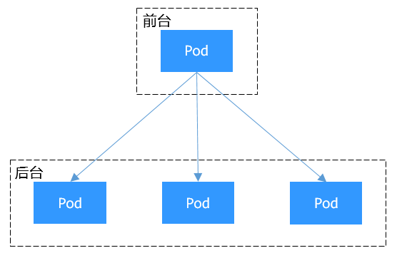
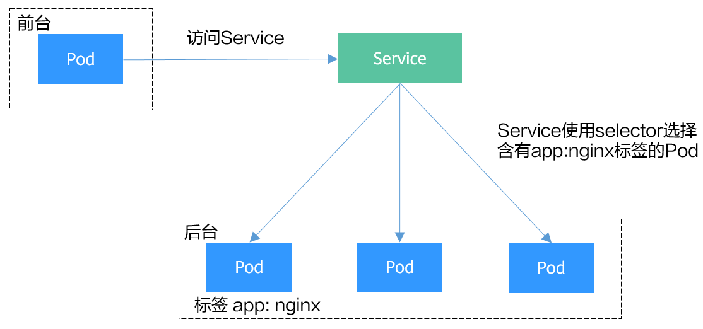

# 容器网络

Kubernetes本身并不负责网络通信，Kubernetes提供了容器网络接口CNI（Container Network Interface），具体的网络通信交给CNI插件来负责，开源的CNI插件非常多，像Flannel、Calico等，华为云CCE也专门为Kubernetes定制了CNI插件（Canal和Yangste），使得Kubernetes可以使用华为云VPC网络。

Kubernetes虽然不负责网络，但要求集群中的Pod能够互相通信，且Pod必须通过非NAT网络连接，即收到的数据包的源IP就是发送数据包Pod的IP。同时Pod与节点之间的通信也是通过非NAT网络。但是Pod访问集群外部时源IP会被修改成节点的IP。

Pod内部是通过虚拟Ethernet接口对（Veth pair）与Pod外部连接，Veth pair就像一根网线，一端留在Pod内部，一端在Pod之外。而同一个节点上的Pod通过网桥（Linux Bridge）通信，如下图所示。

图1 同一个节点中的Pod通信


不同节点间的网桥连接有很多种方式，这跟具体实现相关。但集群要求Pod的地址唯一，所以跨节点的网桥通常使用不同的地址段，以防止Pod的IP地址重复。

图2 不同节点上的Pod通信


以上就是容器网络底层视图，后面将进一步介绍Kubernetes是如何在此基础上向用户提供访问方案，具体请参见[Service](https://support.huaweicloud.com/basics-cce/kubernetes_0024.html)和[Ingress](https://support.huaweicloud.com/basics-cce/kubernetes_0025.html)。


# Service

#### 直接访问Pod的问题

Pod创建完成后，如何访问Pod呢？直接访问Pod会有如下几个问题：

- Pod会随时被Deployment这样的控制器删除重建，那访问Pod的结果就会变得不可预知。
- Pod的IP地址是在Pod启动后才被分配，在启动前并不知道Pod的IP地址。
- 应用往往都是由多个运行相同镜像的一组Pod组成，逐个访问Pod也变得不现实。

举个例子，假设有这样一个应用程序，使用Deployment创建了前台和后台，前台会调用后台做一些计算处理，如[图1](https://support.huaweicloud.com/basics-cce/kubernetes_0024.html#kubernetes_0024__fig2173165051811)所示。后台运行了3个Pod，这些Pod是相互独立且可被替换的，当Pod出现状况被重建时，新建的Pod的IP地址是新IP，前台的Pod无法直接感知。

图1 Pod间访问


#### 使用Service解决Pod的访问问题

Kubernetes中的Service对象就是用来解决上述Pod访问问题的。Service有一个固定IP地址（在创建CCE集群时有一个服务网段的设置，这个网段专门用于给Service分配IP地址），Service将访问它的流量转发给Pod，具体转发给哪些Pod通过Label来选择，而且Service可以给这些Pod做负载均衡。

那么对于上面的例子，为后台添加一个Service，通过Service来访问Pod，这样前台Pod就无需感知后台Pod的变化，如[图2](https://support.huaweicloud.com/basics-cce/kubernetes_0024.html#kubernetes_0024__fig163156154816)所示。

图2 通过Service访问Pod


#### 创建后台Pod

首先创建一个3副本的Deployment，即3个Pod，且Pod上带有标签“app: nginx”，具体如下所示。

```
apiVersion: apps/v1      
kind: Deployment         
metadata:
  name: nginx            
spec:
  replicas: 3                    
  selector:              
    matchLabels:
      app: nginx
  template:              
    metadata:
      labels:
        app: nginx
    spec:
      containers:
      - image: nginx:latest
        name: container-0
        resources:
          limits:
            cpu: 100m
            memory: 200Mi
          requests:
            cpu: 100m
            memory: 200Mi
      imagePullSecrets:
      - name: default-secret
```


#### 创建Service

下面示例创建一个名为“nginx”的Service，通过selector选择到标签“app:nginx”的Pod，目标Pod的端口为80，Service对外暴露的端口为8080。

访问服务只需要通过“服务名称:对外暴露的端口”接口，对应本例即“nginx:8080”。这样，在其他Pod中，只需要通过“nginx:8080”就可以访问到“nginx”关联的Pod。

```
apiVersion: v1
kind: Service
metadata:
  name: nginx        # Service的名称
spec:
  selector:          # Label Selector，选择包含app=nginx标签的Pod
    app: nginx
  ports:
  - name: service0
    targetPort: 80   # Pod的端口
    port: 8080       # Service对外暴露的端口
    protocol: TCP    # 转发协议类型，支持TCP和UDP
  type: ClusterIP    # Service的类型
```


将上面Service的定义保存到nginx-svc.yaml文件中，使用kubectl创建这个Service。

```
$ kubectl create -f nginx-svc.yaml
service/nginx created

$ kubectl get svc
NAME         TYPE        CLUSTER-IP       EXTERNAL-IP   PORT(S)    AGE
kubernetes   ClusterIP   10.247.0.1       <none>        443/TCP    7h19m
nginx        ClusterIP   10.247.124.252   <none>        8080/TCP   5h48m
```


您可以看到Service有个Cluster IP，这个IP是固定不变的，除非Service被删除，所以您也可以使用ClusterIP在集群内部访问Service。

下面创建一个Pod并进入容器，使用ClusterIP访问Pod，可以看到能直接返回内容。

```
$ kubectl run -i --tty --image nginx:alpine test --rm /bin/sh
If you don't see a command prompt, try pressing enter.
/ # curl 10.247.124.252:8080
<!DOCTYPE html>
<html>
<head>
<title>Welcome to nginx!</title>
...
```


#### 使用ServiceName访问Service

通过DNS进行域名解析后，可以使用**“ServiceName:Port”**访问Service，这也是Kubernetes中最常用的一种使用方式。在创建CCE集群的时候，会默认要求安装CoreDNS插件，在kube-system命名空间下可以查看到CoreDNS的Pod。

```
$ kubectl get po --namespace=kube-system
NAME                                      READY   STATUS    RESTARTS   AGE
coredns-7689f8bdf-295rk                   1/1     Running   0          9m11s
coredns-7689f8bdf-h7n68                   1/1     Running   0          11m
```


CoreDNS安装成功后会成为DNS服务器，当创建Service后，CoreDNS会将Service的名称与IP记录起来，这样Pod就可以通过向CoreDNS查询Service的名称获得Service的IP地址。

访问时通过nginx.<namespace>.svc.cluster.local访问，其中nginx为Service的名称，<namespace>为命名空间名称，svc.cluster.local为域名后缀，在实际使用中，在同一个命名空间下可以省略<namespace>.svc.cluster.local，直接使用ServiceName即可。

例如上面创建的名为nginx的Service，直接通过**“nginx:8080”**就可以访问到Service，进而访问后台Pod。

使用ServiceName的方式有个主要的优点就是可以在开发应用程序时可以将ServiceName写在程序中，这样无需感知具体Service的IP地址。

下面创建一个Pod并进入容器，查询nginx域名的地址，可以发现是解析出nginx这个Service的IP地址10.247.124.252；同时访问Pod的域名，可以看到能直接返回内容。

```
$ kubectl run -i --tty --image tutum/dnsutils dnsutils --restart=Never --rm /bin/sh
If you don't see a command prompt, try pressing enter.
/ # nslookup nginx
Server:		10.247.3.10
Address:	10.247.3.10#53

Name:	nginx.default.svc.cluster.local
Address: 10.247.124.252

/ # curl nginx:8080
<!DOCTYPE html>
<html>
<head>
<title>Welcome to nginx!</title>
...
```


#### Service是如何做到服务发现的

前面说到有了Service后，无论Pod如何变化，Service都能够发现到Pod。

如果调用kubectl describe命令查看Service的信息，您会看下如下信息。

```
$ kubectl describe svc nginx
Name:              nginx
......
Endpoints:         172.16.2.132:80,172.16.3.6:80,172.16.3.7:80
......
```


可以看到一个Endpoints，Endpoints同样也是Kubernetes的一种资源对象，可以查询得到。Kubernetes正是通过Endpoints监控到Pod的IP，从而让Service能够发现Pod。

```
$ kubectl get endpoints
NAME         ENDPOINTS                                     AGE
nginx        172.16.2.132:80,172.16.3.6:80,172.16.3.7:80   5h48m
```


这里的172.16.2.132:80是Pod的IP:Port，通过如下命令可以查看到Pod的IP，与上面的IP一致。

```
$ kubectl get po -o wide
NAME                     READY   STATUS    RESTARTS   AGE     IP             NODE         
nginx-869759589d-dnknn   1/1     Running   0          5h40m   172.16.3.7     192.168.0.212
nginx-869759589d-fcxhh   1/1     Running   0          5h40m   172.16.3.6     192.168.0.212
nginx-869759589d-r69kh   1/1     Running   0          5h40m   172.16.2.132   192.168.0.94
```


如果删除一个Pod，Deployment会将Pod重建，新的Pod IP会发生变化。

```
$ kubectl delete po nginx-869759589d-dnknn
pod "nginx-869759589d-dnknn" deleted

$ kubectl get po -o wide
NAME                     READY   STATUS    RESTARTS   AGE     IP             NODE         
nginx-869759589d-fcxhh   1/1     Running   0          5h41m   172.16.3.6     192.168.0.212
nginx-869759589d-r69kh   1/1     Running   0          5h41m   172.16.2.132   192.168.0.94 
nginx-869759589d-w98wg   1/1     Running   0          7s      172.16.3.10    192.168.0.212
```


再次查看Endpoints，会发现Endpoints的内容随着Pod发生了变化。

```
$ kubectl get endpoints
NAME         ENDPOINTS                                      AGE
kubernetes   192.168.0.127:5444                             7h20m
nginx        172.16.2.132:80,172.16.3.10:80,172.16.3.6:80   5h49m
```


下面进一步了解这又是如何实现的。

在[Kubernetes集群架构](https://support.huaweicloud.com/basics-cce/kubernetes_0003.html#kubernetes_0003__section94531832152913)中介绍过Node节点上的kube-proxy，实际上Service相关的事情都由节点上的kube-proxy处理。在Service创建时Kubernetes会分配IP给Service，同时通过API Server通知所有kube-proxy有新Service创建了，kube-proxy收到通知后通过iptables记录Service和IP/端口对的关系，从而让Service在节点上可以被查询到。

下图是一个实际访问Service的图示，Pod X访问Service（10.247.124.252:8080），在往外发数据包时，在节点上根据iptables规则目的IP:Port被随机替换为Pod1的IP:Port，从而通过Service访问到实际的Pod。

除了记录Service和IP/端口对的关系，kube-proxy还会监控Service和Endpoint的变化，从而保证Pod重建后仍然能通过Service访问到Pod。

图3 Pod X访问Service的过程


#### Service的类型与使用场景

Service的类型除了ClusterIP还有NodePort、LoadBalancer和None，这几种类型的Service有着不同的用途。

- ClusterIP：用于在集群内部互相访问的场景，通过ClusterIP访问Service。
- NodePort：用于从集群外部访问的场景，通过节点上的端口访问Service，详细介绍请参见[NodePort类型的Service](https://support.huaweicloud.com/basics-cce/kubernetes_0024.html#kubernetes_0024__section1175215413159)。
- LoadBalancer：用于从集群外部访问的场景，其实是NodePort的扩展，通过一个特定的LoadBalancer访问Service，这个LoadBalancer将请求转发到节点的NodePort，而外部只需要访问LoadBalancer，详细介绍请参见[LoadBalancer类型的Service](https://support.huaweicloud.com/basics-cce/kubernetes_0024.html#kubernetes_0024__section7151144411279)。
- None：用于Pod间的互相发现，这种类型的Service又叫Headless Service，详细介绍请参见[Headless Service](https://support.huaweicloud.com/basics-cce/kubernetes_0024.html#kubernetes_0024__section10301171915541)。


#### NodePort类型的Service

NodePort类型的Service可以让Kubemetes集群每个节点上保留一个相同的端口， 外部访问连接首先访问节点IP:Port，然后将这些连接转发给服务对应的Pod。如下图所示。

图4 NodePort Service


下面是一个创建NodePort类型的Service。创建完成后，可以通过节点的IP:Port访问到后台Pod。

```
apiVersion: v1
kind: Service
metadata:
  name: nodeport-service
spec:
  type: NodePort
  ports:
  - port: 8080
    targetPort: 80
    nodePort: 30120
  selector:
    app: nginx
```


创建并查看，可以看到PORT这一列为8080:30120/TCP，说明Service的8080端口是映射到节点的30120端口。

```
$ kubectl create -f nodeport.yaml 
service/nodeport-service created

$ kubectl get svc -o wide
NAME               TYPE        CLUSTER-IP       EXTERNAL-IP   PORT(S)          AGE    SELECTOR
kubernetes         ClusterIP   10.247.0.1       <none>        443/TCP          107m   <none>
nginx              ClusterIP   10.247.124.252   <none>        8080/TCP         16m    app=nginx
nodeport-service   NodePort    10.247.210.174   <none>        8080:30120/TCP   17s    app=nginx
```


此时，通过节点IP:端口访问Service可以访问到Pod，如下所示。

```
$ kubectl run -i --tty --image nginx:alpine test --rm /bin/sh
If you don't see a command prompt, try pressing enter.
/ # curl 192.168.0.212:30120
<!DOCTYPE html>
<html>
<head>
<title>Welcome to nginx!</title>
......
```


#### LoadBalancer类型的Service

LoadBalancer类型的Service其实是NodePort类型Service的扩展，通过一个特定的LoadBalancer访问Service，这个LoadBalancer将请求转发到节点的NodePort。

LoadBalancer本身不是属于Kubernetes的组件，这部分通常是由具体厂商（云服务提供商）提供，不同厂商的Kubernetes集群与LoadBalancer的对接实现各不相同，例如华为云CCE对接了ELB。这就导致了创建LoadBalancer类型的Service有不同的实现。

图5 LoadBalancer Service


下面是一个创建LoadBalancer类型的Service。创建完成后，可以通过ELB的IP:Port访问到后台Pod。

```
apiVersion: v1 
kind: Service 
metadata: 
  annotations:   
    kubernetes.io/elb.id: 3c7caa5a-a641-4bff-801a-feace27424b6
  labels: 
    app: nginx 
  name: nginx 
spec: 
  loadBalancerIP: 10.78.42.242     #  ELB实例的IP地址
  ports: 
  - name: service0 
    port: 80
    protocol: TCP 
    targetPort: 80
    nodePort: 30120
  selector: 
    app: nginx 
  type: LoadBalancer    # 类型为LoadBalancer 
```


上面metadata.annotations里的参数配置是CCE的LoadBalancer类型Service需要配置的参数，表示这个Service绑定哪个ELB实例。CCE还支持创建LoadBalancer类型Service时新建ELB实例，详细的内容请参见[负载均衡(LoadBalancer)](https://support.huaweicloud.com/usermanual-cce/cce_01_0014.html)。


#### Headless Service

前面讲的Service解决了Pod的内外部访问问题，但还有下面这些问题没解决。

- 同时访问所有Pod
- 一个Service内部的Pod互相访问

Headless Service正是解决这个问题的，Headless Service不会创建ClusterIP，并且查询会返回所有Pod的DNS记录，这样就可查询到所有Pod的IP地址。[StatefulSet](https://support.huaweicloud.com/basics-cce/kubernetes_0015.html)中StatefulSet正是使用Headless Service解决Pod间互相访问的问题。

```
apiVersion: v1
kind: Service       # 对象类型为Service
metadata:
  name: nginx-headless
  labels:
    app: nginx
spec:
  ports:
    - name: nginx     # Pod间通信的端口名称
      port: 80        # Pod间通信的端口号
  selector:
    app: nginx        # 选择标签为app:nginx的Pod
  clusterIP: None     # 必须设置为None，表示Headless Service
```


执行如下命令创建Headless Service。

```
# kubectl create -f headless.yaml 
service/nginx-headless created
```


创建完成后可以查询Service。

```
# kubectl get svc
NAME             TYPE        CLUSTER-IP   EXTERNAL-IP   PORT(S)   AGE
nginx-headless   ClusterIP   None         <none>        80/TCP    5s
```


创建一个Pod来查询DNS，可以看到能返回所有Pod的记录，这就解决了访问所有Pod的问题了。

```
$ kubectl run -i --tty --image tutum/dnsutils dnsutils --restart=Never --rm /bin/sh
If you don't see a command prompt, try pressing enter.
/ # nslookup nginx-0.nginx
Server:         10.247.3.10
Address:        10.247.3.10#53
Name:   nginx-0.nginx.default.svc.cluster.local
Address: 172.16.0.31

/ # nslookup nginx-1.nginx
Server:         10.247.3.10
Address:        10.247.3.10#53
Name:   nginx-1.nginx.default.svc.cluster.local
Address: 172.16.0.18

/ # nslookup nginx-2.nginx
Server:         10.247.3.10
Address:        10.247.3.10#53
Name:   nginx-2.nginx.default.svc.cluster.local
Address: 172.16.0.19
```


# Ingress

#### 为什么需要Ingress

Service是基于四层TCP和UDP协议转发的，而Ingress可以基于七层的HTTP和HTTPS协议转发，可以通过域名和路径做到更细粒度的划分，如下图所示。

图1 Ingress-Service


#### Ingress工作机制

要想使用Ingress功能，必须在Kubernetes集群上安装Ingress Controller。Ingress Controller有很多种实现，最常见的就是Kubernetes官方维护的[NGINX Ingress Controller](https://github.com/kubernetes/ingress-nginx)；不同厂商通常有自己的实现，例如华为云CCE使用华为云弹性负载均衡服务ELB实现Ingress的七层负载均衡。

外部请求首先到达Ingress Controller，Ingress Controller根据Ingress的路由规则，查找到对应的Service，进而通过Endpoint查询到Pod的IP地址，然后将请求转发给Pod。

图2 Ingress工作机制


#### 创建Ingress

下面例子中，使用http协议，关联的后端Service为“nginx:8080”，使用ELB作为Ingress控制器（metadata.annotations字段都是指定使用哪个ELB实例），当访问“http://192.168.10.155:8080/test”时，流量转发“nginx:8080”对应的Service，从而将流量转发到对应Pod。

```
apiVersion: networking.k8s.io/v1beta1
kind: Ingress
metadata:
  name: test-ingress
  annotations:
    kubernetes.io/ingress.class: cce
    kubernetes.io/elb.port: '8080'
    kubernetes.io/elb.ip: 192.168.10.155
    kubernetes.io/elb.id: aa7cf5ec-7218-4c43-98d4-c36c0744667a
spec:
  rules:
  - host: ''
    http:
      paths:
      - backend:
          serviceName: nginx
          servicePort: 8080
        path: "/test"
        property:
          ingress.beta.kubernetes.io/url-match-mode: STARTS_WITH
```


Ingress中还可以设置外部域名，这样您就可以通过域名来访问到ELB，进而访问到后端服务。


域名访问依赖于域名解析，需要您将域名解析指向ELB实例的IP地址，例如您可以使用[云解析服务 DNS](https://www.huaweicloud.com/product/dns.html)来实现域名解析。

```
spec:
  rules:
  - host: www.example.com       # 域名
    http:
      paths:
      - path: /
        backend:
          serviceName: nginx
          servicePort: 80
```


#### 路由到多个服务

Ingress可以同时路由到多个服务，配置如下所示。

- 当访问“http://foo.bar.com/foo”时，访问的是“s1:80”后端。
- 当访问“http://foo.bar.com/bar”时，访问的是“s2:80”后端。

```
spec:
  rules:
  - host: foo.bar.com          # host地址
    http:
      paths:
      - path: "/foo"
        backend:
          serviceName: s1
          servicePort: 80
      - path: "/bar"
        backend:
          serviceName: s2
          servicePort: 80
```


# 就绪探针（Readiness Probe）

一个新Pod创建后，Service就能立即选择到它，并会把请求转发给Pod，那问题就来了，通常一个Pod启动是需要时间的，如果Pod还没准备好（可能需要时间来加载配置或数据，或者可能需要执行一个预热程序之类），这时把请求转给Pod的话，Pod也无法处理，造成请求失败。

Kubernetes解决这个问题的方法就是给Pod加一个业务就绪探针Readiness Probe，当检测到Pod就绪后才允许Service将请求转给Pod。

Readiness Probe同样是周期性的检测Pod，然后根据响应来判断Pod是否就绪，与[存活探针（Liveness Probe）](https://support.huaweicloud.com/basics-cce/kubernetes_0010.html)相同，就绪探针也支持如下三种类型。

- Exec：Probe执行容器中的命令并检查命令退出的状态码，如果状态码为0则说明已经就绪。
- HTTP GET：往容器的IP:Port发送HTTP GET请求，如果Probe收到2xx或3xx，说明已经就绪。
- TCP Socket：尝试与容器建立TCP连接，如果能建立连接说明已经就绪。

#### Readiness Probe的工作原理

通过Endpoints就可以实现Readiness Probe的效果，当Pod还未就绪时，将Pod的IP:Port从Endpoints中删除，Pod就绪后再加入到Endpoints中，如下图所示。

图1 Readiness Probe的实现原理


#### Exec

Exec方式与HTTP GET方式一致，如下所示，这个探针执行**ls /ready**命令，如果这个文件存在，则返回0，说明Pod就绪了，否则返回其他状态码。

```
apiVersion: apps/v1
kind: Deployment
metadata:
  name: nginx
spec:
  replicas: 3
  selector:
    matchLabels:
      app: nginx
  template:
    metadata:
      labels:
        app: nginx
    spec:
      containers:
      - image: nginx:alpine
        name: container-0
        resources:
          limits:
            cpu: 100m
            memory: 200Mi
          requests:
            cpu: 100m
            memory: 200Mi
        readinessProbe:      # Readiness Probe
          exec:              # 定义 ls /ready 命令
            command:
            - ls
            - /ready
      imagePullSecrets:
      - name: default-secret
```


将上面Deployment的定义保存到deploy-read.yaml文件中，删除之前创建的Deployment，用deploy-read.yaml创建这个Deployment。

```
# kubectl delete deploy nginx
deployment.apps "nginx" deleted

# kubectl create -f deploy-read.yaml
deployment.apps/nginx created
```


这里由于nginx镜像不包含/ready这个文件，所以在创建完成后容器不在Ready状态，如下所示，注意READY这一列的值为0/1，表示容器没有Ready。

```
# kubectl get po
NAME                     READY     STATUS    RESTARTS   AGE
nginx-7955fd7786-686hp   0/1       Running   0          7s
nginx-7955fd7786-9tgwq   0/1       Running   0          7s
nginx-7955fd7786-bqsbj   0/1       Running   0          7s
```


创建Service。

```
apiVersion: v1
kind: Service
metadata:
  name: nginx        
spec:
  selector:          
    app: nginx
  ports:
  - name: service0
    targetPort: 80   
    port: 8080       
    protocol: TCP    
  type: ClusterIP
```


查看Service，发现Endpoints一行的值为空，表示没有Endpoints。

```
$ kubectl describe svc nginx
Name:              nginx
......
Endpoints:         
......
```


如果此时给容器中创建一个/ready的文件，让Readiness Probe成功，则容器会处于Ready状态。再查看Pod和Endpoints，发现创建了/ready文件的容器已经Ready，Endpoints也已经添加。

```
# kubectl exec nginx-7955fd7786-686hp -- touch /ready

# kubectl get po -o wide
NAME                     READY     STATUS    RESTARTS   AGE       IP
nginx-7955fd7786-686hp   1/1       Running   0          10m       192.168.93.169 
nginx-7955fd7786-9tgwq   0/1       Running   0          10m       192.168.166.130
nginx-7955fd7786-bqsbj   0/1       Running   0          10m       192.168.252.160

# kubectl get endpoints
NAME       ENDPOINTS           AGE
nginx      192.168.93.169:80   14d
```


#### HTTP GET

Readiness Probe的配置与[存活探针（livness probe）](https://support.huaweicloud.com/basics-cce/kubernetes_0010.html)一样，都是在Pod Template的containers里面，如下所示，这个Readiness Probe向Pod发送HTTP请求，当Probe收到2xx或3xx返回时，说明Pod已经就绪。

```
apiVersion: apps/v1
kind: Deployment
metadata:
  name: nginx
spec:
  replicas: 3
  selector:
    matchLabels:
      app: nginx
  template:
    metadata:
      labels:
        app: nginx
    spec:
      containers:
      - image: nginx:alpine
        name: container-0
        resources:
          limits:
            cpu: 100m
            memory: 200Mi
          requests:
            cpu: 100m
            memory: 200Mi
        readinessProbe:           # readinessProbe
          httpGet:                # HTTP GET定义
            path: /read
            port: 80
      imagePullSecrets:
      - name: default-secret
```


#### TCP Socket

同样，TCP Socket类型的探针如下所示。

```
apiVersion: apps/v1
kind: Deployment
metadata:
  name: nginx
spec:
  replicas: 3
  selector:
    matchLabels:
      app: nginx
  template:
    metadata:
      labels:
        app: nginx
    spec:
      containers:
      - image: nginx:alpine
        name: container-0
        resources:
          limits:
            cpu: 100m
            memory: 200Mi
          requests:
            cpu: 100m
            memory: 200Mi
        readinessProbe:             # readinessProbe
          tcpSocket:                # TCP Socket定义
            port: 80
      imagePullSecrets:
      - name: default-secret
```


#### Readiness Probe高级配置

与Liveness Probe相同，Readiness Probe也有同样的高级配置选项，上面nginx Pod的describe命令回显有中有如下行。

```
Readiness: exec [ls /var/ready] delay=0s timeout=1s period=10s #success=1 #failure=3
```


这一行表示Readiness Probe的具体参数配置，其含义如下：

- delay=0s 表示容器启动后立即开始探测，没有延迟时间
- timeout=1s 表示容器必须在1s内做出相应反馈给probe，否则视为探测失败
- period=10s 表示每10s探测一次
- \#success=1 探测连续1次成功表示成功
- \#failure=3 探测连续3次失败表示失败

这些是创建时默认设置的，您也可以手动配置，如下所示。

```
        readinessProbe:      # Readiness Probe
          exec:              # 定义 ls /readiness/ready 命令
            command:
            - ls
            - /readiness/ready
          initialDelaySeconds: 10    # 容器启动后多久开始探测
          timeoutSeconds: 2          # 表示容器必须在2s内做出相应反馈给probe，否则视为探测失败
          periodSeconds: 30          # 探测周期，每30s探测一次
          successThreshold: 1        # 连续探测1次成功表示成功
          failureThreshold: 3        # 连续探测3次失败表示失败
```


# NetworkPolicy

NetworkPolicy是Kubernetes设计用来限制Pod访问的对象，通过设置NetworkPolicy策略，可以允许Pod被哪些地址访问（即入规则）、或Pod访问哪些地址（即出规则）。这相当于从应用的层面构建了一道防火墙，进一步保证了网络安全。

NetworkPolicy支持的能力取决于集群的网络插件的能力，如CCE的集群只支持设置Pod的入规则。

默认情况下，如果命名空间中不存在任何策略，则所有进出该命名空间中的Pod的流量都被允许。

NetworkPolicy的规则可以选择如下3种：

- namespaceSelector：根据命名空间的标签选择，具有该标签的命名空间都可以访问。
- podSelector：根据Pod的标签选择，具有该标签的Pod都可以访问。
- ipBlock：根据网络选择，网段内的IP地址都可以访问。（CCE当前不支持此种方式）

#### 使用podSelector设置访问范围

```
apiVersion: networking.k8s.io/v1
kind: NetworkPolicy
metadata:
  name: test-network-policy
  namespace: default
spec:
  podSelector:
    matchLabels:
      role: db
  ingress:                      # 表示入规则
  - from:
    - podSelector:              # 只允许具有role=frontend标签的Pod访问
        matchLabels:
          role: frontend
    ports:                      # 只能使用TCP协议访问6379端口
    - protocol: TCP
      port: 6379
```


示意图如下所示。

图1 podSelector


#### 使用namespaceSelector设置访问范围

```
apiVersion: networking.k8s.io/v1
kind: NetworkPolicy
metadata:
  name: test-network-policy
spec:
  podSelector:
    matchLabels:
      role: db
  ingress:                      # 表示入规则
  - from:
    - namespaceSelector:        # 只允许具有project=myproject标签的命名空间中的Pod访问
        matchLabels:
          project: myproject
    ports:                      # 只能使用TCP协议访问6379端口
    - protocol: TCP
      port: 6379
```


示意图如下所示。

图2 namespaceSelector
