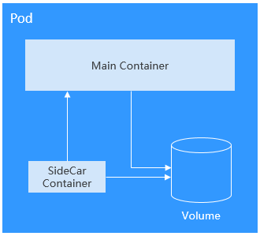
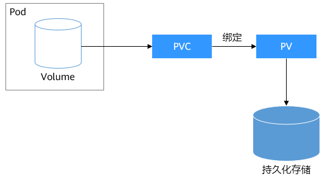
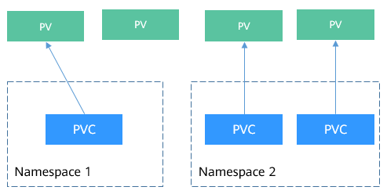

# Volume

容器中的文件在磁盘上是临时存放的，当容器重建时，容器中的文件将会丢失，另外当在一个Pod中同时运行多个容器时，常常需要在这些容器之间共享文件，这也是容器不好解决的问题。 Kubernetes抽象出了Volume来解决这两个问题，也就是存储卷，Kubernetes的Volume是Pod的一部分，Volume不是单独的对象，不能独立创建，只能在Pod中定义。

Pod中的所有容器都可以访问Volume，但必须要挂载，且可以挂载到容器中任何目录。

实际中使用容器存储如下图所示，将容器的内容挂载到Volume中，通过Volume两个容器间实现了存储共享。



Volume的生命周期与挂载它的Pod相同，但是Volume里面的文件可能在Volume消失后仍然存在，这取决于Volume的类型。

#### Volume的类型

Kubernetes的Volume有非常多的类型，在实际使用中使用最多的类型如下。

- emptyDir：一种简单的空目录，主要用于临时存储。
- hostPath：将主机某个目录挂载到容器中。
- ConfigMap、Secret：特殊类型，将Kubernetes特定的对象类型挂载到Pod，在[ConfigMap](https://support.huaweicloud.com/basics-cce/kubernetes_0020.html)和[Secret](https://support.huaweicloud.com/basics-cce/kubernetes_0021.html)章节介绍过如何将ConfigMap和Secret挂载到Volume中。
- persistentVolumeClaim：Kubernetes的持久化存储类型，详细介绍请参考[PV、PVC和StorageClass](https://support.huaweicloud.com/basics-cce/kubernetes_0030.html)中会详细介绍。

#### EmptyDir

EmptyDir是最简单的一种Volume类型，根据名字就能看出，这个Volume挂载后就是一个空目录，应用程序可以在里面读写文件，emptyDir Volume的生命周期与Pod相同，Pod删除后Volume的数据也同时删除掉。

emptyDir的一些用途：

- 缓存空间，例如基于磁盘的归并排序。
- 为耗时较长的计算任务提供检查点，以便任务能从崩溃前状态恢复执行。

emptyDir配置示例如下。

```yaml
apiVersion: v1
kind: Pod
metadata:
  name: nginx
spec:
  containers:
  - image: nginx:alpine
    name: test-container
    volumeMounts:
    - mountPath: /cache
      name: cache-volume
  volumes:
  - name: cache-volume
    emptyDir: {}
```


emptyDir实际是将Volume的内容写在Pod所在节点的磁盘上，另外emptyDir也可以设置存储介质为内存，如下所示，medium设置为Memory。

```yaml
volumes:
  - name: html
    emptyDir:
      medium: Memory
```


#### HostPath

HostPath是一种持久化存储，emptyDir里面的内容会随着Pod的删除而消失，但HostPath不会，如果对应的Pod删除，HostPath Volume里面的内容依然存在于节点的目录中，如果后续重新创建Pod并调度到同一个节点，挂载后依然可以读取到之前Pod写的内容。

HostPath存储的内容与节点相关，所以它不适合像数据库这类的应用，想象下如果数据库的Pod被调度到别的节点了，那读取的内容就完全不一样了。

记住永远不要使用HostPath存储跨Pod的数据，一定要把HostPath的使用范围限制在读取节点文件上，这是因为Pod被重建后不确定会调度哪个节点上，写文件可能会导致前后不一致。

```yaml
apiVersion: v1
kind: Pod
metadata:
  name: test-hostpath
spec:
  containers:
  - image: nginx:alpine
    name: hostpath-container
    volumeMounts:
    - mountPath: /test-pd
      name: test-volume
  volumes:
  - name: test-volume
    hostPath:
      path: /data
```


# PV、PVC和StorageClass

上一章节介绍的HostPath是一种持久化存储，但是HostPath的内容是存储在节点上，导致只适合读取。

如果要求Pod重新调度后仍然能使用之前读写过的数据，就只能使用网络存储了，网络存储种类非常多且有不同的使用方法，通常一个云服务提供商至少有块存储、文件存储、对象存储三种，如华为云的EVS、SFS和OBS。Kubernetes解决这个问题的方式是抽象了PV（PersistentVolume）和PVC（PersistentVolumeClaim）来解耦这个问题，从而让使用者不用关心具体的基础设施，当需要存储资源的时候，只要像CPU和内存一样，声明要多少即可。

- PV：PV描述的是持久化存储卷，主要定义的是一个持久化存储在宿主机上的目录，比如一个NFS的挂载目录。
- PVC：PVC描述的是Pod所希望使用的持久化存储的属性，比如，Volume存储的大小、可读写权限等等。

Kubernetes管理员设置好网络存储的类型，提供对应的PV描述符配置到Kubernetes，使用者需要存储的时候只需要创建PVC，然后在Pod中使用Volume关联PVC，即可让Pod使用到存储资源，它们之间的关系如下图所示。

图1 PVC绑定PV


#### CSI

Kubernetes提供了CSI接口（Container Storage Interface，容器存储接口），基于CSI这套接口，可以开发定制出CSI插件，从而支持特定的存储，达到解耦的目的。例如在[Namespace：资源分组](https://support.huaweicloud.com/basics-cce/kubernetes_0012.html)中看到的kube-system命名空间下everest-csi-controller和everest-csi-driver就是华为云CCE开发存储控制器和驱动。有了这些驱动就可以使用华为云上的EVS、SFS、OBS存储。

```shell
$ kubectl get po --namespace=kube-system
NAME                                      READY   STATUS    RESTARTS   AGE
everest-csi-controller-6d796fb9c5-v22df   2/2     Running   0          9m11s
everest-csi-driver-snzrr                  1/1     Running   0          12m
everest-csi-driver-ttj28                  1/1     Running   0          12m
everest-csi-driver-wtrk6                  1/1     Running   0          12m
```


#### PV

来看一下PV是如何描述持久化存储，例如在华为云SFS中创建了一个文件存储，这个文件存储ID为68e4a4fd-d759-444b-8265-20dc66c8c502，挂载地址为sfs-nas01.cn-north-4b.myhuaweicloud.com:/share-96314776。如果想在CCE中使用这个文件存储，则需要先创建一个PV来描述这个存储，如下所示。

```yaml
apiVersion: v1
kind: PersistentVolume
metadata:
  name: pv-example
spec:
  accessModes:
  - ReadWriteMany                      # 读写模式
  capacity:
    storage: 10Gi                      # 定义PV的大小
  csi:
    driver: nas.csi.everest.io         # 声明使用的驱动                   
    fsType: nfs                        # 存储类型
    volumeAttributes:
      everest.io/share-export-location: sfs-nas01.cn-north-4b.myhuaweicloud.com:/share-96314776   # 挂载地址
    volumeHandle: 68e4a4fd-d759-444b-8265-20dc66c8c502                                            # 存储ID
```


这里csi下面的内容就是华为云CCE中特定的字段，在其他地方无法使用。

下面创建这个PV并查看。

```
$ kubectl create -f pv.yaml
persistentvolume/pv-example created

$ kubectl get pv
NAME                 CAPACITY   ACCESS MODES   RECLAIM POLICY   STATUS      CLAIM    STORAGECLASS   REASON   AGE
pv-example           10Gi       RWX            Retain           Available                                    4s
```


RECLAIM POLICY是指PV的回收策略，Retain表示PVC被释放后PV继续保留。STATUS值为Available，表示PV处于可用的状态。

#### PVC

PVC可以绑定一个PV，示例如下。

```yaml
apiVersion: v1
kind: PersistentVolumeClaim
metadata:
  name: pvc-example
spec:
  accessModes:
  - ReadWriteMany
  resources:
    requests:
      storage: 10Gi              # 声明存储的大小
  volumeName: pv-example         # PV的名称
```


创建PVC并查看。

```shell
$ kubectl create -f pvc.yaml
persistentvolumeclaim/pvc-example created

$ kubectl get pvc
NAME          STATUS   VOLUME       CAPACITY   ACCESS MODES   STORAGECLASS   AGE
pvc-example   Bound    pv-example   10Gi       RWX                           9s
```


这里可以看到状态是Bound，VOLUME是pv-example，表示PVC已经绑定了PV。

再来看下PV。

```shell
$ kubectl get pv
NAME          CAPACITY   ACCESS MODES   RECLAIM POLICY   STATUS   CLAIM                  STORAGECLASS   REASON   AGE
pv-example    10Gi       RWX            Retain           Bound    default/pvc-example                            50s
```


可以看到状态也变成了Bound，CLAIM是default/pvc-example，表示这个PV绑定了default命名空间下的pvc-example这个PVC。

这里一个比较有意思的地方是CLAIM是default/pvc-example，为什么要显示default呢，这是因为PV是集群级别的资源，并不属于某个命名空间，而PVC是命名空间级别的资源，PV可以与任何命名空间的PVC资源绑定。

图2 PV与PVC


#### StorageClass

上节说的PV和PVC方法虽然能实现屏蔽底层存储，但是PV创建比较复杂（可以看到PV中csi字段的配置很麻烦），通常都是由集群管理员管理，这非常不方便。

Kubernetes解决这个问题的方法是提供动态配置PV的方法，可以自动创PV。管理员可以部署PV配置器（provisioner），然后定义对应的StorageClass，这样开发者在创建PVC的时候就可以选择需要创建存储的类型，PVC会把StorageClass传递给PV provisioner，由provisioner自动创建PV。如CCE就提供csi-disk、csi-nas、csi-obs等StorageClass，在声明PVC时加上StorageClassName，就可以自动创建PV，并自动创建底层的存储资源。


> 下面是以CCE 1.15及以上版本集群使用方法举例，1.13以及之前版本集群上使用方法有差异，具体请参见[使用kubectl创建文件存储](https://support.huaweicloud.com/usermanual-cce/cce_01_0260.html)。

执行如下命令即可查询CCE提供的默认StorageClass。您可以使用CCE提供的CSI插件自定义创建StorageClass，但从功能角度与CCE提供的默认StorageClass并无区别，这里不做过多描述。

```shell
# kubectl get sc
NAME                PROVISIONER                     AGE
csi-disk            everest-csi-provisioner         17d          # 云硬盘 StorageClass
csi-disk-topology   everest-csi-provisioner         17d          # 延迟绑定的云硬盘 StorageClass
csi-nas             everest-csi-provisioner         17d          # 文件存储 StorageClass
csi-obs             everest-csi-provisioner         17d          # 对象存储 StorageClass
csi-sfsturbo        everest-csi-provisioner         17d          # 极速文件存储 StorageClass
```


使用StorageClassName创建PVC。

```yaml
apiVersion: v1
kind: PersistentVolumeClaim
metadata:
  name:  pvc-sfs-auto-example
spec:
  accessModes:
  - ReadWriteMany
  resources:
    requests:
      storage: 10Gi
  storageClassName: csi-nas        # StorageClass
```

> 当前不支持使用csi-sfsturbo类型StorageClassName直接创建PVC。

创建PVC并查看PVC和PV。

```shell
$ kubectl create -f pvc2.yaml
persistentvolumeclaim/pvc-sfs-auto-example created

$ kubectl get pvc
NAME                   STATUS   VOLUME                                     CAPACITY   ACCESS MODES   STORAGECLASS   AGE
pvc-sfs-auto-example   Bound    pvc-1f1c1812-f85f-41a6-a3b4-785d21063ff3   10Gi       RWX            csi-nas        29s

$ kubectl get pv
NAME                                       CAPACITY   ACCESS MODES   RECLAIM POLICY   STATUS   CLAIM                         STORAGECLASS   REASON   AGE
pvc-1f1c1812-f85f-41a6-a3b4-785d21063ff3   10Gi       RWO            Delete           Bound    default/pvc-sfs-auto-example  csi-nas                 20s
```


这可以看到使用StorageClass后，不仅创建了PVC，而且创建了PV，并且将二者绑定了。

定义了StorageClass后，就可以减少创建并维护PV的工作，PV变成了自动创建，作为使用者，只需要在声明PVC时指定StorageClassName即可，这就大大减少工作量。

再次说明，StorageClassName的类型在不同厂商的产品上各不相同，这里只是使用了华为云文件存储作为示例，其余存储类型请参见[存储概述](https://support.huaweicloud.com/usermanual-cce/cce_01_0042.html)。

#### 在Pod中使用PVC

有了PVC后，在Pod中使用持久化存储就非常方便了，在Pod Template中的Volume直接关联PVC的名称，然后挂载到容器之中即可，如下所示。甚至在StatefulSet中还可以直接声明PVC，详情请参见[StatefulSet](https://support.huaweicloud.com/basics-cce/kubernetes_0015.html)。

```yaml
apiVersion: apps/v1
kind: Deployment
metadata:
  name: nginx-deployment
spec:
  selector:
    matchLabels:
      app: nginx
  replicas: 2
  template:
    metadata:
      labels:
        app: nginx
    spec:
      containers: 
      - image: nginx:alpine
        name: container-0 
        volumeMounts: 
        - mountPath: /tmp                                # 挂载路径
          name: pvc-sfs-example 
      restartPolicy: Always 
      volumes: 
      - name: pvc-sfs-example 
        persistentVolumeClaim: 
          claimName:  pvc-example                       # PVC的名称
```