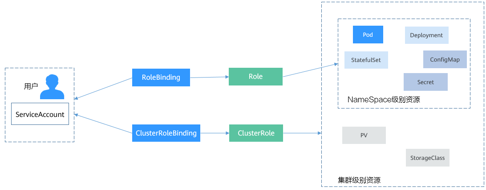

# ServiceAccount

Kubernetes中所有的访问，无论外部内部，都会通过API Server处理，访问Kubernetes资源前需要经过认证与授权。

- Authentication：用于识别用户身份的认证，Kubernetes分外部服务帐号和内部服务帐号，采取不同的认证机制，具体请参见[认证与ServiceAccount](https://support.huaweicloud.com/basics-cce/kubernetes_0032.html#kubernetes_0032__section12514659132115)。
- Authorization：用于控制用户对资源访问的授权，对访问的授权目前主要使用RBAC机制，将在[RBAC](https://support.huaweicloud.com/basics-cce/kubernetes_0033.html)介绍。

图1 API Server的认证授权


#### 认证与ServiceAccount

Kubernetes的用户分为服务帐户（ServiceAccount）和普通帐户两种类型。

- 服务帐户与Namespace绑定，关联一套凭证，存储在Secret中，Pod创建时挂载Secret，从而允许与API Server之间调用。
- Kubernetes中没有代表普通帐户的对象，这类帐户默认由外部服务独立管理，比如在华为云上CCE的用户是由IAM管理的。

普通帐号并不是这里要讨论的内容，这里主要关注ServiceAccount。

ServiceAccount同样是Kubernetes中的资源，与Pod、ConfigMap类似，且作用于独立的命名空间，也就是ServiceAccount是属于命名空间级别的，创建命名空间时会自动创建一个名为default的ServiceAccount。

使用下面命令可以查看ServiceAccount。

```shell
$ kubectl get sa
NAME     SECRETS   AGE
default  1         30d
```


同时Kubernetes还会为ServiceAccount自动创建一个Secret，使用下面命令可以查看到。

```shell
$ kubectl describe sa default
Name:                default
Namespace:           default
Labels:              <none>
Annotations:         <none>
Image pull secrets:  <none>
Mountable secrets:   default-token-vssmw
Tokens:              default-token-vssmw
Events:              <none>
```


在Pod的定义文件中，可以用指定帐户名称的方式将一个ServiceAccount赋值给一个Pod，如果不指定就会使用默认的ServiceAccount。当API Server接收到一个带有认证Token的请求时，API Server会用这个Token来验证发送请求的客户端所关联的ServiceAccount是否允许执行请求的操作。

#### 创建ServiceAccount

使用如下命令就可以创建ServiceAccount：

```shell
$ kubectl create serviceaccount sa-example
serviceaccount/sa-example created

$ kubectl get sa
NAME            SECRETS   AGE
default         1         30d
sa-example      1         2s
```


可以看到已经创建了与ServiceAccount相关联的Token。

```shell
$ kubectl describe sa sa-example
Name:                sa-example
Namespace:           default
Labels:              <none>
Annotations:         <none>
Image pull secrets:  <none>
Mountable secrets:   sa-example-token-c7bqx
Tokens:              sa-example-token-c7bqx
Events:              <none>
```


查看Secret的内容，可以发现ca.crt、namespace和token三个数据。

```shell
$ kubectl describe secret sa-example-token-c7bqx
Name:         sa-example-token-c7bqx
...
Data
====
ca.crt:     1082 bytes
namespace:  7 bytes
token:      <Token的内容>
```


#### 在Pod中使用ServiceAccount

Pod中使用ServiceAccount非常方便，只需要指定ServiceAccount的名称即可。

```yaml
apiVersion: v1
kind: Pod
metadata:
  name: sa-example
spec:  
  serviceAccountName: sa-example
  containers:
  - image: nginx:alpine             
    name: container-0               
    resources:                      
      limits:
        cpu: 100m
        memory: 200Mi
      requests:
        cpu: 100m
        memory: 200Mi
  imagePullSecrets:            
  - name: default-secret
```


创建并查看这个Pod，可以看到Pod挂载了sa-example-token-c7bqx，也就是sa-example这个ServiceAccount对应的Token，即Pod使用这个Token来做认证。

```shell
$ kubectl create -f sa-pod.yaml
pod/sa-example created

$ kubectl get pod
NAME                                       READY   STATUS              RESTARTS   AGE
sa-example                                 0/1     running             0          5s

$ kubectl describe pod sa-example
...
Containers:
  sa-example:
    Mounts:
      /var/run/secrets/kubernetes.io/serviceaccount from sa-example-token-c7bqx (ro)
```


进入Pod内部，还可以看到对应的文件，如下所示。

```shell
$ kubectl exec -it sa-example -- /bin/sh
/ # cd /run/secrets/kubernetes.io/serviceaccount
/run/secrets/kubernetes.io/serviceaccount # ls
ca.crt     namespace  token
```


如上，在容器应用中，就可以使用ca.crt和Token来访问API Server。

下面来验证一下认证是否能生效。在Kubernetes集群中，默认为API Server创建了一个名为kubernetes的Service，通过这个Service可以访问API Server。

```shell
$ kubectl get svc
NAME           TYPE        CLUSTER-IP       EXTERNAL-IP   PORT(S)          AGE
kubernetes     ClusterIP   10.247.0.1       <none>        443/TCP          34
```


进入Pod，使用curl命令直接访问会得到如下返回信息，表示并没有权限。

```shell
$ kubectl exec -it sa-example -- /bin/sh
/ # curl https://kubernetes
curl: (60) SSL certificate problem: unable to get local issuer certificate
More details here: https://curl.haxx.se/docs/sslcerts.html

curl failed to verify the legitimacy of the server and therefore could not
establish a secure connection to it. To learn more about this situation and
how to fix it, please visit the web page mentioned above.
```


使用ca.crt和Token做认证，先将ca.crt放到CURL_CA_BUNDLE这个环境变量中，curl命令使用CURL_CA_BUNDLE指定证书；再将Token的内容放到TOKEN中，然后带上TOKEN访问API Server。

```json
# export CURL_CA_BUNDLE=/var/run/secrets/kubernetes.io/serviceaccount/ca.crt
# TOKEN=$(cat /var/run/secrets/kubernetes.io/serviceaccount/token)
# curl -H "Authorization: Bearer $TOKEN" https://kubernetes
{
  "kind": "Status",
  "apiVersion": "v1",
  "metadata": {

  },
  "status": "Failure",
  "message": "forbidden: User \"system:serviceaccount:default:sa-example\" cannot get path \"/\"",
  "reason": "Forbidden",
  "details": {

  },
  "code": 403
}
```


可以看到，已经能够通过认证了，但是API Server返回的是cannot get path \"/\""，表示没有权限访问，这说明还需要得到授权后才能访问，授权机制将在[RBAC](https://support.huaweicloud.com/basics-cce/kubernetes_0033.html)中介绍。


# RBAC

#### RBAC资源

Kubernetes中完成授权工作的就是RBAC机制，RBAC授权规则是通过四种资源来进行配置。

- Role：角色，其实是定义一组对Kubernetes资源（命名空间级别）的访问规则。
- RoleBinding：角色绑定，定义了用户和角色的关系。
- ClusterRole：集群角色，其实是定义一组对Kubernetes资源（集群级别，包含全部命名空间）的访问规则。
- ClusterRoleBinding：集群角色绑定，定义了用户和集群角色的关系。

Role和ClusterRole指定了可以对哪些资源做哪些动作，RoleBinding和ClusterRoleBinding将角色绑定到特定的用户、用户组或[ServiceAccount](https://support.huaweicloud.com/basics-cce/kubernetes_0032.html)上。如下图所示。

图1 角色绑定



#### 创建Role

Role的定义非常简单，指定namespace，然后就是rules规则。如下面示例中的规则就是允许对default命名空间下的Pod进行GET、LIST操作。

```yaml
kind: Role
apiVersion: rbac.authorization.k8s.io/v1
metadata:
  namespace: default                          # 命名空间
  name: role-example
rules:
- apiGroups: [""]
  resources: ["pods"]                         # 可以访问pod
  verbs: ["get", "list"]                      # 可以执行GET、LIST操作
```


#### 创建RoleBinding

有了Role之后，就可以将Role与具体的用户绑定起来，实现这个的就是RoleBinding了。如下所示。

```yaml
kind: RoleBinding
apiVersion: rbac.authorization.k8s.io/v1
metadata:
  name: rolebinding-example
  namespace: default
subjects:                                 # 指定用户
- kind: User                              # 普通用户
  name: user-example
  apiGroup: rbac.authorization.k8s.io
- kind: ServiceAccount                    # ServiceAccount
  name: sa-example
  namespace: default
roleRef:                                  # 指定角色
  kind: Role
  name: role-example
  apiGroup: rbac.authorization.k8s.io
```


这里的subjects就是将Role与用户绑定起来，用户可以是外部普通用户，也可以是ServiceAccount，这两种用户类型在[ServiceAccount](https://support.huaweicloud.com/basics-cce/kubernetes_0032.html)有过介绍。绑定后的关系如下图所示。

图2 RoleBinding绑定Role和用户


下面来验证一下授权是否生效。

在前面一个章节[使用ServiceAccount](https://support.huaweicloud.com/basics-cce/kubernetes_0032.html#kubernetes_0032__section491412355312)中，创建一个Pod，使用了sa-example这个ServiceAccount，而刚刚又给sa-example绑定了role-example这个角色，现在进入到Pod，使用curl命令通过API Server访问资源来验证权限是否生效。

使用sa-example对应的ca.crt和Token认证，查询default命名空间下所有Pod资源，对应[创建Role](https://support.huaweicloud.com/basics-cce/kubernetes_0033.html#kubernetes_0033__section1940452173615)中的LIST。

```json
$ kubectl exec -it sa-example -- /bin/sh 
# export CURL_CA_BUNDLE=/var/run/secrets/kubernetes.io/serviceaccount/ca.crt
# TOKEN=$(cat /var/run/secrets/kubernetes.io/serviceaccount/token)
# curl -H "Authorization: Bearer $TOKEN" https://kubernetes/api/v1/namespaces/default/pods
{
  "kind": "PodList",
  "apiVersion": "v1",
  "metadata": {
    "selfLink": "/api/v1/namespaces/default/pods",
    "resourceVersion": "10377013"
  },
  "items": [
    {
      "metadata": {
        "name": "sa-example",
        "namespace": "default",
        "selfLink": "/api/v1/namespaces/default/pods/sa-example",
        "uid": "c969fb72-ad72-4111-a9f1-0a8b148e4a3f",
        "resourceVersion": "10362903",
        "creationTimestamp": "2020-07-15T06:19:26Z"
      },
      "spec": {
...
```


返回结果正常，说明sa-example是有LIST Pod的权限的。再查询一下Deployment，返回如下，说明没有访问Deployment的权限。

```
# curl -H "Authorization: Bearer $TOKEN" https://kubernetes/api/v1/namespaces/default/deployments
...
  "status": "Failure",
  "message": "deployments is forbidden: User \"system:serviceaccount:default:sa-example\" cannot list resource \"deployments\" in API group \"\" in the namespace \"default\"",
...
```


Role和RoleBinding作用的范围是命名空间，能够做到一定程度的权限隔离，如下图所示，上面定义role-example就不能访问kube-system命名空间下的资源。

图3 Role和RoleBinding作用的范围是命名空间


在上面Pod中继续访问，返回如下，说明确实没有权限。

```yaml
# curl -H "Authorization: Bearer $TOKEN" https://kubernetes/api/v1/namespaces/kube-system/pods
...
  "status": "Failure",
  "message": "pods is forbidden: User \"system:serviceaccount:default:sa-example\" cannot list resource \"pods\" in API group \"\" in the namespace \"kube-system\"",
  "reason": "Forbidden",
...
```


在RoleBinding中，还可以绑定其他命名空间的ServiceAccount，只要在subjects字段下添加其他命名空间的ServiceAccount即可。

```yaml
subjects:                                 # 指定用户
- kind: ServiceAccount                    # ServiceAccount
  name: kube-sa-example
  namespace: kube-system
```


加入之后，kube-system下kube-sa-example这个ServiceAccount就可以GET、LIST命名空间default下的Pod了，如下图所示。

图4 跨命名空间访问


#### ClusterRole和ClusterRoleBinding

相比Role和RoleBinding，ClusterRole和ClusterRoleBinding有如下几点不同：

- ClusterRole和ClusterRoleBinding不用定义namespace字段
- ClusterRole可以定义集群级别的资源

可以看出ClusterRole和ClusterRoleBinding控制的是集群级别的权限。

在Kubernetes中，默认定义了非常多的ClusterRole和ClusterRoleBinding，如下所示。

```shell
$ kubectl get clusterroles
NAME                                                                   AGE
admin                                                                  30d
cceaddon-prometheus-kube-state-metrics                                 6d3h
cluster-admin                                                          30d
coredns                                                                30d
custom-metrics-resource-reader                                         6d3h
custom-metrics-server-resources                                        6d3h
edit                                                                   30d
prometheus                                                             6d3h
system:aggregate-customedhorizontalpodautoscalers-admin                6d2h
system:aggregate-customedhorizontalpodautoscalers-edit                 6d2h
system:aggregate-customedhorizontalpodautoscalers-view                 6d2h
....
view                                                                   30d

$ kubectl get clusterrolebindings
NAME                                                   AGE
authenticated-access-network                           30d
authenticated-packageversion                           30d
auto-approve-csrs-for-group                            30d
auto-approve-renewals-for-nodes                        30d
auto-approve-renewals-for-nodes-server                 30d
cceaddon-prometheus-kube-state-metrics                 6d3h
cluster-admin                                          30d
cluster-creator                                        30d
coredns                                                30d
csrs-for-bootstrapping                                 30d
system:basic-user                                      30d
system:ccehpa-rolebinding                              6d2h
system:cluster-autoscaler                              6d1h
...
```


其中，最重要最常用的是如下四个ClusterRole。

- view：拥有查看命名空间资源的权限
- edit：拥有修改命名空间资源的权限
- admin：拥有命名空间全部权限
- cluster-admin：拥有集群的全部权限

使用**kubectl describe clusterrole**命令能够查看到各个规则的具体权限。

通常情况下，使用这四个ClusterRole与用户做绑定，就可以很好的做到权限隔离。这里的关键一点是理解到Role（规则、权限）与用户是分开的，只要通过Rolebinding来对这两者进行组合就能做到灵活的权限控制。