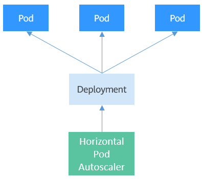

# 弹性伸缩

在[Pod的编排与调度](https://support.huaweicloud.com/basics-cce/kubernetes_0013.html)章节介绍了Deployment这类控制器来控制Pod的副本数量，通过调整replicas的大小就可以达到给应用手动扩缩容的目的。但是在某些实际场景下，手动调整一是繁琐，二是速度没有那么快，尤其是在应对流量洪峰需要快速弹性时无法做出快速反应。

Kubernetes支持Pod和集群节点的自动弹性伸缩，通过设置弹性伸缩规则，当外部条件（如CPU使用率）达到一定条件时，根据规则自动伸缩Pod和集群节点。

#### Prometheus与Metrics Server

想要做到自动弹性伸缩，先决条件就是能感知到各种运行数据，例如集群节点、Pod、容器的CPU、内存使用率等等。而这些数据的监控能力Kubernetes也没有自己实现，而是通过其他项目来扩展Kubernetes的能力。

- [Prometheus](https://prometheus.io/)是一套开源的系统监控报警框架，能够采集丰富的Metrics（度量数据），目前已经基本是Kubernetes的标准监控方案。
- [Metrics Server](https://github.com/kubernetes-sigs/metrics-server)是Kubernetes集群范围资源使用数据的聚合器。Metrics Server从kubelet公开的Summary API中采集度量数据，能够收集包括了Pod、Node、容器、Service等主要Kubernetes核心资源的度量数据，且对外提供一套标准的API。

使用HPA（Horizontal Pod Autoscaler）配合Metrics Server可以实现基于CPU和内存的自动弹性伸缩，再配合Prometheus还可以实现[自定义监控指标](https://github.com/kubernetes/community/blob/master/contributors/design-proposals/instrumentation/custom-metrics-api.md)的自动弹性伸缩。

#### HPA工作机制

HPA（Horizontal Pod Autoscaler）是用来控制Pod水平伸缩的控制器，HPA周期性检查Pod的度量数据，计算满足HPA资源所配置的目标数值所需的副本数量，进而调整目标资源（如Deployment）的replicas字段。

图1 HPA工作机制


HPA可以配置单个和多个度量指标，配置单个度量指标时，只需要对Pod的当前度量数据求和，除以期望目标值，然后向上取整，就能得到期望的副本数。例如有一个Deployment控制有3个Pod，每个Pod的CPU使用率是70%、50%、90%，而HPA中配置的期望值是50%，计算期望副本数=（70 + 50 + 90）/50 = 4.2，向上取整得到5，即期望副本数就是5。

如果是配置多个度量指标，则会分别计算单个度量指标的期望副本数量，然后取其中最大值，就是最终的期望副本数量。

#### 使用HPA

下面通过示例演示HPA的使用。首先使用Nginx镜像创建一个4副本的Deployment。

```shell
$ kubectl get deploy
NAME               READY     UP-TO-DATE   AVAILABLE   AGE
nginx-deployment   4/4       4            4           77s

$ kubectl get pods
NAME                                READY     STATUS    RESTARTS   AGE
nginx-deployment-7cc6fd654c-5xzlt   1/1       Running   0          82s
nginx-deployment-7cc6fd654c-cwjzg   1/1       Running   0          82s
nginx-deployment-7cc6fd654c-dffkp   1/1       Running   0          82s
nginx-deployment-7cc6fd654c-j7mp8   1/1       Running   0          82s
```


创建一个HPA，期望CPU的利用率为70%，副本数的范围是1-10。

```yaml
apiVersion: autoscaling/v2beta1
kind: HorizontalPodAutoscaler
metadata:
  name: scale
  namespace: default
spec:
  maxReplicas: 10                    # 目标资源的最大副本数量
  minReplicas: 1                     # 目标资源的最小副本数量
  metrics:                           # 度量指标，期望CPU的利用率为70%
  - resource:
      name: cpu
      targetAverageUtilization: 70
    type: Resource
  scaleTargetRef:                    # 目标资源
    apiVersion: apps/v1
    kind: Deployment
    name: nginx-deployment
```


创建后HPA查看。

```shell
$ kubectl create -f hpa.yaml
horizontalpodautoscaler.autoscaling/celue created

$ kubectl get hpa
NAME      REFERENCE                     TARGETS   MINPODS   MAXPODS   REPLICAS   AGE
scale     Deployment/nginx-deployment   0%/70%    1         10        4          18s
```


可以看到，TARGETS的期望值是70%，而实际是0%，这就意味着HPA会做出缩容动作，期望副本数量=(0+0+0+0)/70=0，但是由于最小副本数为1，所以Pod数量会调整为1。等待一段时间，可以看到Pod数量变为1。

```shell
$ kubectl get pods
NAME                                READY     STATUS    RESTARTS   AGE
nginx-deployment-7cc6fd654c-5xzlt   1/1       Running   0          7m41s
```


查看HPA详情，可以在Events里面看到这样一条记录。这表示HPA在21秒前成功的执行了缩容动作，新的Pod数量为1，原因是所有度量数量都比目标值低。

```shell
$ kubectl describe hpa scale
...
Events:
  Type    Reason             Age   From                       Message
  ----    ------             ----  ----                       -------
  Normal  SuccessfulRescale  21s   horizontal-pod-autoscaler  New size: 1; reason: All metrics below target
```


如果再查看Deployment的详情，可以在Events里面看到这样一条记录。这表示Deployment的副本数量被设置为1了，跟HPA中看到的一致。

```shell
$ kubectl describe deploy nginx-deployment
...
Events:
  Type    Reason             Age   From                   Message
  ----    ------             ----  ----                   -------
  Normal  ScalingReplicaSet  7m    deployment-controller  Scaled up replica set nginx-deployment-7cc6fd654c to 4
  Normal  ScalingReplicaSet  1m    deployment-controller  Scaled down replica set nginx-deployment-7cc6fd654c to 1
```


#### Cluster AutoScaler

HPA是针对Pod级别的，但是如果集群的资源不够了，那就只能对节点进行扩容了。集群节点的弹性伸缩本来是一件非常麻烦的事情，但是好在现在的集群大多都是构建在云上，云上可以直接调用接口添加删除节点，这就使得集群节点弹性伸缩变得非常方便。

[Cluster Autoscaler](https://github.com/kubernetes/autoscaler/tree/master/cluster-autoscaler)是Kubernetes提供的集群节点弹性伸缩组件，根据Pod调度状态及资源使用情况对集群的节点进行自动扩容缩容。由于要调用云上接口实现弹性伸缩，这就使得在不同环境上的实现与使用各不相同，这里不详细介绍。

华为云CCE的集群节点弹性伸缩请参见[创建节点伸缩策略](https://support.huaweicloud.com/usermanual-cce/cce_01_0209.html)。