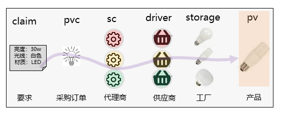
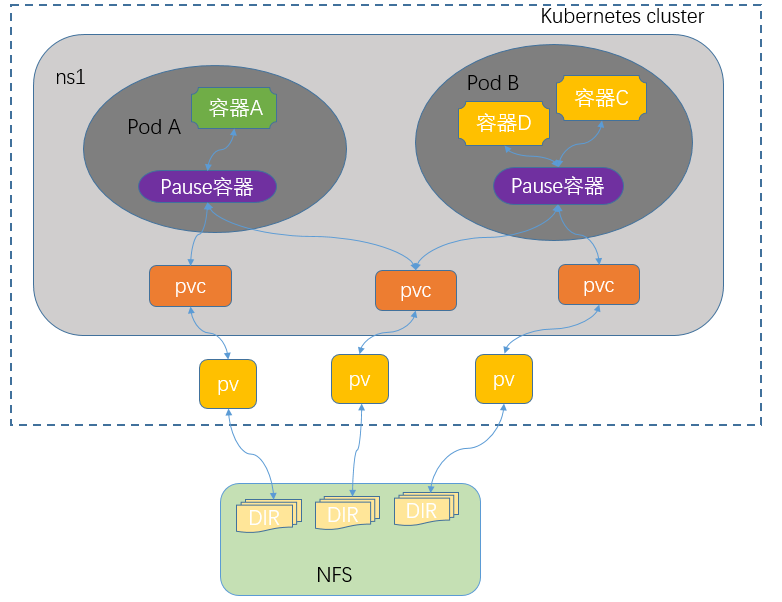
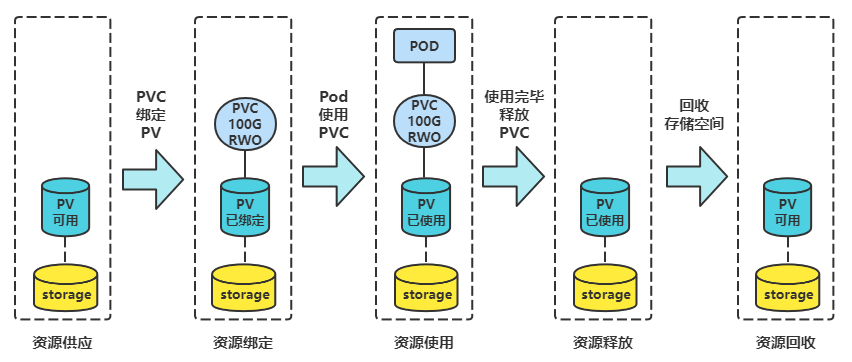
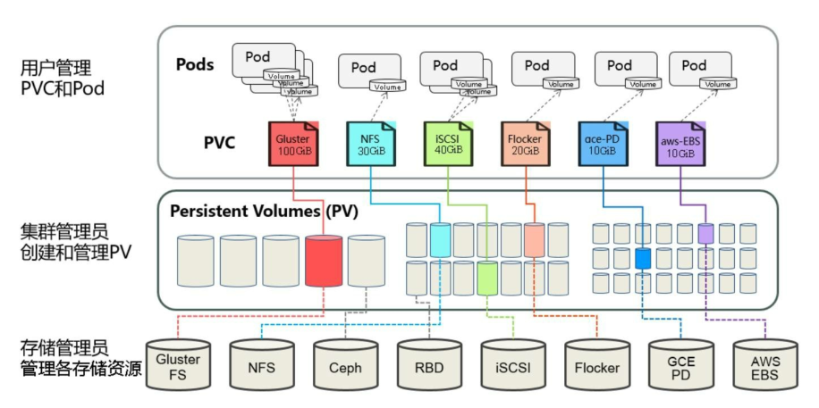
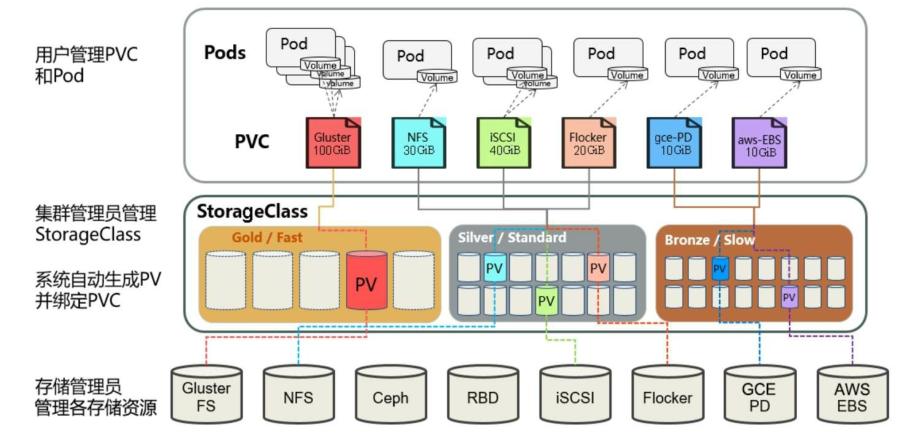
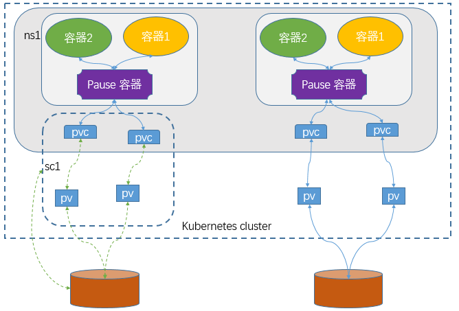
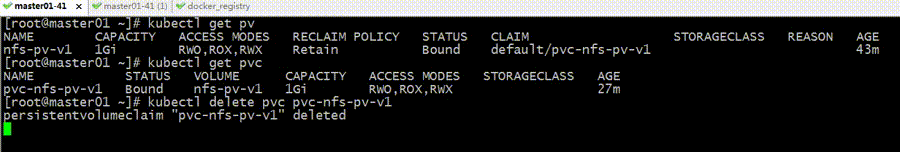

# 持久存储卷

## 一、PV/PVC/SC概念介绍

PersistentVolume：简称pv，持久化存储，是k8s为云原生应用提供一种拥有独立生命周期的、用户可管理的存储的抽象设计。

PersistentVolumeClaim：简称pvc，持久化存储声明，是k8s为解耦云原生应用和数据存储而设计的，通过pvc可以让资源管控更细更灵活、应用模板更通用。

StorageClass：简称sc，存储类，是k8s平台为存储提供商提供存储接入的一种声明。通过sc和相应的存储插件(csi)为容器应用提供持久存储卷的能力。




## pv & pvc介绍

volume的基础使用，需要我们用户手动来向不同类型存储接口传递不同的参数，从而实现把外部存储映射到k8s上的一个volume对象，使得pod才能正常的挂载对应的存储卷，对应pod里的容器才能正常使用；这种使用方式的前提是用户必须了解对应的存储系统，了解对应类型的存储接口，以及相关参数；这使得用户在k8s上使用存储卷变得有些复杂；为了简化这一过程，在k8s上使用pv和pvc资源来把对应底层存储接口给隐藏了，用户使用存储卷不再关心底层存储系统接口；不管底层是那种类型的存储，用户只需面对一个pvc接口即可；

PV、PVC和K8s集群以及pod的关系



提示：用户在创建pod时使用存储卷只需要关心对应名称空间的pvc对象；而对应pv是需要集群管理管理员定义；后端存储是专门的存储管理员负责管理；pv是k8s上的一种标准资源，全称叫做PersistentVolume翻译成中文就是持久存储卷；它主要作用是把后端存储中的某个逻辑单元，映射为k8s上的pv资源；pv是集群级别的资源；任意名称空间都可以直接关联某一个pv；关联pv的过程我们叫做绑定pv；而对应名称空间关联某一pv需要使用pvc资源来定义；pvc全称PersistentVolumeClaim的缩写，意思就是持久存储卷申请；在一个名称空间下创建一个pvc就是把对应名称空间同集群上的某一pv做绑定；一旦一个名称空间绑定了一个pv后，对应的pv就会从available状态转变成bond状态，其他名称空间将不能再使用，只有对应pv是available状态才能正常的被其他名称空间关联绑定；简单讲pvc和pv的关系是一一对应的，一个pv只能对应一个pvc；至于同一名称空间下的多个pod是否能够同时使用一个PVC取决pv是否允许多路读写，对应pv是否支持多路读写取决后端存储系统；不同类型的存储系统，对应访问模式也有所不同。

访问模式有三种:

* 单路读写(ReadWriteOnce简称RWO)

* 多路读写(ReadWriteMany简称RWX)

* 多路只读(ReadOnlyMany简称ROX)

  

## 二、PV和PVC生命周期

我们可以将PV看作可用的存储资源，PVC则是对存储资源的需求，PV和PVC的相互关系遵循如下图所示



### 1、资源供给(Provisioning)

Kubernetes支持两种资源的供应模式：静态模式（Static）和动态模式（Dynamic）。资源供应的结果就是创建好的PV。

* **静态模式：**集群管理员手工创建许多PV，在定义PV时需要将后端存储的特性进行设置。

* **动态模式：**集群管理员无须手工创建PV，而是通过StorageClass的设置对后端存储进行描述，标记为某种类型。此时要求PVC对存储的类型进行声明，系统将自动完成PV的创建及与PVC的绑定。PVC可以声明Class为""，说明该PVC禁止使用动态模式。

### 2、资源绑定(Binding)

​		在用户定义好PVC之后，系统将根据PVC对存储资源的请求（存储空间和访问模式）在已存在的PV中选择一个满足PVC要求的PV，一旦找到，就将该PV与用户定义的PVC进行绑定，用户的应用就可以使用这个PVC了。

​		如果在系统中没有满足PVC要求的PV，PVC则会无限期处于Pending状态，直到等到系统管理员创建了一个符合其要求的PV。PV一旦绑定到某个PVC上，就会被这个PVC独占，不能再与其他PVC进行绑定了。

​		在这种情况下，当PVC申请的存储空间比PV的少时，整个PV的空间就都能够为PVC所用，可能会造成资源的浪费。如果资源供应使用的是动态模式，则系统在为PVC找到合适的StorageClass后，将自动创建一个PV并完成与PVC的绑定。


  在用户定义好 PVC 之后，系统将根据 PVC 对存储资源的请求（存储空间和访问模式）在己存在的 PV 中选择一个满足 PVC 要求的 PV，一旦找到，就将该 PV 与用户定义的 PVC 进行绑定，然后用户的应用就可以使用这个 PVC 了。如果 PV 是为一个 PVC 动态配置的，那么将始终把该 PV 绑定到 PVC。

  PV 一旦绑定到某个 PVC 上，就被这个 PVC 独占，不能再与其他 PVC 进行绑定了，PVC 到 PV 的绑定是一对一对应的。
  当 PVC 申请的存储空间比 PV 少时，用户将得到他们所申请的容量，但 PV 容量可能会超过其所申请的，这可能会造成资源的浪费。
  如果系统中没有满足 PVC 要求的 PV，绑定不会成功，PVC 会无限期处于 Pending 状态，直到等到系统管理员创建了一个符合其要求的 PV。例如，配置了 50Gi PV 的集群与请求 100Gi 的 PVC 不匹配，当将 100Gi PV 添加到集群中时，PVC 就可以被绑定。

### 3、资源使用(using)

​		Pod使用Volume的定义，将PVC挂载到容器内的某个路径进行使用。Volume的类型为”persistentVolumeClaim“。在后面的示例中再进行详细说明。在容器应用挂载了一个PVC后，就能被持续独占使用。不过，多个Pod可以挂载同一个PVC，应用程序需要考虑多个实例共同访问一块存储空间的问题。

* 存储使用(using)

  POD资源基于persistentVolumeClaim卷类型的定义、将选择定的PVC关联为存储卷、而后即可为内部的容器所使用、对于支持多种访问模式的存储卷来说、用户需要额外指定要使用的模式
  一旦完成将存储卷挂载值POD对象内的容器中，其应用即可使用关联的PV提供的存储空间

* PVC保护(partition)

  有用户删除了仍处于某pod资源使用中的PVC时，Kubernetes不会立即予以移除、而是推迟到不再被任何pod资源使用后方才执行删除操作处于此种阶段的PVC资源的status字段为"termination"
  并且其Finalizers字段中包含"kubernetes.io/pvc-protection"

### 4、资源释放(Releasing)

​		当用户对存储资源使用完毕后，用户可以删除PVC，与该PVC绑定的PV将会被标记为“已释放”，但还不能立刻与其他PVC进行绑定。通过之前PVC写入的数据可能还被留在存储设备上，只有在清除之后该PV才能再次使用。

​		如果用户删除了 Pod 正在使用的 PVC，该 PVC 不会立即删除，PVC 的移除将会被推迟，直到 PVC 不再被任何 Pod 主动使用。同样，如果管理员删除绑定到 PVC 的 PV，也不会立即删除 PV，它移除将被推迟，直到 PV 不再绑定到 PVC。
  这是由 Storage Object in Use Protection 功能维系的，它目的是确保 Pod 正在使用的 PVC 和绑定到 PVC 的 PV 不会从系统中删除，因为这可能会导致数据丢失。

### 5、存储回收(Reclaiming)

​		对于PV，管理员可以设定回收策略（Reclaim Policy），用于设置与之绑定的PVC释放资源之后如何处理遗留数据的问题。只有PV的存储空间完成回收，才能供新的PVC绑定和使用。

​		回收策略详见下节的说明。下面通过两张图分别对在静态资源供应模式和动态资源供应模式下，PV、PVC、StorageClass及Pod使用PVC的原理进行说明。

下图描述了在静态资源供应模式下，通过PV和PVC完成绑定，并供Pod使用的存储管理机制。



下图描述了在动态资源供应模式下，通过StorageClass和PVC完成资源动态绑定（系统自动生成PV），并供Pod使用的存储管理机制



* 留存(Retain)

  留存策略意味着在删除PVC之后、kubernetes系统不会自动删除PV，而仅仅是将它置于"释放(releases)状态"、不过，此种状态的PV尚且不能被其他PVC申请所绑定、因为此前的申请生成的数据仍然存在，
  需要由管理员手动决定其后续处理方案。这就意味着，如果想要再次使用此类的PV资源、则需要由管理员按下面的步骤手动执行删除操作

  ```perl
  删除PV,这折后，此PV的数据依然留存于外部的存储智商
  手工清理存储系统上依然留存的数学
  手工删除存储系统级的存储卷(例如：RBD存储系统山过的images)以释放空间、以便再次创建、或者直接将其重新创建为PV
  ```

* 回收( Recycle)

  如果可被底层存储插件支持，资源回收策略会在存储卷商执行数据删除操作并让PV资源再次变为可被Claim.另外、管理元也可以配制一个自定义的回收器POD模板、以便执行自定义的回收操作、不过、此种回收策略行将废弃

* 删除(delete)

  对于支持Delete回收策略的存储插件来说、在PVC被删除后会直接移除PV对象、同时移除的还有PV相关的外部存储系统上的存储资产(asset)、支持这种操作的存储系统有AWS EBS、GCE PD、Azure Disk或Cinder。动态创建的PV资源的回收策略屈居于相关存储类上的定义、存储类上相关的默认策略为delete、大多数情况下、管理元都需要按用户期望的处理机制修改此默认策略、以免导致数据费计划内的误删除


## 三、PV
  PV 作为存储资源，主要包括存储能力、卷模式、访问模式、存储类型、回收策略、后端存储类型 关键信息的设置。
  我们来看一个 PV 例子，其具有以下属性：5G 的存储空间、卷模式为文件系统、访问模式为 ReadWriteOnce、回收策略为 Recycle、存储类型为 slow（要求系统中己存在名为 slow 的 StorageClass）、几个挂载选项、后端储存类型为 NFS。

```yaml
apiVersion: v1
kind: PersistentVolume
metadata:
  name: pv0003
spec:
  capacity:
    storage: 5Gi            # 5G 的存储空间
  volumeMode: Filesystem    # 卷模式，文件系统模式
  accessModes:              
    - ReadWriteOnce         # 访问模式为 ReadWriteOnce
  persistentVolumeReclaimPolicy: Recycle    # 回收策略为 Recycle
  storageClassName: slow    # 存储类型为 slow（要求系统中己存在名为 slow 的 StorageClass）
  mountOptions:             # 挂载选项
    - hard
    - nfsvers=4.1
  nfs:                      # NFS Server 的 IP 地址和路径
    path: /tmp
    server: 172.17.0.2
```

 

### 1、类型
PersistentVolume 类型作为插件实现，Kubernetes 目前支持以下插件：

```yaml
• awsElasticBlockStore：AWS 公有云提供的 ElasticBlockStore
• gcePersistentDisk：GCE 公有云提供的 PersistentDisk
• azureDisk：Azure 公有云提供 Disk
• azureFile：Azure 公有云提供的 File
• fc：Fibre Channel (FC) storage
• csi：Container Storage Interface (CSI)
• vsphereVolume：vSphere VMDK volume
• rbd：Rados Block Device (RBD) volume，Ceph块储存
• cephfs
• glusterfs
• flexVolume
• portworxVolume
• iscsi：iSCSI 存储
• nfs：网络文件系统 (NFS) 存储
• local：安装在节点上的本地存储设备。
• hostPath：HostPath 卷（仅用于单节点测试，不适用于多节点集群，考虑使用 local 卷代替）
```


### 2、存储能力（Capacity)

  通常，PV 将具有特定的存储容量，这是由 PV 的 capacity 属性设置的。目前，存储大小是唯一可以设置或请求的资源，未来的属性可能包括 IOPS、吞吐量等。
 

### 3、卷模式（Volume Mode）
  Kubernetes 支持两种卷模式：Filesystem 和 Block，Filesystem 是 volumeMode 参数省略时使用的默认模式。

Filsystem：这种模式卷会被挂载到 Pod 中的一个目录上。如果卷由块设备支持并且设备是空的，Kubernetes 会在第一次挂载之前在设备上创建一个文件系统。
Block：将卷用作原始块设备，这种模式下卷将作为块设备呈现在 Pod 中，其上没有任何文件系统。
 
### 4、访问模式（Access Modes)
可以对 PV 进行访问模式的设置，用于设置用户对存储资源的访问的权限。访问模式如下：

```yaml
• ReadWriteOnce（RWO）：读写权限，只允许最多一个节点挂载。
• ReadOnlyMany（ROX）：只读权限，允许被多个节点挂载。
• ReadWriteMany（RWX）：读写权限，允许被多个节点挂载。
• ReadWriteOncePod（RWOP）：读写权限，只允许一个Pod挂载，这仅支持 CSI 卷和 Kubernetes 1.22+ 版。
```

  注意。一个卷一次只能使用一种访问模式挂载，即使它支持多种访问模式。例如，GCEPersistentDisk 可以由单个节点挂载为 ReadWriteOnce 或由多个节点挂载为 ReadOnlyMany，但不能同时挂载。
  不同的存储提供者支持不同的访问模式，在 PV 的定义时需要与它们匹配，具体支持哪些请查阅官方文档
 

### 5、存储类别（Class)
  PV 可以设定其存储的类别（Class），通过 storageClassName 参数指定 StorageClass 资源对象的名称。具有特定类别的 PV 只能与请求了该类别的 PVC 进行绑定。未设定类别的 PV 则只能与不请求任何类别的 PVC 进行绑定。
 

### 6、回收策略（Reclaim Policy）
目前的支持的回收策略：

```yaml
• Retain（保留）：保留数据，需要手工处理    
• Recycle（回收）：简单清除文件的操作（例如执行 rm -rf /thevolume/* 命令）。
• Delete（删除）： 将从 Kubernetes 中删除 PV 对象，以及外部基础设施中相关的存储资产，例如 AWS EBS、GCE PD、Azure disk。
```

目前只有 NFS 和 HostPath 支持回收。AWS EBS、GCE PD 和 Azure Disk 支持删除。
 

### 7、挂载选项（Mount Options）

在将 PV 挂载到一个 Node 上时，可以根据后端存储的特点设置挂载选项，并非所有 PV 类型都支持挂载选项。
以下类型支持挂载选项：

```yaml
• AWSElasticBlockStore
• AzureDisk
• AzureFile
• CephFS
• GCEPersistentDisk
• Glusterfs
• NFS
• RBD (Ceph Block Device)
• VsphereVolume
• iSCSI
```

 

### 8、阶段（Phase)
某个 PV 在生命周期中，可能会将处于以下阶段之一：

```yaml
• Available：可用状态，还未与某个 PVC 绑定。 
• Bound：绑定状态，己与某个 PVC 绑定。 
• Released：绑定的 PVC 已经删除，资源己释放，但没有被集群回收
• Failed：自动资源回收失败。
```

CLI 将显示绑定到 PV 的 PVC 的名称。
 

## 四、PVC
  PVC 作为用户对存储资源的需求申请，主要包括存储空间请求、访问模式、 PV 选择条件和存储类别等信息的设置。
  我们来看一个 PVC 例子，其具有以下属性：申请 8G 的存储空间、访问模式为RWO、卷模式为Filesystem、存储类别为slow，PV 选择条件为包含标签 “release=stable” 并且包含条件为 “environment In [dev]” 的标签。

```yaml
apiVersion: v1
kind: PersistentVolumeClaim
metadata:
  name: myclaim
spec:
  accessModes:
    - ReadWriteOnce
  volumeMode: Filesystem
  resources:
    requests:
      storage: 8Gi
  storageClassName: slow
  selector:
    matchLabels:
      release: "stable"
    matchExpressions:
      - {key: environment, operator: In, values: [dev]}
```


PVC 关键配置参数说明如下：

* 资源请求（Resources）：描述对存储资源的请求，目前仅支持 request.storage 的设置， 即存储空间大小。
* 访问模式（Access Modes）： 同 PV
* 卷模式（Volume Mode）：同 PV
* 选择器（Selector）：通过 Label Selector 的设置，可使 PVC 对于系统中己存在的各种 PV 进行筛选。系统将根据标签选择出合适的 PV 与该 PVC 进行绑定。选择条件可以使用 matchLabels 和 matchExpressions 进行设置，如果两个字段都设置了，则 Selector 的逻辑将是两组条件同时满足才能完成匹配。
* 存储类别（Class)：通过使用 storageClassName 指定 StorageClass 的名称来请求特定存储类。只有与 PVC 具有相同 storageClassName 的 PV 才能绑定到 PVC。
    PVC 也可以不设置 Class 需求。如果 storageClassName 被设置为空 (storageClassName=""），则表示该 PVC 不要求特定的 Class。系统将只选择未设定 Class 的 PV 与之匹配和绑定。PVC 也可以完全不设置 storageClassName 字段，此时集群将根据 准入控制器（Admission Controllers）是否启用了 “DefaultStorageClass” 准入插件进行相应的操作。

* 如果准入插件启用：管理员可以指定默认的 StorageClass。所有没有 storageClassName 的 PVC 只能绑定到该默认值的 PV。指定默认 StorageClass 是通过在 StorageClass 对象中设置 annotation 为storageclass.kubernetes.io/is-default-class 等于 true 来实现。如果管理员未指定默认值，则集群响应 PVC 创建，就像关闭了准入插件一样。如果指定了多个默认值，由于不唯一 ，则准入插件禁止创建所有 PVC。

* 如果准入插件关闭：则没有默认 StorageClass 的概念。所有没有 storageClassName 的 PVC 只能绑定到没有类的 PV。在这种情况下，没有 storageClassName 的 PVC 与 storageClassName 设置为 “” 的 PVC 的处理方式相同。


## 五、示例
* 部署 NFS 服务：

  ```shell
  [root@master ~]# yum install -y nfs-utils
  [root@master ~]# mkdir /data
  [root@master ~]# echo "NFS-test" > /data/index.html
  [root@master ~]# echo "/data *(rw,no_root_squash)" > /etc/exports
  [root@master ~]# systemctl restart nfs rpcbind
  [root@master ~]# showmount -e localhost
  Export list for localhost:
  /data *
  ```

  

* 创建 PV：

  ```shell
  [root@master pv]# vim pv-nfs.yaml 
  apiVersion: v1
  kind: PersistentVolume
  metadata:
    name: pv-nfs
    labels: 
      pv: nfs
  spec:
    capacity:
      storage: 1Gi
    volumeMode: Filesystem
    accessModes:              
      - ReadWriteMany
    persistentVolumeReclaimPolicy: Recycle
    nfs:   
      path: /data
      server: 10.0.0.100
  
  [root@master pv]#  kubectl apply -f pv-nfs.yaml 
  persistentvolume/pv-nfs created
  [root@master pv]# kubectl get pv
  NAME     CAPACITY   ACCESS MODES   RECLAIM POLICY   STATUS      CLAIM   STORAGECLASS   REASON   AGE
  pv-nfs   1Gi        RWX            Recycle          Available                                   5s
  ```

  

* 创建 PVC：

  ```shell
  [root@master pv]# vim pvc-nfs.yaml
  apiVersion: v1
  kind: PersistentVolumeClaim
  metadata:
    name: pvc-nfs
  spec:
    accessModes:
      - ReadWriteMany
    volumeMode: Filesystem
    resources:
      requests:
        storage: 1Gi
    selector:
      matchLabels:
        pv: nfs
        
  [root@master pv]# kubectl apply -f pvc-nfs.yaml 
  persistentvolumeclaim/pvc-nfs created
  [root@master pv]# kubectl get pvc
  NAME      STATUS   VOLUME   CAPACITY   ACCESS MODES   STORAGECLASS   AGE
  pvc-nfs   Bound    pv-nfs   1Gi        RWX                           2s
  
  ```

  此时 PV 已经和 PVC 绑定了，下面我们创建一个 Deployment 部署 nignx 来使用 PVC：

  ```shell
  [root@master pv]# vim deployment-nfs.yaml
  apiVersion: apps/v1
  kind: Deployment
  metadata:
    name: nginx-deployment
    labels:
      app: nginx
  spec:
    replicas: 3       
    selector:  
      matchLabels:
        app: nginx
    template:
      metadata:
        labels:
          app: nginx
      spec:
        containers:
        - name: nginx
          image: nginx
          ports:
          - containerPort: 80
          volumeMounts:
          - mountPath: /usr/share/nginx/html/
            name: nfs
        volumes:
          - name: nfs
            persistentVolumeClaim:
              claimName: pvc-nfs
  
  [root@master pv]# kubectl apply -f deployment-nfs.yaml 
  deployment.apps/nginx-deployment created
  [root@master pv]# kubectl get pod -o wide
  NAME                                READY   STATUS    RESTARTS   AGE   IP             NODE    NOMINATED NODE   READINESS GATES
  nginx-deployment-6768ffdf4b-6pv99   1/1     Running   0          35s   10.244.1.112   node1   <none>           <none>
  nginx-deployment-6768ffdf4b-8jrxz   1/1     Running   0          35s   10.244.2.197   node2   <none>           <none>
  nginx-deployment-6768ffdf4b-v2pdc   1/1     Running   0          35s   10.244.2.198   node2   <none>           <none>
  [root@master pv]# curl 10.244.1.112
  NFS-test
  [root@master pv]# curl 10.244.2.197
  NFS-test
  [root@master pv]# curl 10.244.2.198
  NFS-test
  
  ```

  

## sc

SC是StorageClass的缩写，表示存储类；这种资源主要用来对pv资源的自动供给提供接口；所谓自动供给是指用户无需手动创建pv，而是在创建pvc时对应pv会由persistentVolume-controller自动创建并完成pv和pvc的绑定；使用sc资源的前提是对应后端存储必须支持rustfull类型接口的管理接口，并且pvc必须指定对应存储类名称来引用SC；简单讲SC资源就是用来为后端存储提供自动创建pv并关联对应pvc的接口；如下图



　　提示：使用sc动态创建pv，对应pvc必须也是属于对应的sc；上图主要描述了用户在创建pvc时，引用对应的sc以后，对应sc会调用底层存储系统的管理接口，创建对应的pv并关联至对应pvc；

　　示例：创建sc资源

```
apiVersion: storage.k8s.io/v1
kind: StorageClass
metadata:
  name: slow
provisioner: kubernetes.io/glusterfs
parameters:
  resturl: "http://127.0.0.1:8081"
  clusterid: "630372ccdc720a92c681fb928f27b53f"
  restauthenabled: "true"
  restuser: "admin"
  secretNamespace: "default"
  secretName: "heketi-secret"
  gidMin: "40000"
  gidMax: "50000"
  volumetype: "replicate:3"
```

　　提示：上述是官方文档中的一个示例，在创建sc资源时，对应群组是storage.k8s.io/v1，类型为StorageClass；provisioner字段用于描述对应供给接口名称；parameters用来定义向对应存储管理接口要传递的参数；

　　在pvc资源中引用SC资源对象

```
apiVersion: v1
kind: PersistentVolumeClaim
metadata:
  name: foo-pvc
  namespace: foo
spec:
  storageClassName: "slow"
  volumeName: foo-pv
  ...
```

　　提示：在创建pvc时用storageClassName字段来指定对应的SC名称即可；


# 示例

## pv创建

示例：pv资源创建

```
[root@master01 ~]# cat pv-v1-demo.yaml 
apiVersion: v1
kind: PersistentVolume
metadata:
  name: nfs-pv-v1
  labels:
    storsystem: nfs-v1
    rel: stable
spec:
  capacity:
    storage: 1Gi
  volumeMode: Filesystem
  accessModes: ["ReadWriteOnce","ReadWriteMany","ReadOnlyMany"]
  persistentVolumeReclaimPolicy: Retain
  mountOptions:
  - hard
  - nfsvers=4.1
  nfs:
    path: /data/v1
    server: 192.168.0.99
```

　　提示：pv是k8s的标准资源，其群组版本为v1,类型为PersistentVolume；spec.capacity.storage字段用来描述pv的存储容量；volumeMode用来描述对应存储系统提供的存储卷类型接口，一般存储卷类型接口有两种，分别是文件系统接口和块设备接口；accessModes用来描述pv的访问模式；presistentVolumeReclaimPolicy字段用来描述存储卷回收策略，持久卷回收策略有3中，一种是Delete，表示当pvc删除以后，对应pv也随之删除；第二种是Recycle,表示当pvc删除以后，对应pv的数据也随之被删除；第三种是Retain表示当pvc被删除以后，pv原封动，即pv也在，对应数据也在；mountOptions字段用来指定挂载选项；nfs表示后端存储为nfs，对于不同类型的存储，对应的要传递的参数各不相同，对于nfs这种类型的存储，我们只需要指定其nfs服务器地址以及对应共享出来的文件路径；以上配置就表示把nfs上的/data/v1目录映射到k8s上的pv，对应pv的名称为nfs-pv-v1；这里需要注意一点，在创建pv时，对应后端存储应该提前准备好；

　　应用配置清单

```
[root@master01 ~]# kubectl apply -f pv-v1-demo.yaml
persistentvolume/nfs-pv-v1 created
[root@master01 ~]# kubectl get pv
NAME        CAPACITY   ACCESS MODES   RECLAIM POLICY   STATUS      CLAIM   STORAGECLASS   REASON   AGE
nfs-pv-v1   1Gi        RWO,ROX,RWX    Retain           Available                                   4s
[root@master01 ~]# kubectl describe pv nfs-pv-v1
Name:            nfs-pv-v1
Labels:          rel=stable
                 storsystem=nfs-v1
Annotations:     <none>
Finalizers:      [kubernetes.io/pv-protection]
StorageClass:    
Status:          Available
Claim:           
Reclaim Policy:  Retain
Access Modes:    RWO,ROX,RWX
VolumeMode:      Filesystem
Capacity:        1Gi
Node Affinity:   <none>
Message:         
Source:
    Type:      NFS (an NFS mount that lasts the lifetime of a pod)
    Server:    192.168.0.99
    Path:      /data/v1
    ReadOnly:  false
Events:        <none>
[root@master01 ~]# 
```

　　提示：在pv的详细信息中能够看到，当前pv的状态为available，pv对应后端的存储是nfs，对应存储的ip地址为192.168.0.99，当前pv对应后端存储的逻辑单元就是/data/v1；

## pvc创建

示例：创建pvc

```
[root@master01 ~]# cat pvc-v1-demo.yaml 
apiVersion: v1
kind: PersistentVolumeClaim
metadata:
  name: pvc-nfs-pv-v1
  namespace: default
  labels:
    storsystem: nfs-v1
spec:
  accessModes:
    - ReadWriteMany
  volumeMode: Filesystem
  resources:
    requests:
      storage: 500Mi
  selector:
    matchLabels:
      storsystem: nfs-v1
      rel: stable
[root@master01 ~]# 
```

　　提示：pvc也是k8s上的标准资源，对应的群组版本为v1,类型为PersistentVolumeClaim；其中spec.accessModes字段是用来指定其pvc的访问模式，一般这个模式是被pv的accessModes包含，也就说pvc的访问模式必须是pv的子集，即等于小于pv的访问模式；resources用来描述对应pvc的存储空间限制，requests用来描述对应pvc最小容量限制，limits用来描述最大容量限制；selector用来定义标签选择器，主要作用过滤符合对应标签的pv；如果不定义标签选择器，它会在所有available状态的pv中，通过其容量大小限制以及访问模式去匹配一个最佳的pv进行关联；

　　应用配置清单

```
[root@master01 ~]# kubectl apply -f pvc-v1-demo.yaml 
persistentvolumeclaim/pvc-nfs-pv-v1 created
[root@master01 ~]# kubectl get pvc
NAME            STATUS   VOLUME      CAPACITY   ACCESS MODES   STORAGECLASS   AGE
pvc-nfs-pv-v1   Bound    nfs-pv-v1   1Gi        RWO,ROX,RWX                   8s
[root@master01 ~]# kubectl describe pvc pvc-nfs-pv-v1
Name:          pvc-nfs-pv-v1
Namespace:     default
StorageClass:  
Status:        Bound
Volume:        nfs-pv-v1
Labels:        storsystem=nfs-v1
Annotations:   pv.kubernetes.io/bind-completed: yes
               pv.kubernetes.io/bound-by-controller: yes
Finalizers:    [kubernetes.io/pvc-protection]
Capacity:      1Gi
Access Modes:  RWO,ROX,RWX
VolumeMode:    Filesystem
Used By:       <none>
Events:        <none>
[root@master01 ~]# kubectl get pv
NAME        CAPACITY   ACCESS MODES   RECLAIM POLICY   STATUS   CLAIM                   STORAGECLASS   REASON   AGE
nfs-pv-v1   1Gi        RWO,ROX,RWX    Retain           Bound    default/pvc-nfs-pv-v1                           19m
[root@master01 ~]# 
```

　　提示：这里显示pvc的大小是pvc最大容量显示，默认不限制最大容量就是其pv的最大容量；从上面的显示可以看到对应pv被pvc绑定以后，其状态就变成了bound；


## pod关联pvc

示例：创建pod关联pvc，并在其pod容器里挂载pvc

```
[root@master01 ~]# cat redis-demo.yaml
apiVersion: v1
kind: Pod
metadata:
  name: redis-demo
  labels:
    app: redis
spec:
  containers:
  - name: redis
    image: redis:alpine
    volumeMounts:
    - mountPath: /data
      name: redis-data
  volumes:
  - name: redis-data
    persistentVolumeClaim:
      claimName: pvc-nfs-pv-v1
[root@master01 ~]# 
```

　　提示：在pod里关联pvc，只需要指定后端存储类型为persistentVolumeClaim，然后指定对应的pvc名称；

　　应用资源清单

```
[root@master01 ~]# kubectl apply -f redis-demo.yaml
pod/redis-demo created
[root@master01 ~]# kubectl get pod
NAME         READY   STATUS              RESTARTS   AGE
redis-demo   0/1     ContainerCreating   0          7s
[root@master01 ~]# kubectl get pod
NAME         READY   STATUS    RESTARTS   AGE
redis-demo   1/1     Running   0          27s
[root@master01 ~]# kubectl describe pod redis-demo
Name:         redis-demo
Namespace:    default
Priority:     0
Node:         node03.k8s.org/192.168.0.46
Start Time:   Fri, 25 Dec 2020 21:55:41 +0800
Labels:       app=redis
Annotations:  <none>
Status:       Running
IP:           10.244.3.105
IPs:
  IP:  10.244.3.105
Containers:
  redis:
    Container ID:   docker://8e8965f52fd0144f8d6ce68185209114163a42f8437d7d845d431614f3d6dd05
    Image:          redis:alpine
    Image ID:       docker-pullable://redis@sha256:68d4030e07912c418332ba6fdab4ac69f0293d9b1daaed4f1f77bdeb0a5eb048
    Port:           <none>
    Host Port:      <none>
    State:          Running
      Started:      Fri, 25 Dec 2020 21:55:48 +0800
    Ready:          True
    Restart Count:  0
    Environment:    <none>
    Mounts:
      /data from redis-data (rw)
      /var/run/secrets/kubernetes.io/serviceaccount from default-token-xvd4c (ro)
Conditions:
  Type              Status
  Initialized       True 
  Ready             True 
  ContainersReady   True 
  PodScheduled      True 
Volumes:
  redis-data:
    Type:       PersistentVolumeClaim (a reference to a PersistentVolumeClaim in the same namespace)
    ClaimName:  pvc-nfs-pv-v1
    ReadOnly:   false
  default-token-xvd4c:
    Type:        Secret (a volume populated by a Secret)
    SecretName:  default-token-xvd4c
    Optional:    false
QoS Class:       BestEffort
Node-Selectors:  <none>
Tolerations:     node.kubernetes.io/not-ready:NoExecute op=Exists for 300s
                 node.kubernetes.io/unreachable:NoExecute op=Exists for 300s
Events:
  Type    Reason     Age   From               Message
  ----    ------     ----  ----               -------
  Normal  Scheduled  37s   default-scheduler  Successfully assigned default/redis-demo to node03.k8s.org
  Normal  Pulling    36s   kubelet            Pulling image "redis:alpine"
  Normal  Pulled     30s   kubelet            Successfully pulled image "redis:alpine" in 5.284107704s
  Normal  Created    30s   kubelet            Created container redis
  Normal  Started    30s   kubelet            Started container redis
[root@master01 ~]# 
```

　　提示：可以看到对应pod已经正常运行起来；从详细信息中可以看到对应pod使用的volumes类型为PersistentVolumeClaim，对应名称为pvc-nfs-pv-v1；对应容器以读写方式挂载了对应存储卷；


## 测试NFS 数据

测试：在redis-demo上产生数据，看看是否能够正常保存到nfs服务器上？

```
[root@master01 ~]# kubectl get pod
NAME         READY   STATUS    RESTARTS   AGE
redis-demo   1/1     Running   0          5m28s
[root@master01 ~]# kubectl exec -it redis-demo -- /bin/sh
/data # redis-cli 
127.0.0.1:6379> set mykey "this is test key "
OK
127.0.0.1:6379> get mykey
"this is test key "
127.0.0.1:6379> BGSAVE
Background saving started
127.0.0.1:6379> exit
/data # ls
dump.rdb
/data # 
```

　　在nfs服务器上查看对应目录下是否有dump.rdb文件产生？

```
[root@docker_registry ~]# ll /data/v1
total 4
-rw-r--r-- 1 polkitd qiuhom 122 Dec 25 22:02 dump.rdb
[root@docker_registry ~]# 
```

　　提示：可以看到，redis上产生的快照文件在nfs服务器上有对应的文件存在；

　　测试：删除pod，看看对应文件是否还在？

```
[root@master01 ~]# kubectl delete -f redis-demo.yaml 
pod "redis-demo" deleted
[root@master01 ~]# kubectl get pods
No resources found in default namespace.
[root@master01 ~]# ssh 192.168.0.99
The authenticity of host '192.168.0.99 (192.168.0.99)' can't be established.
ECDSA key fingerprint is SHA256:hQoossQnTJMXB0+DxJdTt6DMHuPFLDd5084tHyJ7920.
ECDSA key fingerprint is MD5:ef:61:b6:ee:76:46:9d:0e:38:b6:b5:dd:11:66:23:26.
Are you sure you want to continue connecting (yes/no)? yes
Warning: Permanently added '192.168.0.99' (ECDSA) to the list of known hosts.
root@192.168.0.99's password: 
Last login: Fri Dec 25 20:13:05 2020 from 192.168.0.232
[root@docker_registry ~]# ll /data/v1
total 4
-rw-r--r-- 1 polkitd qiuhom 122 Dec 25 22:05 dump.rdb
[root@docker_registry ~]# exit
logout
Connection to 192.168.0.99 closed.
[root@master01 ~]# 
```

　　提示：可以看到删除了pod对应快照文件在nfs服务器还是存在；

　　绑定节点，重新新建pod，看看对应是否能够自动应用快照中的数据？

```
[root@master01 ~]# cat redis-demo.yaml
apiVersion: v1
kind: Pod
metadata:
  name: redis-demo
  labels:
    app: redis
spec:
  nodeName: node01.k8s.org
  containers:
  - name: redis
    image: redis:alpine
    volumeMounts:
    - mountPath: /data
      name: redis-data
  volumes:
  - name: redis-data
    persistentVolumeClaim:
      claimName: pvc-nfs-pv-v1
[root@master01 ~]# kubectl apply -f redis-demo.yaml
pod/redis-demo created
[root@master01 ~]# kubectl get pod -o wide
NAME         READY   STATUS              RESTARTS   AGE   IP       NODE             NOMINATED NODE   READINESS GATES
redis-demo   0/1     ContainerCreating   0          8s    <none>   node01.k8s.org   <none>           <none>
[root@master01 ~]# kubectl get pod -o wide
NAME         READY   STATUS    RESTARTS   AGE   IP            NODE             NOMINATED NODE   READINESS GATES
redis-demo   1/1     Running   0          21s   10.244.1.88   node01.k8s.org   <none>           <none>
[root@master01 ~]# 
```

　　提示：可以看到新建的pod被调度到node01上了；

　　进入对应pod，看看是否应用了其快照文件中的数据？对应key是否能够被应用到内存？

```
[root@master01 ~]# kubectl get pods
NAME         READY   STATUS    RESTARTS   AGE
redis-demo   1/1     Running   0          2m39s
[root@master01 ~]# kubectl exec -it redis-demo -- /bin/sh
/data # redis-cli 
127.0.0.1:6379> get mykey
"this is test key "
127.0.0.1:6379> exit
/data # ls 
dump.rdb
/data # exit
[root@master01 ~]# 
```

　　提示：可以看到新建的pod能够正常读取到nfs上的快照文件并应用到内存中；

　　删除pvc，看看对应pv是否被删除？



　　提示：可以看到在没有删除pod的情况下，对应删除操作被阻塞了；

　　查看pvc状态

```
[root@master01 ~]# kubectl delete pvc pvc-nfs-pv-v1
persistentvolumeclaim "pvc-nfs-pv-v1" deleted
^C
[root@master01 ~]# kubectl get pvc
NAME            STATUS        VOLUME      CAPACITY   ACCESS MODES   STORAGECLASS   AGE
pvc-nfs-pv-v1   Terminating   nfs-pv-v1   1Gi        RWO,ROX,RWX                   34m
[root@master01 ~]# kubectl get pvc
NAME            STATUS        VOLUME      CAPACITY   ACCESS MODES   STORAGECLASS   AGE
pvc-nfs-pv-v1   Terminating   nfs-pv-v1   1Gi        RWO,ROX,RWX                   34m
[root@master01 ~]# kubectl get pvc
NAME            STATUS        VOLUME      CAPACITY   ACCESS MODES   STORAGECLASS   AGE
pvc-nfs-pv-v1   Terminating   nfs-pv-v1   1Gi        RWO,ROX,RWX                   34m
[root@master01 ~]# kubectl get pv
NAME        CAPACITY   ACCESS MODES   RECLAIM POLICY   STATUS   CLAIM                   STORAGECLASS   REASON   AGE
nfs-pv-v1   1Gi        RWO,ROX,RWX    Retain           Bound    default/pvc-nfs-pv-v1                           52m
[root@master01 ~]# 
```

　　提示：可以看到现在pvc的状态变成了terminating，但对应pvc还在并没有被删除；对应pv还处于绑定状态；

　　删除pod，看看对应pvc是否会被删除呢？

```
[root@master01 ~]# kubectl get pod
NAME         READY   STATUS    RESTARTS   AGE
redis-demo   1/1     Running   0          14m
[root@master01 ~]# kubectl delete pod redis-demo
pod "redis-demo" deleted
[root@master01 ~]# kubectl get pvc
No resources found in default namespace.
[root@master01 ~]# kubectl get pv
NAME        CAPACITY   ACCESS MODES   RECLAIM POLICY   STATUS     CLAIM                   STORAGECLASS   REASON   AGE
nfs-pv-v1   1Gi        RWO,ROX,RWX    Retain           Released   default/pvc-nfs-pv-v1                           54m
[root@master01 ~]# 
```

　　提示：可以看到删除对应pod以后，pvc就立即删除了；对应pvc被删除以后，对应pv的状态就从bound状态转变为Released状态，表示等待回收；我们在资源清单中使用的是Retain回收策略，pv和pvc都是我们人工手动回收；

　　删除pv，看看对应数据是否会被删除？

```
[root@master01 ~]# kubectl get pv
NAME        CAPACITY   ACCESS MODES   RECLAIM POLICY   STATUS     CLAIM                   STORAGECLASS   REASON   AGE
nfs-pv-v1   1Gi        RWO,ROX,RWX    Retain           Released   default/pvc-nfs-pv-v1                           57m
[root@master01 ~]# kubectl delete pv nfs-pv-v1
persistentvolume "nfs-pv-v1" deleted
[root@master01 ~]# kubectl get pv
No resources found
[root@master01 ~]# ssh 192.168.0.99
root@192.168.0.99's password: 
Last login: Fri Dec 25 22:05:53 2020 from 192.168.0.41
[root@docker_registry ~]# ll /data/v1
total 4
-rw-r--r-- 1 polkitd qiuhom 122 Dec 25 22:24 dump.rdb
[root@docker_registry ~]# exit
logout
Connection to 192.168.0.99 closed.
[root@master01 ~]# 
```

　　提示：可以看到删除了pv，对应快照文件并没有清除；
