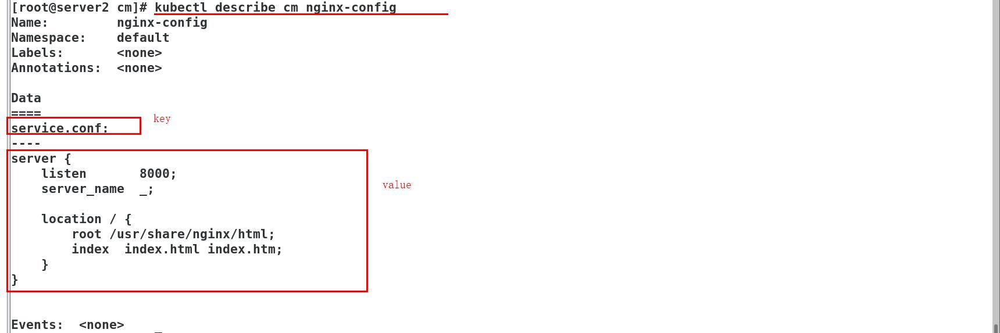

# 一、comfigmap（简称：cm）简介
Configmap用于保存配置数据，以键值对形式存储。
configMap 资源提供了向 Pod 注入配置数据的方法。
旨在让镜像和配置文件解耦，以便实现镜像的可移植性和可复用性。

**典型的使用场景：**

```powershell
填充环境变量的值

设置容器内的命令行参数

填充卷的配置文件
```

**创建ConfigMap的方式有4种：**

```powershell
使用字面值创建
使用文件创建
使用目录创建
编写configmap的yaml文件创建
```

# 二、创建cm
清除之前ingress的实验操作

## 2.1 使用字面值创建

```powershell
# 从终端录入的数据
# key1:key值  config1:value值
# 第一对：--from-literal=key1=config1  
# 第二队：--from-literal=key2=config2
# 创建：
kubectl create configmap my-config --from-literal=key1=config1 --from-literal=key2=config2
```


## 2.2 使用文件创建

```powershell
# key的名称是文件名称，value的值是这个文件的内容
kubectl create configmap my-config-2 --from-file=/etc/resolv.conf
```


## 2.3 使用目录创建

```shell
# 目录中的文件名为key，文件内容是value
kubectl create configmap my-config-3 --from-file=test
```

```powershell
# 创建目录
mkdir test 
# 拷贝文件：
cp /etc/resolv.conf
cp /etc/fstab 
 ls  查看
fstab  resolv.conf

[root@server2 ~]# kubectl create configmap my-config-3 --from-file=test
configmap/my-config-3 created
[root@server2 ~]# kubectl get cm
NAME          DATA   AGE
my-config     2      18m
my-config-2   1      9m35s
my-config-3   2      7s
```


## 2.4 编写configmap的yaml文件

```shell
[root@server2 cm]# vim cm1.yml 
apiVersion: v1
kind: ConfigMap
metadata:
  name: cm1-config
data:
  db_host: "172.25.254.250"
  db_port: "3306"
```

```powershell
[root@server2 cm]# kubectl apply -f cm1.yml 
configmap/cm1-config unchanged
[root@server2 cm]# kubectl describe cm cm1
Name:         cm1-config
Namespace:    default
Labels:       <none>
Annotations:  
Data
====
db_host:
----
172.25.254.250
db_port:
----
3306
Events:  <none>
```


# 三、cm的应用
如何使用configmap：

```powershell
1.通过环境变量的方式直接传递给pod
2.通过在pod的命令行下运行的方式
3.作为volume的方式挂载到pod内
```

## 3.1 使用configmap设置环境变量
**方法一**：

```powershell
[root@server2 cm]# vim cm1.yml 
apiVersion: v1
kind: ConfigMap
metadata:
  name: cm1-config
data:
  db_host: "172.25.254.250"
  db_port: "3306"

---
apiVersion: v1
kind: Pod
metadata:
  name: pod1
spec:
  containers:
    - name: pod1
      image: busybox
      command: ["/bin/sh", "-c", "env"]
      env:
        - name: key1
          valueFrom:
            configMapKeyRef:
              name: cm1-config
              key: db_host
        - name: key2
          valueFrom:
            configMapKeyRef:
              name: cm1-config
              key: db_port
  restartPolicy: Never


[root@server2 cm]# kubectl apply -f cm1.yml 
configmap/cm1-config unchanged
pod/pod1 created
[root@server2 cm]# kubectl get pod   pod1运行结束后直接退出
NAME                        READY   STATUS              RESTARTS   AGE
my-nginx-7db4c4f989-j2kbm   0/1     ContainerCreating   0          18m
pod1                        0/1     Completed           0          110s
```


**方法二：
一次性全部注入:cm1-config**

```powershell
apiVersion: v1
kind: ConfigMap
metadata:
  name: cm1-config
data:
  db_host: "172.25.254.250"
  db_port: "3306"

---
apiVersion: v1
kind: Pod
metadata:
  name: pod1
spec:
  containers:
    - name: pod1
      image: busybox
      command: ["/bin/sh", "-c", "env"]
      envFrom:
        - configMapRef:
            name: cm1-config
  restartPolicy: Never
```


## 3.2 使用conigmap设置命令行参数

```powershell
[root@server2 cm]# kubectl delete -f cm1.yml 
configmap "cm1-config" deleted
pod "pod1" deleted
[root@server2 cm]# vim cm1.yml 
apiVersion: v1
kind: ConfigMap
metadata:
  name: cm1-config
data:
  db_host: "172.25.254.250"
  db_port: "3306"

---
apiVersion: v1
kind: Pod
metadata:
  name: pod1
spec:
  containers:
    - name: pod1
      image: busybox
      command: ["/bin/sh", "-c", "echo $(db_host) $(db_port)"]
      envFrom:
        - configMapRef:
            name: cm1-config
  restartPolicy: Never

[root@server2 cm]# kubectl apply -f cm1.yml 
configmap/cm1-config created
pod/pod1 created
[root@server2 cm]# kubectl logs pod1 
172.25.254.250 3306
```


## 3.3通过数据卷使用configmap

```powershell
[root@server2 cm]# vim cm1.yml 
 
apiVersion: v1
kind: ConfigMap
metadata:
  name: cm1-config
data:
  db_host: "172.25.254.250"
  db_port: "3306"

---
apiVersion: v1
kind: Pod
metadata:
  name: pod1
spec:
  containers:
    - name: pod1
      image: busybox
      command: ["/bin/sh", "-c", "cat /config/db_host"]
      volumeMounts: 			# 指定挂在卷
      - name: config-volume 	# 名称自定义
        mountPath: /config 		# 指定挂载点，容器内部挂载点
  volumes:						# 指定挂载卷的挂载来源，制作映射
    - name: config-volume		# 挂载卷名称，上面一致
      configMap:
        name: cm1-config		# 指定来源
  restartPolicy: Never
```

```shell
[root@server2 cm]# kubectl apply -f cm1.yml 
configmap/cm1-config created
pod/pod1 created
[root@server2 cm]# kubectl logs pod1 
172.25.254.250 
```

**cm1-config里面有两对键值，其中就有db_host**

**查看输出信息**


```powershell
[root@server2 cm]# vim cm1.yml 
apiVersion: v1
kind: ConfigMap
metadata:
  name: cm1-config
data:
  db_host: "172.25.254.250"
  db_port: "3306"

---
apiVersion: v1
kind: Pod
metadata:
  name: pod1
spec:
  containers:
    - name: pod1
      image: nginx
      volumeMounts:
      - name: config-volume
        mountPath: /config
  volumes:
    - name: config-volume
      configMap:
        name: cm1-config
```


# 四、configmap热更新

```powershell
# 看似会自动更新，但是pod容器并没有去读取更新信息
[root@server2 cm]# kubectl edit cm cm1-config  编辑cm1-config
```


```powershell
[root@server2 cm]# kubectl exec  -it pod1 -- bash
```


```powershell
[root@server2 cm]# kubectl exec pod1 -- cat /config/db_host
172.25.254.200
[root@server2 cm]# kubectl exec pod1 -- cat /config/db_port
3309 
```


实现滚动更新，使用Deployment控制器

```powershell
[root@server2 cm]# cat cm1.yml 
apiVersion: v1
kind: ConfigMap
metadata:
  name: cm1-config
data:
  db_host: "172.25.254.250"
  db_port: "3306"

---
apiVersion: apps/v1
kind: Deployment
metadata:
  name: my-nginx
spec:
  replicas: 1
  selector:
    matchLabels:
      app: nginx
  template:
    metadata:
      labels:
        app: nginx
    spec:
      containers:
        - name: nginx
          image: nginx
          ports:
          volumeMounts:
          - name: config-volume
            mountPath: /etc/nginx/conf.d/  指定挂载目录
      volumes:
        - name: config-volume
          configMap:
            name: nginx-config     创建新的cm
```

创建cm

```powershell
[root@server2 cm]# kubectl create configmap nginx-config --from-file=service.conf 
configmap/nginx-config created
[root@server2 cm]# kubectl get cm
NAME           DATA   AGE
my-config      2      3h35m
my-config-2    1      3h26m
my-config-3    2      3h16m
nginx-config   1      1s  成功创建
```





查看更改的内容已经生效


接下来更改端口

```powershell
[root@server2 cm]# kubectl edit cm nginx-config 
```


端口已经更改


configmap热更新后，并不会触发相关Pod的滚动更新，需要手动触发


手动触发

```powershell
[root@server2 cm]#  kubectl patch deployments.apps my-nginx --patch '{"spec": {"template": {"metadata": {"annotations": {"version/config": "2020072"}}}}}'
deployment.apps/my-nginx patched
```


