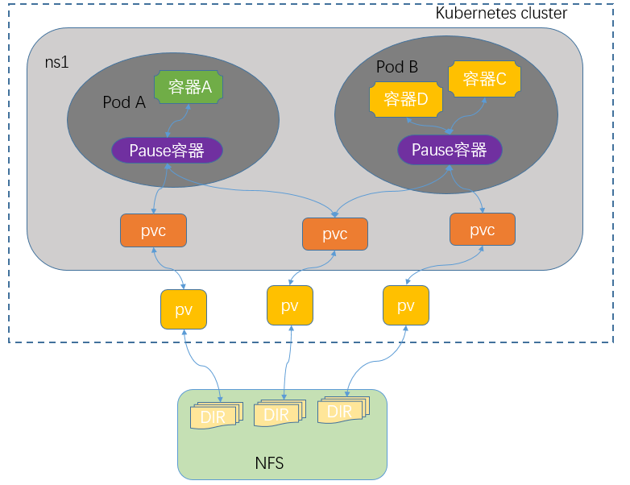

# 持久存储卷

volume的基础使用，需要我们用户手动来向不同类型存储接口传递不同的参数，从而实现把外部存储映射到k8s上的一个volume对象，使得pod才能正常的挂载对应的存储卷，对应pod里的容器才能正常使用；这种使用方式的前提是用户必须了解对应的存储系统，了解对应类型的存储接口，以及相关参数；这使得用户在k8s上使用存储卷变得有些复杂；为了简化这一过程，在k8s上使用pv和pvc资源来把对应底层存储接口给隐藏了，用户使用存储卷不再关心底层存储系统接口；不管底层是那种类型的存储，用户只需面对一个pvc接口即可；

PV、PVC和K8s集群以及pod的关系



提示：用户在创建pod时使用存储卷只需要关心对应名称空间的pvc对象；而对应pv是需要集群管理管理员定义；后端存储是专门的存储管理员负责管理；pv是k8s上的一种标准资源，全称叫做PersistentVolume翻译成中文就是持久存储卷；它主要作用是把后端存储中的某个逻辑单元，映射为k8s上的pv资源；pv是集群级别的资源；任意名称空间都可以直接关联某一个pv；关联pv的过程我们叫做绑定pv；而对应名称空间关联某一pv需要使用pvc资源来定义；pvc全称PersistentVolumeClaim的缩写，意思就是持久存储卷申请；在一个名称空间下创建一个pvc就是把对应名称空间同集群上的某一pv做绑定；一旦一个名称空间绑定了一个pv后，对应的pv就会从available状态转变成bond状态，其他名称空间将不能再使用，只有对应pv是available状态才能正常的被其他名称空间关联绑定；简单讲pvc和pv的关系是一一对应的，一个pv只能对应一个pvc；至于同一名称空间下的多个pod是否能够同时使用一个PVC取决pv是否允许多路读写，对应pv是否支持多路读写取决后端存储系统；不同类型的存储系统，对应访问模式也有所不同。访问模式有三种，单路读写(ReadWriteOnce简称RWO)，多路读写(ReadWriteMany简称RWX)，多路只读(ReadOnlyMany简称ROX)；


```json
master
node(worker)

namespance
pod
deployment
service

images:{
    search,
    pull,
    build,
    commit,
    login,
    push
}
container:{
    ps,
    run,
    start,
    stop,
    restart
    exec,
    rm,
    rename,
    logs
    commit
    export,
    import
}

dockerfile
docker-compose

pv
pvc
sc
nfs

kubeadm
kubectl
kubelet

```


## PV和PVC生命周期

实际上，不管是PV，还是PVC，都遵循以下生命周期：
1、Provisioning
Provisioning，即配置阶段。一般而言，PV的提供方式有两种——静态和动态。
所谓静态提供，就是Kubernetes管理员创建多个PV，这些PV的存储空间等属性已经确定，并且已经和真实的存储设备进行了关联。Pod中的PVC可以根据需要请求这些PV。
所谓动态提供，需要依托与StorageClass的支持，这时Kubernetes会尝试为PVC来动态的创建PV。这样做的好处是避免出现这种情况：部分PVC被分配给了远远超出其资源需求的PV、或者说系统存在很多资源较少的PV，但是一个资源需求很高的PVC缺无法被满足的情况。
2、Binding
在动态配置的情况下，用户创建或者已经创建了具有特定数量的PVC后，PVC与PV绑定的过程。
如果没有满足PVC请求需求的PV，那么PVC将无法被创建，因此造成的结果就是相应的Pod也不会被创建。
3、Using
即PVC与PC绑定后，Pod对存储空间的使用过程。
4、Releasing
当Pod被删除或者对该PV的资源使用结束后，Kubernetes就会删除该PVC对象，相应的也会回收PV资源，这时的PV就会处于这种状态。但是此时的PV还需要处理完毕之前的Pod在该存储卷上存储信息后才能够被使用。
5、Reclaiming
PV的回收策略对被释放的PV的处理过程。
6、Recycling
根据配置，有时PV会被执行擦除操作，删除掉该存储空间上的所有信息，并且该存储资源也可以被再次使用。


