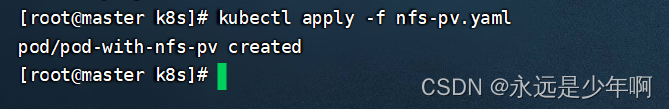
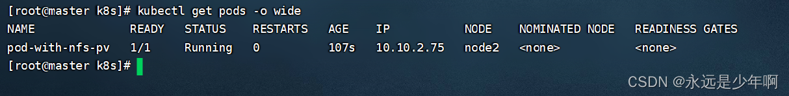
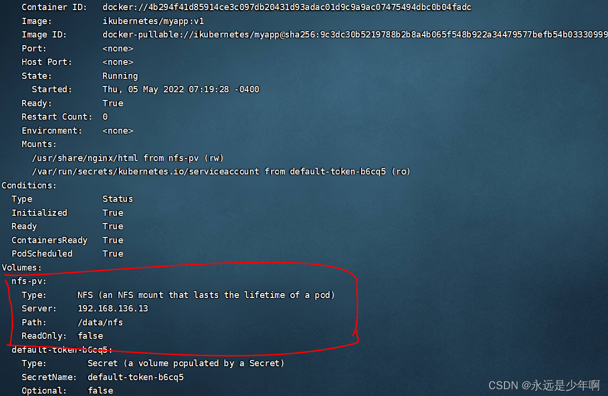
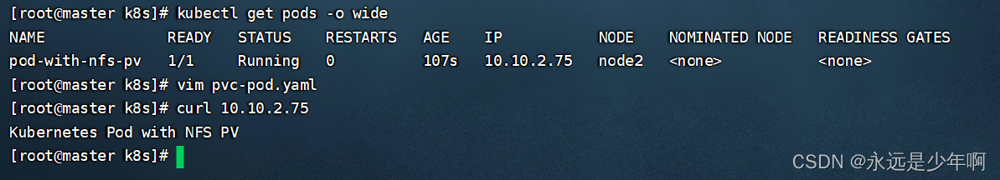

本文主要内容是Kubernetes NFS存储卷。

# 一、NFS服务配置
要进行Kubernetes的NFS存储卷相关配置，那么我们就必须先配置好NFS服务。
本文是在该篇文章的基础上来进行的配置，因此，最后我们完成了一个/data/nfs目录的NFS创建，如下所示：

```shell
[root@storage kubernetes]# showmount -e
Export list for storage:
/data/nfs *
```

注意，在Kubernetes集群中，因为我们的Pod要创建NFS服务，因此我们的Node1和Node2两个结点上都必须安装nfs服务！


# 二、存储卷创建

在创建存储卷之前，我们可以先执行命令：

```shell
kubectl explain pods.spec.volumes.nfs
```

来查看NFS存储卷的相关配置和命令，如下所示：

```shell
[root@master ~]# kubectl explain pods.spec.volumes.nfs
KIND:     Pod
VERSION:  v1

RESOURCE: nfs <Object>

DESCRIPTION:
     NFS represents an NFS mount on the host that shares a pod's lifetime More
     info: https://kubernetes.io/docs/concepts/storage/volumes#nfs

     Represents an NFS mount that lasts the lifetime of a pod. NFS volumes do
     not support ownership management or SELinux relabeling.

FIELDS:
   path <string> -required-
     Path that is exported by the NFS server. More info:
     https://kubernetes.io/docs/concepts/storage/volumes#nfs

   readOnly     <boolean>
     ReadOnly here will force the NFS export to be mounted with read-only
     permissions. Defaults to false. More info:
     https://kubernetes.io/docs/concepts/storage/volumes#nfs

   server       <string> -required-
     Server is the hostname or IP address of the NFS server. More info:
     https://kubernetes.io/docs/concepts/storage/volumes#nfs
```

接下来，我们就可以来创建Pod，并且在Pod中定义使用NFS的存储卷了。创建资源配置清单文件nfs-pv.yaml，并且在该文件中写入如下内容：

```shell
apiVersion: v1
kind: Pod
metadata:
  name: pod-with-nfs-pv
  namespace: default
spec:
  containers:
  - name: myapp
    image: ikubernetes/myapp:v1
    volumeMounts:
    - name: nfs-pv
      mountPath: /usr/share/nginx/html
  volumes:
  - name: nfs-pv
    nfs:					  # NFS卷
      path: /data/nfs 		  # NFS挂载的目录
      server: 192.168.137.140 # NFS服务器的IP地
```

完成资源清单配置文件的创建后，接下来，我们就可以开始创建该Pod了，执行命令：

```shell
kubectl apply -f nfs-pv.yaml
```

来根据我们之前的资源清单配置文件创建Pod，该命令执行结果如下所示：



从上图中可以看出，该命令被成功执行，我们带有NFS挂载卷的Pod已经成功创建！


# 三、NFS存储卷查看

最后，我们来检验一下我们的配置结果。
首先，执行命令：

```bash
kubectl get pods -o wide
```

来查看我们创建的Pod情况，该命令执行结果如下：



从上图中可以看出，我们的Pod资源已经成功创建。执行命令：

```bash
kubectl describe pods pod-with-nfs-pv
```

来查看该Pod的详细信息，可以看到该Pod的挂载情况，如下所示：



接下来，我们在NFS服务器上，执行命令：

```shell
echo "Kubernetes Pod with NFS PV" > /data/nfs/index.html
```

向被挂载的目录写入一个index.html文件，用于检验Pod的挂载情况。刚才我们查看到Pod的IP地址为10.10.2.75，我们可以使用curl访问该IP地址，结果如下：



从上图中可以看出，我们的curl显示的结果正是我们在NFS服务器上创建的index.html，我们的Pod挂载NFS存储卷实验成功！