本文主要内容是Kubernetes NFS对PVC和PV使用实战。

# 一、实战说明
我们以NFS为存储方式，创建5个PV，然后再创建一个Pod，给该Pod使用PVC，使得PVC动态的选择PV进行挂载。本次实战架构如下：

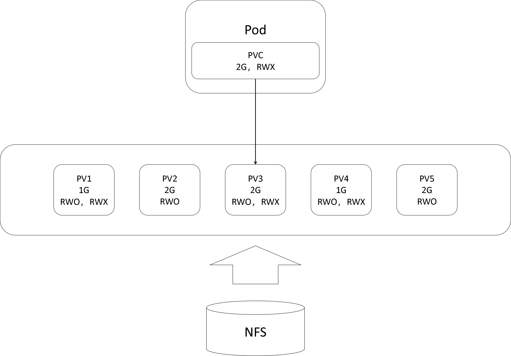

注意，在上图中，我们并没有规定Pod的PVC究竟选择哪个PV，但是根据PVC的选择原则，其余的PV均不符合规定，因此该PVC必然会选择PV3。


# 二、NFS存储配置

要利用NFS实现Kubernetes集群的PV和PVC存储，那么我们首先要配置NFS。NFS的相关配置请参考文章：NFS配置实战。在这里就不过多赘述了。
最终，我们创建了v1——v5一共5个目录，作为这5个PV的挂载目录，如下所示：

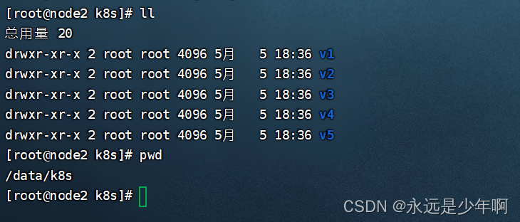

同时，/etc/exports文件配置如下所示：


NFS服务开启情况如下：

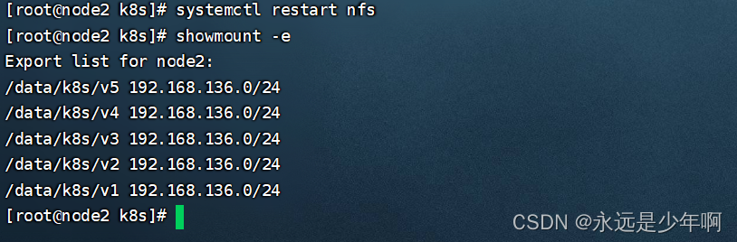

我们在其他设备上尝试挂载该NFS，发现可以成功挂载，如下所示：

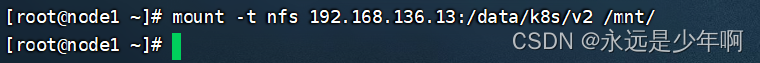

# 三、PV定义与创建
在完成NFS服务的相关配置后，接下来我们就可以开始进行PV的定义和创建了。
首先，我们创建PV的资源清单配置文件pv.yaml，一个PV的资源配置清单设置如下：

```shell
apiVersion: v1
kind: PersistentVolume
metadata:
  name: pv1
  labels:
    name: pv1
spec:
  nfs:
    path: /data/k8s/v1
    server: 192.168.136.13
  accessModes: ["ReadWriteMany","ReadWriteOnce"]
  capacity:
    storage: 1Gi
```

在上述配置中，spec字段中的nfs的path和server两个参数指定了NFS服务器和挂载目录，storage参数指定了该PV的存储空间大小，accessModes参数指定了该PV的权限。
在accessModes参数中，一共可以设置的权限有以下三种：
**RWO（ReadWriteOnce）：** 单节点读写
**RWX（ReadwriteMany）：** 多节点多读写
**ROX（ReadOnlyMany）： **单节点只读
我们可以按照本文第一章的PV相关要求，改动上述的名称、标签、权限和存储空间大小等设定，完成其他PV的资源配置清单。不同的PV资源配置清单之间使用三个短杠间隔，配置完成后的pv.yaml文件（部分）如下所示：

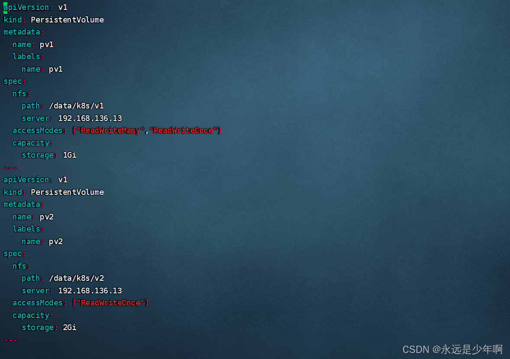

在完成资源配置清单文件的配置后，我们执行命令：

```shell
kubectl apply -f pv.yaml
```

来创建这5个PV，该命令执行结果如下所示：

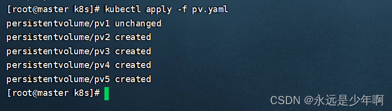

从上图中，我们可以看到，5个PV都已经创建完成。
我们可以执行命令：

```shell
kubectl get pv
```

执行结果如下：

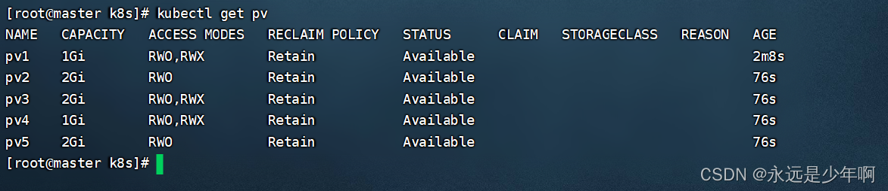

从上图中，我们可以简单的查看这5个PV的基本情况。

# 四、PVC和Pod的定义与创建
在完成PV的创建后，我们就可以创建PVC和Pod了。我们先来创建pvc-pod.yaml的PVC和Pod的资源清单配置文件。并且向文件中写入如下内容：

```shell
apiVersion: v1
kind: PersistentVolumeClaim
metadata:
  name: pvc-exp
  namespace: default
spec:
  accessModes: ["ReadWriteMany"]
  resources:
    requests:
      storage: 2Gi
---
apiVersion: v1
kind: Pod
metadata:
  name: pod-with-nfs-pv
  namespace: default
spec:
  containers:
  - name: pv-exp
    image: ikubernetes/myapp:v1
    volumeMounts:
    - name: nfs-pv
      mountPath: /usr/share/nginx/html
  volumes:
  - name: nfs-pv
    persistentVolumeClaim:
      claimName: pvc-exp
```

完成配置后的资源配置清单文件如下所示：

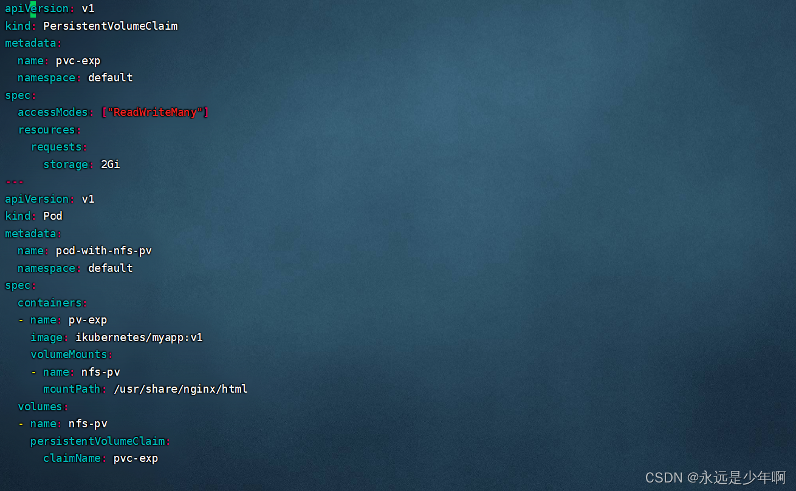

在完成上述资源配置清单文件的创建后，我们执行命令：

```shell
kubectl apply -f pvc-pod.yaml
```

来创建PVC和Pod资源，该命令执行结果如下：

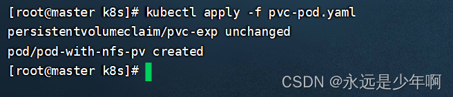

从上襦中可以看出，我们的PVC和Pod资源已经成功创建。
接下来，我们执行命令：

```shell
kubectl get pods
kubectl get pv
```

来分别查看Pods和PV资源情况，这两条命令执行结果如下：

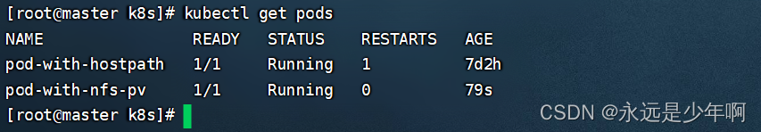

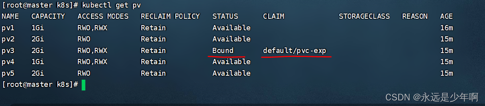


注意，在上图中，我们的Pod已经成功的对pv3完成了绑定。

# 五、效果查看
最后，让我们来检验一下上述配置的效果。
首先，我们给PV3的NFS服务器内，添加一个index.html文件，然后向该文件内写入指定内容，如下所示：

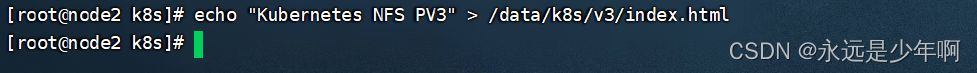

之后，我们先查看该Pod的IP地址，然后使用curl命令访问该IP地址，结果如下：

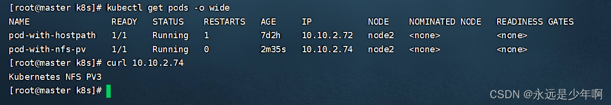

从上图中可以看出，我们对该Pod资源的访问结果正是我们写入NFS服务器中的内容。
之后，我们删除该Pod资源，然后再来查看我们的PV挂载情况，如下所示：

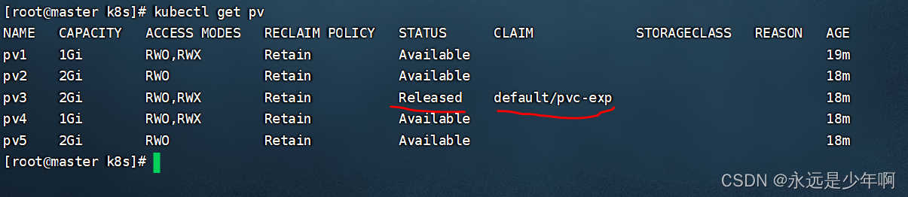

从上图中可以看出，我们的Pod被删除后，我们的PVC资源也会被随之释放。