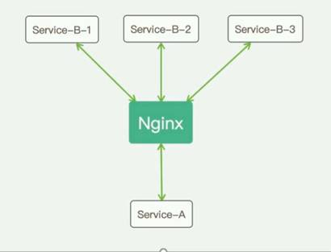
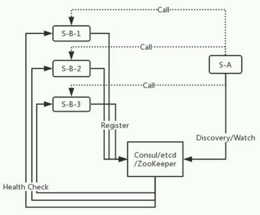

# 服务注册发现

- **Nginx (微服务1.0)**
  - **优点：**故障发现
  - **缺点：**配置文件写死，服务增加 - 没法弹性

- **服务注册发现中心 (微服务2.0)**

  **优点：**服务注册(新增服务) - 实现弹性调度

  - **Consul**
    - 启动Consul - Consul  agent -dev
    - 服务注册 - 程序启动，注册服务实例
      - 引用Nuget - Consul

      - Program.cs       - 服务注册，心跳

    - 服务发现

  - **Nacos**

  - **etcd**
  - **Zookeeper**

 

 

 