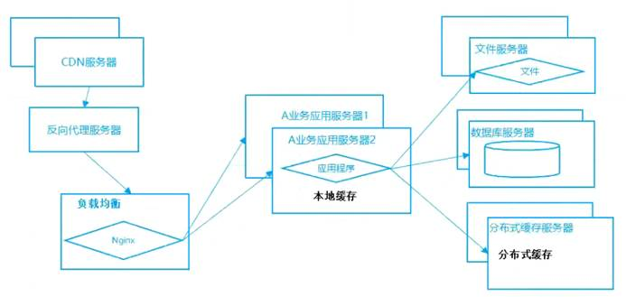
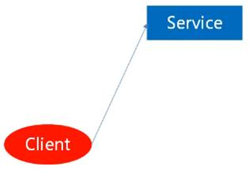
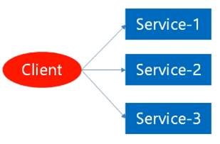
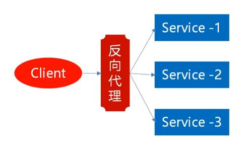
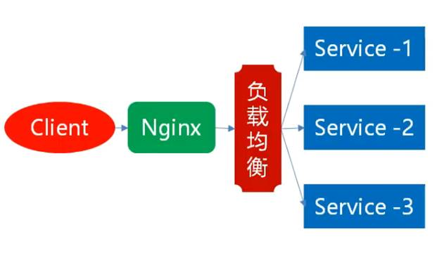
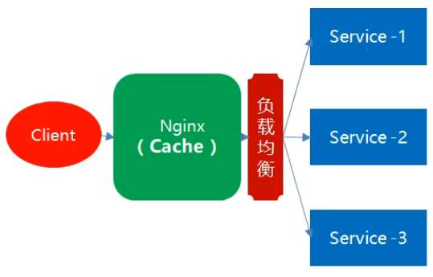
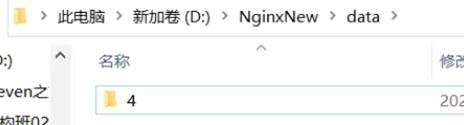
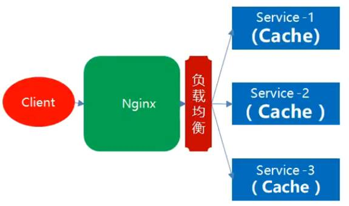
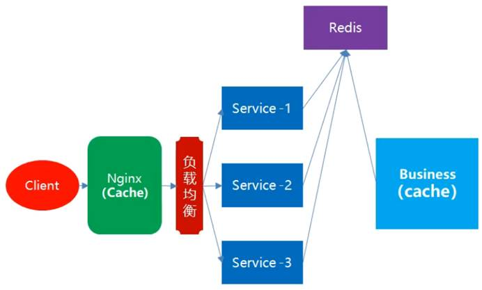
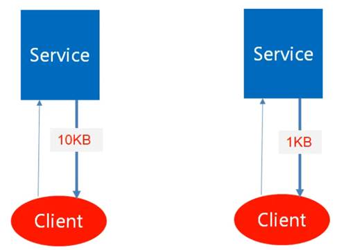

## 大数据高并发系统架构



## 单服务实例

1.所有请求都依赖于一个服务实例

2.服务器宕机，整个系统直接瘫痪




## 多服务实例

服务器集群




## 反向代理

反向代理：安装在服务器 IIS / Nginx

正向代理：安装在客户端




## 负载均衡 - Ngnix

负载：服务器处理业务，业务对于服务器就是服务器的负载

负载均衡：多个服务器，让负载给多个服务器来均衡处理。如果服务器宕机，ngnix可以做到自动的故障转移，当故障恢复后，自动的再转发到该服务器。

 

**下载地址** **-** http://nginx.org/en/download.html

**ngnix** **优点：**

* 反向代理

* 故障转移 - 如果某一台服务器宕机，ngnix可以做到自动的故障转移，当故障恢复后，自动的再转发到该服务器

* 故障恢复 - 如果故障服务器回复，Ngnix重新分发到这台服务器

 

**负载均衡策略**：

* 默认是轮询策略：多个服务器轮流来处理

* 权重策略：从大概的比例上来分配




## 性能优化 - 反向代理缓存

任何一次请求都必须要经过：Ngnix

**缓存：如果相同的请求路径，不在轮值分发**

​		临时存储区域，确定一个存储区域：D:\NgnixNew\data

​		定义一个可以：用这个key去存缓存，取数据的时候也需要通过这个key取出来。

​		只要key不变，缓存的结果就应该不变

​		**Key:访问路径作为key**




**Nginx.conf 配置：**

```yaml
#设置缓存的路径和其它参数
#proxy_cache_path path[levels=levels] keys_zone=name:size[inactive=time] [max_size=size] [loader_files=number]    [loader_sleep=time] [loader_threshold=time];
#缓存路径 /Ngnix/data 缓存结构为2层，即该路径下会有2层子目录，缓存文件会保存在最下层子目录
#缓存key会保存在名为 web_cache 的内存区域，该内存区域大小为50m
#1分钟内缓存没有被访问就会过期
#缓存文件做多占用1g空间
proxy_cache_path /Ngnix/data levels=1:2 keys_zone=web_cache:50m inactive=1m max_size=1g;

location /Cache {
	proxy_pass  http://webservers;
    proxy_store off;
    proxy_redirect off;
    proxy_set_header X-Forwarded-For $proxy_add_x_forwarded_for;
    proxy_set_header X-Real-IP $remote_addr;
    proxy_set_header Host $http_host;  #使用当前的路径作为缓存的Key
    #缓存使用前面定义的内存区域
    proxy_cache_path web_cache;
    #对于 200 和 304 的响应码进行缓存，过期时间为 2 分钟，这会覆盖前面定义的 1 分钟过期时间
    proxy_cache_valid 200 304 2m;
    #设置缓存的 key，直接用URL
    proxy_cache_key $scheme$proxy_host$request_uri;
}  
```




## 持续优化 - AOP ResourceFilter

**问题**：Ngnix转发，不同服务器之间不能互相访问到内存地址。缓存机制失效

 



 

## 分布式缓存 - 共享内存 Redis

把缓存的内容，保存在**同一块内存**中，每一个服务器实例都可以去到缓存中取数据

 



  

## 压缩



 
