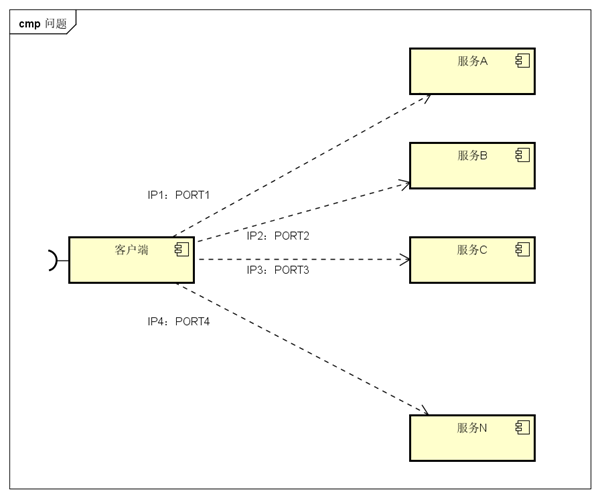
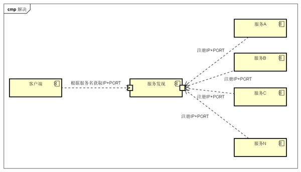
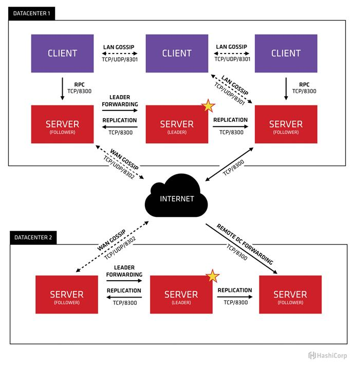
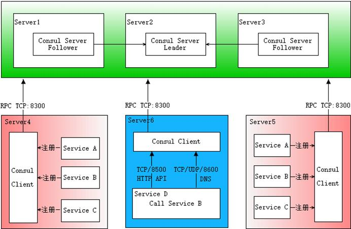
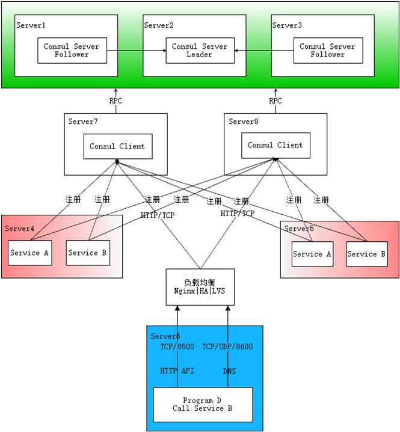

# 什么是服务发现

微服务的框架体系中，服务发现是不能不提的一个模块。我相信了解或者熟悉微服务的童鞋应该都知道它的重要性。这里我只是简单的提一下，毕竟这不是我们的重点。我们看下面的一幅图片：

图中，客户端的一个接口，需要调用服务A-N。客户端必须要知道所有服务的网络位置的，以往的做法是配置是配置文件中，或者有些配置在[数据库](https://cloud.tencent.com/solution/database?from=10680)中。这里就带出几个问题：

- 需要配置N个服务的网络位置，加大配置的复杂性
- 服务的网络位置变化，都需要改变每个调用者的配置
- 集群的情况下，难以做负载（反向代理的方式除外）

**总结起来一句话：服务多了，配置很麻烦，问题多多**

既然有这些问题，那么服务发现就是解决这些问题的。话说，怎么解决呢？我们再看一张图

与之前一张不同的是，加了个服务发现模块。图比较简单，这边文字描述下。服务A-N把当前自己的网络位置注册到服务发现模块（这里注册的意思就是告诉），服务发现就以K-V的方式记录下，K一般是服务名，V就是IP:PORT。服务发现模块定时的轮询查看这些服务能不能访问的了（这就是健康检查）。客户端在调用服务A-N的时候，就跑去服务发现模块问下它们的网络位置，然后再调用它们的服务。这样的方式是不是就可以解决上面的问题了呢？客户端完全不需要记录这些服务网络位置，客户端和服务端完全解耦！

这个过程大体是这样，当然服务发现模块没这么简单。里面包含的东西还很多。这样表述只是方便理解。 

图中的服务发现模块基本上就是微服务架构中服务发现的作用了。

# consul 概述

做服务发现的框架常用的有 zookeeper eureka etcd consul 

这里就不比较哪个好哪个差了，需要的童鞋自己谷歌百度。

那么consul是啥？consul就是提供服务发现的工具。然后下面是简单的介绍： 

consul是分布式的、高可用、横向扩展的。consul提供的一些关键特性： 

- service discovery：consul通过DNS或者HTTP接口使服务注册和服务发现变的很容易，一些外部服务，例如saas提供的也可以一样注册。 
- health checking：健康检测使consul可以快速的告警在集群中的操作。和服务发现的集成，可以防止服务转发到故障的服务上面。     
- key/value storage：一个用来存储动态配置的系统。提供简单的HTTP接口，可以在任何地方操作。     
- multi-datacenter：无需复杂的配置，即可支持任意数量的区域。 

我们这里会介绍服务发现，健康检查，还有一些基本KV存储。多数据中心有机会另一篇文章再说。 

总结：只要知道它是解决我上一部分提出的问题就行，其它的东西慢慢理解

# consul 内部原理

首先Consul支持多数据中心，在上图中有两个DataCenter，他们通过Internet互联，同时请注意为了提高通信效率，只有Server节点才加入跨数据中心的通信。

 

在单个数据中心中，Consul分为Client和Server两种节点（所有的节点也被称为Agent），**Server节点保存数据，Client负责健康检查及转发数据请求到Server**；Server节点有一个Leader和多个Follower，Leader节点会将数据同步到Follower，Server的数量推荐是3个或者5个，在Leader挂掉的时候会启动选举机制产生一个新的Leader。

 

集群内的Consul节点通过gossip协议（流言协议）维护成员关系，也就是说某个节点了解集群内现在还有哪些节点，这些节点是Client还是Server。单个数据中心的流言协议同时使用TCP和UDP通信，并且都使用8301端口。跨数据中心的流言协议也同时使用TCP和UDP通信，端口使用8302。

 

集群内数据的读写请求既可以直接发到Server，也可以通过Client使用RPC转发到Server，请求最终会到达Leader节点，在允许数据轻微陈旧的情况下，读请求也可以在普通的Server节点完成，**集群内数据的读写和复制都是通过TCP的8300端口完成**。

 

现在我们只看DataCenter，可以看出Consul的集群是由N个SERVER，加上M个CLIENT组成的。而不管是SERVER还是CLIENT，都是consul的一个节点，所有的服务都可以注册到这些节点上，正是通过这些节点实现服务注册信息的共享。除了这两个，在看下面的一些小细节。

**CLIENT**

CLIENT表示Consul的client模式，就是客户端模式。是Consul节点的一种模式，这种模式下，所有注册到当前节点的服务会被转发到SERVER，本身是不持久化这些信息。

**SERVER**

SERVER表示Consul的server模式，表明这个Consul是个server，这种模式下，功能和CLIENT都一样，唯一不同的是，它会把所有的信息持久化的本地，这样遇到故障，信息是可以被保留的。

**SERVER-LEADER**

中间那个SERVER下面有LEADER的字眼，表明这个SERVER是它们的老大，它和其它SERVER不一样的一点是，它需要负责同步注册的信息给其它的SERVER，同时也要负责各个节点的健康监测。

**其它信息**

其它信息包括它们之间的通信方式，还有一些协议信息，算法。它们是用于保证节点之间的数据同步，实时性要求等等一系列集群问题的解决。这些有兴趣的自己看看官方文档。

# Consul 服务发现原理

下面这张图基本描述了服务发现的完整流程，先大致看一下。

 

首先需要有一个正常的Consul集群，有Server，有Leader。这里在服务器Server1、Server2、Server3上分别部署了Consul Server，假设他们选举了Server2上的Consul Server节点为Leader。这些服务器上最好只部署Consul程序，以尽量维护Consul Server的稳定。

 

然后在服务器Server4和Server5上通过Consul Client分别注册Service A、B、C，这里每个Service分别部署在了两个服务器上，这样可以避免Service的单点问题。服务注册到Consul可以通过HTTP API（8500端口）的方式，也可以通过Consul配置文件的方式。Consul Client可以认为是无状态的，它将注册信息通过RPC转发到Consul Server，服务信息保存在Server的各个节点中，并且通过Raft实现了强一致性。

 

最后在服务器Server6中Program D需要访问Service B，这时候Program D首先访问本机Consul Client提供的HTTP API，本机Client会将请求转发到Consul Server，Consul Server查询到Service B当前的信息返回，最终Program D拿到了Service B的所有部署的IP和端口，然后就可以选择Service B的其中一个部署并向其发起请求了。如果服务发现采用的是DNS方式，则Program D中直接使用Service B的服务发现域名，域名解析请求首先到达本机DNS代理，然后转发到本机Consul Client，本机Client会将请求转发到Consul Server，Consul Server查询到Service B当前的信息返回，最终Program D拿到了Service B的某个部署的IP和端口。

 

图中描述的部署架构笔者认为是最普适最简单的方案，从某些默认配置或设计上看也是官方希望使用者采用的方案，比如8500端口默认监听127.0.0.1，当然有些同学不赞同，后边会提到其他方案。

 

# Consul 的其它部署架构

如果你实在不想在每个主机部署Consul Client，还有一个多路注册的方案可供选择

如图所示，在专门的服务器上部署Consul Client，然后每个服务都注册到多个Client，这里为了避免服务单点问题还是每个服务部署多份，需要服务发现时，程序向一个提供负载均衡的程序发起请求，该程序将请求转发到某个Consul Client。这种方案需要注意将Consul的8500端口绑定到私网IP上，默认只有127.0.0.1。

 

这个架构的优势：

Consul节点服务器与应用服务器隔离，互相干扰少；

不用每台主机都部署Consul，方便Consul的集中管理；

某个Consul Client挂掉的情况下，注册到其上的服务仍有机会被访问到；

但也需要注意其缺点：

引入更多技术栈：负载均衡的实现，不仅要考虑Consul Client的负载均衡，还要考虑负载均衡本身的单点问题。

Client的节点数量：单个Client如果注册的服务太多，负载较重，需要有个算法（比如hash一致）合理分配每个Client上的服务数量，以及确定Client的总体数量。

服务发现要过滤掉重复的注册，因为注册到了多个节点会认为是多个部署（DNS接口不会有这个问题）。

这个方案其实还可以优化，服务发现使用的负载均衡可以直接代理Server节点，因为相关请求还是会转发到Server节点，不如直接就发到Server。

 

# 是否可以只有Server？

这个问题的答案还是有关服务数量的问题，首先Server的节点数量不是越多越好，3个或者5个是推荐的数量，数量越多数据同步的处理越慢（强一致性）；然后每个节点可以注册的服务数量是有上限的，这个受限于软硬件的处理能力。所以如果你的服务只有10个左右，只有Server问题是不大的，但是这时候有没有必要使用Consul呢？因此正常使用Consul的时候还是要有Client才好，这也符合Consul的反熵设计。

 
