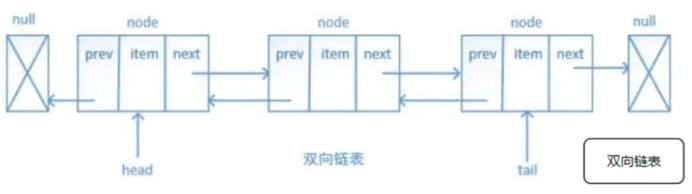
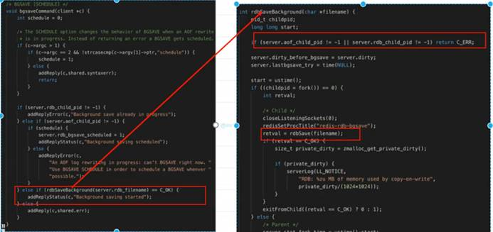

# 介绍

**Remote Dictionary Server -** **远程字典服务**

**优点：**

1. 方便扩展

2. 大数据高并发

3. 数据类型的影响

4. 分布式存储

**缓存流程：**

# 数据结构

## 一、前言
​		Redis除了可以存储键还可以存储常见的5种数据类型，分别是：String、List、Set、Hash、ZSet。对于Redis的命令有一部分是可以公用的，但是还有一些其他的命令是属于特殊使用的。

首先看看一张关于Redis5种数据结构的对比：

## 二、5种常见的数据结构类型。

### 1、String字符串类型

Redis中的String类型就是一个由字节组成的序列，他和其他编程语言或者其他键值对存储提供的字符串操作非常相似。

一个String类型的实例，其中键为hello，值为world：

（1）常用命令如下：

（2）Redis中的自增命令和自减命令：

（3）除了get、set、del、自增、自减等操作外，Redis还提供了下面一些操作：

- 获取字符串长度
- 往字符串append内容
- 设置和获取字符串的某一段内容
- 设置及获取字符串的某一位（bit）
- 批量设置一系列字符串的内容

如下图所示：

（4）应用场景：

​		String是最常用的一种数据类型，普通的key/value存储都可以归为此类，value其实不仅是String， 也可以是数字：比如想知道什么时候封锁一个IP地址(访问超过几次)。INCRBY命令让这些变得很容易，通过原子递增保持计数。

### 2、List列表类型
​		Redis中的List其实就是链表（redis 使用双端链表实现的 List），相信学过数据结构知识的人都应该能理解其结构。

​		使用 List 结构，我们可以轻松地实现最新消息排行等功能（比如新浪微博的 TimeLine ）。List 的另一个应用就是消息队列，可以利用 List 的 PUSH 操作，将任务存在 List 中，然后工作线程再用 POP 操作将任务取出进行执行。

一个List类型的实例，列表包含的元素，**相同元素**可以重复出现：

需要注意的是：**一个List结构可以有序的存储多个字符串，并且是允许元素重复的。**

（1）常用命令如下：

​		LPUSH和RPUSH命令分别用于将元素推入列表的左端和右端；LPOP和RPOP命令分别用于从列表的左端和右端弹出元素，也就是删除元素；

​		其中对于LRANGE命令来说，使用0位范围的起始索引，-1为范围的结束索引，可以取出列表包含元素的所有元素。

（2）除了上边比较常用的命令之外，Redis列表还可以从列表里边移除元素、将元素插入列表中间、将列表修剪至指定长度的命令，以及一些其他命令。

（3）使用场景：

- 微博 TimeLine
- 消息队列

### 3、Hash散列类型

一个List散列类型的实例，是一个包含两个键值对的散列键：

（1）常用命令如下：

（2）其他命令包含添加和删除键值对的命令、获取所有键值对的命令、以及对键值对的值进行自增和自减操作的命令，如下所示：

### 4、Set集合类型
​		Redis的集合和列表都可以存储多个字符串，他们的不同支持在于，列表可以存储多个相同的字符串，而集合通过使用散列表来保证自己存储的每个字符串都是各不相同的。

​		Redis的集合使用的是无序的方式存储元素，所以不可以像List列表那样，将元素推入集合的某一端，或者从集合的某一端弹出元素。

一个Set集合类型的实例，各不相同的元素，无序排列：

（1）常用命令如下：

（2）除了常见的命令之外，还有交集、并集、差集的计算，如下：

（3）使用场景：

- 共同好友、二度好友
- 利用唯一性，可以统计访问网站的所有独立 IP
- 好友推荐的时候，根据 tag 求交集，大于某个 threshold 就可以推荐

### 5、Redis的有序集合ZSet数据类型
​		有序集合和散列一样，用于存储键值对；有序集合的键被称为成员member，每一个成员都是独一无二的；而有序集合的值被称为分值score，分值必须是浮点数。

​		有序集合是Redis里面唯一一个既可以根据成员访问元素，又可以根据分值以及分值的排序来访问元素的结构。

一个有序集合类型的实例，zset-key是一个包含两个元素的有序集合键：

常用命令如下：

# 数据结构原理

## 1. 字符串 - String - 不推荐

-  RAW编码：开辟两次空间，小于41个字节

-  embstr编码：开辟一次编码，会有预留空间

   初次：20+n / 第二次：(20+n)*2

   

## 2. 哈希表 - Hashe - 推荐

- Hashe结构：

 

- 底层结构

  * ZipList：时间复杂度 O(n)

  - HashTable**：**时间复杂度 O(1)。如果Filed的个数超过512个或者Filed中任意一个键值的长度大于64个字节

## 3. 集合 - List

* 数据结构

  - 单向链表 - 快速插入

    

  - 底层结构
    - 双向链表 - 快速插入、消息队列、栈

 

## 4. 去重集合 - Set

- 数据结构

- 底层数据结构：
  - intzset：存放数字，最大值不能超过2^64
  - HashTable

## 5. 有序的去重集合 - Zset

- 数据结构

- 底层结构

  - ZipList

    

  - 跳跃表 - Redis最大32层

 

## 6. BitMaps

## 7. HyperLogLoss - Log

## 8. Streams - 流

 

# 持久化

 

- **持久化方式**
  - **RDB持久化：**能够在指定的时间间隔能对你的数据进行快照存储
  - **AOF持久化：**记录每次对服务器写的操作，当服务器重启的时候会重新执行这些命令恢复原始的数据，AOF命令以redis协议追加保存每次写的操作到文件末尾。redis还能对AOF文件进行后台重写，使得AOF文件的体积不至于过大。
  - **如果你只希望你的数据在服务器运行的时候存在，你也可以不使用任何持久化方式**
  - **也可以同时开启两种持久化方式，在这种情况下，当redis重启的时候会优先载入AOF文件来恢复原始的数据，因为在通常情况下AOF文件保存的数据集要比RDB文件保存的数据集要完成**

 

## RDB

- **配置**

 

- **配置自动触发Bgsave命令的原理：**

  - 计数器记录了在上一次成功的持久化后，redis进行了多少次写操作，其值在每次写操作之后都加1，在成功完成持久化后清零

    

    

  - Redis有一个周期性操作函数，默认每隔100ms执行一次，它的其中一项工作就是检查自动触发Bgsave命令的条件是否成立

    

- **Save命令：**将内存数据镜像保存为rdb文件，由于redis是单线程模型，期间会阻塞redis服务进程，redis服务不在处理任何命令，直到rdb文件创建完成

  

 

- **Bgsave命令：**父进程启动一个子进程，由子进程将内存保存在硬盘文件，期间不会影响其他的指令操作

  

 

- **缺点**
  - 丢数据
  - 大数据量耗性能

- **优点**
  - 快速还原

## AOF

* **配置**

  修改config中的配置**appendonly yes** 

  

- **AOF三个步骤**

- **三种追加方式**

  * appendfsync always 只要有读写

  - appendfsync everysec 1s的周期（推荐）

  - appendfsync no 等业务不繁忙的时候，这种操作最不靠谱

- **AOF文件指令**

- 当文件指令体积比较大的时候 - 重写：压缩文件空间

- **优点**
  - 追加速度比较快

- **缺点**
  - 文件体积比较大 - 没有压缩
  - 还原性能比较低

## Redis持久化加载（混合模式）

- **配置**

  修改config中的配置 aof-use-rdb-preamble yes

- **原理：**

  当AOF文件比较大的时候，先转化为RDB文件，快速还原，在执行AOF文件

# 分布式锁 - Redis

**Lock** **原理：**- Monitor.Enter(olock); Monitor.Exit(olock);

- 0/1 - 枷锁：1 / 释放锁：0
- 头：共享索引块

**秒杀系统** - API Service分布式集群，发生**并发**情况，会出现**超卖**。

- 一个进程、多线程：通过Lock解决（.Net 锁 - 只会作用在一个进程）

- 多个进程、多线程：通过Redis Lock解决（**分布式锁     - 分布式缓存**）
  - **阻塞锁（互斥锁） -**
    - using (var dataLock =       redis.AcquireLock("DataLock:"+key,timeout)}{ … … }
      - DataLock锁：如果存在，则锁被抢走了；如果没有，则自己可以创建一个字段，自己拿到锁。

      - **Timeout**：防止当前线程宕机，其他线程一直等待。
        - 失效时间；拿不到锁，需要等待时间，重新拿锁
        - **默认时间****365** **-** **过期时间一年**

      - 问题1：A线程 即将释放锁的时候，时间超时；程序释放锁；B线程执行；A线程释放B线程的锁**（锁失效 - 续命）**

      - 问题2：A线程        释放锁，B\C线程同时执行Lock判断程序。**（事务 / Redis使用Lua 脚本）**
        - Redis - 监听版本号(key)，为下一次使用 
        - 事务带着版本号抢锁，如果版本号相同，则执行成功；如果版本号不通，则失败

  - **非阻塞锁 -**
    - bool isLocked = redis.Add<string>("DataLock:"       + key,key,timeout);
    - redis.Remove("DataLock:"+key);

# 分布式事务

**分布式事务 -** MySQL & SQL Server 处理数据应用事务

 

# 高级结构

## 1. 单机模式

**优点：**

* 部署简单，0成本。

* 成本低，没有备用节点，不需要其他的开支。

* 高性能，单机不需要同步数据，数据天然一致性。

**缺点：**

* 可靠性保证不是很好，单节点有宕机的风险。

* 单机高性能受限于CPU的处理能力，redis是单线程的。

 

## 2. 主从架构（主从复制）

主从复制，是指将一台Redis服务器的数据，复制到其他的Redis服务器。

前者称为主节点(master)，后者称为从节点(slave)；数据的复制是单向的，只能由主节点到从节点。

- 读写分离 - 主节点写数据，从节点读数据
- 默认从节点不可以写数据(主节点)

 

主从模式配置很简单，只需要在从节点配置主节点的ip和端口号即可。

slaveof <masterip> <masterport># 例如# slaveof 192.168.1.214 6379

 

**主从模式的优点：**

* 一旦 主节点宕机，从节点 作为 主节点 的 备份 可以随时顶上来。

* 扩展 主节点 的 读能力，分担主节点读压力。

* 高可用基石：除了上述作用以外，主从复制还是哨兵模式和集群模式能够实施的基础，因此说主从复制是Redis高可用的基石。

**也有相应的缺点，比如我刚提到的数据冗余问题**：

* 一旦 主节点宕机，从节点 晋升成 主节点，同时需要修改 应用方 的 主节点地址，还需要命令所有 从节点 去 复制 新的主节点，整个过程需要 人工干预。

* 主节点 的 写能力 受到 单机的限制。

* 主节点 的 存储能力 受到 单机的限制。

 

## 3. 哨兵模式

主从模式，当主节点宕机之后，从节点是可以作为主节点顶上来，继续提供服务的。

但是有一个问题，主节点的IP已经变动了，此时应用服务还是拿着**原**主节点的地址去访问，于是，在Redis 2.8版本开始引入，就有了哨兵这个概念。在**复制的基础**上，哨兵实现了**自动化**的故障恢复。

如图，哨兵节点由两部分组成，哨兵节点和数据节点：

- 哨兵节点：哨兵系统由一个或多个哨兵节点组成，哨兵节点是特殊的redis节点，不存储数据。
- 数据节点：主节点和从节点都是数据节点。

访问redis集群的数据都是通过哨兵集群的，哨兵监控整个redis集群。

 

一旦发现redis集群出现了问题，比如刚刚说的主节点挂了，从节点会顶上来。但是主节点地址变了，这时候应用服务无感知，也不用更改访问地址，因为哨兵才是和应用服务做交互的。

Sentinel 很好的解决了故障转移，在高可用方面又上升了一个台阶，当然Sentinel还有其他功能。

比如 **主节点存活检测**、**主从运行情况检测**、**主从切换**。

Redis的Sentinel最小配置是 **一主一从**。

 

**作用**

- 通过发送命令，让Redis服务器返回监控其运行状态，包括主服务器和从服务器。
- 当哨兵监测到master宕机，会自动将slave切换成master，然后通过**发布订阅模式**通知其他的从服务器，修改配置文件，让它们切换主机。

 

**说下哨兵模式监控的原理**

每个Sentinel以 每秒钟 一次的频率，向它**所有**的 **主服务器**、**从服务器**以及其他Sentinel**实例** 发送一个PING 命令。

如果一个 实例（instance）距离最后一次有效回复 PING命令的时间超过 down-after-milliseconds 所指定的值，那么这个实例会被 Sentinel标记为 **主观下线**。

如果一个 **主服务器**被标记为 **主观下线**，那么正在 监视 这个 主服务器 的**所有** Sentinel 节点，要以 **每秒一次** 的频率确认 该主服务器是否的确进入了 **主观下线** 状态。

如果一个 主服务器 被标记为 主观下线，并且有 **足够数量**的 Sentinel（至少要达到配置文件指定的数量）在指定的 **时间范围** 内同意这一判断，那么这个该主服务器被标记为 **客观下线**。

在一般情况下， 每个 Sentinel 会以每 10秒一次的频率，向它已知的所有 主服务器 和 从服务器 发送 INFO 命令。

当一个 **主服务器**被 Sentinel标记为 **客观下线** 时，Sentinel 向 下线主服务器 的所有 从服务器 发送 INFO 命令的频率，会从10秒一次改为 每秒一次。

Sentinel和其他 Sentinel 协商 **主节点**的状态，如果 主节点处于 **SDOWN`****状态，则投票自动选出**新的主节点。将剩余的 **从节点** 指向 **新的主节点** 进行 **数据复制**。

当没有足够数量的 Sentinel 同意 主服务器 下线时， 主服务器 的 **客观下线状态**就会被移除。当 **主服务器** 重新向 Sentinel的PING命令返回 有效回复 时，主服务器 的 **主观下线状态** 就会被移除。

 

**客户端访问Redis-Sentinel的方式**

- Redis Client先询问Sentinels,Sentinel返回Master     (IP,Port)
- Redis Client再与以上Master     (IP,Port)建立连接

**哨兵模式的优缺点**

**优点：**

- 哨兵模式是基于主从模式的，所有主从的优点，哨兵模式都具有。
- 主从可以自动切换，系统更健壮，可用性更高。
- Sentinel 会不断的检查 主服务器 和 从服务器 是否正常运行。当被监控的某个 Redis 服务器出现问题，Sentinel 通过API脚本向管理员或者其他的应用程序发送通知。

**缺点：**

- Redis较难支持在线扩容，对于集群，容量达到上限时在线扩容会变得很复杂。

 

## 4. 集群模式

主从不能解决故障自动恢复问题，哨兵已经可以解决故障自动恢复了，那到底为啥还要集群模式呢？

主从和哨兵都还有另外一些问题没有解决，单个节点的存储能力是有上限，访问能力是有上限的。

Redis Cluster 集群模式具有 **高可用、可扩展性、分布式、容错**等特性。

 

**Cluster** **集群模式的原理**

通过数据分片的方式来进行数据共享问题，同时提供数据复制和故障转移功能。

之前的两种模式数据都是在一个节点上的，单个节点存储是存在上限的。集群模式就是把数据进行分片存储，当一个分片数据达到上限的时候，就分成多个分片。

 

**数据分片怎么分？**

集群的键空间被分割为16384个slots（即hash槽），通过hash的方式将数据分到不同的分片上的。

HASH_SLOT = CRC16(key) & 16384

CRC16是一种循环校验算法，这里不是我们研究的重点，有兴趣可以看看。

这里用了**位运算**得到取模结果，位运算的速度高于取模运算。

 

有一个很重要的问题，为什么是分割为16384个槽？这个问题可能会被面试官随口一问。（槽位 16384 = 16k）

 

**数据分片之后怎么查，怎么写？**

读请求分配给slave节点，写请求分配给master，数据同步从master到slave节点。

**读写分离**提高并发能力，增加高性能。

 

**如何做到水平扩展？**

master节点可以做扩充，数据迁移redis内部自动完成。

当你新增一个master节点，需要做数据迁移，redis服务不需要下线。

举个栗子：上面的有三个master节点，意味着redis的槽被分为三个段，假设三段分别是0~7000，7001~12000、12001~16383。

现在因为业务需要新增了一个master节点，四个节点共同占有16384个槽。

槽需要重新分配，数据也需要重新迁移，但是服务不需要下线。

redis集群的重新分片由redis内部的管理软件redis-trib负责执行。redis提供了进行重新分片的所有命令，redis-trib通过向节点发送命令来进行重新分片。

 

**如何做故障转移？**

假如途中红色的节点故障了，此时master3下面的从节点会通过 **选举**产生一个主节点。替换原来的故障节点。

此过程和哨兵模式的故障转移是一样的。

​                                                                     

# 常见问题

## 1. 缓存雪崩

* redis缓存key同一时间**大量失效**，导致大量请求全部打到数据库，造成数据库宕机

- **例如：**双十一商品对应redis 100个key，设置失效一小时，一小时后同时失效。

- **解决方案：**
  - 设置缓存失效时间：随机初始化失效时间，预防同时失效
  - Redis集群：热点key放在不同的redis节点上（副本集，分片集）（一致性hash算法 2^23-1 node - 数据倾斜）
  - 永不过期：不设置失效时间
  - 缓存续命：定时任务延长缓存过期时间

## 2. 缓存击穿

- 突然**热点key**(A key)失效，一瞬间大量的A key请求打到数据库上
- **例如：**秒杀商品，A商品数据存放到redis缓存里面的A key，失效时间为1个小时。当拍卖到1小时A key突然失效，导致大量的请求（**热点key - A key**）在Redis无法查询到，直接打到数据库上，数据库反应不及时，直接宕机。

- **解决方案：**
  - 永不过期 - （不推荐）

  - CLR锁 - 单应用

  - 分布式锁 - 请求数据库的时候使用锁，只有一个线程抢到锁      操作数据库，当线程查到数据缓存到redis中后。其他线程等待几秒，可以在redis中查到，不需要请求数据库。（推荐）
    - 实现 zookeeper / redis

  - 互斥锁（Mutex key）

  - 缓存预热 - 静态数据放在缓存（推荐）

## 3. 缓存穿透

- 指缓存和数据库中都没有的数据，一般常见与黑客攻击。
- **例如：**用请求id=-1的数据，这种数据直接穿透缓存，打在数据库上，导致数据库挂掉

- **解决方案：**

  - 同一参数 - 无论查出什么结果都缓存到Redis中，过期时间比较短。缓存空，Redis有数据淘汰策略（LER,LRU）内存Key达到限制，就清理数据（**内存中全是空数据**）。

  - 不同参数 - 拉黑IP

  - 不通IP - 对参数的合法性检验

  - 布隆过滤器： 数据存在布隆过滤器（位数组 - 0/1）

    - 优点：

      - 存储的时二进制数，插入查询比较快。时间复杂度O(n)

        

    - 缺点：
      - 存储的二进制数，可能存储多个值，无法删除操作
      - 误判 - 两个值相同。误判率越小执行越慢
      - 缓存值变化不好处理 - 重新加载 / 计数器
        

## 4. 缓存预热

- 在应用启动之前，就保证redis缓存中数据是必须有的
- 解决方案：
  - 定时预热
  - 分段预热 - 时段的数据

