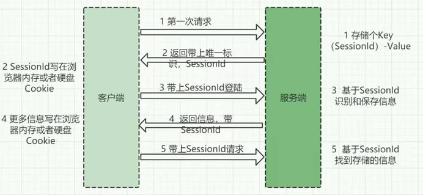
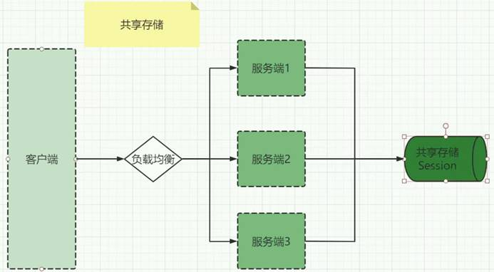
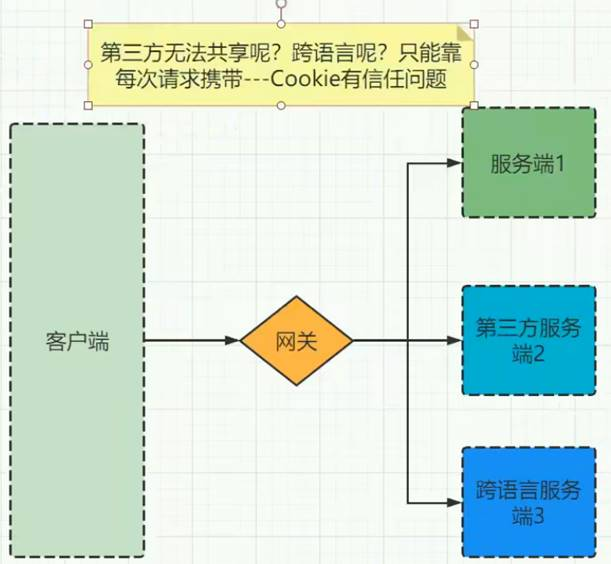
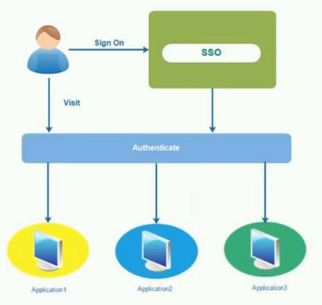
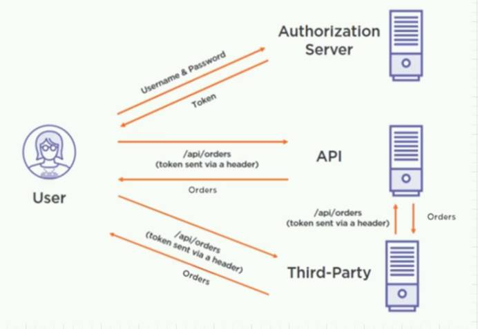
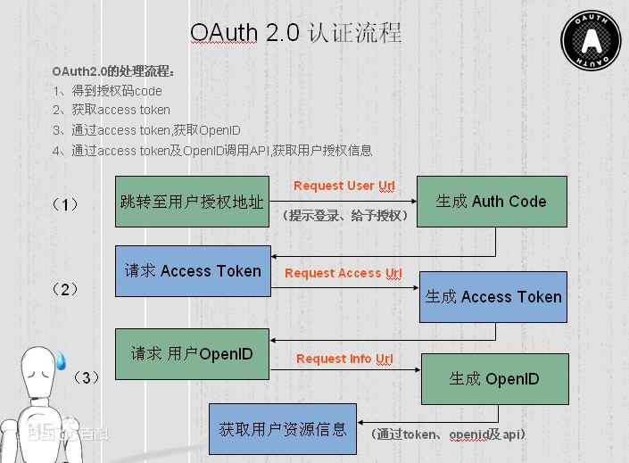
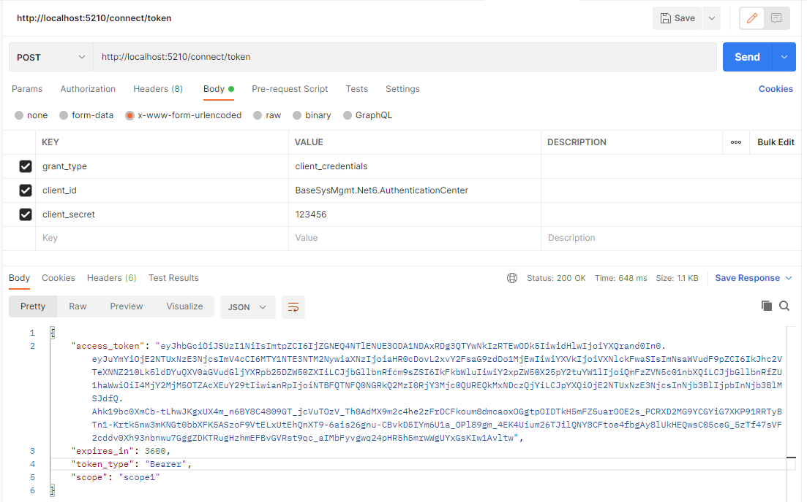
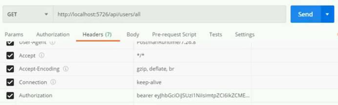

## 用户持久化演进

**1.Http无状态协议 - Web1.0**

HTTP协议诞生是为了信息浏览，请求响应式，没有用户识别概念（无状态）

 

**2.Cookie \ Session - Web2.0**

2.0需要用户持久化（证明张三是张三）- Cookie \ Session



 

**3.共享存储 - Web3.0**



**4.客户端携带 - Token**



**网关完成多个微服务的鉴权授权，就是Single Sign On单点登录（SSO）**



 

**理想通信模式，去中心化，需要解决信任问题 -** Token是鉴权中心发布的，其他服务器都认可

非对称可逆加密 - (**鉴权中心 - 腾讯QQ**) 

-> 生成一对密钥(**私钥-加密、公钥-解密**) 

-> 用户登陆成功，把用户信息用私钥加密得到token 

-> 用户带着token去请求API

-> 拿到腾讯的公钥，对token解密 

\- 能解开，就能证明token是来自腾讯，不是伪造

\- 内容带上时间戳

 




## JWT令牌结构 (Json Web Token)

**格式：xxxxx.yyyyy.zzzzz -> Header.Payload.Signature**

* **Header** - 标头 。 base64UrlEncode(header)：jwt令牌的第一部分。

  ```yaml
  {
      "alg":"HS256",
      "typ":"JWT"
  }
  ```

  

* **Payload** **-** 有效载荷。base64UrlEncode(payload)：jwt令牌的第二部分。

  * JWT 规定了7个官方字段，供选用

    ```yaml
    {
        iss (issuer)：签发人
        exp (expiration time)：过期时间
        sub (subject)：主题
        aud (audience)：受众
        nbf (Not Before)：生效时间
        iat (Issued At)：签发时间
        jti (JWT ID)：编号
    }
    ```

  * 自定义私有字段

    ```yaml
    {
        "sub": "1234567890",
        "name": "chongchong",
        "admin": true
    }
    ```


* **Singture** **-** 签名。防止抵赖 - 防止篡改

  secret：签名所使用的密钥，该密钥仅仅保存在服务器中，并且不能向用户公开。

  HMACSHA256(base64UrlEncode(header) + "." + base64UrlEncode(payload), secret)**

  

**注意**：base64编码，并不是加密，只是把明文信息变成了不可见的字符串。但是其实只要用一些工具就可以把base64编码解成明文，所以不要在JWT中放入涉及私密的信息。


## OAuth2.0 协议

授权机制，是一种规范、协议，制定了授权流程，解决授权问题

1. 客户端凭证（client credentials）

2. 密码式（password）

3. 隐藏式（implicit）

4. 授权码（authorization-code）

5. 混合模式（Hybrid）

 

## IdentityServer4

IdentityServer4 框架/组件/中间件 - 支持JWT格式

ASP.NET Core量身定制的框架实现了OpenID Connect和OAuth2.0协议-规范认证授权中间件

 

## 建立鉴权中心

基于.NET6+Ids4建个授权中心（QQ服务器）

1. Core WebAPI独立进程

2. Nuget IdentityServer4

3. 中间件 - 初始化数据

4. Postman 获取token

5. 使用鉴权授权 [Authorize (Role =  "Admin")]  /  [Authorize]

   

   **dotnet run --url=http://*:7200**

   [**http://localhost:7200/connect/token**](http://localhost:7200/connect/token)

   | KEY           | VALUE                                 |      |
   | ------------- | ------------------------------------- | ---- |
   | grant_type    | client_credentials                    |      |
   | client_id     | BaseSysMgmt.Net6.AuthenticationCenter |      |
   | client_secret | 123456                                |      |

   


## 客户端继承Ids4

1. Core WebAPI

2. nuget IdentityServer4.AccessTokenValidation

3. 鉴权+授权+特性

 

**Ids4地址只是为了提供公钥拿到公钥，其实就不再通信**



 

## 网关集成Ids4

1.nuget IdentityServer4.AccessTokenValidation

2.配置鉴权服务

3.配置文件匹配

 

## 验证&流程

**1.直接访问无权限要求地址 - 200**

**2.访问有权限要求地址 - 401**

**3.登陆后获取token**

**4.拿着token登录需要权限认证地址 - 200**

 

**Authorization：beaer token**