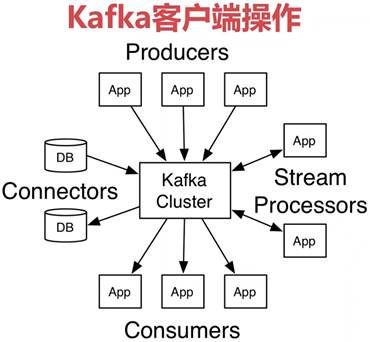
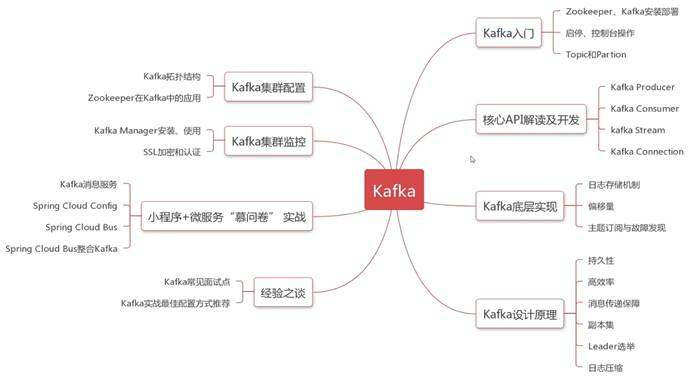
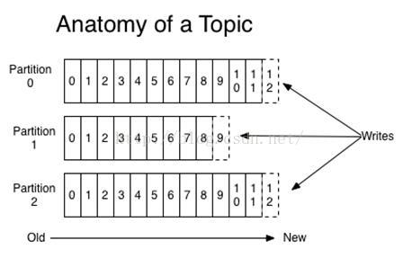
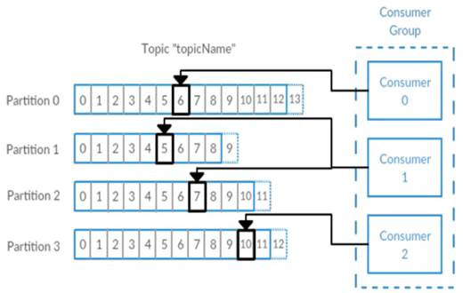
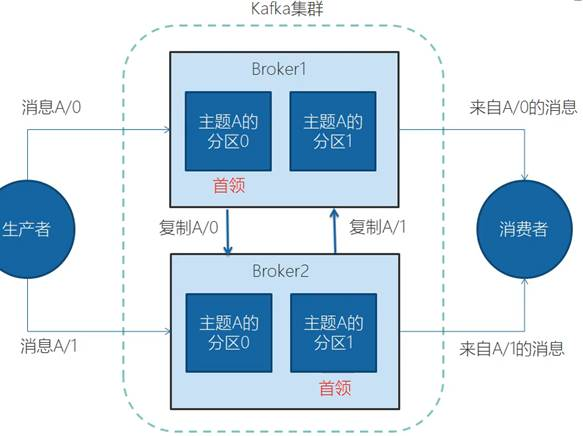
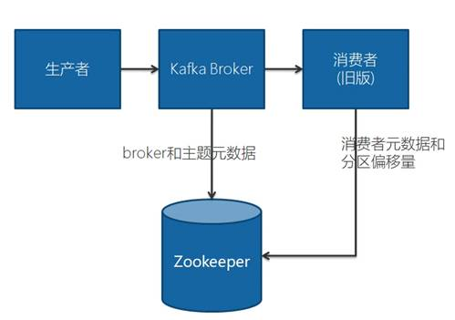
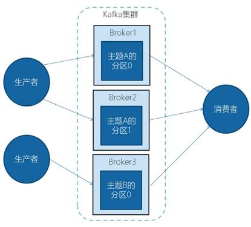

# 介绍

A distributed streaming platform / 分布式流平台

Kafka是基于zookeeper的分布式消息系统

Kafka具有高吞吐率、高性能、实时及高可靠等特点 

 

Kafka客户端API类型

- AdminClient API：允许管理和检测Topic、broker以及其它Kafka对象
- Producer API：发布消息到1个或多个topic
- Consumer API:：订阅一个或多个topic，并处理产生的消息
- Streams API：高效的将输入流转换到输出流
- Connector API：从一些源系统或应用程序中拉取数据到kafka

 

 

# Kafka中的概念

- **消息和批次**
- **主题和分区**
- **生产者和消费者、偏移量、消费者群组**

* **Kafka中的基本概念**

- - **Broker和集群**
  - **保留消息（多副本）**

 

# Kafka 安装和配置

- **JDK**
- **Zookeeper**
- **下载安装Kafka**

# Kafka集群

 