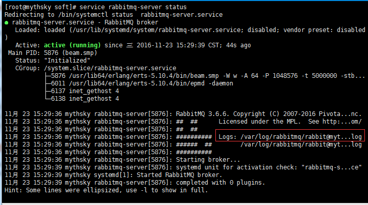
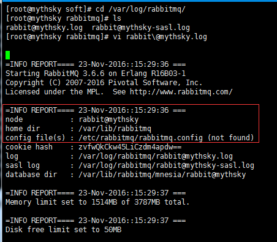

# 一. RabbitMQ概念

​		RabbitMQ是流行的开源消息队列系统，是AMQP（Advanced Message Queuing Protocol高级消息队列协议）的标准实现，用erlang语言开发。RabbitMQ据说具有良好的性能和时效性，同时还能够非常好的支持集群和负载部署，非常适合在较大规模的分布式系统中使用。


## Rabbit模式三种模式

Rabbit模式大概分为以下三种：单一模式、普通模式、镜像模式

**单一模式：**最简单的情况，非集群模式，即单实例服务。

**普通模式：**默认的集群模式。

​		queue创建之后，如果没有其它policy，则queue就会按照普通模式集群。对于Queue来说，消息实体只存在于其中一个节点，A、B两个节点仅有相同的元数据，即队列结构，但队列的元数据仅保存有一份，即创建该队列的rabbitmq节点（A节点），当A节点宕机，你可以去其B节点查看，./rabbitmqctl list_queues 发现该队列已经丢失，但声明的exchange还存在。

​		当消息进入A节点的Queue中后，consumer从B节点拉取时，RabbitMQ会临时在A、B间进行消息传输，把A中的消息实体取出并经过B发送给consumer。

​		所以consumer应尽量连接每一个节点，从中取消息。即对于同一个逻辑队列，要在多个节点建立物理Queue。否则无论consumer连A或B，出口总在A，会产生瓶颈。

​		该模式存在一个问题就是当A节点故障后，B节点无法取到A节点中还未消费的消息实体。

​		如果做了消息持久化，那么得等A节点恢复，然后才可被消费；如果没有持久化的话，队列数据就丢失了。

**镜像模式：**把需要的队列做成镜像队列，存在于多个节点，属于RabbitMQ的HA方案。

​		该模式解决了上述问题，其实质和普通模式不同之处在于，消息实体会主动在镜像节点间同步，而不是在consumer取数据时临时拉取。

​		该模式带来的副作用也很明显，除了降低系统性能外，如果镜像队列数量过多，加之大量的消息进入，集群内部的网络带宽将会被这种同步通讯大大消耗掉。

​		所以在对可靠性要求较高的场合中适用，一个队列想做成镜像队列，需要先设置policy，然后客户端创建队列的时候，rabbitmq集群根据“队列名称”自动设置是普通集群模式或镜像队列。具体如下：

​		队列通过策略来使能镜像。策略能在任何时刻改变，rabbitmq队列也近可能的将队列随着策略变化而变化；非镜像队列和镜像队列之间是有区别的，前者缺乏额外的镜像基础设施，没有任何slave，因此会运行得更快。

​		为了使队列称为镜像队列，你将会创建一个策略来匹配队列，设置策略有两个键“ha-mode和 ha-params（可选）”。

## 了解集群中的基本概念

​		RabbitMQ的集群节点包括内存节点、磁盘节点。顾名思义内存节点就是将所有数据放在内存，磁盘节点将数据放在磁盘。不过，如前文所述，如果在投递消息时，打开了消息的持久化，那么即使是内存节点，数据还是安全的放在磁盘。

​		一个rabbitmq集群中可以共享user，vhost，queue，exchange等，所有的数据和状态都是必须在所有节点上复制的，一个例外是，那些当前只属于创建它的节点的消息队列，尽管它们可见且可被所有节点读取。rabbitmq节点可以动态的加入到集群中，一个节点它可以加入到集群中，也可以从集群环集群会进行一个基本的负载均衡。

**集群中有两种节点：**

1. 内存节点：只保存状态到内存（一个例外的情况是：持久的queue的持久内容将被保存到disk）

2. 磁盘节点：保存状态到内存和磁盘。

​		内存节点虽然不写入磁盘，但是它执行比磁盘节点要好。集群中，只需要一个磁盘节点来保存状态就足够了如果集群中只有内存节点，那么不能停止它们，否则所有的状态，消息等都会丢失。


# 二. RabbitMQ的安装

## 1. Ubuntu16.04中安装RabbitMQ

1).首先必须要有Erlang环境支持

安装之前要装一些必要的库:

```
# sudo apt-get install build-essential 
# sudo apt-get install libncurses5-dev 
# sudo apt-get install libssl-dev
# sudo apt-get install m4 
# sudo apt-get install unixodbc unixodbc-dev
# sudo apt-get install freeglut3-dev libwxgtk2.8-dev 
# sudo apt-get install xsltproc 
# sudo apt-get install fop 
# sudo apt-get install tk8.5
```

安装好之后运行:

```
# sudo apt-get install erlang
```

完成后在控制台输入命令：

```
erl
```

可以查看erlang安装版本情况

2).安装RabbitMQ（可以用两种方式）

**自动安装**

```
# sudo apt-get install rabbitmq-server
```

如果没有问题，那就直接安装了，不用设置什么东西

**查看运行状态**

```
# service rabbitmq-server status
```

**手动安装**

1).首先创建一个文件夹用来下载RabbitMQ

```
# mkdir rabbitmqsoft
# cd rabbitmqsoft
```

2).获取安装包（这里选择2.7.0 unix版本）

```
# wget http://www.rabbitmq.com/releases/rabbitmq-server/v2.7.0/rabbitmq-server-generic-unix-2.7.0.tar.gz
--解压
# tar -zxvf rabbitmq-server-generic-unix-2.7.0.tar.gz
# cd rabbitmq_server-2.7.0/
```

3).运行

```
# sbin/rabbitmq-server
```

4).查看运行状态（打开另外一个终端）

```
# cd ~/rabbitmqsoft/rabbitmq_server-2.7.0/
# sbin/rabbitmqctl status
```

到底为止，Ubuntu系统下安装RabbitMQ就完成了


## 2. Centos7中安装RabbitMQ

1).首先需要安装erlang

\#rpm -Uvh http://download.fedoraproject.org/pub/epel/7/x86_64/e/epel-release-7-8.noarch.rpm
\#yum install erlang

安装过程中会有提示，一路输入“y”即可。

2).完成后安装RabbitMQ：

**先下载rpm：**

\#wget http://www.rabbitmq.com/releases/rabbitmq-server/v3.6.6/rabbitmq-server-3.6.6-1.el7.noarch.rpm

下载完成后安装：

```
#yum install rabbitmq-server-3.6.6-1.el7.noarch.rpm 
```

完成后启动服务：

```
#service rabbitmq-server start
```

可以查看服务状态：

```
#service rabbitmq-server status
```


## 3. RabbitMQ的配置

**1.修改配置文件**

通过查看服务状态：

```
#service rabbitmq-server status
```



这里可以看到log文件的位置，转到文件位置，打开文件：



这里显示的是没有找到配置文件，我们可以自己创建这个文件

```
#cd /etc/rabbitmq/
#vim rabbitmq.config
```

编辑内容如下：

```
[{rabbit, [{loopback_users, []}]}].
```

这里的意思是开放使用，rabbitmq默认创建的用户guest，密码也是guest，这个用户默认只能是本机访问，localhost或者127.0.0.1，从外部访问需要添加上面的配置。

保存配置后重启服务：

```
#service rabbitmq-server stop
#service rabbitmq-server start
```

**2.安装插件**

```
#/sbin/rabbitmq-plugins enable rabbitmq_management 
```

重启rabbitmq服务

```
#service rabbitmq-server restart 
```

到此,就可以通过http://ip:15672 使用guest,guest 进行登陆web页面了


## 4. RabbitMQ用户角色及权限控制

**1.RabbitMQ的用户角色分类：**

none、management、policymaker、monitoring、administrator

**2.RabbitMQ各类角色描述：**

none

不能访问 management plugin

**management**

用户可以通过AMQP做的任何事外加：

列出自己可以通过AMQP登入的virtual hosts

查看自己的virtual hosts中的queues, exchanges 和 bindings

查看和关闭自己的channels 和 connections

查看有关自己的virtual hosts的“全局”的统计信息，包含其他用户在这些virtual hosts中的活动。

**policymaker**

management可以做的任何事外加：

查看、创建和删除自己的virtual hosts所属的policies和parameters

**monitoring**

management可以做的任何事外加：

列出所有virtual hosts，包括他们不能登录的virtual hosts

查看其他用户的connections和channels

查看节点级别的数据如clustering和memory使用情况

查看真正的关于所有virtual hosts的全局的统计信息

**administrator**

policymaker和monitoring可以做的任何事外加:

**创建和删除virtual hosts**

查看、创建和删除users

查看创建和删除permissions

关闭其他用户的connections

**3.创建用户并设置角色：**

可以创建管理员用户，负责整个MQ的运维，例如：

```
$sudo rabbitmqctl add_user user_admin passwd_admin 
```

赋予其administrator角色：

```
$sudo rabbitmqctl set_user_tags user_admin administrator 
```

可以创建RabbitMQ监控用户，负责整个MQ的监控，例如：

```
$sudo rabbitmqctl add_user user_monitoring passwd_monitor 
```

赋予其monitoring角色：

```
$sudo rabbitmqctl set_user_tags user_monitoring monitoring 
```

可以创建某个项目的专用用户，只能访问项目自己的virtual hosts

```
$sudo rabbitmqctl add_user user_proj passwd_proj 
```

赋予其monitoring角色：

```
$sudo rabbitmqctl set_user_tags user_proj management 
```

创建和赋角色完成后查看并确认：

```
$sudo rabbitmqctl list_users 
```

**4.RabbitMQ权限控制**

默认virtual host："/"

默认用户：guest

guest具有"/"上的全部权限，仅能有localhost访问RabbitMQ包括Plugin，建议删除或更改密码。可通过将配置文件中loopback_users置孔来取消其本地访问的限制：

[{rabbit, [{loopback_users, []}]}]

用户仅能对其所能访问的virtual hosts中的资源进行操作。这里的资源指的是virtual hosts中的exchanges、queues等，操作包括对资源进行配置、写、读。配置权限可创建、删除、资源并修改资源的行为，写权限可向资源发送消息，读权限从资源获取消息。比如：

exchange和queue的declare与delete分别需要exchange和queue上的配置权限

exchange的bind与unbind需要exchange的读写权限

queue的bind与unbind需要queue写权限exchange的读权限

发消息(publish)需exchange的写权限

获取或清除(get、consume、purge)消息需queue的读权限

对何种资源具有配置、写、读的权限通过正则表达式来匹配，具体命令如下：

```
set_permissions [-p <vhostpath>] <user> <conf> <write> <read>
```

其中，<conf> <write> <read>的位置分别用正则表达式来匹配特定的资源，如'^(amq\.gen.*|amq\.default)$'可以匹配server生成的和默认的exchange，'^$'不匹配任何资源

需要注意的是RabbitMQ会缓存每个connection或channel的权限验证结果、因此权限发生变化后需要重连才能生效。

为用户赋权：

```
$sudo rabbitmqctl set_permissions -p /vhost1 user_admin '.*' '.*' '.*' 
```


该命令使用户user_admin具有/vhost1这个virtual host中所有资源的配置、写、读权限以便管理其中的资源

查看权限:

```
$sudo rabbitmqctl list_user_permissions user_admin 
Listing permissions for user "user_admin" ... 
/vhost1<span style="white-space:pre"> </span>.*<span style="white-space:pre"> </span>.*<span style="white-space:pre"> </span>.* 
$sudo rabbitmqctl list_permissions -p /vhost1 
Listing permissions in vhost "/vhost1" ... 
user_admin<span style="white-space:pre"> </span>.*<span style="white-space:pre"> </span>.*<span style="white-space:pre"> </span>.* 
```