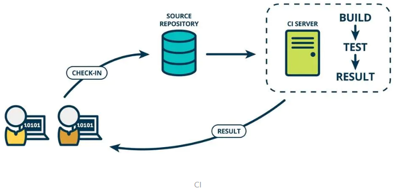
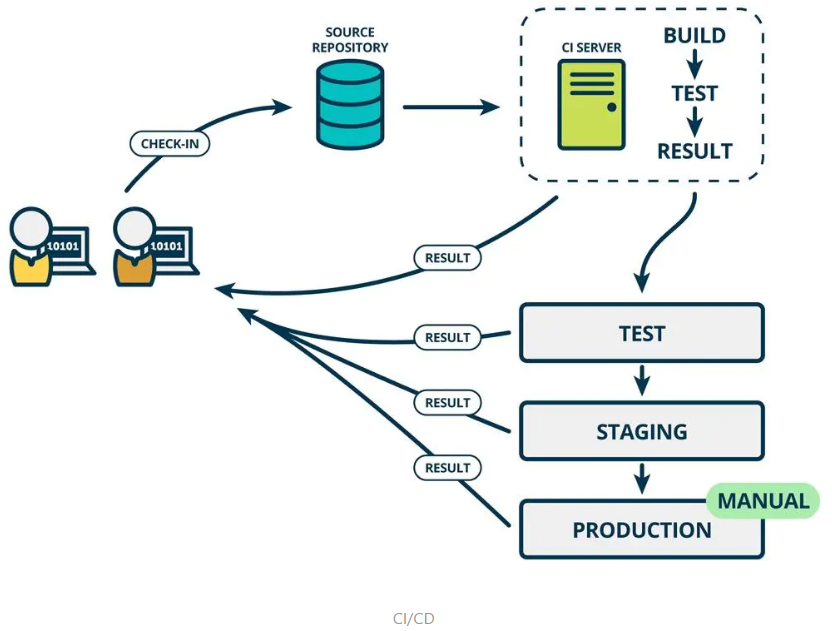

# Jenkins

## 1. CI/CD是什么？

CI(Continuous integration，中文意思是持续集成)是一种软件开发时间。持续集成强调开发人员提交了新代码之后，立刻进行构建、（单元）测试。根据测试结果，我们可以确定新代码和原有代码能否正确地集成在一起。借用网络图片对CI加以理解。

CD(Continuous Delivery， 中文意思持续交付)是在持续集成的基础上，将集成后的代码部署到更贴近真实运行环境(类生产环境)中。比如，我们完成单元测试后，可以把代码部署到连接数据库的Staging环境中更多的测试。如果代码没有问题，可以继续手动部署到生产环境。下图反应的是CI/CD 的大概工作模式。

