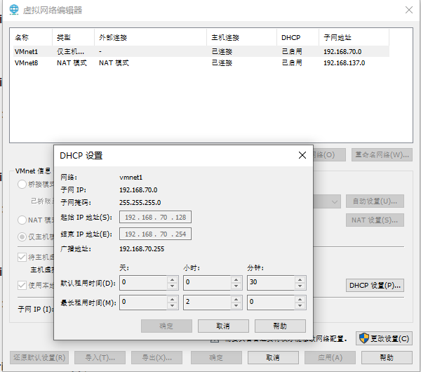

# 1.账号：

| **System**      | **Account**              | **Password** | **IP**          | **M****ac Addr**  | **Remark**                     |
| --------------- | ------------------------ | ------------ | --------------- | ----------------- | ------------------------------ |
| Windows         | xzzhang1991@outloock.com | 1991         | 192.168.137.110 | 00:0C:29:7B:A0:9D | SQL Server:Pa$$W0rd / P@ssW0rd |
| CentOS          | root                     | 54Zhong      | 192.168.137.120 | 00:0C:29:40:3C:E7 |                                |
| Ubuntu          | zhong                    | 54Zhong      | 192.168.137.121 | 00:0c:29:4f:fe:19 |                                |
|                 |                          |              |                 |                   |                                |
| CentOS (master) | root                     | 54Zhong      | 192.168.137.130 | 00:0c:29:05:64:7e |                                |
| CentOS (node)   | root                     | 54Zhong      | 192.168.137.131 | 00:50:56:36:BD:D4 |                                |
| CentOS (node)   | root                     | 54Zhong      | 192.168.137.132 | 00:0c:29:57:2f:42 |                                |
|                 |                          |              |                 |                   |                                |
| CentOS (NFS)    | root                     | 54Zhong      | 192.168.137.140 |                   |                                |

 

# 2.远程终端软件：

Xshell

MobaXterm

XManager

SecureCRT

 

# 3.占用端口

| Type              | Port | Mark |
| ----------------- | ---- | ---- |
| Redis             | 6378 |      |
| SQL Server        | 1433 |      |
| MySQL             | 3306 |      |
| Zookeeper         | 2181 |      |
| Kafka             | 9092 |      |
| Web               | 80   |      |
| 远程端口          | 3389 |      |
| FTP               | 21   |      |
| SSH(Secure shell) | 22   |      |

 

# 4.虚拟网络编辑器

 

 