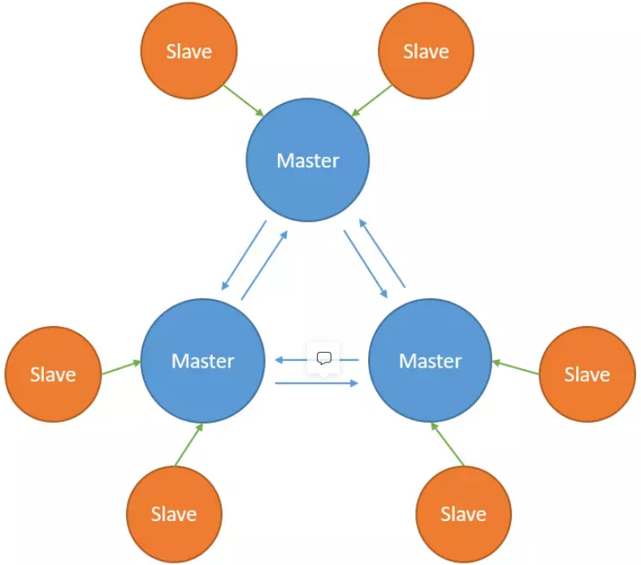
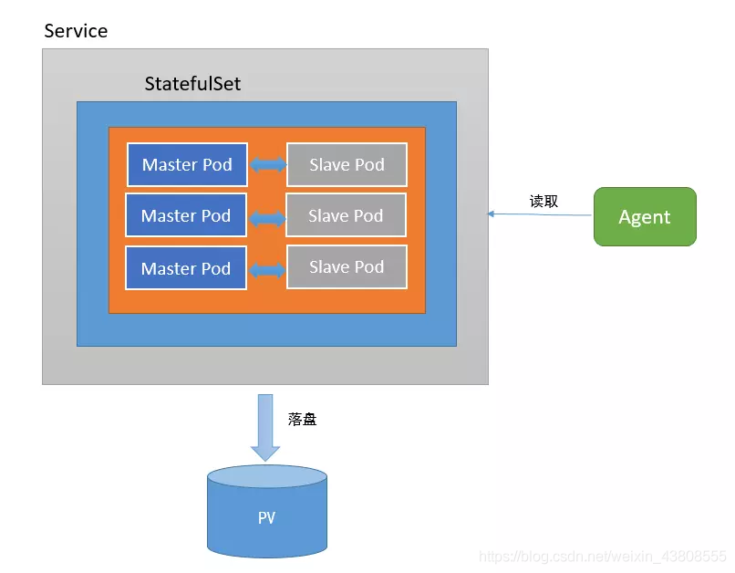

# Redis

## 0. 环境配置

1. 服务器

   | Server              | ip              |
   | ------------------- | --------------- |
   | NFS Server          | 192.168.137.140 |
   | NFS CLient (master) | 192.168.137.130 |
   | NFS CLient (node)   | 192.168.137.131 |
   | NFS CLient (node)   | 192.168.137.132 |

2. 部署Redis集群 3主3从

   下图为Redis集群的[架构](https://so.csdn.net/so/search?q=架构&spm=1001.2101.3001.7020)图，每个Master都可以拥有多个Slave。当Master下线后，Redis集群会从多个Slave中选举出一个新的Master作为替代，而旧Master重新上线后变成新Master的Slave。

   

   ​		StatefulSet基于Headless Service（即没有Cluster IP的Service）为Pod实现了稳定的网络标志（包括Pod的hostname和DNS Records），在Pod重新调度后也保持不变。同时，结合PV/PVC，StatefulSet可以实现稳定的持久化存储，就算Pod重新调度后，还是能访问到原先的持久化数据。

   ​		下图为使用StatefulSet部署Redis的架构，无论是Master还是Slave，都作为StatefulSet的一个副本，并且数据通过PV进行持久化，对外暴露为一个Service，接受客户端请求。

   


## 1. 配置共享文件系统NFS

* NFS配置

  ```shell
  #创建nfs redis 存储目录 共 6个
  mkdir -p /nfs/redis/pv{1..6}
  
  #编辑 nfs 存储配置文件
  [root@storage ~]# vim /etc/exports
  #添加以下内容
  /nfs/redis/pv1 *(ro,sync,no_root_squash,no_subtree_check)
  /nfs/redis/pv2 *(ro,sync,no_root_squash,no_subtree_check)
  /nfs/redis/pv3 *(ro,sync,no_root_squash,no_subtree_check)
  /nfs/redis/pv4 *(ro,sync,no_root_squash,no_subtree_check)
  /nfs/redis/pv5 *(ro,sync,no_root_squash,no_subtree_check)
  /nfs/redis/pv6 *(ro,sync,no_root_squash,no_subtree_check)
  ```

* 重新 刷新配置共享配置文件中的共享目录

  ```shell
  exportfs -rv
  ```

* 查看nfs共享目录

  ```shell
  [root@storage ~]# showmount -e 192.168.0.254
  Export list for 192.168.0.254:
  /nfs/redis *
  ```
  


## 2. 创建NameSpaces

* 创建NameSpance

  ```shell
  kubectl create namespace redis-ns
  ```

* 查看

  ```shell
  kubectl get ns
  ```


## 3. 创建PV和PVC

* Founction 1

  * 创建pv文件

    redis-pv.yaml

    ```yaml
    apiVersion: v1
    kind: PersistentVolume
    metadata:
      name: redis-pv
    spec:
      capacity:
        storage: 1Gi
      accessModes:
      - ReadWriteOnce
      persistentVolumeReclaimPolicy: Recycle
      storageClassName: "redis-cluster"
      nfs:
        path: /nfs/redis
        server: 192.168.0.254
    ```

    执行创建命令

    ```yaml
    kubectl apply -f redis-pv.yaml
    persistentvolume/redis created
    ```

  * 创建pvc文件

    redis-pvc.yaml
    
    ```yaml
    
    ```
    
    执行创建命令
    
    ```shell
    kubectl apply -f redis-pv.yaml
    ```

* Founction 2

  * 创建redis-pv-pvc.yaml

    ```yaml
    # pv不用指定命名空间
    # pvc需要指定命名空间，默认为default
    # 若有配置hosts映射，可使用映射名代替
    # pv相当于逻辑卷，pvc是将多个卷合并为一使用
    
    apiVersion: v1
    kind: PersistentVolume
    metadata:
      name: redis-pv
      #namespace: redis-ns
    spec:
      capacity:
        storage: 1Gi
      accessModes:
      - ReadWriteOnce
      - ReadWriteMany
      - ReadOnlyMany
      #回收策略 留存(Retain)、回收(Recycle)、删除(Delete) - 默认
      persistentVolumeReclaimPolicy: Retain
      storageClassName: redis-nfs
      nfs:
        path: /data/nfs/kubernetes/redis	# NFS path
        #path: /root/kubernetes/redis
        server: 192.168.137.140				# NFS IP地址
    ---
    apiVersion: v1
    kind: PersistentVolumeClaim
    metadata:
      name: redis-pvc
      namespace: redis-ns
    spec:
      accessModes:
      - ReadWriteOnce
      resources:
        requests:
          storage: 1Gi
      storageClassName: redis-nfs
    ```

  * 执行创建命令

    ```yaml
    kubectl apply -f redis-pv-pvc.yaml
    persistentvolume/redis created
    ```

* 查看pv & pvc

  ```shell
  [root@master redis]# kubectl get pv
  NAME     CAPACITY ACCESS MODES RECLAIM POLICY STATUS  CLAIM               STORAGECLASS  REASON  AGE
  redis-pv 1Gi      RWO,ROX,RWX  Retain         Bound   redis-ns/redis-pvc  redis-nfs             6m2s
  [root@master redis]# kubectl get pvc -n redis-ns
  NAME        STATUS   VOLUME     CAPACITY   ACCESS MODES   STORAGECLASS   AGE
  redis-pvc   Bound    redis-pv   1Gi        RWO,ROX,RWX    redis-nfs      4m34s
  ```

  

## 4. 创建ConfigMap

* Founction 1

  * 创建redis-configmap.yml

    * 创建redis-configmap.yml - v1.0

      ```yaml
      apiVersion: v1
      kind: ConfigMap
      metadata:
        name: redis-cluster
      data:
        update-node.sh: |
          #!/bin/sh
          REDIS_NODES="/data/nodes.conf"
          sed -i -e "/myself/ s/[0-9]\{1,3\}\.[0-9]\{1,3\}\.[0-9]\{1,3\}\.[0-9]\{1,3\}/${POD_IP}/" ${REDIS_NODES}
          exec "$@"
        redis.conf: |+
          cluster-enabled yes
          cluster-require-full-coverage no
          cluster-node-timeout 15000
          cluster-config-file /data/nodes.conf
          cluster-migration-barrier 1
          dir /data
          appendonly yes
          protected-mode no
      ```

    * 创建redis-configmap.yaml - v2.0

      ```yaml
      #ConfigMap生成的配置文件放置于容器内/etc/redis/redis.conf
      #使挂载的ConfigMap生效：command: ["redis-server","/etc/redis/redis.conf"]
      #将容器的/data持久化到redis-pvc，即192.168.137.140机器的/data/nfs/kubernetes/redis下
      
      apiVersion: v1
      kind: ConfigMap
      metadata:
        name: redis-configmap
        namespace: redis-ns
      data:
        redis.conf: |+
          requirepass 123456
          protected-mode no
          port 6379
          tcp-backlog 511
          timeout 0
          tcp-keepalive 300
          daemonize no
          supervised no
          pidfile /var/run/redis_6379.pid
          loglevel notice
          logfile ""
          databases 16
          always-show-logo yes
          save 900 1
          save 300 10
          save 60 10000
          stop-writes-on-bgsave-error yes
          rdbcompression yes
          rdbchecksum yes
          dbfilename dump.rdb
          dir /data
          slave-serve-stale-data yes
          slave-read-only yes
          repl-diskless-sync no
          repl-diskless-sync-delay 5
          repl-disable-tcp-nodelay no
          slave-priority 100
          lazyfree-lazy-eviction no
          lazyfree-lazy-expire no
          lazyfree-lazy-server-del no
          slave-lazy-flush no
          appendonly yes
          appendfilename "appendonly.aof"
          appendfsync everysec
          no-appendfsync-on-rewrite no
          auto-aof-rewrite-percentage 100
          auto-aof-rewrite-min-size 64mb
          aof-load-truncated yes
          aof-use-rdb-preamble no
          lua-time-limit 5000
          slowlog-log-slower-than 10000
          slowlog-max-len 128
          latency-monitor-threshold 0
          notify-keyspace-events Ex
          hash-max-ziplist-entries 512
          hash-max-ziplist-value 64
          list-max-ziplist-size -2
          list-compress-depth 0
          set-max-intset-entries 512
          zset-max-ziplist-entries 128
          zset-max-ziplist-value 64
          hll-sparse-max-bytes 3000
          activerehashing yes
          client-output-buffer-limit normal 0 0 0
          client-output-buffer-limit slave 256mb 64mb 60
          client-output-buffer-limit pubsub 32mb 8mb 60
          hz 10
          aof-rewrite-incremental-fsync yes
      ```
    
  * 执行创建命令
  
    ```shell
    kubectl apply -f redis-configmap.yaml
    ```
  
* Founction 2

  * 创建redis.conf

    ```yaml
    appendonly yes
    cluster-enabled yes
    cluster-config-file /var/lib/redis/nodes.conf
    cluster-node-timeout 5000
    dir /var/lib/redis
    port 6379
    ```

  * 执行创建命令

    ```shell
    kubectl create configmap redis-cm --from-file=redis.conf
    ```

* 查看ConfigMap

  ```shell
  [root@master redis]# kubectl get cm -n redis-ns
  NAME               DATA   AGE
  kube-root-ca.crt   1      13m
  redis-cm           1      23s
  ```

  

## 5. 创建Headless Service

* 介绍

  **Headless Service：**简单的说，Headless Service 就是没有指定 Cluster IP 的 Service，相应的，在 k8s 的 dns 映射里，Headless Service 的解析结果不是一个 Cluster IP，而是它所关联的所有 Pod 的IP列表

  **Service：**为了能够对集群其他的服务提供访问，还需要建立一个 service 来实现服务发现和负载均衡

* 创建redis-hs.yaml

  ```yaml
  apiVersion: v1
  kind: Service
  metadata:
    name: redis-headless-service
    labels:
      app: redis
  spec:
    ports:
    - name: redis-port
      port: 6379
    clusterIP: None
    selector:
      app: redis
      appCluster: redis-cluster
  ```

* 创建redis-svc.yml

  * redis-svc.yaml - v1.0

    ```yaml
    apiVersion: v1
    kind: Service
    metadata:
      name: redis-headless-service
    spec:
      type: ClusterIP
      ports:
      - name: client
        port: 6379
        targetPort: 6379
      - name: gossip
      	port: 16379
        targetPort: 16379
      selector:
        app: redis-cluster
    ```

  * redis-svc.yaml - v2.0

    ```yaml
    apiVersion: v1
    kind: Service
    metadata:
      name: redis-headless-service
      namespace: redis-ns
    spec:
      selector:
        app: redis
      type: ClusterIP
      # HeadLess
      clusterIP: None
      ports:
        - port: 6379
          targetPort: 6379
    ```

* 执行创建命令

  ```shell
  kubectl apply -f redis-svc.yaml
  service/redis-svc created
  ```

* 查看 svc redis-cluster

  ```shell
  [root@master redis]# kubectl get svc redis-svc -n redis-ns
  NAME        TYPE       CLUSTER-IP     EXTERNAL-IP   PORT(S)          AGE
  redis-svc   NodePort   10.100.128.1   <none>        6379:30379/TCP   28s
  ```


## 6. 创建StatefulSet

* 创建redis-statefulset.yml 

  * redis-statefulset.yml - v1.0

    ```yaml
    apiVersion: apps/v1
    kind: StatefulSet
    metadata:
      name: redis-cluster
    spec:
      serviceName: redis-cluster
      replicas: 6
      selector:
        matchLabels:
          app: redis-cluster
      template:
        metadata:
          labels:
            app: redis-cluster
        spec:
          containers:
          - name: redis
            image: redis:6.2-alpine
            ports:
            	- name: client
                  containerPort: 6379
                - name: gossip
                  containerPort: 16379
            #command: ["/conf/update-node.sh", "redis-server", "/conf/redis.conf"]
            command:
            	- "redis-server"
            args:
              - "/etc/redis/redis.conf"
              - "--protected-mode"
            env:
            - name: POD_IP
              valueFrom:
                fieldRef:
                  fieldPath: status.podIP
            volumeMounts:
            - name: conf
              mountPath: /conf
              readOnly: false
            - name: data
              mountPath: /data
              readOnly: false
          volumes:
          - name: conf
            configMap:
              name: redis-cluster
              defaultMode: 0755
      volumeClaimTemplates:
      - metadata:
          name: data
        spec:
          accessModes: [ "ReadWriteOnce" ]
          resources:
            requests:
              storage: 5Gi
          storageClassName: redis-cluster
    ```

  * redis-statefulset.yml - v2.0

    ```yaml
    apiVersion: apps/v1
    kind: StatefulSet
    metadata:
      name: redis-statefulset
      namespace: redis-ns
    #  labels:
    #    app: redis
    spec:
      serviceName: "redis-headless-service"
      replicas: 3
      selector:
        matchLabels:
          app: redis
      template:
        metadata:
          labels:
            app: redis
          annotations:
            version/date: "20220528"
            version/author: "xzzhang"
        spec:
          containers:
          - name: redis
            image: redis
            imagePullPolicy: Always
            command: ["redis-server","/etc/redis/redis.conf"]
            ports:
            - containerPort: 6379
            # 挂载外部文件到容器
            volumeMounts:
            - name: redis-config
              mountPath: /etc/redis/redis.conf
              subPath: redis.conf
            - name: redis-persistent-storage
              mountPath: /data
          volumes:
          - name: redis-config
            configMap:
              name: redis-configmap 					# ConfigMap Name
              items:
              - key: redis.conf
                path: redis.conf
          - name: redis-persistent-storage
            persistentVolumeClaim:
              claimName: redis-pvc						# pvc Name
          # 指定节点运行
          # nodeName: node1
    ```

  * redis.sts.yaml - v3.0

    ```yaml
    apiVersion: apps/v1beta1
    kind: StatefulSet
    metadata:
      name: redis-app
    spec:
      serviceName: "redis-headless-service"
      replicas: 6
      template:
        metadata:
          labels:
            app: redis
            appCluster: redis-cluster
        spec:
          terminationGracePeriodSeconds: 20
          affinity:
            podAntiAffinity:
              preferredDuringSchedulingIgnoredDuringExecution:
              - weight: 100
                podAffinityTerm:
                  labelSelector:
                    matchExpressions:
                    - key: app
                      operator: In
                      values:
                      - redis
                  topologyKey: kubernetes.io/hostname
          containers:
          - name: redis
            image: "redis"
            command:
              - "redis-server"
            args:
              - "/etc/redis/redis.conf"
              - "--protected-mode"
              - "no"
    #        resources:
    #          requests:
    #            cpu: "100m"
    #            memory: "100Mi"
            ports:
                - name: redis
                  containerPort: 6379
                  protocol: "TCP"
                - name: cluster
                  containerPort: 16379
                  protocol: "TCP"
            volumeMounts:
              - name: "redis-conf"
                mountPath: "/etc/redis"
              - name: "redis-data"
                mountPath: "/var/lib/redis"
          volumes:
          - name: "redis-conf"
            configMap:
              name: "redis-conf"
              items:
                - key: "redis.conf"
                  path: "redis.conf"
      volumeClaimTemplates:
      - metadata:
          name: redis-data
        spec:
          accessModes: [ "ReadWriteMany" ]
          resources:
            requests:
              storage: 200M
    ```

    

* 执行创建命令

  ```shell
  kubectl apply -f redis-statefulset.yaml
  statefulset.apps/redis-statefulset created
  ```

* 查看

  ```shell
  [root@master redis]# kubectl get pods -n redis-ns -o wide
  NAME                  READY   STATUS    RESTARTS   AGE   IP               NODE    NOMINATED NODE   READINESS GATES
  redis-statefulset-0   1/1     Running   0          22m   10.244.104.16    node2   <none>           <none>
  redis-statefulset-1   1/1     Running   0          20m   10.244.166.139   node1   <none>           <none>
  redis-statefulset-2   1/1     Running   0          19m   10.244.104.17    node2   <none>           <none>
  ```


## 7. 初始化 Redis Cluster

* 进入pod

  ```shell
  [root@master redis]# kubectl exec -it redis-statefulset-0 -n redis-ns sh
  # redis-cli -a 123456 -p 6379
  127.0.0.1:6379> set name xzzhang
  OK
  127.0.0.1:6379> get name
  "xzzhang"
  127.0.0.1:6379> info Replication
  
  
  for x in $(seq 0 2); do echo "redis-statefulset-$x"; kubectl exec redis-statefulset-$x -- redis-cli -a 123456 role; echo; done
  ```

  

* 执行命令

  ```shell
  kubectl exec -it redis-cluster-0 -- redis-cli --cluster create --cluster-replicas 1 $(kubectl get pods -l app=redis-cluster -o jsonpath='{range.items[*]}{.status.podIP}:6379 {end}')
  ```

* 验证集群部署

  ```shell
  kubectl exec -it redis-cluster-0 -- redis-cli cluster info
  cluster_state:ok
  cluster_slots_assigned:16384
  cluster_slots_ok:16384
  cluster_slots_pfail:0
  cluster_slots_fail:0
  cluster_known_nodes:6
  cluster_size:3
  cluster_current_epoch:6
  cluster_my_epoch:1
  cluster_stats_messages_ping_sent:57351
  cluster_stats_messages_pong_sent:55991
  cluster_stats_messages_sent:113342
  cluster_stats_messages_ping_received:55986
  cluster_stats_messages_pong_received:57351
  cluster_stats_messages_meet_received:5
  cluster_stats_messages_received:113342
  ```

* 查看各个redis的主从状态

  ```shell
  for x in $(seq 0 5); do echo "redis-cluster-$x"; kubectl exec redis-cluster-$x -- redis-cli role; echo; done
  redis-cluster-0
  master
  80332
  10.42.0.19
  6379
  80332
  
  redis-cluster-1
  master
  80332
  10.42.0.20
  6379
  80332
  
  redis-cluster-2
  master
  80332
  10.42.0.18
  6379
  80332
  
  redis-cluster-3
  slave
  10.42.0.17
  6379
  connected
  80332
  
  redis-cluster-4
  slave
  10.42.0.15
  6379
  connected
  80332
  
  redis-cluster-5
  slave
  10.42.0.16
  6379
  connected
  80346
  ```

  

## 8. 创建Service(?)

* 创建redis-service.yaml

  ```yaml
  
  ```

* 执行创建命令

  ```shell
  
  ```

  


