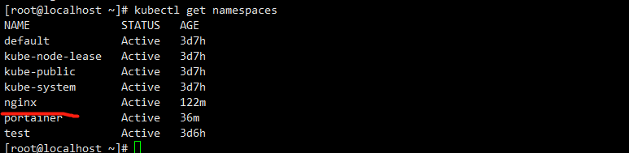
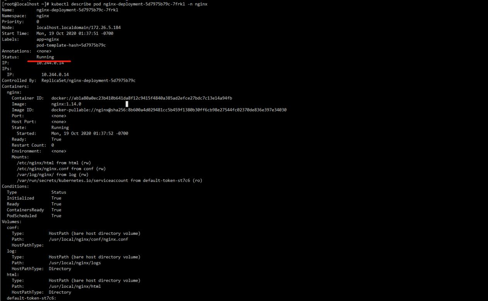
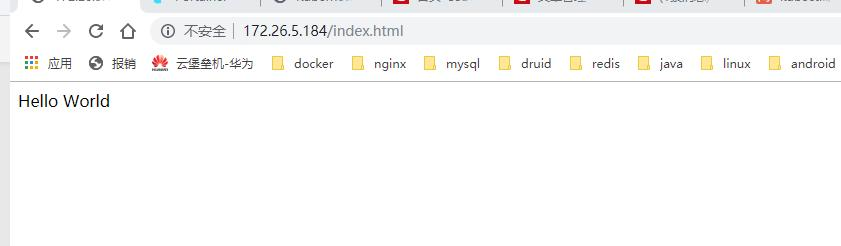

# Nginx

### 一，创建 NAMESPACE

**nginx-namespace.yaml:**

```
apiVersion: v1
#namespace固定写法
kind: Namespace
metadata:
  name: nginx
  labels:
    name: nginx
```

我们可以使用kubectl apply/create -f nginx-namespace.yaml来创建namespace:

```
kubectl create -f nginx-namespace.yaml
```

创建成功后，可以查看我们刚刚创建的namespace:



###  二，创建DEPLOYMENT

其实，我们的目的是创建pod,deployment可以说是担任了 ”管理“ 的角色吧，通过它可以部署很多pod。它拥有强更加灵活强大的升级、回滚功能,并且支持滚动更新。具体可以百度。

**nginx-deployment.yaml**

```
apiVersion: apps/v1
kind: Deployment
metadata:
  labels:
    app: nginx
  name: nginx-deployment
  #指定域
  namespace: nginx
spec:
  replicas: 1
  selector:
    matchLabels:
      app: nginx
  template:
    metadata:
      labels:
        app: nginx
    spec:
      containers:
      - image: nginx:1.14.0
        name: nginx
        volumeMounts:
        - name: conf
          mountPath: /etc/nginx/nginx.conf
        - name: log
          mountPath: /var/log/nginx/
        - name: html
          mountPath: /etc/nginx/html
      #标签选择器（集群状态下，可以指定服务部署在特定node节点上，这就是标签的作用）
      #nodeSelector:
        #type: nginx
      #设置污点可以调度到对应服务器
      tolerations:
      - key: "key"
        operator: "Equal"
        value: "nginx"
        effect: "NoSchedule"
      volumes:
      - name: conf
        hostPath:
          path: /usr/local/nginx/conf/nginx.conf
      - name: log
        hostPath:
          path: /usr/local/nginx/logs
          type: Directory
      - name: html
        hostPath:
          path: /usr/local/nginx/html
          type: Directory
```

和docker compose的 微服务文件虽然格式变化很大，但是核心思想还是不变的。都是指定镜像，数据卷，分片数量，名称等。最主要的还是要 **指定 namespace。**

我们依然使用 kubectl apply/create -f nginx-deployment.yaml 来生成pod

```
kubectl create -f nginx-deployment.yaml
```

接下来我们来查看刚刚创建成功的pod


 注意里面的状态（ready,status）,ready下面的1 和 刚刚我们生命的分片数量（spec.replicas）有关。running代表成功，其他几个状态这里就不说哦了，反正除了这个都是失败。

那如果失败的话，我们怎么排查呢。拿走，不谢。



这里有pod的详细信息，自行查阅，一般都是数据卷映射出错，镜像拉取出错，端口冲突等等。 

### 三，创建SERVICE

每个 Pod 都有自己的 IP 地址。当 controller 用新 Pod 替代发生故障的 Pod(重启策略，或者删除重新创建等等) 时，新 Pod 会分配到新的 IP 地址。这样就产生了一个问题：

如果一组 Pod 对外提供服务（比如 HTTP），它们的 IP 很有可能发生变化，那么客户端如何找到并访问这个服务呢？

Kubernetes 给出的解决方案是 Service。

话不多说，上才艺。

**nginx-service.yaml:**

```
apiVersion: v1
kind: Service
metadata:
  labels:
    app: nginx
  name: nginx-deployment
  namespace: nginx
spec:
  ports:
  - port: 80
    name: nginx-service80
    protocol: TCP
    targetPort: 80
    nodePort: 80  
  - port: 81
    name: nginx-service81
    protocol: TCP
    targetPort: 81
    nodePort: 81
  selector:
    app: nginx
  type: NodePort
```

这里就声明了宿主机（nodeport）80 映射容器(targetport)80。

创建服务：

```
kubectl create -f nginx-service.yaml
```

### 四，大功告成

拉出来溜溜

