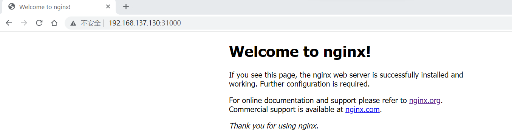

# Nginx

### 1. 创建 namespace

* nginx-namespace.yaml

  ```perl
  apiVersion: v1
  kind: Namespace
  metadata:
    name: nginx
    labels:
      name: nginx
  ```

  配置说明：

  kind：Namespace 表示yaml文件创建的是命名空间

  metadata表示命名空间的元信息

  metadata.name 是命名空间的名称 取值nginx

  metadata.labels 是命名空间的标签 name=nginx

* 创建命名空间nginx

  我们可以使用kubectl apply/create -f nginx-namespace.yaml来创建namespace:

  ```perl
  kubectl create -f nginx-namespace.yaml
  ```

* 查询命名空间

  ```perl
  # 查询所有命名空间，可以看到新创建的命名空间nginx
  kubectl get namespaces
  NAME              STATUS   AGE
  default           Active   85d
  kube-node-lease   Active   85d
  kube-public       Active   85d
  kube-system       Active   85d
  nginx             Active   8d
  ```

* 查询命名空间nginx详情

  ```perl
  kubectl describe namespace nginx
  Name:         nginx
  Labels:       name=nginx
  Annotations:  <none>
  Status:       Active
  ```

* 总结：

  从命名空间详情中可以看到如下信息

  命名空间名称： nginx

  命名空间的标签：name=nginx

  命名空间状态：Active 表示命名空间活跃


###  2. 创建 Deployment

其实，我们的目的是创建pod,deployment可以说是担任了 ”管理“ 的角色吧，通过它可以部署很多pod。它拥有强更加灵活强大的升级、回滚功能,并且支持滚动更新。和docker compose的 微服务文件虽然格式变化很大，但是核心思想还是不变的。都是指定镜像，数据卷，分片数量，名称等。最主要的还是要 **指定 namespace。**

* nginx-deployment-simple.yaml

  ```yaml
  apiVersion: apps/v1
  kind: Deployment
  metadata:
    namespace: nginx
    name: nginx-deployment
  spec:
    selector:
      matchLabels:
        app: nginx
    replicas: 2
    template:
      metadata:
        labels:
          app: nginx
      spec:
        containers:
        - name: nginx
          image: nginx:alpine # nginx:latest = nginx:alpine
          ports:
          - containerPort: 80
  ```

* nginx-deployment.yaml

  ```yaml
  apiVersion: apps/v1
  kind: Deployment
  metadata:
    labels:
      app: nginx
    name: nginx-deployment
    #指定域
    namespace: nginx
  spec:
    replicas: 1
    selector:
      matchLabels:
        app: nginx
    template:
      metadata:
        labels:
          app: nginx
      spec:
        containers:
        - image: nginx:1.14.0
          name: nginx
          volumeMounts:
          - name: conf
            mountPath: /etc/nginx/nginx.conf
          - name: log
            mountPath: /var/log/nginx/
          - name: html
            mountPath: /etc/nginx/html
        #标签选择器（集群状态下，可以指定服务部署在特定node节点上，这就是标签的作用）
        #nodeSelector:
          #type: nginx
        #设置污点可以调度到对应服务器
        tolerations:
        - key: "key"
          operator: "Equal"
          value: "nginx"
          effect: "NoSchedule"
        volumes:
        - name: conf
          hostPath:
            path: /usr/local/nginx/conf/nginx.conf
        - name: log
          hostPath:
            path: /usr/local/nginx/logs
            type: Directory
        - name: html
          hostPath:
            path: /usr/local/nginx/html
            type: Directory
  ```

  **配置说明：**

  kind: Deployment表示yaml文件创建的是一个Deployment发布

  metadata表示这个deployment的元信息

  metadata.name 是deployment的名称 nginx-deployment1

  metadata.labels 是deployment的标签 即：app=nginx

  metadata.namespace 是deployment的命名空间，此处选择的是第一步创建的命名空间nginx

   

  spec: 表示deployment的详细参数配置说明

  spec.replicas 是启动几个pod节点

  spec.template.spec 是deployment选择模块的详细说明

  spec.template.spec.containers 表示选择的容器是什么，此处是nginx的docker镜像 nginx:1.14.0，容器的端口设置 containerPort: 80， volumeMounts表示绑定的文件和目录

   

  spec.template.spec.volumes 表示选择的容器挂载的宿主机的文件和目录 conf, log和html

  

* 创建deployment的nginx

  我们依然使用 kubectl apply/create -f nginx-deployment.yaml 来生成pod

  ```shell
  kubectl create -f nginx-deployment.yaml
  ```

* 查询nginx命名空间下的pods

  ```shell
  kubectl get pods -n nginx
  NAME                                 READY   STATUS    RESTARTS   AGE
  nginx-deployment1-6cb86fb6b7-kkpbw   1/1     Running   5          7d20h
  ```

  可以看到有一个nginx-deployment的pods， 启动了1个pods运行Running状态

  可以通过修改如上yaml文件的spec.replicas启动多个pods，

  

* 增加pods节点从1个到3个如下

  spec.replicas: 3

  ```shell
  # ➜  kube kubectl get pods -n nginx
  NAME                                 READY   STATUS              RESTARTS   AGE
  nginx-deployment1-6cb86fb6b7-kkpbw   1/1     Running             5          7d20h
  nginx-deployment1-6cb86fb6b7-txkkj   0/1     ContainerCreating   0          1s
  nginx-deployment1-6cb86fb6b7-ztt2t   0/1     ContainerCreating   0          1s
  ```

  如上可以看到有两个新的pod处于容器创建中状态，容器创建成功后，状态会转移到Running，READY也会变成1/1

   

* 减少pods节点从3个到1个如下

  ```shell
  # ➜  kube kubectl apply -f nginx-deployment.yaml
  deployment.apps/nginx-deployment1 configured
  # ➜  kube kubectl get pods -n nginx
  NAME                                 READY   STATUS        RESTARTS   AGE
  nginx-deployment1-6cb86fb6b7-d6z6l   1/1     Terminating   0          98s
  nginx-deployment1-6cb86fb6b7-kkpbw   1/1     Running       5          7d20h
  nginx-deployment1-6cb86fb6b7-qtx2v   1/1     Terminating   0          98s
  ```

  如上所示，有两个pod状态是终止中，只剩余一个处于Running状态

   

* 查询命名空间nginx下的发布deployment

  ```shell
  # ➜  kube kubectl describe deployment nginx -n nginx
  Name:                   nginx-deployment1
  Namespace:              nginx
  CreationTimestamp:      Thu, 30 Sep 2021 11:46:53 +0800
  Labels:                 app=nginx
  Annotations:            deployment.kubernetes.io/revision: 1
  Selector:               app=nginx
  Replicas:               1 desired | 1 updated | 1 total | 1 available | 0 unavailable
  # ...
  ```

  可以看到pods节点是1个。

   

* 查询命名空间nginx下的发布pod详情

  ```shell
  # ➜  kube kubectl describe pod nginx-deployment1-6cb86fb6b7-kkpbw -n nginx
  Name:         nginx-deployment1-6cb86fb6b7-kkpbw
  Namespace:    nginx
  Priority:     0
  Node:         docker-desktop/192.168.65.4
  Start Time:   Thu, 30 Sep 2021 15:12:48 +0800
  Labels:       app=nginx
                pod-template-hash=6cb86fb6b7
  Annotations:  <none>
  Status:       Running
  IP:           10.1.0.170
  # ...
  ```

  

* 删除一个deployment的pod节点~

  ```shell
  # ➜  kube kubectl delete pod  nginx-deployment1-6cb86fb6b7-txkkj -n nginx
  pod "nginx-deployment1-6cb86fb6b7-txkkj" deleted
  ```


### 3. 创建 Service

每个 Pod 都有自己的 IP 地址。当 controller 用新 Pod 替代发生故障的 Pod(重启策略，或者删除重新创建等等) 时，新 Pod 会分配到新的 IP 地址。这样就产生了一个问题：

如果一组 Pod 对外提供服务（比如 HTTP），它们的 IP 很有可能发生变化，那么客户端如何找到并访问这个服务呢？

Kubernetes 给出的解决方案是 Service。

* nginx-service-simple.yaml

  ```yaml
  apiVersion: v1
  kind: Service
  metadata:
    namespace: nginx
    name: nginx-service
  spec:
    selector:
      app: nginx
    # 默认 ClusterIP 集群内可访问，NodePort 节点可访问，LoadBalancer 负载均衡模式（需要负载均衡器才可用）
    type: NodePort
    ports:
    - protocol: TCP
      port: 80		# 本Service的端口
      targetPort: 80	# 容器端口
      nodePort: 31000	# 节点端口，范围固定 30000 ~ 32767
  ```

* nginx-service.yaml:

  ```yaml
  apiVersion: v1
  kind: Service
  metadata:
    labels:
      app: nginx
    name: nginx-deployment
    namespace: nginx
  spec:
    ports:
    - port: 80
      name: nginx-service80
      protocol: TCP
      targetPort: 80
      nodePort: 80  
    - port: 81
      name: nginx-service81
      protocol: TCP
      targetPort: 81
      nodePort: 81
    selector:
      app: nginx
    type: NodePort
  ```

  **配置说明：**

  kind: Service表示yaml文件创建的是一个Service

  metadata表示这个Service的元信息

  metadata.name 是Service的名称 nginx-deployment1

  metadata.labels 是Service的标签 即：app=nginx

  metadata.namespace 是Service的命名空间，此处选择的是第一步创建的命名空间nginx

   

  sepc是Service的详细配置说明

  sepc.type 取值NodePort 表示这个Service的类型是一个节点端口转发类型

  sepc.selector 表示这个Service是将带标签的哪些pods做为一个集合对外通过服务

  sepc.ports.port 是Service绑定的端口

  sepc.ports.name: nginx-service80 表示Service服务的名称
  sepc.ports.protocol: TCP 表示Service转发请求到容器的协议是TCP，我们部署的http的nginx服务，因此选择协议为TCP
  sepc.ports.targetPort: 80 表示Service转发外部请求到容器的目标端口80，即deployment的pod容器对外开放的容器端口80
  sepc.ports.nodePort: 31090 表示Service对外开放的节点端口

  这里就声明了宿主机（nodeport）80 映射容器(targetport)80。

* 创建服务：

  ```shell
  kubectl create -f nginx-service.yaml
  ```

  即可以使用浏览器打开这个端口的页面，如下

  

  

* 查询服务列表

  ```shell
  # ➜  kube kubectl get services -n nginx
  NAME                TYPE       CLUSTER-IP   EXTERNAL-IP   PORT(S)          AGE
  nginx-deployment1   NodePort   10.96.92.3   <none>        9000:31090/TCP   34s
  ```

*  查询服务详情

  ```shell
  # ➜  kube kubectl describe service nginx-deployment1 -n nginx
  Name:                     nginx-deployment1
  Namespace:                nginx
  Labels:                   app=nginx
  Annotations:              <none>
  Selector:                 app=nginx
  Type:                     NodePort
  IP:                       10.96.92.3
  LoadBalancer Ingress:     localhost
  Port:                     nginx-service80  9000/TCP
  TargetPort:               80/TCP
  NodePort:                 nginx-service80  31090/TCP
  Endpoints:                10.1.0.170:80,10.1.0.176:80,10.1.0.178:80
  Session Affinity:         None
  External Traffic Policy:  Cluster
  Events:                   <none>
  ```

* 删除一个service服务

  ```shell
  # ➜  kube kubectl delete services nginx-deployment1 -n nginx
  service "nginx-deployment1" deleted
  ```

  

如上就是通过k8s简单部署一个nginx服务的步骤

其中包括如下步骤

- 命名空间的创建
- 标签的增加
- deployment的pods发布，增加和减少pods的方法
- 节点端口转发的Service创建
- 删除一个服务
- 删除一个pod

 