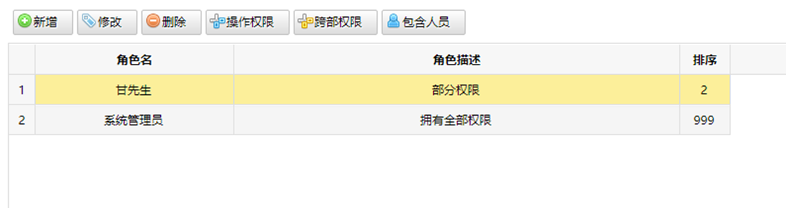
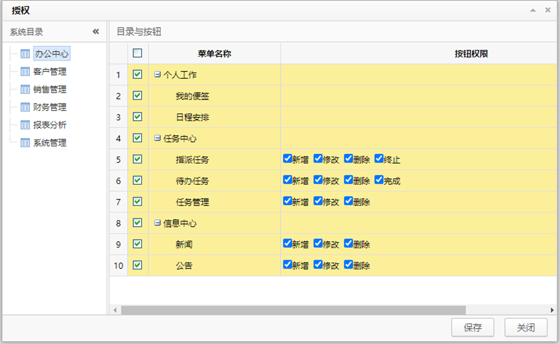
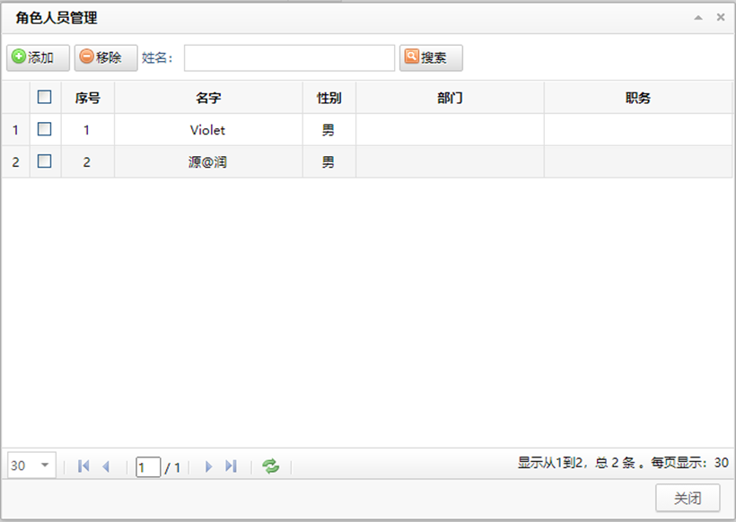
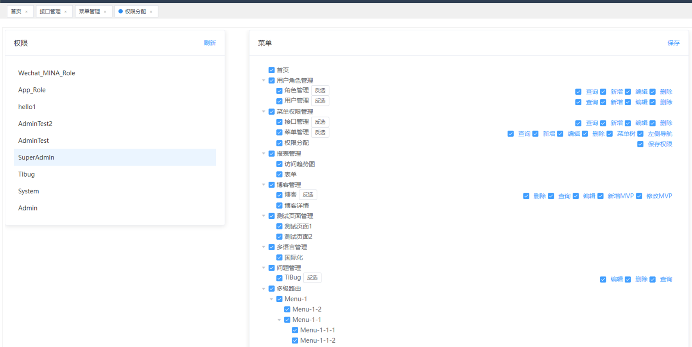
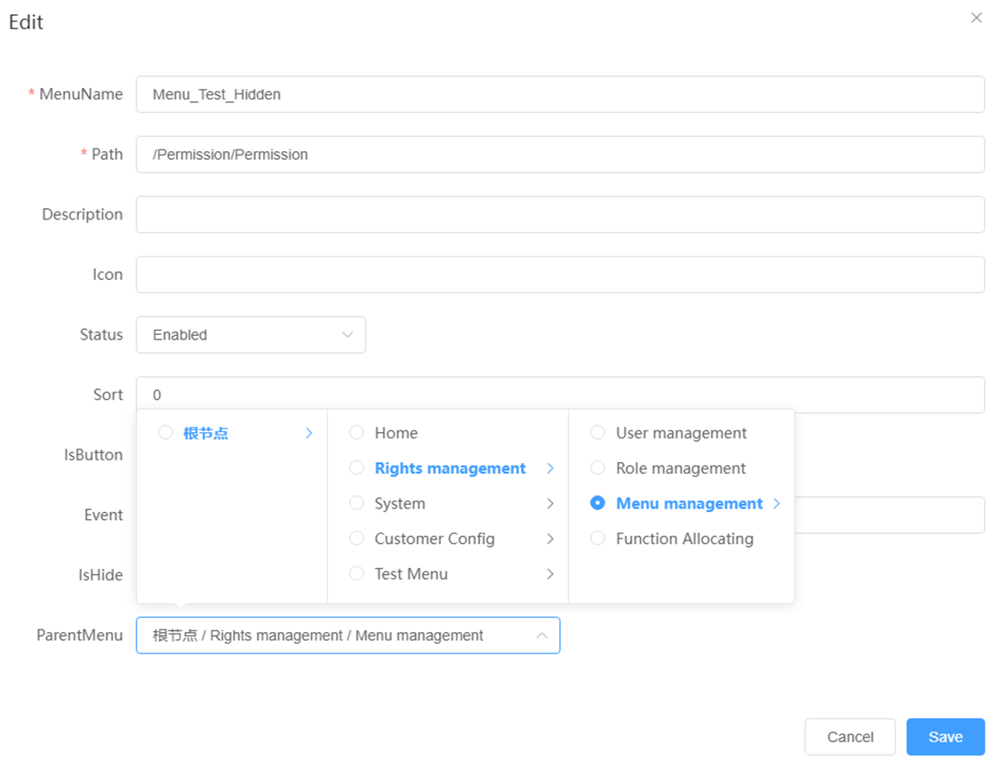
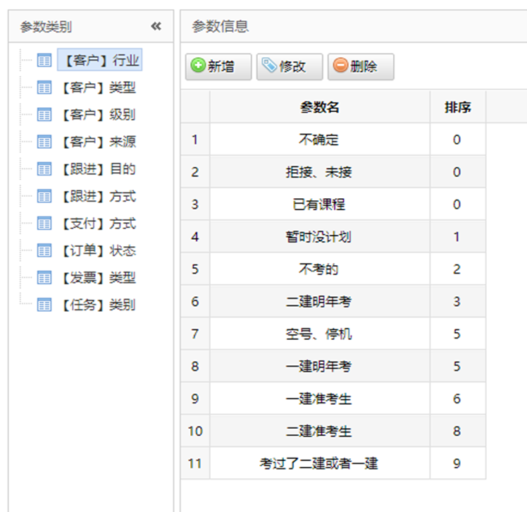
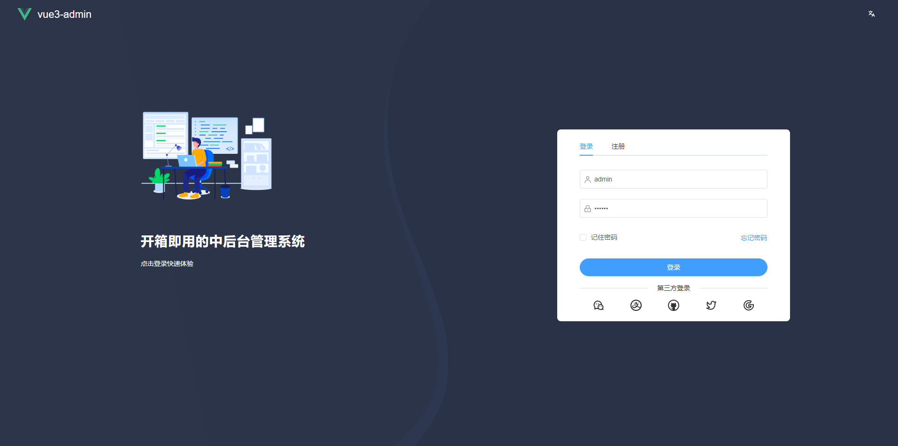

# 1. Role

## 1.1 Role 管理界面

## 1.2 Role修改界面

# 2. Param

## 2.1 管理界面

# 3. Menu

## 3.1 Menu 管理界面

## 3.2 Menu 添加 & 修改页面

# 4. User

## 4.1 User 管理界面

## 4.2 User 添加修改页面

# 5. Login

# 6. Log

## 6.1 Log 分析页面

1. 登录统计

   统计每日登录数量

2. log统计

   统计各类Log

3. 账户统计

   统计系统内部分类账号

4. 错误日志查询

   查看Error log 详细信息