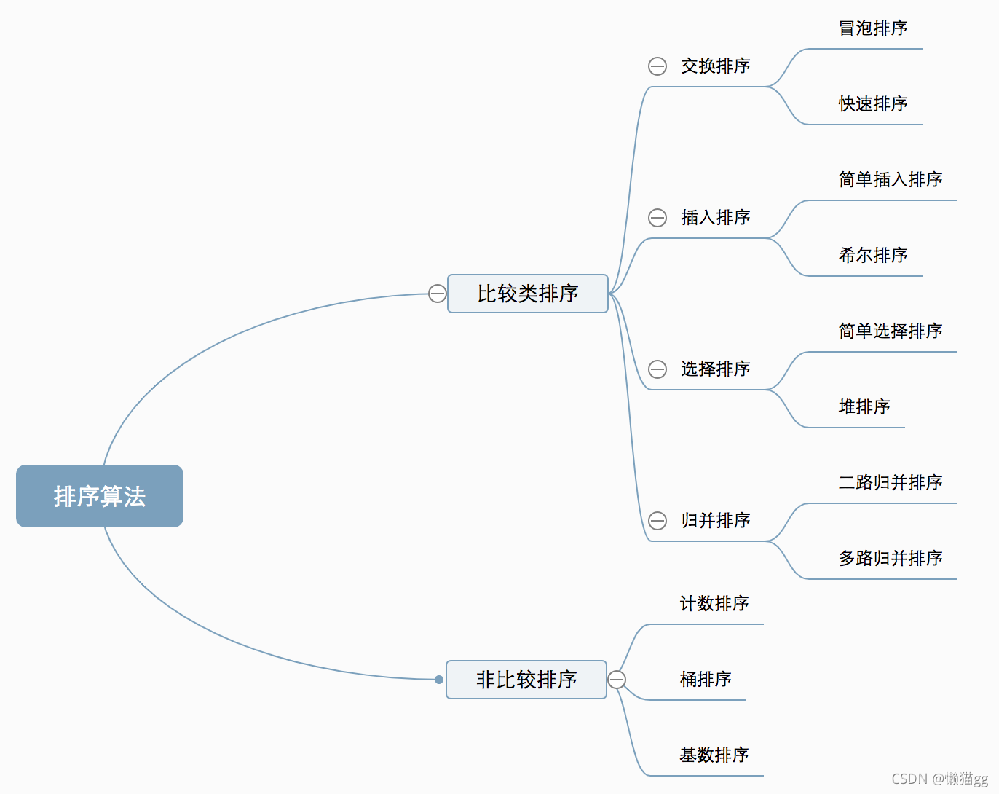
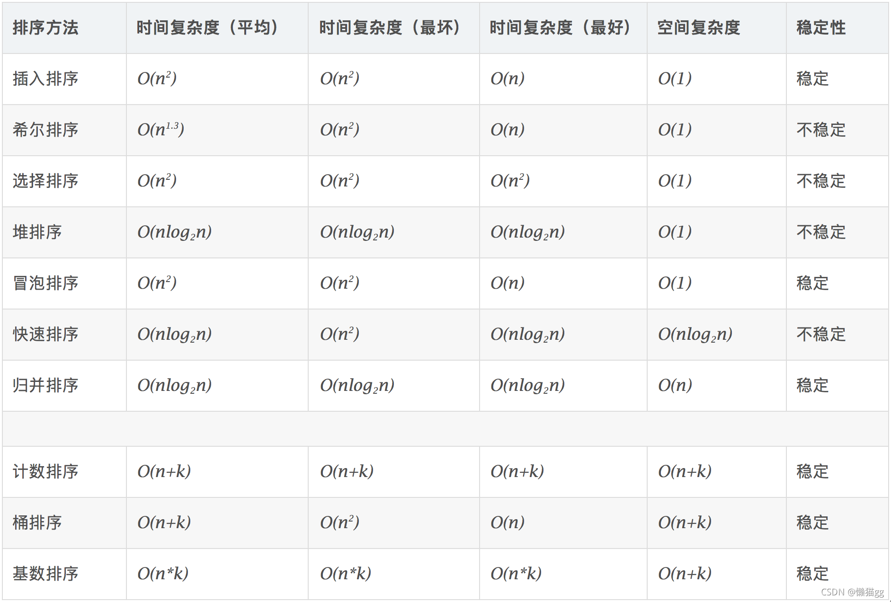
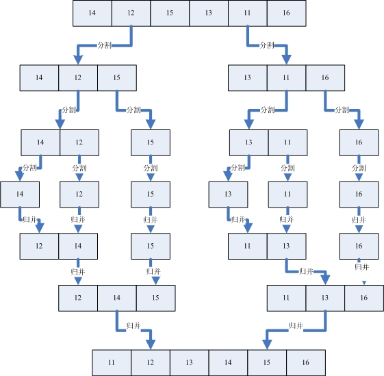

# 前言
排序算法是在生活中随处可见，也是算法基础

# 算法分类
十种常见排序算法可以分为两大类：

* 比较类排序：通过比较来决定元素间的相对次序，由于其时间复杂度不能突破O(nlogn)，因此也称为非线性时间比较类排序。
* 非比较类排序：不通过比较来决定元素间的相对次序，它可以突破基于比较排序的时间下界，以线性时间运行，因此也称为线性时间非比较类排序。
  


# 算法复杂度 




# 相关概念

* 稳定：如果a原本在b前面，而a=b，排序之后a仍然在b的前面。
* 不稳定：如果a原本在b的前面，而a=b，排序之后 a 可能会出现在 b 的后面。
* 时间复杂度：对排序数据的总的操作次数。反映当n变化时，操作次数呈现什么规律。
* 空间复杂度：是指算法在计算机内执行时所需存储空间的度量，它也是数据规模n的函数。

> 关于时间复杂度学习https://blog.csdn.net/y3over/article/details/86750358
> https://blog.csdn.net/y3over/article/details/86750358

> 选择排序的不稳定例子很简单。比如A 80 B 80 C 70 这三个卷子从小到大排序
>
> 第一步会把C和A做交换 变成C B A
> 第二步和第三步不需要再做交换了。所以排序完是C B A
> 但是稳定的排序应该是C A B


# 交换排序
以交换位置的方式排序

## 1. 冒泡排序
> 原理：把最大的换到最后一位，然后把第一大的换到倒数第二位

```c#
public static void bubbleSort(int[] args) {
    int len = args.length;
    while (len > 0) {
        for (int i = 0; i < len - 1; i++) {
            int next = i + 1;
            if (args[i] > args[next]) {
                int temp = args[next];
                args[next] = args[i];
                args[i] = temp;
            }
        }
        len--;
    }
}
```


## 2. 快速排序

> 原理：从数列中取出一个值，将比这个值大的放在它的右边，将比这个值小的放在它的左边，再最左右两个区域重复这个过程，直到各个区域只有一个数。

```c#
public void quickSort(int[] target, int left, int right) {
    if (left >= right) {
        return;
    }
    int pivot = target[left];// 基准点
    int lo = left;
    int hi = right;
    while (lo < hi) {

        while (target[hi] >= pivot && lo < hi) {
            hi--;
        }
        //把右边受阴元素和左边换
        target[lo] = target[hi];

        while (target[lo] <= pivot && lo < hi) {
            lo++;
        }
        //把左边受阴元素和右边换
        target[hi] = target[lo];
    }
    //把拿出来的元素放回去
    target[lo] = pivot;

    quickSort(target, left, lo - 1);
    quickSort(target, lo + 1, right);
}
```


# 选择排序
> 将数组中最大（最小）数依次先出来


## 3. 简单的选择排序

> 原理：找出数组中的最小值，然后与第一位交换，然后再找出第二小的值与第二位交换

```c#
public static void selectSort(int[] arr) {
    for (int i = 0; i < arr.length - 1; i++) {//遍历长度-1次
        int minIndex = i;
        int min = arr[i];
        for (int j = i + 1; j < arr.length; j++) {
            if (min > arr[j]) {//假定的最小值，不一定是最小
                min = arr[j];//重置min，并不改变arr[]数组内的值
                minIndex = j;//重置minIndex
            }
        }
        if (minIndex != i) {//最小值下标不是i，表示最小值不是它自己，则进行下面的交换
            arr[minIndex] = arr[i];//将当前轮下标i（当前轮次第一个）对应的值赋给最小值对应的下标的值，覆盖原来的值
            arr[i] = min;//让之前拿到的最小值min赋给最小值的当前轮下标i对应的值
        }
    }
}
```


## 4. 堆排序

> 原理：
>
> 堆是一棵顺序存储的完全二叉树。
>
> * 其中每个结点的关键字都不大于其孩子结点的关键字，这样的堆称为小根堆。
>
> * 其中每个结点的关键字都不小于其孩子结点的关键字，这样的堆称为大根堆
>
> 把数组组成最大堆，从数组中取走第一个，再次组成新的最大堆
>
> 

```c#
public static void sort(int[] arr) {
    //1.构建大顶堆
    for (int i = arr.length / 2 - 1; i >= 0; i--) {
        //从第一个非叶子结点从下至上，从右至左调整结构
        adjustHeap(arr, i, arr.length);
    }
    //2.调整堆结构+交换堆顶元素与末尾元素
    for (int j = arr.length - 1; j > 0; j--) {

        //将堆顶元素与末尾元素进行交换
        int temp = arr[0];
        arr[0] = arr[j];
        arr[j] = temp;
        adjustHeap(arr, 0, j);//重新对堆进行调整
    }
}

public static void adjustHeap(int[] arr, int i, int length) {
    int temp = arr[i];//先取出当前元素i
    for (int k = i * 2 + 1; k < length; k = k * 2 + 1) {//从i结点的左子结点开始，也就是2i+1处开始
        if (k + 1 < length && arr[k] < arr[k + 1]) {//如果左子结点小于右子结点，k指向右子结点
            k++;
        }
        if (arr[k] > temp) {//如果子节点大于父节点，将子节点值赋给父节点（不用进行交换）
            arr[i] = arr[k];
            i = k;
        } else {
            break;
        }
    }
    arr[i] = temp;//将temp值放到最终的位置
}
```


# 插入排序
> 以插入的方式，进行排序。


## 5. 简单插入排序

> 原理：对于未排序数据，在已排序序列中从后向前扫描（可采用顺序查找，折半（二分）查找），找到相应位置并插入。

```c#
public static void insertSort(int[] arr) {
    for (int i = 1; i < arr.length; i++) {//不需要-1，因为i是从1开始的
        //定义待插入的数，先假定一个是有序的
        int insertVal = arr[i];
        //待插入数前面那个数的下标
        int insertIndex = i - 1;
        //数组不越界 并且 待插入的数小于待插入前面那个数（还没有找到插入位置）
        while (insertIndex >= 0 && insertVal < arr[insertIndex]) {
            arr[insertIndex + 1] = arr[insertIndex];//将待插入数前面那个数 覆盖 它后面那个数（arr[indexIndex]后移）
            insertIndex--;//为了找插入位置，不断往前遍历
        }
        arr[insertIndex + 1] = insertVal;//把之前存起来要插入的数插入到对应位置。 insertIndex+1:顺序正确时，+1保持值不变 | 顺序不正确时（已经进了while循环减过1了）：+1后就是要插入的位置
    }
}
```


## 6. 希尔排序

> 简单插入排序，当需要插入的数是较小的数时，后移的次数明显增多，对效率有影响.
>
> 1959年Shell发明，第一个突破O(n2)的排序算法，是简单插入排序的改进版。它与插入排序的不同之处在于，它会优先比较距离较远的元素。希尔排序又叫缩小增量排序。
>
> 如果直接grab(间隙为1)就是一插入排序。至于grab>1的所有操作都是为grab为1作辅助功能。


```c#
public static void shellSort(int[] args) {
    for (int gap = args.length / 2; gap > 0; gap /= 2) {
        // 从第gap个元素，逐个对其所在组进行直接插入排序操作
        for (int i = gap; i < args.length; i++) {
            int j = i;
            int temp = args[j];
            if (args[j] < args[j - gap]) {
                while (j - gap >= 0 && temp < args[j - gap]) {
                    // 移动法
                    args[j] = args[j - gap];
                    j -= gap;
                }
                args[j] = temp;
            }
        }
    }
 
}
```


## 7. 归并排序

> 原理：把数组一级一级分解，再用插入的方式归并




```c#
//分+合方法
    public static void mergeSort(int[] arr, int left, int right, int[] temp) {
        if (left < right) {
            int mid = (left + right) / 2;//中间索引
            //向左递归分解
            mergeSort(arr, left, mid, temp);
            //向右递归分解
            mergeSort(arr, mid + 1, right, temp);
            //合并
            merge(arr, left, mid, right, temp);
        }
    }
 
    /**
     * 合并的方法
     *
     * @param arr 排序的原始数组
     * @param left 左边有序序列的初始索引
     * @param mid 中间索引
     * @param right 右边索引
     * @param temp 临时存储的中转数组
     */
    public static void merge(int[] arr, int left, int mid, int right, int[] temp) {
        int i = left;//初始化i，左边有序序列的初始索引
        int j = mid+1;//中间索引
        int t = 0;//指向temp的中间索引
 
        //(-)、先把左右两边有序的数据按照规则填充到temp数组，直到左右两边的有序序列，有一边处理完毕为止
        while (i <= mid && j <= right) {
            //如果左边的有序序列的当前元素小于等于右边有序序列的当前元素
            //即将左边有序序列的当前元素填充到temp数组
            //然后t++，i++
            if (arr[i] <= arr[j]) {
                temp[t] = arr[i];
                t += 1;
                i += 1;
                //反之，将右边有序序列的当前元素填充到temp数组
            } else {
                temp[t] = arr[j];
                t += 1;
                j += 1;
            }
        }
 
        //(二)、把有剩余元素的一边的数据依次全部填充到temp数组中
        //左边的有序序列还有剩余的元素，就全部填充到temp数组
        while (i <= mid) {
            temp[t] = arr[i];
            t += 1;
            i += 1;
        }
        //右边的有序序列还有剩余的元素，就全部填充到temp数组
        while (j <= right) {
            temp[t] = arr[j];
            t += 1;
            j += 1;
        }
        //(三)、将temp数组里的有序元素拷贝回arr数组
        //从左边开始拷贝， 注意：不是每次都拷贝所有
        t = 0;
        int tempLeft = left;
        //第一次合并：templeft = 0，right = 1。 第二次合并：templeft = 2，right = 3。 最后一次：templeft = 0，right = 7
        while (tempLeft <= right) {
            arr[tempLeft] = temp[t];
            t += 1;
            tempLeft += 1;
        }
    }
```


## 8. 计数排序

> 原因：创建一个的数组C长度取决于待排序数组中数据的范围，将排序数值对应的C数组+1，然后按C数组中的计数输出（计数排序对于数据范围很大的数组，需要大量时间和内存，适用性不高）


```c#
 /*
  *  算法的步骤如下：
     1、找出待排序的数组中最大和最小的元素
     2、统计数组中每个值为t的元素出现的次数，存入数组C的第t项
     3、对所有的计数累加（从C中的第一个元素开始，每一项和前一项相加）
     4、反向填充目标数组：将每个元素t放在新数组的第C(t)项，每放一个元素就将C(t)减去1
  * */
 public class CountingSort {
     // 类似bitmap排序
     public static void countSort(int[] a, int[] b, final int k) {
         // k>=n
         int[] c = new int[k + 1];
         for (int i = 0; i < k; i++) {
             c[i] = 0;
         }        
         for (int i = 0; i < a.length; i++) {
             c[a[i]]++;
         }        
         System.out.println("\n****************");
         System.out.println("计数排序第2步后,临时数组C变为：");
         for (int m:c) {
             System.out.print(m + " ");
         }
         
         for (int i = 1; i <= k; i++) {
             c[i] += c[i - 1];
         }        
         System.out.println("\n计数排序第3步后,临时数组C变为：");
         for (int m:c) {
             System.out.print(m + " ");
         }
         
         for (int i = a.length - 1; i >= 0; i--) {
             b[c[a[i]] - 1] = a[i];//C[A[i]]-1 就代表小于等于元素A[i]的元素个数，就是A[i]在B的位置
             c[a[i]]--;
         }
         System.out.println("\n计数排序第4步后,临时数组C变为：");
         for (int n:c) {
             System.out.print(n + " ");
         }
         System.out.println("\n计数排序第4步后,数组B变为：");
         for (int t:b) {
             System.out.print(t + " ");
         }
         System.out.println();
         System.out.println("****************\n");
     }
  
     public static int getMaxNumber(int[] a) {
         int max = 0;
         for (int i = 0; i < a.length; i++) {
             if (max < a[i]) {
                 max = a[i];
             }
         }
         return max;
     }
  
     public static void main(String[] args) {
         int[] a = new int[] { 2, 5, 3, 0, 2, 3, 0, 3 };
         int[] b = new int[a.length];
         System.out.println("计数排序前为：");
         for (int i = 0; i < a.length; i++) {
             System.out.print(a[i] + " ");
         }
         System.out.println();
         countSort(a, b, getMaxNumber(a));
         System.out.println("计数排序后为：");
         for (int i = 0; i < a.length; i++) {
             System.out.print(b[i] + " ");
         }
         System.out.println();
     }
  
 }
```


## 8. 基数排序

> 原理：基数排序是按照低位先排序，然后收集；再按照高位排序，然后再收集；依次类推，直到最高位。


```c#
 // 基数排序：稳定排序
 public class RadixSorting {
  
     // d为数据长度
     private static void radixSorting(int[] arr, int d) {        
         //arr = countingSort(arr, 0);
         for (int i = 0; i < d; i++) {
             arr = countingSort(arr, i); // 依次对各位数字排序（直接用计数排序的变体）
             print(arr,i+1,d);
         }
     }
     
     // 把每次按位排序的结果打印出来
     static void print(int[] arr,int k,int d)
     {
         if(k==d)
             System.out.println("最终排序结果为：");
         else
             System.out.println("按第"+k+"位排序后，结果为：");
         for (int t : arr) {
             System.out.print(t + " ");
         }
         System.out.println();
     }
     
     // 利用计数排序对元素的每一位进行排序
     private static int[] countingSort(int[] arr, int index) {
         int k = 9;
         int[] b = new int[arr.length];
         int[] c = new int[k + 1]; //这里比较特殊：数的每一位最大数为9        
  
         for (int i = 0; i < k; i++) {
             c[i] = 0;
         }
         for (int i = 0; i < arr.length; i++) {
             int d = getBitData(arr[i], index);
             c[d]++;
         }
         for (int i = 1; i <= k; i++) {
             c[i] += c[i - 1];
         }
         for (int i = arr.length - 1; i >= 0; i--) {
             int d = getBitData(arr[i], index);
             b[c[d] - 1] = arr[i];//C[d]-1 就代表小于等于元素d的元素个数，就是d在B的位置
             c[d]--;
         }
         return b;
     }
  
     // 获取data指定位的数
     private static int getBitData(int data, int index) {
         while (data != 0 && index > 0) {
             data /= 10;
             index--;
         }
         return data % 10;
     }
  
     public static void main(String[] args) {
         // TODO Auto-generated method stub
         int[] arr = new int[] {326,453,608,835,751,435,704,690,88,79,79};//{ 333, 956, 175, 345, 212, 542, 99, 87 };
         System.out.println("基数排序前为：");
         for (int t : arr) {
             System.out.print(t + " ");
         }
         System.out.println();
         radixSorting(arr, 4);        
     }
  
 }
```


## 10. 桶排序

> 原理：桶为一个数据容器，每个桶存储一个区间内的数，假设我们有M个桶，第i个桶Bucket[i]存储i*K/M至(i+1)*K/M之间的数。

```c#
 // 桶排序
 public class BucketSort {
  
     // 插入排序
     static void insertSort(int[] a) {
         int n = a.length;
         for (int i = 1; i < n; i++) {
             int p = a[i];
             insert(a, i, p);
         }
     }
  
     static void insert(int[] a, int index, int x) {
index-1]
         int i;
         for (i = index - 1; i >= 0 && x < a[i]; i--) {
             a[i + 1] = a[i];
         }
         a[i + 1] = x;
     }
  
     private static void bucketSort(int[] a) {
         int M = 10; // 11个桶
         int n = a.length;
         int[] bucketA = new int[M]; // 用于存放每个桶中的元素个数
         // 构造一个二维数组b，用来存放A中的数据,这里的B相当于很多桶，B[i][]代表第i个桶
         int[][] b = new int[M][n];
         int i, j;
         for (i = 0; i < M; i++)
             for (j = 0; j < n; j++)
                 b[i][j] = 0;
  
         int data, bucket;
         for (i = 0; i < n; i++) {
             data = a[i];
             bucket = data / 10;
             b[bucket][bucketA[bucket]] = a[i];// B[0][]中存放A中进行A[i]/10运算后高位为0的数据，同理B[1][]存放高位为1的数据
             bucketA[bucket]++;// 用来计数二维数组中列中数据的个数，也就是桶A[i]中存放数据的个数
         }
         System.out.println("每个桶内元素个数：");
         for (i = 0; i < M; i++) {
             System.out.print(bucketA[i] + " ");
         }
         System.out.println();
  
         System.out.println("数据插入桶后，桶内未进行排序前的结果为：");
         for (i = 0; i < M; i++) {
             for (j = 0; j < n; j++)
                 System.out.print(b[i][j] + " ");
             System.out.println();
         }
  
         System.out.println("对每个桶进行插入排序，结果为：");
         // 下面使用直接插入排序对这个二维数组进行排序,也就是对每个桶进行排序
         for (i = 0; i < M; i++) {
             // 下面是对具有数据的一列进行直接插入排序，也就是对B[i][]这个桶中的数据进行排序
             if (bucketA[i] != 0) {
                 // 插入排序
                 for (j = 1; j < bucketA[i]; j++) {
                     int p = b[i][j];
                     int k;
                     for (k = j - 1; k >= 0 && p < b[i][k]; k--)
                     {
                         assert k==-1;
                         b[i][k + 1] = b[i][k];
                     }
                     b[i][k + 1] = p;
                 }
             }
         }
         
         // 输出排序过后的顺序
         for (i = 0; i < 10; i++) {
             if (bucketA[i] != 0) {
                 for (j = 0; j < bucketA[i]; j++) {
                     System.out.print(b[i][j] + " ");
                 }
             }
         }
     }
  
     /**
      * @param args
      */
     public static void main(String[] args) {
         // TODO Auto-generated method stub
         int[] arr = new int[] {3,5,45,34,2,78,67,34,56,98};                                                            
         bucketSort(arr);
     }
  
 }
```
